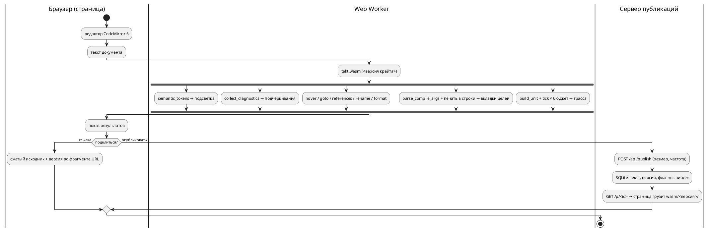
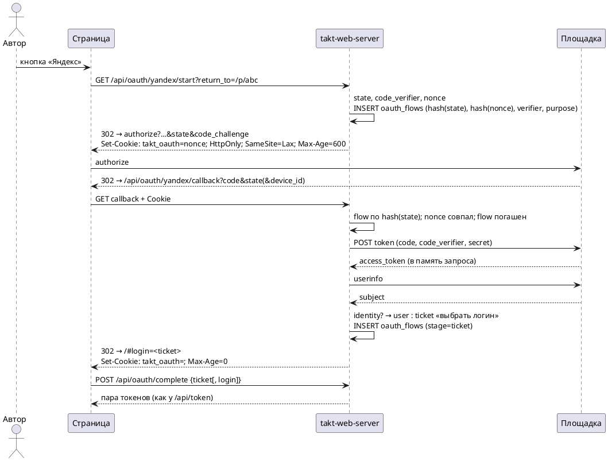

# Фича: Онлайн-редактор Takt: подсветка, LSP, генерация, симуляция, обмен ссылками

- **Номер:** 0531
- **Статус:** РАЗРАБОТКА
- **Зависит от:** нет (проверено на стадии анализа 2026-09-04: ни одна незакрытая
  фича не даёт контракта, схемы или инфраструктуры, которых ждёт эта)
- **Tier:** — (шкала «признак вреда» к новой возможности не применяется;
  предложено оставить прочерк — решение заказчика, см. ADR)
- **Класс:** прочее (инструменты)
- **Связанные issue (анализ):** запрос заказчика 2026-09-04

## Стадии жизненного цикла

Все стадии — **разделы этой карточки**. Пройдены регистрация,
архитектура (ADR, 2026-09-04) и анализ (2026-09-04, задачи `0531-01`…`0531-05`
и порядок их выполнения — в разделе «Анализ»); идёт разработка — выполнены
задачи `0531-01`, `0531-02` (раздел «Разработка»), `0531-03`, `0531-08`,
`0531-06`, `0531-07a`, `0531-07b`, `0531-09a`, `0531-09b`, `0531-09c`,
`0531-05`, `0531-07c`, `0531-07d`, `0531-09d`, `0531-09e`, `0531-09f-1`,
`0531-09f-2`, `0531-09f-3`, `0531-09g`, `0531-09h`, `0531-09i`, `0531-09j`,
`0531-09k`, `0531-09l`, `0531-09m`, `0531-09n`, `0531-09p`, `0531-09q`,
`0531-09r` и
`0531-10a` (разделы
«Часть 03», «Часть 08», «Часть 06», «Часть 07», «Часть 09» и «Часть 10»
анализа). Задача `0531-09f` (вход через OAuth площадок) — в проработке у
модели Fable по поручению заказчика 2026-09-04. Ниже — то, что
сказал заказчик, и вопросы, на которые отвечает ADR.

## Краткое описание

Веб-сервис, в котором модель на Takt пишут, проверяют и запускают прямо в
браузере, а результатом делятся по ссылке — как на pastebin.

Состав, названный заказчиком:

- **редактор** с подсветкой синтаксиса Takt;
- **семантический анализ** — «всё, что может обеспечить LSP»: диагностики по
  мере набора, переход к объявлению, поиск использований, переименование,
  наведение, форматирование;
- **генерация кода** — вывод целей рядом с исходником (предпросмотр);
- **симуляция** — отдельной вкладкой;
- **обмен**: код выкладывается на всеобщее обозрение, у каждой публикации своя
  ссылка.

Задача **большая** и по своду подлежит декомпозиции: на стадии анализа
она разбивается на задачи `0531-YY`, а часть, возможно, выделяется в отдельные
фичи со своими номерами.

## Документирование

Предварительно: **язык не меняется** — сервис показывает то, что уже умеют
`taktc`, `takt-lsp` и `takt-sim`. Раздел документа при этом, вероятно, нужен:
«Инструментарий» описывает работу с инструментами, и веб-редактор — такое же
применение (свод допускает прикладные разделы). Решение принимается на
стадии архитектуры; если сервис потребует ограничить конструкции языка (например
запретить долгие прогоны), это уже **изменение языка** и отдельный разговор.

## Вопросы к архитектуре (стадия 2)

Список открытых решений, а не предложений — их предстоит принять заказчику.

1. **Где исполняется компилятор.** Сборка `takt-lang` в WebAssembly и работа
   целиком в браузере — или серверный прогон с API? Первое снимает вопросы
   изоляции и нагрузки, второе не требует портирования и даёт доступ к
   инструментам целей (`cc`, `iec2c`, `verilator`), которых в браузере нет.
2. **Симуляция.** Прогон в браузере против прогона на сервере; лимиты шагов и
   времени; что делать с моделями, которые не завершаются (у эталона есть предел
   итераций, но не предел прогона).
3. **Хранение публикаций.** Что именно сохраняется (исходник, сценарий,
   выбранная цель, версия языка), сколько живёт, можно ли править и удалять;
   нужен ли приватный режим «по ссылке, но не в списке».
4. **Версия языка у публикации.** Ссылка должна открываться так же и через год:
   значит публикация хранит версию, а сервис — несколько версий компилятора.
   Иначе старые ссылки будут молча меняться в поведении.
5. **LSP в браузере.** `takt-lsp` — процесс, говорящий по LSP; в вебе нужен
   мост (WebSocket или WASM-сборка). Пути поиска импортов в вебе отсутствуют —
   решить, поддерживаются ли многофайловые публикации.
6. **Цели генерации в предпросмотре.** Показывать все восемь или выбранную;
   что делать с целями, отказывающими на входе (это нормальный ответ, а не
   ошибка сервиса).
7. **Злоупотребления.** Публичная площадка с исполнением кода: лимиты на размер,
   частоту, длительность; модерация; хранение адресов.
8. **Куда кладётся сервис.** Отдельный крейт в этом репозитории или отдельный
   репозиторий; как он собирается и чем проверяется (у изменения
   обязана быть сборка и тесты).

## Что уже есть в проекте (опора для анализа)

- `takt-lang` — компилятор с восемью целями и библиотечным API (`parse`,
  `compile_to_c`, …);
- `takt-lsp` — сервер LSP: диагностики, переход к объявлению, использования,
  переименование, форматирование, символы документа;
- `takt-sim` — эталонный симулятор: прогон по тактам, сценарии, GIF/SVG;
- `book/takt.sublime-syntax` и списки ключевых слов — готовое описание лексики
  для подсветки, сверяемое с лексером проверкой `check-book-keywords.py`;
- плагины редакторов (`extensions/`) — образец того, какие возможности
  редакторского слоя уже описаны.

## Архитектура (ADR)

- **Status:** Proposed — решения, названные в «Decision» как **решения заказчика**,
  ждут его слова; остальное предложено к принятию.
- **Date:** 2026-09-04
- **Authors:** архитектор, системный аналитик

### Context

Сервис обязан показывать **то же**, что `taktc`, `takt-lsp` и `takt-sim`:
документ уже обещает, что «диагностика в редакторе совпадает с диагностикой
компилятора» (раздел «Инструментарий»), и второй компилятор для веба проект
позволить себе не может. Значит, вопрос архитектуры — **где исполняется тот же
самый код** и **через какую границу** он говорит с браузером.

**Что уже есть (снято чтением дерева 2026-09-04):**

| Слой | Что есть | Что мешает браузеру |
|---|---|---|
| компилятор | `takt-lang`: `parse`, `compile_to_*` (8 целей), `compile_cli::parse_compile_args` (разбор ключей — одна таблица `target_flags`, 0466), `verify_all` | `compile_to_*` и `generator::generate` принимают **путь вывода** и пишут файлы сами; `std::fs` встречается в 17 файлах — генераторы, импорт, карта адресов, рабочая область LSP |
| LSP | библиотечный слой — **чистые функции над текстом**: `collect_diagnostics(src)`, `hover_info(src, pos)`, `goto_declaration`, `references_at`, `rename_at`, `formatting_edits`, `document_symbols`, `completion_items`, `semantic_tokens`; позиции — UTF-16 (`lsp/position.rs`) | транспорт (`Connection::stdio`, диспетчер) живёт в бинарнике `takt_lsp.rs` (529 строк); варианты `*_in_workspace` читают диск |
| эталон | `takt_sim::build_unit` + `Unit::tick`, `active_states`, `variable`, `set_port`, `is_terminal`; сценарий — `json_input::SimStep`; предел итераций цикла `MAX_ITERATIONS = 100_000` **на такт** | `SimulationRunner` печатает в stdout (11 мест) и пишет GIF/SVG на диск; раскладка графа берёт `rand::rng()` (`unit/viewport/graph.rs`) — на `wasm32-unknown-unknown` `getrandom 0.4` требует явного генератора; предела **прогона** нет — только `-n` |
| подсветка | `lsp::semantic_tokens` (лексер + имена из дерева), `book/takt.sublime-syntax` (для PDF, сверяется с лексером проверкой) | третий список ключевых слов для веба — класс |
| процесс | проверки внешних инструментов — мягкий пропуск, под `PRECHECK_STRICT=1` ошибка; CI Actions **не исполняется** (биллинг, 0175) — развёртывание только руками; расширение Zed собирается под WASM вне предкоммита (0414) | предкоммит 233 с — новый крейт в корневом workspace платит на каждом прогоне |

**Замер-04 (проба): крейты собираются под WebAssembly без
единой правки.** `cargo check --target wasm32-wasip1` (таргет уже стоит в пине
[расширение Zed не собирается: пин толчейна и каталог сборки](0414-zed-extension-build.md)):

| Крейт | Набор фич | Результат | Время |
|---|---|---|---|
| `takt-lang` | умолчание | `Finished` | 14.6 с |
| `takt-lang` | `lsp` (`lsp-types`, `lsp-server`, `serde_json`) | `Finished` | 10.1 с |
| `takt-sim` (`--lib`, вместе с `resvg`, `gif`, `clap`) | умолчание | `Finished` | 5.8 с |

Пробный `cdylib` с одним экспортом, удерживающим компилятор с восемью целями,
слой LSP и эталон (релиз, `opt-level = "s"`, `lto`, `panic = "abort"`, без
`wasm-opt`): **3.3 МБ** (`takt_wasm_probe.wasm`), **937 КБ** в gzip; сборка модуля при
готовых зависимостях — 10.9 с. В пробу вошли `resvg`, `fontdb`, `rustybuzz`
(графика эталона) — рабочий модуль без них будет меньше (A2).

Что проба **не** доказывает: таргет браузера `wasm32-unknown-unknown` в пине
отсутствует и не проверялся; известное по документации препятствие на нём —
`getrandom` (см. таблицу), а операции `std::fs` там **компилируются**, но
отвечают ошибкой при вызове. Инструменты целей (`cc`, `iec2c`, `verilator`,
`yosys`) в браузере недоступны при любом варианте.

### Decision Drivers

1. **Исполнение чужого кода.** На сервере это изоляция, лимиты, дежурство и
   площадка для злоупотреблений; в браузере — песочница, за которую платит
   браузер, и нагрузка, за которую платит автор модели.
2. **Один носитель.** Тот же код, что у `taktc`; подсветка — из того же лексера;
   ключи сборки — из той же таблицы. Второй список — молчаливое расхождение.
3. **Ссылка через год.** Поведение задаёт **версия крейта** `takt-lang`
   (0.55.0), а не только версия языка (0.17.0): исправления меняют вывод без подъёма
   языка. Публикация обязана хранить то, что задаёт поведение.
4. **Стоимость владения.** CI не исполняется, дежурного нет, разработчик один.
   Каждая движущаяся часть на сервере — обязательство навсегда.
5. **свод и цена предкоммита.** У каждой части — сборка и тесты; при этом
   233 с предкоммита не должны вырасти вдвое ради веба.
6. **свод.** Части обязаны быть самостоятельно полезны: редактор без
   сервера публикаций — уже инструмент.

### Considered Options

#### Option A. Всё в браузере (WebAssembly); сервер — только хранилище публикаций

Компилятор, слой LSP и эталон собираются в **один модуль WASM**, исполняются в
Web Worker; сервер (если он есть) хранит тексты и раздаёт статику.

**Pros:** песочница браузера снимает вопросы 1, 2 и 7 карточки (изоляция,
лимиты прогона, злоупотребления исполнением); версии — это **файлы**
`wasm/<версия>/takt.wasm`, старые лежат рядом с новыми и не стоят ничего;
ноль процессов на сервере ради компиляции; проба показала, что портировать
нечего — только развязать вывод от файловой системы.

**Cons:** нет инструментов целей — показывается вывод компилятора, а не вердикт
`cc`/`iec2c`/`verilator` (граница названная: тот же класс «валидный вывод при
нулевом коде», который у проекта контролируют проверки, в браузере не виден); модуль
весит мегабайты (замер выше); в проект входит JS-инструментарий (см. A3).

#### Option B. Всё на сервере: API над `taktc`/`takt-sim`, `takt-lsp` через WebSocket-мост

**Pros:** ничего не портируется; доступны инструменты целей; LSP говорит своим
протоколом.

**Cons:** исполнение чужого кода на сервере — контейнер/seccomp, лимиты CPU и
памяти, очередь; **процесс `takt-lsp` на сессию** (сервер не многодокументный);
несколько версий — несколько установленных бинарников и их маршрутизация;
`takt-sim` без предела прогона надо убивать по таймеру; при заблокированном CI
всё это разворачивается и чинится руками. Драйверы 1 и 4 против.

#### Option C. Гибрид: LSP и генерация в браузере, симуляция на сервере

**Cons:** худшее обеих — сервер всё равно исполняет чужой код, а код живёт на
двух путях; единственный аргумент (длинные прогоны) закрывается бюджетом
тактов в Worker с `terminate()`. Отвергнут.

#### Option D. Чужая площадка (Compiler Explorer)

Language добавляется PR с бинарником компилятора; ссылки короткие — их
инфраструктура. **Cons:** нет ни LSP, ни симуляции, ни своих публикаций;
исполнение — на их машинах со своей политикой. Отвергнут: закрывает одну
позицию из пяти.

**Выбор — Option A.** Ниже — решения внутри него; каждое с отвергнутой
альтернативой.

#### A1. Мост браузер ↔ WASM: C-ABI + JSON, без `wasm-bindgen`

Экспорты вида `fn(ptr, len) -> ptr` с строками UTF-8; аргументы и ответы —
JSON. Ответы слоя LSP сериализуются **типами `lsp-types`** (они уже `serde`):
форма ответа в вебе тождественна форме ответа `takt-lsp` редактору, и второго
описания API нет. Ключи сборки принимаются **строкой аргументов CLI** и
разбираются `parse_compile_args` — таблица применимости ключей 0466 остаётся
единственной.

Отвергнуто: `wasm-bindgen`/`wasm-pack` — ещё один внешний инструмент, чья
версия обязана совпадать с версией крейта; связка склеивающего JS занимает
≈60 строк, и писать их дешевле, чем контролировать инструмент. Отвергнуто: LSP
JSON-RPC через `lsp_server::Connection::memory()` — переносит в веб
**транспорт** (529 строк диспетчера), тогда как содержание — функции над
текстом; редактору в вебе клиент протокола не нужен.

#### A2. Таргет `wasm32-unknown-unknown`; вывод генераторов развязывается от файлов

Таргет браузера без WASI: прослойка WASI в браузере — ещё одна JS-зависимость
ради `std::fs`, которого в вебе быть не должно. Следствие — правка **в
библиотеке**: у генераторов появляется носитель «напечатать в строки»
(`Vec<(имя_файла, текст)>`), а нынешний `generate(…, output_path, …)` становится
«напечатать и записать». Бинарник и веб зовут один печатник; снимки
`examples/generated/` (0048, 0274) контролируют тождественность байт в байт.
Раскладка графа получает **детерминированный** генератор (трасса проекта
воспроизводима по замыслу 0134, случайность в кадре — то же нарушение), а
`resvg`/`gif` уходят под фичу `graphics` крейта `takt-sim` (умолчание — вкл.,
в WASM — выкл.).

#### A3. Редактор — CodeMirror 6; подсветка — `semantic_tokens` из модуля

Токены приходят от того же лексера, что у `takt-lsp` (на неразбираемом файле —
лексерные, имена появляются после разбора), диагностики — декорациями; своей
грамматики подсветки у веба **нет**. Отвергнуто: Monaco + `monaco-languageclient`
(мегабайты и клиент протокола ради того, что уже есть функциями); отвергнута
грамматика Monarch/Lezer (третий список слов).

Цена: в проект входит `node` с `package-lock.json` и сборщиком (`esbuild`);
политика та же, что у `iec2c`/`verilator` — нет `node` → мягкий пропуск,
`PRECHECK_STRICT=1` → ошибка. Отвергнуто: CDN во время исполнения (сервис
зависит от чужого хоста) и коммит собранного бандла (собранный артефакт в
дереве — то, чего проект избегает: 0274 сверяет снимки, а не хранит).

#### A4. Симуляция — в Worker, потактово через `Unit::tick`, с бюджетом

Сценарий — тот же JSON, что у `-s` (`json_input`); за такт — состояния и
значения в трассу (таблица, как у `takt-sim`); бюджет — число тактов (умолчание
как у `-n`) **и** время стены; превышение — `Worker.terminate()` и сообщение с
названной причиной. Бюджет — **свойство прогона**, как `-n`, а не языка:
конструкции не ограничиваются, язык не меняется (раздел «Документирование»
карточки). Кадры SVG — позже, после A2.

#### A5. Версия публикации — версия крейта `takt-lang`; модули лежат по версиям

Публикация хранит `takt_lang` (крейт) и `LANGUAGE_VERSION` (для показа);
страница грузит `wasm/<версия крейта>/takt.wasm`; новый документ берёт
последнюю. Старые модули **не удаляются** — это и есть ответ на вопрос 4
карточки. Отвергнуто: хранить только версию языка — исправления меняют поведение
между подъёмами языка (0507…0512 вышли без подъёма).

#### A6. Обмен — двумя ступенями

1. **Ссылка без сервера:** сжатый исходник + сценарий + цель + версия — во
   фрагменте URL (приём Compiler Explorer / TypeScript Playground). Вечная,
   самодостаточная, площадки для злоупотреблений нет. Достаточна для «поделиться».
2. **Сервер публикаций** (вопросы 3 и 7 карточки): `POST` → короткий
   идентификатор; список публичных; флаг «по ссылке, но не в списке»
   (умолчание — **не в списке**); удаление по токену владельца; предел размера
   (64 КиБ); ограничение частоты по адресу с окном в минуты — **адрес с
   публикацией не хранится**; модерация — удаление администратором. Сервер
   ничего не исполняет. Реализация — Rust (`axum` + SQLite) в **своём**
   workspace `web/server` (драйвер 5: корневой `cargo test` его не собирает),
   со своим шагом предкоммита.

Срок жизни публикаций и наличие ступени 2 в первом выпуске — **решение
заказчика**.

#### A7. Один файл; импорт — названная граница

Публикация — один файл. `import` даёт штатный `SE-001` с подсказкой (0279) —
это честный ответ, не отказ сервиса. Многофайловые публикации требуют
поставщика файлов в `semantic::import` (сейчас читает диск напрямую) — кандидат
в фичи после закрытия этой.

#### A8. Размещение в дереве и проверки

| Часть | Где | Сборка и проверка |
|---|---|---|
| привязки | `takt-wasm/` — **член корневого workspace** (тонкий: JSON ↔ вызовы библиотек) | нативно — обычный `cargo test`; под WASM — шаг предкоммита `cargo build --release --target wasm32-unknown-unknown -p takt-wasm` (таргет — в пин `rust-toolchain.toml`) |
| фронтенд | `web/` (`package.json`, lockfile, `esbuild`) | шаг предкоммита: сборка + **сверка в `node`**: корпус `examples/*.takt` через модуль против вывода `taktc` **байт в байт** по всем целям и трассы `examples/simulations/` против `takt-sim` — основание 0048 (генерация детерминирована) |
| сервер | `web/server/` — свой workspace (как `extensions/zed-takt`) | свой шаг: `cargo test` в его каталоге |

Проверки, перечисляющие крейты списком (`check-test-targets.py: CRATES`,
`check-module-size.sh`), получают третий крейт — иначе он невидим им молча.
Хостинг статики и домен — **решение заказчика**; развёртывание — скриптом
`scripts/`, поскольку CI не исполняется.

### Decision

Принять **Option A** с решениями A1–A8. Целевой поток:



**Декомпозиция для стадии анализа** (свод; порядок — по самостоятельной
пользе):

| Часть | Содержание | Что даёт сама по себе |
|---|---|---|
| 0531-01 | печать генераторов в строки; фича `graphics` и детерминированная раскладка у `takt-sim`; крейт `takt-wasm` (компиляция всех целей, диагностики, функции LSP, форматирование, потактовая симуляция); таргет в пине; шаг сборки WASM | модуль, который можно позвать из `node` |
| 0531-02 | фронтенд: редактор, токены, диагностики, наведение/переход/использования/переименование/форматирование, вкладки целей, вкладка симуляции с бюджетом; ссылка во фрагменте URL; проверка сверки с `taktc`/`takt-sim` | рабочий редактор без сервера |
| 0531-03 | сервер публикаций: API, хранение, список, приватность, лимиты, удаление, раздача модулей по версиям | «как pastebin» |
| 0531-04 | документ: подраздел «Онлайн-редактор» в разделе «Инструментарий» (свод допускает; новый **раздел** не заводится); README; скрипт развёртывания | описание применения |

Нумерация задач уточняется анализом; выделение 0531-03 в отдельную фичу —
по решению заказчика о ступени 2.

**Решения, ожидающие заказчика:** (1) `Tier` — шкала признака вреда к новой
возможности не применяется, предложено оставить `—`; (2) нужна ли ступень 2
обмена в первом выпуске и срок жизни публикаций; (3) хостинг статики и домен;
(4) согласие на вход `node` в предкоммит на условиях мягкого пропуска.

### Consequences

- **Язык не меняется**; бюджет прогона — свойство прогона. Раздел
  «Документирование» карточки подтверждается.
- Библиотека `takt-lang` получает печать генераторов **в строки** — правка
  касается всех восьми целей и контролируется снимками 0274 и проверкой; это
  улучшение и для тестов (сегодня они читают файлы).
- `takt-sim` теряет случайность в раскладке — кадр становится воспроизводимым,
  что согласно 0134 и так ожидалось от эталона.
- В предкоммит входят три шага (WASM-сборка, сверка в `node`, тесты сервера);
  цена измеряется на стадии анализа (`scripts/measure-precheck.sh`)
  и обязана уложиться в бюджет, названный там.
- Граница «инструменты целей в браузере недоступны» показывается пользователю
  словами на вкладке цели, а не молчанием.
- Первый JS-код в проекте: правила `docs/CODE.md` его не покрывают — анализ
  называет минимум (lockfile, версия `node`, без транспиляции сверх `esbuild`).

#### Acceptance criteria

1. Вывод каждой из восьми целей в браузере **байт в байт** совпадает с
   `taktc` на корпусе `examples/*.takt`; трасса симуляции совпадает с
   `takt-sim` на `examples/simulations/` — проверяет проверка, а не глаз.
2. Подсветка, диагностики, наведение, переход, использования, переименование
   и форматирование в браузере идут через функции `takt_lang::lsp`; в `web/`
   нет списка ключевых слов Takt (контроль — греп по каталогу).
3. Публикация, открытая по ссылке, грузит модуль **своей** версии; при двух
   выложенных версиях старая продолжает открываться (тест на двух модулях).
4. Прогон, превышающий бюджет, останавливается с названной причиной; страница
   остаётся отзывчивой (Worker).
5. Ключи сборки в вебе — те же строки, что у `taktc compile`; отказ цели
   показывается как её диагностика.
6. `./scripts/precheck.sh` зелёный; без `node` шаги веба пропускаются словом
   «пропуск», под `PRECHECK_STRICT=1` — ошибка.

## Анализ

### Цель и контекст

ADR принял **Option A**: компилятор, слой LSP и эталон исполняются в браузере
одним модулем WebAssembly, сервер (ступень 2 обмена) только хранит публикации.
Анализ переводит решение в задачи: что именно меняется в библиотеках, что
заводится заново, чем каждая часть проверяется и в каком порядке они идут.
Нумерация частей совпадает с нумерацией задач разработки.

### Замер (дата 2026-09-04)

Сверх замеров ADR (сборка под WASM без правок; модуль 3.3 МБ / 937 КБ gzip):

| Предмет | Факт | Следствие для задач |
|---|---|---|
| как генераторы пишут вывод | текст собирается **в памяти** (`generate_header`/`generate_source` → `String`), запись — `fs::write` в `generate` каждой цели: `c` (2 файла), `sv` (модуль + адаптер шины), `rust`, `st`, `plantuml` — **7 мест в 5 модулях**; `c-hal`, `st-at`, `sv-mmio` идут теми же печатниками | задача 01: одно место записи вместо семи, печатники не трогаются |
| печать позиции диагностики | `diagnostics/position.rs` **читает файл с диска** (два места), чтобы напечатать `файл:строка:колонка` | в браузере файла нет: реестр файлов обязан принимать текст из памяти — путь, которым уже идёт LSP на несохранённом документе (0153: «текст открытых документов сильнее диска»); проверяется в 02 |
| импорт | `semantic/import` читает диск напрямую и канонизирует путь **корневого** файла | в вебе — пустой список путей и синтетическое имя; `import` даёт `SE-001` (A7); отказ канонизации на несуществующем корне — проверить в 02 |
| трасса эталона | строку шага печатает `runner.rs` (`print!` ×5, `println!` ×4, `eprintln!` ×3); тесты `examples_scenario_tests.rs` идут **через библиотеку** (`build_unit`/`tick`) | задача 01: строка шага собирается функцией в библиотеке, CLI и веб печатают одну и ту же |
| сценарии корпуса | `examples/simulations/` — 6 сценариев + каталог `graphics` | материал проверки сверки трасс (02) |
| случайность | `rand::rng()` — два места в `unit/viewport/graph.rs` (раскладка графа); `getrandom 0.4` в `Cargo.lock` | задача 01: сеяный генератор; проверка сборки на `wasm32-unknown-unknown` — в 02 |
| предел прогона | `MAX_ITERATIONS = 100 000` — на **цикл в такте**; предела тактов нет, только `-n` | бюджет веба — свойство прогона (A4): умолчание 10 000 тактов и 5 с стены |
| инструменты машины | `node` v26.8.1, `npm` 11.19.0 есть; `esbuild` нет (ставится через `npm ci`); таргеты rustup: `aarch64-apple-darwin`, `wasm32-wasip1`, `wasm32-wasip2` — **`wasm32-unknown-unknown` не установлен** | первый шаг 02 — таргет в пин  |
| корпус редакторского слоя | 0464: 295 входов × шесть операций, выгружаются в `target/matrix-corpus/` | проверка 02 гоняет тот же корпус через модуль: ответ обязан приходить (без падения) |

### Зависимости фичи

**Зависит от: нет.** Проверено по контракту (библиотечные API `takt-lang` и
`takt-sim` — на месте), по схеме (новых узлов языка нет) и по инфраструктуре
(проверки внешних инструментов с мягким пропуском есть). Замороженная 0257 (кэш
рабочей области LSP) не нужна: рабочей области в вебе нет. 0175 (CI) не
блокирует: развёртывание руками заложено в ADR.

### Требования и проверяемые условия

- **R1. Печать в строки.** `generator::generate` печатает через новый носитель
  `generate_texts(l, model, options) -> Result<Output, Diagnostic>`, где `Output`
  — список `(имя файла, текст)` плюс предупреждения; запись на диск делает
  обёртка. Проверка: снимки `examples/generated/` (0274) и проверка
  детерминированности (0048) **байт в байт** без изменений.
- **R2. Эталон без консоли.** Строка шага и итоговая сводка строятся функциями
  библиотеки; `SimulationRunner` их печатает. Проверка: вывод `takt-sim` на
  `examples/simulations/` совпадает с прежним байт в байт (`run_simulations.sh`).
- **R3. Графика — фича.** `resvg`/`gif`/`svg`-рендер под фичей `graphics`
  (умолчание вкл.); раскладка графа — сеяный генератор (`StdRng::seed_from_u64`),
  кадр воспроизводим. Проверка: `cargo test -p takt-sim --no-default-features`
  зелёный; два прогона с GIF дают одинаковые байты.
- **R4. Крейт `takt-wasm`.** Экспорты C-ABI со строками JSON: `version`,
  `compile(target, args, source)`, `diagnostics`, `tokens`, `hover`, `goto`,
  `references`, `rename`, `format`, `symbols`, `completion`, `sim_open(source,
  scenario)`, `sim_tick(n)`, `sim_close`. Формы ответов — типы `lsp-types` и
  `Diagnostic` через `serde`. Нативные тесты крейта — в `cargo test`.
- **R5. Тождественность.** Проверка в `node`: каждый `examples/*.takt` × каждая цель
  — файлы из модуля равны файлам `taktc` байт в байт, отказы равны по коду и
  позиции; каждый сценарий `examples/simulations/` — трасса равна выводу
  `takt-sim`; корпус 0464 × операции — ответ приходит.
- **R6. Редактор.** Подсветка из `tokens`; диагностики подчёркиванием и
  списком; наведение, переход, использования, переименование, форматирование —
  командами; вкладки восьми целей с ключами сборки строкой `taktc compile`;
  вкладка симуляции: сценарий, бюджет, трасса, останов с причиной. В `web/` нет
  списка ключевых слов Takt (контроль — греп).
- **R7. Ссылка.** Фрагмент URL несёт `{v, src, scn, t, args}` (сжатие
  `CompressionStream("deflate-raw")`, base64url); открытие восстанавливает всё
  и грузит `wasm/<v>/`. Проверка: круговой рейс на корпусе.
- **R8. Сервер (ступень 2, по решению заказчика).** `POST /api/publications`
  → `{id, owner_token}`; `GET /api/publications/{id}`; `DELETE` с токеном;
  `GET /api/publications?listed=1` постранично; предел 64 КиБ; частота — окно
  в минуты по адресу, адрес **не** хранится; SQLite; раздача статики и
  `wasm/<версия>/`. Проверка: интеграционные тесты HTTP в своём workspace.
- **R9. Проверки.** Шаги предкоммита: сборка модуля, сверка в `node`, тесты
  сервера; политика — мягкий пропуск / `PRECHECK_STRICT=1`. Цена шагов
  измеряется `scripts/measure-precheck.sh` и записывается в отчёт.
- **R11. Подсветка вывода целей** (решение заказчика 2026-09-04). Вкладка цели
  показывает порождённый код **подсвеченным по правилам своего языка**: C
  (`c`/`c-hal`), Structured Text (`st`/`st-at`), Rust, SystemVerilog
  (`sv`/`sv-mmio`), PlantUML. Исходник на Takt красится своим слоем (`tokens`
  модуля, R6) — целевые языки к нему отношения не имеют.
  Словари целевых языков **берутся у редактора** (режимы CodeMirror), а не
  пишутся руками: собранный чтением стандарта список отстаёт — это измерено на
  зарезервированных именах IEC (прогон 0511 добавил 33 имени).
  Контроль «в `web/` нет списка ключевых слов Takt» (R6) остаётся в силе и
  **не** запрещает словари чужих языков: предмет запрета — дубль знания о
  **Takt**, которое живёт в лексере.
  ST и Takt-подсветки в проекте уже есть — определения `book/*.sublime-syntax`
  для документа. Задача обязана начать с замера: годятся ли они
  веб-редактору или нужен другой носитель; два описания одного языка разъедутся.
  Проверка: смоук в `node` — у каждой из восьми целей разметка непуста и
  различает хотя бы ключевое слово, число и комментарий.

- **R12. Перенос практик референса** (решение заказчика 2026-09-04). Из проекта
  `tamagotchi` берётся не только протокол моста (он уже взят задачей `0531-02`),
  но и **всё применимое**: авторизация (`crates/kjuru-service/src/auth.rs` —
  argon2id + JWT, `passport.rs`), дизайн-бук (`docs/design/BOOK.md`,
  `REFERENCE.md`, `CONTROLS.html`, `web/design/`), раскладка статики и сборки,
  оснастка развёртывания. Состав определяет **проработка** (см. «Часть 07»): она
  и решает, что переносится, что берётся идеей, а что не нужно вовсе — у
  редактора Takt нет ни игроков, ни питомцев, и слепой перенос дал бы
  инфраструктуру без адресата.
  Авторизация фиче нужна **не всякая**: ADR (решение A6) описывает обмен
  двумя ступенями, где ступень 1 самодостаточна и никакого входа не требует.
  Проработка обязана назвать, что именно даёт вход в редакторе (владение
  публикацией? приватные ссылки? ничего?), и обосновать — иначе появится вход
  ради входа.

- **R13. Кеш клиента и обновление приложения** (решение заказчика 2026-09-04).
  Модуль весит 3.34 МБ (830 КБ gzip): тянуть его на каждое открытие
  недопустимо — страница обязана его кешировать. Одновременно она обязана
  **узнавать о новой сборке** сервиса и обновляться, как это сделано в
  референсе (`build-number`, `crates/kjuru-service/src/apiversion.rs`).
  У редактора несохранённый исходник в буфере: обновление, которое молча
  перезагружает страницу, теряет работу автора. Форма («новая версия — обновить»
  с сохранением текста) — предмет проработки задачи `0531-07`.
  Кеш обязан уживаться с решением A5: публикация открывается модулем **своей**
  версии (`wasm/<версия>/`), то есть на сервере одновременно живут несколько
  модулей, и «последняя версия» не единственная.

- **R14. Стенд в контейнерах: `docker-compose` и управление** (решение
  заказчика 2026-09-04). Из референса переносятся и адаптируются `Dockerfile`,
  `docker-compose.yml` и управление стендом: **запуск, гашение, проверка
  состояния, перезапуск**.
  Это решение **отменяет** вывод проработки «контейнеров в первом выпуске
  нет» (раздел 3 «Части 07»): тот опирался на состав служб референса
  (PostgreSQL и пять служб), которого у нас нет, — но выбор способа
  развёртывания принадлежит заказчику, а не аналитику.
  Команды живут в `scripts/`, а не в `Makefile`: команды проекта названы в
  README, и README **проверяется** проверкой (0275) — второй носитель команд дал
  бы класс. Цели референса `up`/`down`/`restart`/`ps`/`logs` становятся
  скриптами `scripts/web-*.sh`.
  Что от референса **не** переносится: PostgreSQL со своими параметрами и
  учётом запросов, профили смотрителей, `autoheal`, шлюз мессенджера — у нас
  одна служба, SQLite файлом на хосте и статика каталогом.
  Проверка: контроль скриптов (гашение на непущенном стенде не ошибка, проверка
  состояния отличает поднятый от погашенного), мягкий пропуск без `docker`.

- **R15. Адаптивный интерфейс** (решение заказчика 2026-09-04). Страница
  работает на узком экране так же, как на широком: раскладка перестраивается,
  цели нажатия остаются достижимыми, ничего не обрезается и не уезжает за край.
  Образец — референс `tamagotchi` (его `web/static/app.css` и разметка);
  предметный состав правил снимается замером задачи `0531-08`.
  Точки перелома и размеры берутся из замера референса, а не придумываются:
  придуманная сетка расходится с той, что уже проверена на устройствах.
  У редактора своя трудность, которой нет у референса: на узком экране
  **две области** (модель и вывод) не помещаются рядом, и надо решить, что
  показывать — переключение вкладками или вертикальный стек.

- **R16. Проекты пользователя** (решение заказчика 2026-09-04). У пользователя
  несколько **проектов**; в проекте хранятся **только исходники**, размер
  проекта ограничен. Проект бывает **закрытым** или **открытым**: открытые
  видны всем, ищутся и раздаются ссылкой, а права на проект выдаются по видам
  — правка, копирование себе, только чтение и прочие.
  Это **пересматривает** вывод проработки «Часть 07», где вход пользователя
  признан ненужным: проекты принадлежат кому-то, а значит учётная запись
  становится нужна. Что из прежнего вывода остаётся, а что отменяется — предмет
  проработки задачи `0531-09`.
  Соотношение с уже решённым обменом (A6: ссылка-фрагмент + публикация с
  токеном владельца) обязано быть названо: проект и публикация — одно, разное
  или второе есть частный случай первого. Молчание здесь дало бы две системы
  хранения одного и того же.

- **R17. Язык интерфейса** (поручение заказчика 2026-09-04). Оболочка
  редактора переводима: подписи, кнопки и сообщения страницы берутся из
  словаря, а не вшиты в разметку.
  Тексты, приходящие **от модуля** (диагностики, трасса, сводка прогона),
  этой задачей не переводятся: они рождаются в `takt-lang`/`takt-sim`, и их
  язык — предмет отдельной [язык сообщений компилятора и симулятора (i18n)](0532-i18n-diagnostics.md). До неё смешение языков — названная
  граница, а не недоделка; проработка `0531-10` обязана сказать, что видит
  пользователь в этот период.
  Прежний вывод «Части 07» («английский не нужен: диагностики русские»)
  оказался верен ровно наполовину — он и назвал причину, которую снимает 0532.

- **R10. Документ.** Подраздел «Онлайн-редактор» в разделе «Инструментарий»
  (свод; без номеров фич); README — раздел «Онлайн-редактор»; скрипт
  сборки статики и развёртывания в `scripts/`.

### Критерии приёмки и способ проверки

Критерии ADR 1–6 остаются; способ проверки — **проверка R5**, а не ручной прогон.
Дополнительно: `scripts/precheck.sh` зелёный при отсутствующем `node` (слово
«пропуск») и при `PRECHECK_STRICT=1` с установленным `node`; снимки 0274 и
вывод `takt-sim` не изменились после 01.

### Редакторский слой

**Язык не меняется** — правки `takt-lang/src/lsp/` и плагинов `extensions/` не
требуются. Веб — **новый потребитель** того же слоя: он зовёт функции
`takt_lang::lsp` напрямую, поэтому любое будущее изменение слоя доезжает до
него сборкой. Ответ зафиксирован; в отчёте стадии 6 повторить.

### Особенности по обратной функциональности

- Сигнатуры `compile_to_*` и CLI **не меняются**; меняется публичный трейт
  `Generator` (метод печати в строки) — версия крейта `takt-lang` поднимается
  по semver (минор), версия языка **нет**.
- `takt-sim`: вывод CLI байт в байт прежний; фича `graphics` по умолчанию
  включена, потребители без изменений.
- Ссылка ступени 1 самодостаточна и не зависит от сервера — при появлении
  ступени 2 старые ссылки продолжают открываться.

### Риски и зависимости

- **`getrandom` на `wasm32-unknown-unknown`** отвечает ошибкой компиляции без
  явного генератора. Снятие — `rand` без `os_rng` (сеяный генератор — R3);
  запасной ход — генератор `wasm_js` только для `wasm32`. Решается сборкой в 02.
- **Паника в модуле** = `abort`, модуль умирает. Worker пересоздаёт модуль и
  сообщает «внутренняя ошибка»; пределы глубины (0129/0156) делают панику на
  входе неожиданной, а не штатной.
- **Цена предкоммита.** Холодная сборка под второй таргет — полный проход
  зависимостей; замер в 02 (`measure-precheck.sh`, урок: два прогона).
- **JS без правил.** `docs/CODE.md` его не описывает: минимум — lockfile,
  версия `node` в `package.json` (`engines`), `esbuild` как единственный шаг,
  без транспиляции и фреймворков.
- **Хостинг и CI.** Развёртывание — скрипт; площадка — решение заказчика.
- **Размер модуля** 3.3 МБ до снятия графики; при необходимости — `wasm-opt`
  как **необязательный** инструмент с мягким пропуском.

### План разработки: задачи и порядок выполнения

| Порядок | Задача | Предмет | Зависит от | Проверка |
|---|---|---|---|---|
| 1 | `0531-01` | библиотеки: печать генераторов в строки (R1), строка шага эталона функцией (R2), фича `graphics` и сеяная раскладка (R3) | — | снимки 0274, `run_simulations.sh` байт в байт |
| 2 | `0531-02` | крейт `takt-wasm` (R4), таргет в пине, шаг сборки модуля, проверка сверки в `node` (R5, R9) | 01 | проверка R5 зелёный; `precheck.sh` с `node` и без |
| 3 | `0531-03` | фронтенд `web/` **без зависимостей** (решение заказчика 2026-09-04): редактор, вкладки целей, симуляция с бюджетом (R6), ссылка во фрагменте (R7) | 02 | проверка сборки `web/`, круговой рейс ссылки, греп на список слов |
| 4 | `0531-06` | подсветка синтеза: вывод целей во вкладках красится как код своего языка (R11) — **решение заказчика 2026-09-04** | 03 | смоук в `node`: у каждой цели непустая разметка, у `takt` — своя |
| 5 | `0531-07` | перенос практик референса `tamagotchi`: авторизация, дизайн-бук и всё, что окажется применимым (R12) — **решение заказчика 2026-09-04**; состав определяет проработка | 03 | по итогам проработки (раздел «Часть 07») |
| 6 | `0531-04` | сервер публикаций `web/server/` на `axum` (R8) — **по решению заказчика**; при отказе задача отменяется, порядок сдвигается | 03, 07 | HTTP-тесты в своём workspace, шаг предкоммита |
| 7 | `0531-05` | документ и README (R10), скрипт сборки статики и развёртывания | 03 (и 04, если она есть) | проверки документа (0133…0527), `check-readme-commands.sh` |

Порядок обусловлен пользой каждой ступени: после 01 библиотеки
чище и без веба; после 02 модуль проверяем из `node`; после 03 есть работающий
редактор с обменом по ссылке; 04 добавляет площадку; 05 закрывает
документирование.

#### Часть 01 — библиотеки готовятся к модулю

- **Что меняется:** `generator/mod.rs` (носитель `Output`, `generate_texts`,
  `generate` = печать + запись), пять `generate` целей (семь `fs::write` → один
  носитель), `takt-sim/src/runner.rs` (строка шага и сводка → функции),
  `takt-sim/Cargo.toml` (фича `graphics`), `unit/viewport/graph.rs` (сеяный
  генератор).
- **Проверки:** снимки и проверки R1–R3; тест «два прогона с GIF — одинаковые
  байты»; тест «`generate_texts` для `c` отдаёт два файла с именами, которые
  прежде писались на диск».

#### Часть 02 — крейт `takt-wasm` и проверка тождественности

- **Что меняется:** новый член workspace `takt-wasm/` (`cdylib` + `rlib` для
  нативных тестов; экспорты R4; JSON через `serde_json`); `rust-toolchain.toml`
  (`wasm32-unknown-unknown`); `scripts/check-test-targets.py` и
  `check-module-size.sh` (третий крейт); `scripts/check-wasm.sh` (сборка) и
  `scripts/check-wasm-identity.mjs` (сверка R5 в `node`, склейка ≈60 строк JS:
  память, UTF-8, вызовы); контроля проверок по правилу.
- **Проверки:** R5 на корпусе; отказ канонизации корня и печать позиции без
  файла — тестами на синтетическом имени; `precheck.sh` в обоих режимах.

#### Часть 03 — фронтенд и ссылка (план анализа)

- **Что меняется:** `web/` (страницы и Worker с модулем),
  `scripts/check-web.sh` (сборка + смоук в `node`), контроль грепа «нет списка
  ключевых слов».
  Запись анализа называла `package.json`, `esbuild` и CodeMirror 6 — это
  **отменено** решением заказчика 2026-09-04 (фронтенд без зависимостей);
  сделанное описано ниже.
- **Проверки:** R6, R7; бюджет останавливает бесконечную модель (`loop` без
  выхода) с названной причиной; страница отзывчива во время прогона.


#### Часть 03 — фронтенд и ссылка

Предмет — требования R6, R7 и часть R9/R13. Решение заказчика 2026-09-04:
фронтенд **без зависимостей** (отменяет A3 ADR).

##### Что сделано

- `web/static/` — страница без сборщика: `index.html`, `app.css`, и модули
  браузера `app.js`, `editor.js`, `bridge.js`, `share.js`, `draft.js`,
  `worker.js`. Сборка — `scripts/build-web.sh`: копия статики плюс модуль в
  `takt.wasm` и `wasm/<версия>/takt.wasm` плюс `version.json`.
- **Редактор** — `contenteditable`, подсветка **токенами модуля**
  (`takt_tokens` → `bridge.spans`); своего словаря в `web/` нет, и это
  контролирует проверка. Строка с диагностикой помечена и цветом, и текстом в списке.
- **Операции слоя LSP**: диагностики (список с кодом, переход по клику),
  наведение (подсказка в строку состояния, не всплывашкой), Alt+клик — переход
  к объявлению и счёт использований, F2 — переименование, кнопка «Формат».
- **Вкладки целей**: цель и ключи сборки — те же строки, что у
  `taktc compile`; отказ показывается как диагностика цели (код, позиция,
  текст).
- **Прогон** — в отдельном потоке (`worker.js`) порциями по бюджету: страница
  остаётся отзывчивой на модели, которая не завершается никогда, а останов
  называется словами («бюджет прогона исчерпан: N тактов»).
- **Ссылка** (R7): состояние `{v, src, scn, t, args}` сжимается
  `CompressionStream("deflate-raw")` и кодируется base64url во фрагмент URL —
  фрагмент не уходит на сервер ни в логи, ни в `Referer`.
- **Черновик** (R13): исходник, сценарий, цель и ключи пишутся в
  `localStorage` с задержкой, восстанавливаются при открытии; предел — тот же
  64 КиБ, что у публикации, и превышение **названо**, а не усечено молча.

##### Проверка и контроль

`scripts/check-web.sh`: сборка статики, проверка, что разметка ссылается
только на собранное, разбор каждого скрипта (`node --check`), греп «нет
списка ключевых слов Takt», прогон `web/tests/web-tests.mjs` (11 проверок).
Контроль `scripts/test-check-web.sh` (B1…B5) роняет проверка на пропавшем файле, на
сломанном скрипте и на заведённом словаре языка, принимает согласованное
дерево и держит политику «нет `node` — пропуск, под `PRECHECK_STRICT=1` —
ошибка».

##### Что нашёл прогон страницы (2026-09-04)

1. **`display: flex` сильнее атрибута `hidden`** — панель «Прогон» висела на
   экране вместе с выводом, и вкладки не были вкладками. Правило
   `.panel[hidden] { display: none }` заведено.
2. **`innerText` удваивал переводы строк**: каждая строка — блочный узел, и
   перевод считался дважды. Документ из семи строк возвращался четырнадцатью,
   а лишние переводы уезжали в ссылку и в черновик. Текст берётся
   `textContent` узлов-строк.
3. **Порядок каскада важнее специфичности**: адаптивный блок стоял выше
   базового `.pane { display: flex }` и не действовал вовсе. Все медиазапросы
   перенесены в конец файла.

Все три класса невидимы тестам в `node`: страница собиралась, скрипты
разбирались, проверки проходили. Нашёл их **прогон в браузере**, и это
названная граница фичи — вёрстку проверяет человек.

##### Что осталось за границей задачи

- Автодополнение мост отдаёт (`takt_completion`), но на странице оно не
  подключено: список без контекста курсора мешает больше, чем помогает.
- Предупреждения компилятора (`SE-036` и прочие, что CLI печатает до
  генерации) модуль по-прежнему не отдаёт — канал заводится вместе с
  задачей `0531-09`.

#### Часть 06 — подсветка вывода целей (решение заказчика)

- **Что меняется:** `web/` — режимы подсветки целевых языков во вкладках
  предпросмотра (C, ST, Rust, SystemVerilog, PlantUML) и выбор режима по цели.
- **Замер первым шагом:** что уже есть в проекте для ST и Takt
  (`book/*.sublime-syntax`) и годится ли это редактору; какие режимы
  даёт CodeMirror из коробки. Итог замера — в отчёт: словари чужих языков
  берутся у библиотеки, руками не пишутся.
- **Проверки:** смоук в `node` (у каждой цели разметка непуста и различает
  ключевое слово, число, комментарий); контроль R6 остаётся зелёным — списка слов
  **Takt** в `web/` по-прежнему нет.

##### Замер первым шагом (2026-09-04)

Вопрос замера: откуда брать словари целевых языков и откуда — роли цвета.
Прочитано дерево: `book/*.sublime-syntax`, `book/takt.tmTheme`, списки имён у
целей `st`, `sv`, `rust`, сборка документа.

| Носитель | Что это | Годится ли вкладке цели |
|---|---|---|
| `book/st.sublime-syntax` (0269) | описание ST под вывод целей `st`/`st-at`, 75 слов в пяти группах | как **файл** — нет (движка `sublime-syntax` в браузере нет), как **описание языка** — да: с ним надо сверяться |
| `book/takt.sublime-syntax` | описание Takt для PDF | не нужно: исходник красится токенами модуля (R6), второй словарь Takt запрещён |
| `book/ebnf.sublime-syntax` | грамматика приложения | к целям отношения не имеет |
| `book/takt.tmTheme` | цвета блоков кода PDF, палитра tango | как **реестр ролей** — да; как источник **цветов** — нет: тема одна и светлая, у страницы светлая и тёмная |
| `generator/sv/sv_module.rs` | `SV_KEYWORDS` — 248 слов IEEE 1800-2017, судят имена (`SV-012`) | **да, целиком** |
| `generator/rust/rust_name.rs` | `KEYWORDS` + `CANNOT_BE_RAW` — 47 + 4 слова, судят имена (`RS-004`) | **да, целиком** |
| `generator/st/st_reserved.rs` | `IEC_RESERVED` — имена, отвергаемые `iec2c` | **нет**: предмет иной — там есть `abs`, `left`, `concat` и нет `IF`, `VAR`, `TYPE` |
| syntect (внутри Typst) | встроенные `c`, `rust`, `systemverilog` | недоступен: это данные крейта, которого в дереве нет |
| CodeMirror | режимы всех пяти языков | недоступен: фронтенд **без зависимостей** (решение заказчика 2026-09-04 отменило A3) |
| PlantUML | нигде | описания нет ни у кого |

**Вывод замера.** Указание R11 «словари берутся у редактора» после отмены A3
неисполнимо буквально — библиотеки-редактора у проекта нет. Исполнимо по
существу: у трёх языков из пяти носитель **свой** и лучше библиотечного (его
держит зелёным прогон чужих инструментов), у четвёртого — описание документа, с
которым заведена машинная сверка. Руками написаны словари **C и PlantUML**, и
это названная граница: цена промаха здесь другого класса, чем у списка IEC. Там
пропущенное имя означало вывод, отвергнутый `iec2c` при нулевом коде возврата;
здесь — слово без цвета. Ни поведение автомата, ни валидность вывода от словаря
подсветки не зависят.

##### Что сделано

- **`takt_lang::generator::keywords`** — публичный носитель слов целевых языков:
  `SV` (248), `RUST` (47), `RUST_NOT_RAW` (4). Списки **переехали** из
  `sv/sv_module.rs` и `rust/rust_name.rs`, потребителей стало двое — судья имён
  (`SV-012`, `RS-004`) и подсветка. Второй копии в проекте нет.
- **`takt-wasm/src/highlight/`** — разбор целевого языка и таблицы пяти
  описаний. Ответ `takt_highlight { target, text }` — **та же форма**, что у
  `takt_tokens` (пятёрки LSP плюс легенда), поэтому страница разворачивает его
  тем же `spans()` и красит тем же раскладчиком строк.
- **Цель, а не язык, в запросе**: соответствие «`c-hal` печатает C, `st-at` —
  Structured Text» знает модуль (`Target::language`) — вторая таблица целей в
  браузере была бы классом.
- **`web/static`**: раскладчик строк вынесен в общий `paintCode` (его зовут и
  редактор, и вкладка вывода), у имени файла появилась приписка — язык
  подсветки либо причина, по которой цвета нет.
- **Роли цвета сверены с темой документа**: заведены `--tok-constant` и
  `--tok-operator`, `.tok-enumMember` переведена с числа на константу, а
  `.tok-class` **заведена впервые** — правила не было вовсе, и имена состояний
  в редакторе оставались без цвета.

##### Что нашёл замер ролей

Сверка `app.css` с `book/takt.tmTheme` нашла три расхождения, каждое —
«документ красит, редактор нет»:

1. **`class` не покрашен ни разу.** Легенда слоя LSP несёт роль `class`
   (состояния и модели), а правила `.tok-class` в стилях не было — имена
   состояний шли цветом текста. Тема документа красит их как тип.
2. **`enumMember` красился числом.** Тема зовёт эту роль `constant.language` и
   даёт ей свой цвет; вариант перечисления выглядел литералом.
3. **`operator` не имел своей роли** — цвет брался у чернил напрямую, то есть
   роль существовала в разметке и не существовала в реестре.

##### Замер производительности (2026-09-04, прогон в браузере)

Вывод цели `c`, размноженный до предела показа: 202 124 символа, 7 545 строк,
18 768 отрезков.

| Шаг | Время |
|---|---|
| разбор в модуле (`takt_highlight`) | 39 мс |
| разворот пятёрок (`spans`) | 5 мс |
| раскладка строк (`paintCode`) | 105 мс |
| **прежняя раскладка** (`marks.filter` на каждую строку) | **3 856 мс** |

Раскладка строк была **квадратичной** и досталась вкладке вывода по
наследству от редактора: каждая строка фильтровала весь список отрезков. На
исходнике в тридцать строк это незаметно, на выводе цели — четыре секунды на
каждое нажатие клавиши. Отрезки раскладываются по строкам одним проходом; заодно
это чинит и редактор на крупной модели. Порог показа без подсветки — 200 000
символов, и он **назван словами** в приписке у имени файла.

##### Проверки

- Словарь ST **сверяется** с `book/st.sublime-syntax` по пяти группам в обе
  стороны (`highlight::syntax::tests::st_dictionary_matches_the_book`); мутация
  «убрать `EXIT` из документа» роняет тест с именем группы.
- Словари Rust и SV **равны** спискам компилятора, и списки не выродились
  (`rust_and_sv_take_words_from_the_compiler`).
- Проба каждого из восьми целевых языков различает ключевое слово, число и
  комментарий (`each_language_distinguishes_keyword_number_and_comment`).
  Проверяется на **пробе языка**, а не на выводе цели: в выводе `plantuml`
  нет ни чисел, ни комментариев, и требование к нему было бы требованием к
  фикстуре.
- Смоук в `node`: у каждой из восьми целей разметка вывода непуста, язык назван,
  и **ни один отрезок не выходит за конец своей строки** — съехавшая колонка
  красит соседнее слово, а вывод при этом выглядит совершенно рабочим.
- Роли `--tok-*` сверяются с темой документа в обе стороны; контроль проверки
  получил случай **B6**, роняющий его на роли, заведённой только в стилях.
- Токен не пересекает конец строки (правило протокола LSP): комментарий IEC из
  трёх строк — три токена.

##### Что нашёл первый прогон

1. **Контроль проверки не клал в копию дерева `book/takt.tmTheme`** — и случай B4
   («согласованное дерево принимается») падал с чужой причиной. Копия дерева не
   «весь проект»: файл, который читают тесты, обязан быть в списке.
2. **Типизированный литерал IEC распадался надвое.** Хвост `T#100ms`
   начинается с цифры, и `word_len` возвращал ноль: подсветка давала `T#` и
   отдельно `100ms`. Хвост литерала — свой разбор.
3. **Пробы «ключевое слово, число, комментарий» на выводе цели неисполнимы**
   для `plantuml` и для заголовка `.h`: там законно нет чисел. Условие приёмки
   разделено — разметка проверяется на выводе, различение ролей на пробе языка.
4. **Тождественность списков нельзя доказать адресом.** `assert!(ptr::eq(…))`
   падал: компоновщик размножил статику в двух крейтах (два разных адреса у
   одного списка). Сверка идёт по содержимому.

##### Границы

- Словари C и PlantUML написаны руками — носителя в проекте нет (см. замер).
- Разбор **лексический**: `#include <stdint.h>` не считает `<stdint.h>`
  строкой, а `logic`/`wire` у SV красятся как ключевые слова, а не как типы —
  разделять их значило бы завести второй список рядом с компиляторным.
- Вёрстку по-прежнему проверяет человек: браузерного проверки в проекте нет.
  Прогон 2026-09-04 сделан на четырёх целях, в тёмной теме и на 375×812.

#### Часть 07 — перенос практик референса (решение заказчика)

- **Предмет:** что из `tamagotchi` применимо к онлайн-редактору Takt —
  авторизация, дизайн-бук и оснастка. Задача **начинается с проработки**, а не
  с кода: список переносимого составляется чтением референса и сверкой с тем,
  что у фичи уже решено (ADR, задачи 01–03).
- **Проработка выполнена моделью Fable** (поручение заказчика 2026-09-04), её
  итог — ниже. Вопросы, на которые она отвечала: кеширование статики и модуля на стороне
  клиента и способ узнать о новой сборке сервиса (R13) — с оглядкой на то, что
  в буфере редактора лежит несохранённый исходник; нужен ли вход пользователя и зачем;
  какие части дизайн-бука переносимы (у референса экран 32×16 и пиксельная
  графика — у редактора текст и вкладки); что из раскладки `web/` и оснастки
  развёртывания годится; чего переносить не следует и почему.

##### Замер референса (2026-09-04)

Референс — `/Volumes/HOME/GitHub/pastor/repositories/testing/rustlang/tamagotchi`, коммит `c03f6a38`. Прочитаны целиком: `crates/kjuru-service/src/{auth,passport,error,config,openapi}.rs`, обработчики входа и сборка роутера в `routes.rs`, `docs/design/{BOOK.md,REFERENCE.md}`, шапки `CONTROLS.html` и `web/design/v2.dc.html`, `web/static/{sw.js,manifest.webmanifest,api.html}`, слой `i18n`, скрипты `scripts/{check_design,split_inline,stamp_assets,minify_dist,check_js_syntax}.py` и `setup_nginx_tamagotchi.sh`, `Makefile`, `Dockerfile`, `docker-compose.yml`, `deploy/`, `crates/kjuru-web/src/{lib,ffi}.rs`, `build.rs`, разделы «Клиенты», «Сервис», «Развёртывание», «Ворота качества» его `CLAUDE.md`, его `docs/RULE.md` и план «Версия приложения и предложение обновиться» в `docs/PLAN.md`. **Не читаны:** `storage.rs` (4806 строк), `events.rs`, `support.rs`, `verify.rs`, тело `admin.html` — утверждений о них ниже нет.

Осознанное решение референса отличимо от случайности по его же документам: решения записаны в `BOOK.md` (восемь правил, у каждого — из какой поломки родилось) и в `CLAUDE.md` с пометкой «решение владельца». Случайное там тоже есть: ограничения частоты запросов у сервиса **нет вовсе** (греп `rate|limit|governor` — только `DefaultBodyLimit`), хотя площадка публичная.

##### 1. Авторизация: не нужна, и вот почему

**Что вход даёт редактору.** Единственное, чего нельзя без учётной записи, — связать несколько публикаций с одним человеком: список «мои публикации», правка после выкладки, имя автора. Всё прочее (поделиться, опубликовать, спрятать из списка, удалить своё, модерировать чужое) решено ADR A6 **без входа**: ступень 1 — ссылка во фрагменте, ступень 2 — токен владельца при `POST`, удаление по нему, модерация администратором. Ни один из шести критериев приёмки входа не требует; «как pastebin» его тоже не требует.

**Что тянет за собой перенос `auth.rs`.** Файл невелик (185 строк: argon2id, JWT HS256, экстракторы `AuthUser`/`AdminUser`), но он верхушка: таблица `users` с `pass_hash` и `role`, `refresh_tokens` с цепочками и отзывом, список сеансов, «выйти везде», подтверждение через ботов мессенджеров (`verify.rs`, 2098 строк, свои корни доверия), список бранных слов для логинов, удаление аккаунта по сроку. У референса это оправдано — у игрока есть питомец, чат, обращения, роль оператора. У редактора адресата нет: это и есть **вход ради входа**, о котором предупреждает R12.

**Вывод: в первом выпуске входа нет.** Переносятся три приёма, ни один не требует пользователей:

| Приём референса | Где | Как у нас |
|---|---|---|
| непрозрачный токен: 32 случайных байта, в БД лежит **SHA-256**, не сам токен | `auth.rs` | токен владельца публикации (A6): выдаётся раз в ответе `POST`, хранится отпечатком; утечка БД не даёт удалять чужое |
| единый тип ошибки API: машинный код + русское сообщение + статус; `Internal` пишется в лог, наружу — «внутренняя ошибка» | `error.rs` | `ApiError` сервера: `too_large` (413), `rate_limited` (429), `not_found`, `forbidden`, `bad_request`, `internal` |
| администратор — отдельный экстрактор, право проверяется **на каждый запрос**, а не вшито в токен | `auth.rs` | модерация — заголовок с секретом из окружения (`TAKT_WEB_ADMIN_TOKEN`), сравнение постоянного времени; пустая переменная — модерации нет, и сервис говорит об этом при старте |

`passport.rs` (паспорт метода: группа, кеш, задержка, цена; тесты «нет метода без паспорта», «справочное таймером не спрашивают») — **идея, не код**: у референса семьдесят методов, у нас четыре. Переносится правило «новый метод нельзя завести молча» (тест перечисляет маршруты списком) и следствие для клиента — справочное не опрашивается таймером (раздел 6).

**Условие пересмотра.** Вход понадобится, когда заказчик попросит «мои публикации» или правку после выкладки. Тогда минимальная форма — вход по ссылке на почту либо сторонний OAuth; своя таблица паролей — самый дорогой вариант по владению (CI не исполняется, дежурного нет). **Открытый вопрос:** нужно ли имя автора на странице публикации — это уже персональные данные, а A6 обещает их не хранить.

##### 2. Дизайн-бук: переносимо, идеей, не нужно

У референса три носителя: `REFERENCE.md` (палитра, типографика, геометрия), `BOOK.md` (восемь правил, токены, реестр пар, описание контролов по шаблону), `CONTROLS.html` (витрина на живом `app.css`). Экран 32×16 занимает в них меньше, чем кажется: раздел 5 `REFERENCE.md` и три контрола из одиннадцати. Остальное — кнопки, поля, карточки, вкладки, окна, подсказки, то есть ровно то, из чего состоит редактор.

**Переносимо как есть:**

1. **Токены в два слоя: сырьё и роли.** Сырьё — цвета числом в одном блоке `:root`; роли — пары «заливка / чернила» (`--surface`/`--on-surface`, `-sunken`, `-raised`, `-accent`, `-yes`, `-alarm`, `-warn`), объявленные **на том же `:root`** (иначе тема накрывает страницу наполовину). Тема — подмена сырья и только его. У нас ролей больше на группу: **диагностики** (ошибка/предупреждение/подсказка) и **подсветка кода**.
2. **Отклик формулой:** `color-mix(in srgb, var(--on-surface) var(--state-hover), var(--surface))`, плотность одна на проект. Убирает класс «семь заливок наведения» до его появления.
3. **Вариант контрола — подмена пары, и ничего больше** (с ловушкой специфичности).
4. **Цвет числом в правилах запрещён** — единственное правило дизайна, которое контролирует машина: `check_design.py` находит палитру **по форме** (тело правила из одних объявлений токенов), а не по имени файла.
5. **Размеры из шкал:** высоты 48/40/32/24, скругления 8/14/18/pill, пять ступеней кегля; `font-size` числом проверка отвергает **весь** (у референса набралось 26 значений на 92 объявления, прежде чем завели правило).
6. **Пять состояний у всего нажимаемого**, `:focus-visible` одним правилом кольцом; недоступность одна на всё, без `opacity`.
7. **Доступность:** контраст ≥ 4,5:1, цель нажатия ≥ 24×24, состояние никогда не только цветом. Для редактора прямо: **диагностика — не только подчёркивание**, а список с кодом и текстом; отказ цели — не только цвет вкладки, а слово.
8. **Никаких внешних CDN**, шрифт локальным `woff2` — совпадает с A3.
9. **Подсказки свои, только там, где есть наведение** (`matchMedia("(hover: hover)")`), `aria-label` всегда; **ошибка формы — строкой под полем**; окно поверх страницы — только для непропускаемого.
10. **Движение:** переходы 120 мс по фону и рамке, `prefers-reduced-motion` гасит.

**Переносимо идеей:**

- **Книга контролов + витрина + проверка «книга не разошлась с вёрсткой»** (реестр пар сверяется в обе стороны). У нас контролов около семи: кнопка, кнопка-значок, поле, вкладка, чип диагностики, строка списка, окно. Витрина — та же страница на живом `app.css`: третьей копии правды не заводить.
- **Палитра единым источником в Rust** — у референса оправдана вторым потребителем (TUI). У нас его нет: источник — сам `app.css`. Крейт ради теста «CSS равен себе» не нужен.
- **Цветовая схема подсветки кода.** У референса нет; у нас **уже есть** носитель — `book/takt.tmTheme` и `book/takt.sublime-syntax` (ими красится код в PDF). Веб-подсветка обязана красить те же виды токенов теми же ролями, иначе документ и редактор разойдутся глазами. Годится ли `tmTheme` источником CSS-переменных — **замер задачи 06**.
- **Значки.** Референс сперва запрещал их («элементы подписаны словами»), потом ввёл сетку 20×20 с формулой толщины и проверкой. У редактора значков мало — правило «подпись словом» берётся как есть, формула и эталоны — когда значков станет больше пяти.
- **Тёмная тема.** У референса её **нет** (замер: `prefers-color-scheme` в его `app.css` отсутствует). Но устройство токенов к ней готово: тема = второй блок сырья. Для редактора она ожидание, а не украшение (код читают долго): по `prefers-color-scheme` без переключателя, роли не трогаются.
- **Типографика.** Наклонный чертёжный шрифт референса — под игру. У документа Takt шрифт **Fira Code** (OFL); у редактора тот же, локальным `woff2` — тогда код в PDF и в браузере выглядит одинаково. Интерфейсный — системный стек.

**Не нужно:** экран жк и всё вокруг него, пиксельные спрайты и генераторы, чипы состояния питомца, реплей, шкалы, кладбище, панель оператора со своей палитрой, макет `v2.dc.html` (устарел по словам самого референса: источник правды — вёрстка).

##### 3. Оснастка: раскладка, сборка, развёртывание

**`web/static` → `web/dist`** переносится **как принцип**: исходники читаемы, собранный каталог производный. У референса сборка — цель `Makefile`: `cargo build --target wasm32-unknown-unknown`, копия модуля, `wasm-opt -Oz` при наличии (1005 → 605 КБ, мягкий пропуск), копия статики, вынос встроенных `<script>`/`<style>` в файлы, своя минификация, отпечаток в адресе. Три Python-скрипта существуют потому, что **на его стенде нет `node`**. Переносится **цель**, не скрипты. `wasm-opt` — как у референса: необязательный, мягкий пропуск, замер в отчёт.

**Конфигурация из окружения:** один префикс, умолчания для локальной разработки, понятная ошибка разбора чисел, каталог статики, **`BASE_PATH`** — префикс за обратным прокси. Последнее у референса появилось из поломки: клиент ходил в API **абсолютными** путями, и за прокси `/tamagotchi/` ссылки уводили в корень. У нас страница обязана строить адреса **относительно** себя с первого дня.

**Сервер:** `axum` + `tower-http` (`fs`, `set-header`, `compression`), статика через `ServeDir`, `DefaultBodyLimit`, `/health` без авторизации. Переносится: `ServeDir`, лимит тела 64 КиБ (A6), `/health` (`SELECT 1`), заголовки кеша. **Не переносится** учёт обращений в БД — A6 обещает не хранить адрес.

**Развёртывание.** У референса: многостадийный `Dockerfile`, `docker-compose` с PostgreSQL и пятью службами, выкладка `ssh стенд 'git pull && make up'`, nginx идемпотентным скриптом, HTTPS через certbot. Для нас, при неисполняемом CI и одном разработчике:

| Что | Решение | Почему |
|---|---|---|
| контейнеры | **нет** в первом выпуске | сервер — бинарник + SQLite + каталог статики; compose референса существует ради PostgreSQL и пяти служб |
| скрипт выкладки | `scripts/deploy-web.sh`: сборка, раскладка `wasm/<версия>/`, `rsync`, перезапуск службы | приём «всё проверяемое лежит в скриптах» (0302) |
| nginx | **идеей**: идемпотентная генерация, правила кеша по форме адреса, заставка 503, `server_tokens off`, `client_max_body_size` под лимит | скрипт референса на 400 строк привязан к его путям и потоковым локейшенам |
| резервные копии | идеей: суточная `sqlite3 .backup`, хранить 14, раз в неделю проверка восстановлением | у референса это решение владельца: «оборванный дамп выглядит как обычный файл» |
| `Makefile` | **нет** | команды живут в `scripts/` и README, и README **проверяется** (0275); `Makefile` стал бы вторым носителем команд  |
| номер сборки (`build-number`) | **нет** | версию задаёт крейт (A5), «ту ли сборку открыл пользователь» отвечает хеш бандла |

**i18n** — устройство простое и переносимое, **но не нужно**: диагностики, документ и текст форматтера русские, английская оболочка вокруг русских сообщений дала бы половинчатый интерфейс. **Открытый вопрос:** нужен ли английский вообще.

**PWA** — переносится **шапка страницы**: `theme-color`, favicon, `og:*` для предпросмотра ссылки (у референса появились из поломки: краулер брал обрывки справки; у нас предпросмотр ссылки — как раз то, чем делятся). Манифест и «на экран Домой» не нужны. Service worker референса **ничего не кеширует** и существует только ради уведомлений на iOS — у нас его нет.

##### 4. Чего переносить не следует

- **Пользователи, пароли, JWT, refresh-цепочки, сеансы, подтверждение через мессенджеры** — адресата нет (раздел 1). Сюда же чужие корни доверия в `deploy/certs/`.
- **PostgreSQL, миграции отдельным образом, кеш `.sqlx`** — у нас SQLite bundled, схему держит одна функция при старте.
- **OpenAPI и страница описания API** — у референса семьдесят методов и три клиента; у нас четыре ручки и один. Описание — таблица в документе, тест на список маршрутов.
- **Версионирование API vendor-медиатипом** — у нас версионируется **модуль**, а не API; вторая ось версий — ровно то, о чём предупреждает A5.
- **Единый канал событий, WebSocket, long poll, уведомления, шедулер** — у редактора нет живых данных с сервера.
- **Учёт обращений в БД** — против A6.
- **Своя минификация и разбор JS на Python** — заменены сборкой статики; держать оба — две реализации одной сборки.
- **Полное скрытие полос прокрутки** (решение владельца референса) — в редакторе кода полоса несёт информацию: где я в файле, где диагностики.
- **Свой выпадающий список и гармошка карточек** — у редактора один-два `select`, нативных достаточно.
- Правила Rust берутся из `docs/CODE.md` нашего проекта, а не из свода референса.

##### 5. Кеш клиента (дополнение заказчика 2026-09-04)

**Как у референса.** Кеш — **только HTTP**, ни Service Worker, ни Cache API. Три слоя: отпечаток в адресе у собранных файлов; заголовки от **формы адреса** (помеченный — год и `immutable`, непомеченный — десять минут, HTML намеренно мимо кеша прокси — «иначе после выкладки браузер ещё десять минут показывал бы старую страницу, подтягивая к ней новые стили»); сжатие на лету, предсжатых файлов нет. Модуль референса 603 КБ; наш — 3 344 001 Б / 829 626 Б gzip, в 5,5 раза больше, и сжимать его каждому первому заходу — лишняя работа стенда.

**Переносится как есть:** «содержимое задаёт адрес, адрес задаёт срок»: у бандла хеш **в имени** (лучше, чем строка запроса: часть прокси её игнорирует), HTML — `no-cache`, помеченное — год и `immutable`. Правило по форме адреса дублируется в сервере, чтобы без nginx заголовки были те же.

**Переносится идеей — у нас несколько версий модуля.** По A5 модуль лежит в `wasm/<версия>/`, то есть **версия уже в пути** — случай «неизменяемого адреса»:

- модуль — `immutable` на год **по пути**, без строки запроса; каждая версия своя запись в кеше; публикация, открывшая `wasm/0.56.0/`, во второй раз не грузит ничего;
- **обратная сторона:** адрес обещает неизменность, а выложить под тем же путём другой файл — молчаливая порча у всех, кто уже кешировал. Контроль — **выкладка отказывает**, если в `wasm/<версия>/` лежит модуль с другой контрольной суммой (рядом `manifest.json` с `sha256`, версией крейта, версией языка, датой). Обойти можно только подъёмом версии крейта;
- «какая версия последняя» — `wasm/index.json` с `no-cache`;
- **предсжатие**: выкладка кладёт рядом `.gz` (и `.br`, если есть); стенд ничего не считает;
- стабильный адрес и верный `Content-Type: application/wasm` позволяют браузеру держать и скомпилированный код.

**Чего не должно быть:** Service Worker с Cache API — по причинам референса (обновление воркера, «залипшая» версия, отладка) плюс нашей: версий модуля несколько, и воркер, кеширующий «последнюю», обманул бы публикацию.

**Проверяется машиной:** собранный `index.html` ссылается только на файлы с хешем в имени; отказ выкладки на подмене модуля; заголовки ответов (тест сервера); `curl -I` в смоуке выкладки.

##### 6. Обновление приложения (дополнение заказчика 2026-09-04)

**Как у референса.** Механизма **нет**: перезагрузки страницы в его коде не встречается, канал событий сборку не несёт. Есть только **показ**: счётчик сборки → `build.rs` → метод API → строка «сборка: … · коммит» в карточке версии (при отсутствии данных пишется `unknown` — «врать о коммите хуже, чем признать»). Страница узнаёт о новой сборке при следующем открытии; открытая вкладка работает на старой, пока её не перезагрузят. Несохранённой работы у игрока нет — состояние на сервере. В его плане (не сделано) записано: спрашивать версию и хеш, при расхождении **предлагать** обновиться спокойным окном — «молча не обновляемся: игрок может быть посреди партии».

**Переносится этот план с двумя поправками — у нас есть несохранённый исходник, и это переворачивает порядок:**

1. **Черновик переживает всё.** Редактор пишет исходник, сценарий, цель и ключи в `localStorage` при правке (с задержкой), при открытии восстанавливает; `beforeunload` спрашивает, пока черновик расходится с сохранённым. Это независимо от обновлений: случайная перезагрузка, закрытая вкладка, паника модуля (`abort`) — ни одна не теряет текст.
2. **Обнаружение новой сборки.** Бандл несёт свой идентификатор (хеш содержимого + версия крейта модуля). На сервере — `version.json` с `no-cache` (пишет выкладка; работает и без сервера публикаций — это статика). Страница спрашивает его **не таймером**, а по событиям: при открытии, при возвращении вкладки на глаза, перед публикацией.
3. **Что показывает.** Ненавязчивую строку в шапке: «доступна новая сборка — обновить», без окна и без повтора; нажатие — сохранить черновик и перезагрузить. Отказ помнится до следующего открытия. **Молча не перезагружаемся никогда.**
4. **Старая вкладка продолжает работать.** Условие — выкладка **не удаляет** файлы предыдущих сборок (удаляются старше N, умолчание 5). Иначе вкладка, дозапрашивающая шрифт или словарь подсветки, получит 404. Контроль — после двух выкладок оба бандла на месте.
5. **Публикация и версия модуля.** Новая сборка не меняет модуль у открытой публикации (A5); новый документ берёт последнюю версию из `wasm/index.json`.

**Чего не должно быть:** автоматической перезагрузки; опроса по таймеру; счётчика сборки как сущности; версионирования API заголовком.

**Проверяется машиной:** круговой рейс черновика в `node`; сохранение предыдущих бандлов; совпадение идентификатора в бандле и в `version.json` (один источник — скрипт выкладки); заголовок `no-cache` у `version.json`.

##### 7. Предложенная декомпозиция

Кода в «переносе» немного, а требований — на несколько задач соседей. Предложение аналитика (**решение о порядке — за заказчиком**): не делать одну большую `0531-07`, а разнести по подзадачам; `07a` и `07b` идут **до** фронтенда `03`, иначе `03` заведёт свои цвета и свою раскладку статики, и переносить придётся дважды.

| Порядок | Подзадача | Предмет | Зависит от | Проверка |
|---|---|---|---|---|
| 1 | `0531-07a` | дизайн-система: `web/static/app.css` (сырьё в двух блоках, роли, шкалы, формула отклика, пять состояний, роли диагностик и токенов кода); книга контролов; витрина на живом `app.css`; проверка `check-design.py` + контроль | 02 | контроль роняет проверка на цвете числом, на готовом цвете в `:hover`, на паре вне реестра; замер контраста ролей — в отчёт |
| 2 | `0531-07b` | оснастка статики: раскладка `web/static`/`web/dist`, хеш в имени, `wasm/<версия>/` + `manifest.json` + `index.json` + `version.json`, предсжатие, черновик в `localStorage` и `beforeunload`, обнаружение новой сборки по событиям; шапка страницы; шрифт кода локально | 07a | тесты в `node`: только хешированные ссылки, круговой рейс черновика, идентификатор бандла = `version.json` |
| 3 | `0531-03` | фронтенд — как в плане, **на** 07a/07b | 07b | как в плане |
| 4 | `0531-08` | адаптивный интерфейс: раскладка узкого экрана, сенсорные цели, поведение вкладок (R15) — **решение заказчика 2026-09-04**, замер снимается с референса | 03 | замер в отчёте; проверка вёрстки на трёх ширинах — ручная, проверки на браузер в проекте нет |
| 5 | `0531-06` | подсветка целей; **замер `tmTheme` как источника ролей подсветки** | 03 | как в плане + контроль «роли кода ↔ `takt.tmTheme`», если замер подтвердит носитель |
| 6 | `0531-10` | i18n веб-интерфейса (R17, поручение заказчика 2026-09-04) — **в проработке у модели Fable**; язык сообщений инструментов — отдельная [язык сообщений компилятора и симулятора (i18n)](0532-i18n-diagnostics.md) | 03 | по итогам проработки (раздел «Часть 10») |
| 7 | `0531-09` | **проекты пользователя** (R16, решение заказчика 2026-09-04): понятие проекта, предел размера, закрытые и открытые, поиск, права и вход — **в проработке у модели Fable**; состав и место в плане определяет её итог | 03, 07 | по итогам проработки (раздел «Часть 09») |
| 8 | `0531-07c` | сервер и развёртывание: `ApiError`, токен отпечатком, админ-секрет из окружения, конфигурация с `BASE_PATH`, `/health`, лимит тела, заголовки кеша; `deploy-web.sh` с отказом на подмене модуля и хранением N бандлов; **`Dockerfile`, `docker-compose.yml` и скрипты управления стендом — запуск, гашение, проверка, перезапуск (R14, решение заказчика)**; шаблон nginx; резервная копия SQLite | 04 | HTTP-тесты + контроль выкладки и скриптов стенда; тест «маршруты перечислены списком» |
| 9 | `0531-05` | документ и README | 07c | как в плане |

Если заказчик отменяет ступень 2 (`04`), `07c` сводится к выкладке и nginx: `version.json`, `wasm/<v>/` и предсжатие живут на статике и сервера не требуют.

##### Что сделано (задача `0531-07a`)

- **Дизайн-система описана словами** — `web/design/BOOK.md`: два слоя токенов,
  реестр пар, формула отклика, шкалы кегля и высот, пять состояний,
  доступность, движение и семь контролов по шаблону «что это → состояния →
  чего у него нет».
- **Витрина `web/design/controls.html`** стоит на **живом** `web/static/app.css`
  — своих цветов и кеглей у неё нет, только раскладка. В `web/dist` она не
  собирается: это документ разработчика, а не часть сервиса.
- **Шкалы заведены и применены**: пять ступеней кегля (`--text-xs`…`--text-xl`),
  три высоты (`--h-touch`, `--h-control`, `--h-compact`), одно скругление,
  отступы `--gap` с производными **от базового** (в «кармане» база ужимается, и
  производные с ней), длительность перехода `--motion`. Литеральных `font-size`
  и `height` в правилах не осталось ни одного.
- **Отклик и недоступность доведены**: `select` получил наведение и нажатие
  (был только `button`), недоступность — одна на все контролы и **без
  `opacity`**: полупрозрачный контрол теряет контраст вместе с фоном, и предел
  4,5:1 перестаёт соблюдаться.
- **Проверка `scripts/check-design.py`** — семь правил (`D1`…`D7`) и контроль
  `scripts/test-check-design.sh` (`G0`…`G8`). Шаг внесён в предкоммит; внешних
  инструментов он не требует.

##### Что судит машина

| Правило | Предмет | Чем платим без него |
|---|---|---|
| `D1` | цвета числом нет вне палитры | тема накрывает страницу наполовину |
| `D2` | в `:hover`/`:active` только формула отклика | семь чуть-чуть разных заливок наведения |
| `D3` | пара «заливка / чернила» — из реестра; сверка **трёх** сторон: вёрстка, книга, витрина | книга описывает оформление, которого нет |
| `D4` | кегль из шкалы | 26 значений на 92 объявления (замер референса) |
| `D5` | высота и скругление из шкал | контролы разной высоты в одной строке |
| `D6` | контролы книги и витрины совпадают | витрина показывает вчерашний интерфейс |
| `D7` | у витрины нет своих цветов и кеглей | витрина показывает не то, что проверяет |

Палитра ищется **по форме** (тело правила из одних объявлений токенов), а не
по имени файла или селектора: правило, привязанное к имени, обходится переносом
строки в другой блок.

Контроль требует и обратного: **вырожденный вход отвергается**. Проверка, который
на пустом `app.css` отвечает «нарушений нет», доказывает не чистоту вёрстки, а
то, что он ничего не прочёл.

##### Замер контраста ролей (2026-09-04)

Отношение контраста по WCAG 2.1, обе темы. Предел для текста — **4,5:1**.

| Пара | светлая | тёмная |
|---|---|---|
| `--surface` / `--on-surface` | 16.27 | 14.48 |
| `--surface-raised` / `--on-surface` | 16.56 | 13.31 |
| `--surface-sunken` / `--on-surface` | 14.88 | 15.14 |
| `--surface-sunken` / `--on-surface-soft` | 5.32 | 7.38 |
| `--surface-raised` / `--on-surface-soft` | 5.92 | 6.49 |
| `--surface-accent` / `--on-surface-accent` | 6.12 | 5.56 |
| `--surface` / `--alarm` | 6.53 | 6.51 |
| `--surface` / `--warn` | 5.44 | 8.47 |
| `--surface-sunken` / `--warn` | **4.98** | 8.86 |

Роли подсветки кода на `--surface`:

| Роль | светлая | тёмная | | Роль | светлая | тёмная |
|---|---|---|---|---|---|---|
| `keyword` | 6.77 | 7.12 | | `string` | 6.01 | 10.34 |
| `type` | 6.67 | 8.32 | | `comment` | **4.75** | 5.87 |
| `number` | 7.51 | 7.99 | | `function` | 6.67 | 8.32 |
| `constant` | 7.81 | 8.40 | | `variable` | 16.27 | 14.48 |
| `operator` | 5.81 | 7.06 | | | | |

**Наименьшее значение — 4.75** (`comment` в светлой теме), и это осознанный
край: комментарий обязан быть тише кода, но остаться читаемым. Ниже предела нет
ни одной роли.

Замер относится к палитре, действовавшей на момент 07a. Решением заказчика
2026-09-04 палитра заменена на референсную — **пересчёт в разделе «Часть 07b»**.

##### Что нашёл прогон витрины

- **Витрина не прокручивалась вовсе.** Страница редактора держит
  `display: flex`, `height: 100dvh` и `overflow: hidden` — прокрутка у неё живёт
  внутри областей. Витрина длиннее экрана, и на живом `app.css` она унаследовала
  это правило целиком. Обычный поток документа возвращается тремя строками её
  собственной раскладки — цветов и кеглей это не касается.
- **Первый прогон проверки нашёл настоящее расхождение**: пара
  `--surface-raised` / `--on-surface-soft` применяется у имени файла в выводе
  цели и в реестре книги названа не была.

##### Границы

- **Значков нет**, и правило «подпись словом» взято как есть: формула толщины и
  эталоны заводятся, когда значков станет больше пяти (правило референса).
- **Шрифт кода — системная подстановка**, а не локальный `woff2`: раскладку
  статики с хешем в имени ведёт задача `07b`, и шрифт кладётся вместе с ней.
- **Контраст замерен, а не проверяется машиной**: значения роли задаёт человек,
  и проверка на них потребовал бы разбора `color-mix` и наследования — цена выше
  пользы, пока палитра одна.
- Вёрстка витрины и страницы проверена человеком; браузерного проверки в проекте
  нет и эта задача его не заводит.

##### Что сделано (задача `0531-07b`)

Задача начиналась как оснастка статики, а по ходу заказчик поправил курс:
«не забывай про референс UI — там шрифт ГОСТ, там расцветка, там поведение
контролов и выстраивание работы UI». Проработка (§ 2) считала чертёжный шрифт
«игровым» и выбирала Fira Code; слово заказчика это отменяет.

###### Решения заказчика 2026-09-04 (по ходу задачи)

1. **ГОСТ в интерфейсе, Fira Code в коде.** Подписи, кнопки и вкладки
   набираются OpenGost Type B с наклоном 15°; код остаётся моноширинным — ГОСТ
   пропорционален, и в нём разъехались бы колонки кода, выравнивание трассы и
   позиции диагностик, а вид кода в PDF разошёлся бы с браузером.
2. **Палитра референса как есть** — «чертёжная бумага». Тёмная тема остаётся
   нашей: у референса её нет вовсе.
3. **Расширенный набор ролей** — у каждой поверхности свои чернила.
4. **Скрытые полосы прокрутки и растворяющийся нижний край.**
5. **Свой выпадающий список** вместо системного — цена (доступность делается
   заново) была названа до выбора и принята.
6. **Высота контролов 48 px.**
7. **Ширина оболочки задаётся читателем**, наибольшая — размер окна.

###### Оснастка статики

- **Раскладка собранного**: `index.html` и `version.json` в корне (`no-cache`),
  страница целиком — в `b/<отпечаток>/` (год, `immutable`), модуль — в
  `wasm/<версия>/` с `manifest.json`, рядом `wasm/index.json`.
- **Отпечаток — на бандл, а не на каждый файл.** У референса он пофайловый,
  потому что понятия бандла у него нет; у нас пофайловый потребовал бы
  переписывать спецификаторы `import` в порядке зависимостей — работу
  сборщика, от которого проект отказался. Внутри каталога бандла все ссылки
  относительные, и переписывать нечего. Цена: правка одного файла обновляет
  весь бандл — 60 КиБ текста против 3,3 МиБ модуля, который версионируется
  отдельно.
- **Отпечаток считается по содержимому** в устойчивом порядке; дата и версия
  модуля в него **не входят** — иначе он менялся бы на каждой сборке, и кеш
  читателя обесценивался бы без единой правки.
- **Предсжатие**: `.gz` и `.br` (если есть `brotli`) рядом с каждым текстовым
  файлом и модулем. Описи `no-cache` не сжимаются: их читают ради свежести.
- **Опись модуля** несёт `sha256` и размер — на ней стоит будущий отказ
  выкладки при подмене уже выложенного (задача 07c).

###### Черновик и новая сборка

- **`beforeunload` спрашивает, пока работа расходится с сохранённым**, а не
  «пока в редакторе есть текст». Текст есть всегда — с первого открытия там
  пример, — и безусловный вопрос приучает отвечать «уйти» не читая, то есть
  перестаёт защищать.
- **Обнаружение новой сборки — по событиям**: при открытии, при возвращении
  вкладки на глаза, перед публикацией. Опроса по таймеру нет: вкладка редактора
  живёт часами. Страница узнаёт свой отпечаток из **собственного адреса**
  (`import.meta.url`), выложенный — из `version.json`; второго носителя нет.
- **Молча не перезагружаемся никогда**: о новой сборке говорит строка в шапке,
  перезагружает автор. Перед перезагрузкой отложенная запись черновика
  делается немедленно (`debounce.now`) — отложенная на 400 мс, она до
  перезагрузки не доживёт.

###### Шрифты

Оба лежат рядом со страницей, внешних CDN нет. OpenGost Type B — 7 924 Б,
243 глифа; Fira Code Regular — 103 412 Б, 1586 глифов, без подмножества
(замер: подмножество сэкономило бы десятки килобайт и завело бы правило
«какие глифы нужны», которому нужен свой контроль). Лицензии SIL OFL 1.1 лежат
рядом — этого требует сама лицензия при распространении.

**Треугольника (`▾`, `▼`), стрелок и галочек в чертёжной гарнитуре нет.**
Указатель выпадающего списка поэтому **нарисован рамкой**: набранный символом,
он приехал бы системным глифом на чужой базовой линии.

###### Ширина оболочки

Шапка, рабочая область и нижняя полка делят **одну** ширину `--shell-w`.
Умолчание — всё окно (ничего не меняется, пока читатель не тронул ручку),
наименьшая — 640 px, наибольшая — размер окна. Ручка у правого края работает
мышью, пальцем **и клавиатурой** (стрелки, Shift ускоряет, Home/End — к
пределам, двойной щелчок возвращает во всю ширину). Оболочка стоит по
центру, поэтому сдвиг края меняет ширину **вдвое**. Выбор помнится в браузере
и **не входит** ни в ссылку, ни в черновик: ширина монитора у получателя своя.

##### Замер контраста после смены палитры (2026-09-04)

| Пара | светлая | тёмная |
|---|---|---|
| `--surface` / `--on-surface` | 11.00 | 13.10 |
| `--surface-raised` / `--on-surface-raised` | 12.46 | 11.81 |
| `--surface-sunken` / `--on-surface-sunken` | 5.69 | 6.55 |
| `--surface-field` / `--on-surface-field` | 12.68 | 11.81 |
| `--surface-accent` / `--on-surface-accent` | 5.26 | 6.45 |
| `--surface-alarm` / `--on-surface-alarm` | 5.47 | 8.87 |
| `--surface-warn` / `--on-surface-warn` | 6.00 | 8.80 |
| `--surface-yes` / `--on-surface-yes` | 6.13 | 7.55 |

| Роль кода | светлая | тёмная | | Роль кода | светлая | тёмная |
|---|---|---|---|---|---|---|
| `keyword` | 6.01 | 6.65 | | `string` | 5.41 | 9.66 |
| `type` | 5.83 | 7.77 | | `comment` | **4.96** | 5.48 |
| `number` | 5.41 | 7.46 | | `operator` | 5.46 | 6.21 |
| `constant` | 6.19 | 7.84 | | | | |

**Наименьшее — 4.96**, ниже предела 4,5:1 нет ни одной роли.

Замер нашёл **три** нарушения сразу после переноса палитры: `--alarm` и
`--warn` референса — тона **заливочные**, и текстом на бумаге они дают 3,13 и
2,06. Текст переведён на чернила пары (`--on-surface-alarm`,
`--on-surface-warn`); заливочные тона остались рамкам и формулам.

##### Что нашёл прогон страницы

Пять классов, и ни один не виден тестам в `node`:

1. **Словари приезжали 404.** `fetch("i18n/ru.json")` считается **от
   документа**, а собранная страница лежит в каталоге бандла. Адрес считается
   от модуля (`import.meta.url`); та же правка понадобилась воркеру.
2. **Встроенный `<script>` разметки не работал вовсе**: его относительные
   `import` тоже считаются от документа, и модули приезжали 404 — страница
   выглядела пустой. Запуск вынесен в `boot.js`, ссылку на который сборка
   переписывает сама.
3. **Кнопка списка прыгала по ширине** — с 39 px на «c» до 90 px на
   «plantuml», сдвигая соседей. Ширина задана в знаках.
4. **Витрина не прокручивалась** (найдено в 07a, повторилось после смены
   палитры): на живом `app.css` она наследует `height: 100dvh` страницы.
5. **Мутация контроля перестала мутировать.** Случай `B6` дописывал роль после
   строки `--tok-comment: #6b7280;`, а палитра сменилась — `sed` не совпал, и
   контроль доложил об успехе, ничего не проверив. Мутация переведена на «после
   строки с любым значением».

##### Границы

- **Раскладка версий модуля** ведётся сборкой на одну версию; хранение N
  бандлов и отказ выкладки при подмене — задача `07c`.
- **Заголовки кеша** (`immutable`, `no-cache`) задаёт сервер или nginx —
  задача `07c`; сборка лишь раскладывает адреса так, чтобы правило по форме
  адреса было выразимо.
- **Свой список на телефоне** проверен человеком; экранным диктором — нет.
- Значков по-прежнему нет: правило «подпись словом» взято как есть, и оно
  усилено тем, что рисовать их не в чем — глифов в гарнитуре ГОСТ нет.

##### 8. Риски и границы

- **Проверки на браузер в проекте нет и не появится в этой фиче**: что проверяется в `node` — проверяется; что видно только в браузере (фокус, контраст глазами, `beforeunload`, кеш скомпилированного модуля) — ручная проверка с датой в отчёте. У референса та же граница названа словами.
- **Проверка дизайна ошибается в сторону ложной тревоги** — так устроен и референс («непонятное место лучше показать человеку»); список исключений поимённо и с причиной, и **не растёт молча**.
- **`immutable` по пути модуля** держится дисциплиной выкладки; без контроля первая же «горячая правка» под старой версией повредит кеш у всех.
- **Тёмная тема без переключателя** — решение первого выпуска; переключатель потребует хранения выбора и класса на корне.
- **Черновик в `localStorage`** — на один браузер, без синхронизации; ограничить его тем же пределом, что и публикацию, с сообщением, а не молчаливым усечением.
- **свод** не затрагивается: язык не меняется.
- **Предкоммит** получает шаг проверки дизайна (доли секунды) и тесты `node` (внутри шага веба); замер — в отчёт.

##### Открытые вопросы к заказчику

1. Нужно ли **имя автора** у публикации? По умолчанию — нет: A6 обещает не хранить личного.
2. Нужен ли **английский** интерфейс? По умолчанию — нет: диагностики и документ русские.
3. **Тёмная тема** по системной настройке без переключателя в первом выпуске — подтвердить.
4. **Fira Code** как шрифт кода в вебе (тот же, что в PDF) — подтвердить; интерфейсный шрифт системный.
5. **Сколько предыдущих сборок** хранить на стенде (умолчание 5) и держать ли модули всех версий бессрочно.


#### Часть 08 — адаптивный интерфейс (решение заказчика)

Предмет — R15. Замер референса снят моделью Fable 2026-09-04; ниже — что из
него применено.

##### Замер референса (что нашлось)

Тринадцать медиазапросов, и у каждого названа причина в комментарии. Главное,
что взято:

- **порог «карман» решается по ширине, а не по наличию мыши**: у референса
  правило по `hover` растянуло полку во весь экран на планшете (его обращение
  №8) — отсюда `(min-width: 560px), (hover: hover)`, а не один `hover`;
- **оболочка `100dvh` с прокруткой внутри областей**: `vh` оставляет на
  телефоне пустую полосу под съехавшей адресной строкой;
- **две полосы прокрутки запрещены**; узкая раскладка **прячет соседнюю
  колонку целиком**, а не жмёт обе;
- **подпись у вкладки не прячется**: «по одним значкам вкладку находят не
  все»; на 340 px ужимается кегль, а не текст;
- цели нажатия ≥ 44 px там, где нет наведения; отступы ужимаются раньше
  контролов; `env(safe-area-inset-bottom)` у нижней полки.

Замер нашёл и **дефект референса**: `env(safe-area-*)` у него объявлен, а
`viewport-fit=cover` в `meta viewport` — нет, и в браузере телефона отступ
равен нулю. У нас он проставлен, и это контролирует тест.

##### Что сделано

- Порог **900 px** — своё число (у референса двух колонок нет): 2 × 40
  символов Fira Code 0.9rem ≈ 700 px плюс поля. Ниже — **одна область на
  экран** и полка режимов «Модель / Вывод / Прогон» внизу, над зоной жестов.
- `100dvh` с запасом `100vh`, `overflow-x: clip`, `overscroll-behavior:
  contain` у прокручиваемых областей.
- `@media (hover: none)` — цель нажатия 44 px, поля ввода 16 px (иначе iOS
  увеличивает страницу при фокусе), строка диагностики становится целью.
- «Карман» 560 px — отступы вдвое, подпись над полем; ландшафт
  (`max-height: 560px`) — служебным строкам минимум.
- Переключателя раскладки в коде **нет**: её выбирает CSS по ширине, а
  `resize`-обработчик стал бы вторым носителем порога.

##### Проверки

Машиной (тесты в `node`): точки перелома перечислены **в одном месте** и
множество чисел в `@media` равно реестру; рядом с каждым `100vh` есть `100dvh`;
`env(safe-area-*)` не бывает без `viewport-fit=cover`; у каждой вкладки есть
подпись словом. Человеком — вёрстка на 320×568, 390×844, 768×1024 и в
ландшафте: проверки на браузер в проекте нет, и это названная граница.

Прогон в браузере 2026-09-04 нашёл третий класс, невидимый тестам:
**порядок каскада важнее специфичности** — адаптивный блок стоял выше
базового `.pane { display: flex }` и не действовал вовсе. Все медиазапросы
перенесены в конец файла.

##### Границы

Набор кода на телефоне остаётся неудобным (нет Tab, автозамена, клавиатура
закрывает экран): телефон — режим чтения, прогона и обмена ссылкой. Это
записывается словами в документ задачей `0531-05`, а не выдаётся за
полноценную правку.

#### Часть 09 — проекты пользователя (решение заказчика)

Проработка выполнена моделью Fable (поручение заказчика 2026-09-04).
Её выводы **меняют план**: задача `04` отменяется как самостоятельная, а
восемь вопросов вынесены заказчику (раздел 10) — до ответов состав задач
`09a`…`09e` считается предложением, а не решением.

##### Замер и опора (2026-09-04)

Прочитано: карточка целиком (ADR A5–A8, требования R8, R12–R16, «Часть 07», «Часть 04», отчёты задач 01–02); дерево `web/static/`; каталога `web/server/` **нет** — задача 04 не начата. Референс: `crates/kjuru-service/src/{auth,error,config,passport}.rs` целиком, обработчики входа в `routes.rs`, миграции `0001`, `0003`, `0004`, `0005`, `0013`, `0015`, `docker-compose.yml`. **Не читаны:** `storage.rs` (кроме грепа по `LIKE`), `verify.rs`, `events.rs`. Понятий «проект», «видимость», «право» в референсе **нет** (греп по миграциям — ноль): переносятся учётная запись, токены, ошибки и конфигурация; модель проекта проектируется здесь.

| Предмет | Факт | Следствие |
|---|---|---|
| корпус `.takt` | 11 файлов `examples/*.takt`, 76 372 Б; крупнейшие: `stacker.takt` 17 248 Б, `book/src/20-processor/examples/machine_lib.takt` 21 506 Б | предел файла 64 КиБ ≈ 3× крупнейшего примера — годится |
| предел 64 КиБ | назван в A6 без вывода; повторён в `draft.js`; у референса буфер моста 64 КиБ, а лимит тела HTTP — 6 МиБ | число унаследовано от буфера, а не выведено; вывод — ниже |
| вывод целей | `c` на модели из 400 состояний — 200 КиБ (отчёт 02) | сборки в проекте не хранить |
| SQLite bundled | сборка включает FTS5 и JSON1, версия 3.51.3, токенизаторы `unicode61` и `trigram` | полнотекстовый поиск без внешнего движка |
| поиск у референса | `login LIKE '%…%'`, и его же миграция признаёт: «btree не возьмёт в любом случае» | `LIKE` не переносить — FTS5 |
| ограничение частоты | у референса отсутствует | своё, окном в памяти |

##### 0. Что из «Части 07» остаётся, а что отменяется

**Отменяется** (решение заказчика R16): вывод «в первом выпуске входа нет» и его основание «адресата нет» — адресат появился, это владелец проекта. Вместе с ним отменяется **ступень 2 обмена A6 в прежней форме** (анонимная публикация с токеном владельца): проект с владельцем делает её лишней, а двух систем хранения одного текста быть не должно. Открытый вопрос про имя автора закрывается: у открытого проекта показывается **логин** владельца — псевдоним, а не персональные данные.

**Остаётся в силе:** ступень 1 A6 (ссылка-фрагмент) целиком; A5 (модуль своей версии); A7 (`import` → `SE-001`) с уточнением ниже; три перенесённых приёма (токен отпечатком SHA-256 — теперь для refresh-токенов; `ApiError`; право администратора проверяется на каждый запрос); разделы дизайна, оснастки, кеша и обновления; список «чего не переносить» — **кроме первой строки**: пользователи, пароли и refresh-цепочки переносятся, подтверждение через мессенджеры, список бранных слов и удаление аккаунта по сроку — по-прежнему нет.

**Пересматривается оценка** «своя таблица паролей — самый дорогой вариант»: она считала хвост референса целиком (2098 строк подтверждения через ботов). Сам `auth.rs` — 185 строк без внешних служб; вход по почте требует SMTP и доставляемости, OAuth — регистрации приложения у третьей стороны. При неисполняемом CI и одном разработчике **пароль без внешних служб — самый дешёвый по владению**, дорогой он по ответственности (утечка хешей), и это закрывает argon2id. Цена — нет восстановления пароля без почты.

##### 1. Что такое проект

**Проект** — именованное хранилище **исходников** одного владельца: файлы `*.takt` и сценарии `*.json` (форма `json_input::SimStep`, та же, что у `-s`), плюс метаданные: имя, описание, видимость, версия крейта (A5), ревизия. Сценарий — исходник, а не результат: без него модель не показать.

**Не хранится:** вывод целей, трассы, кадры, диагностики, черновики, история правок (ревизия — счётчик обнаружения конфликта, не журнал). Всё воспроизводимо модулем версии проекта (0048 — генерация детерминирована, 01 — раскладка сеяна) и стоило бы на порядок больше исходника (200 КиБ вывода против 17 КиБ модели).

**Соотношение с A6 и A7.** Публикация ступени 2 становится **частным случаем проекта**: «опубликовать» = открытый проект. Хранилище — **список файлов с первого дня** (иначе вторая схема при первом же `import`), но компиляция в первом выпуске — **одного файла**, выбранного активным; `import` внутри проекта даёт `SE-001`, как обещает A7. Несколько файлов нужны ради разных моделей и сценариев рядом, а не ради импорта. Поставщик файлов для `semantic::import` (сегодня читает диск напрямую) остаётся кандидатом в отдельную фичу: правка семантики компилятора не должна ехать под фичей инструмента.

**Версия модуля** — свойство проекта: при создании берётся последняя, страница проекта грузит модуль его версии, подъём — **явное действие владельца**, после которого вывод может измениться.

##### 2. Ограничение размера

| Предмет | Значение | Из чего выведено |
|---|---|---|
| файл | **64 КиБ** | 3× крупнейшего файла корпуса (21 506 Б); совпадает с черновиком и буфером моста — один предел на всё, второй разошёлся бы  |
| файлов в проекте | **32** | достаточно для «модель + библиотека + сценарии» |
| проект суммарно | **512 КиБ** | 8 файлов предела либо ≈ 30 обычных |
| проектов у пользователя | **100** | потолок владения: 50 МиБ на пользователя в худшем случае |
| имя проекта / файла / описание | 64 / 64 / 512 символов; имя файла — `[A-Za-z0-9_-]+\.(takt|json)` | имя файла становится именем корневой модели (0195: `concat.takt` → отказ IEC) |

Единица — **байты UTF-8** (в `.takt` есть кириллица, 0053); превышение — `413` с названным пределом и фактом, не усечение.

##### 3. Видимость, доступ, ссылки

Три состояния, а не два: **`private`**, **`link`** (читает всякий, у кого ссылка; в списке и поиске нет — это флаг «не в списке» A6, нужный, чтобы показать закрытый проект человеку без учётной записи), **`public`**. Умолчание — `private`. Идентификатор — **16 случайных байт, base64url**: при `link` он и есть секрет, а последовательный номер перечислялся бы перебором.

**Список открытых** — постранично курсором по `updated_at`. **Поиск** — FTS5 по имени, описанию и **тексту файлов** `.takt` (сценарии не индексируются), токенизатор `unicode61` (кириллица разбивается верно); фильтр по автору — отдельный параметр, не полнотекст. Поиск видит **только `public`**, и проверка стоит в запросе, а не фильтром после выборки.

**Две ссылки, разный смысл:** `/p/<id>` — **живая** страница проекта (следует за правками, требует сервера); ссылка-фрагмент — **снимок** (вечная, без сервера). Обе подписаны словами. Уживаются потому, что не подменяют друг друга: снимок не портится удалением проекта.

##### 4. Права

| Уровень | Может | Не может | Зачем |
|---|---|---|---|
| `view` | читать, открывать без сохранения, брать снимок | сохранять, копировать себе | «только чтение»; рецензент |
| `fork` | всё `view` + копировать себе | править | «копирование себе»; ученик берёт образец |
| `edit` | всё `fork` + сохранять, создавать и удалять файлы | менять видимость, права, имя, версию; удалять проект | «правка»; соавтор |
| владелец | всё | — | один на проект |

**Чего не делать:** права по файлам, группы и организации, «редактор с правом делиться», срок действия права. **Открытый проект даёт всем `fork`, а не `view`**: текст уже в браузере читателя, и запрет копировать неисполним — право, которое нельзя обеспечить, не право.

**Копирование себе (форк):** новый проект получателя с копией файлов на момент копирования, той же версией модуля, видимостью `private`; `forked_from` = идентификатор исходника (`ON DELETE SET NULL`). Связь **односторонняя и без синхронизации**. Автор исходника видит **число копий** и список тех, что открыты; закрытые копии — уже чужие проекты.

##### 5. Авторизация: минимальная форма

**Логин + пароль** по `auth.rs` референса: argon2id, access — JWT HS256 сроком **час** (у референса сутки; редактор обновляет пару refresh-токеном незаметно, а короткий срок сокращает окно после «выйти»), refresh — непрозрачный токен 32 байта, в БД **SHA-256**, одноразовый, семейство от одного входа, повторное предъявление гасит семейство. Ручки: `register`, `token` (grant `password` и `refresh_token`), `revoke` (на неизвестный токен «готово», не оракул). Роль читается **из БД на каждый запрос** — отзыв действует немедленно. Первый администратор — командой CLI сервера.

**Хранится:** `id`, `login`, `pass_hash`, `role`, `created_at`. **Не хранится:** почта, имя, адрес, `User-Agent`, часовой пояс, `last_seen_at`. Ограничение частоты — окно в памяти по адресу, **без записи** (A6: адрес не хранится).

**Без входа** страница работает как сегодня: черновик, ссылка-снимок, чтение открытых проектов. Вход нужен ровно для трёх вещей: сохранить, скопировать, получить право.

##### 6. Хранилище и схема

**Отменено решением заказчика 2026-09-04: хранилище — PostgreSQL, а не
SQLite.** Ниже — запись проработки как она была; действующая схема и цена
перехода — в разделе «Что сделано (задача `0531-09a`)».

SQLite bundled, `journal_mode=WAL`, `foreign_keys=ON`, схема — одна функция при старте с номером версии в `PRAGMA user_version`.

```sql
users(id TEXT PK, login TEXT NOT NULL UNIQUE COLLATE NOCASE, pass_hash TEXT NOT NULL,
      role TEXT NOT NULL DEFAULT 'user', created_at INTEGER NOT NULL);
refresh_tokens(id INTEGER PK, user_id TEXT NOT NULL REFERENCES users(id) ON DELETE CASCADE,
      token_hash TEXT NOT NULL UNIQUE, family TEXT NOT NULL, created_at, expires_at,
      revoked_at INTEGER);
projects(id TEXT PK, owner_id TEXT NOT NULL REFERENCES users(id) ON DELETE CASCADE,
      name TEXT NOT NULL, description TEXT NOT NULL DEFAULT '',
      visibility TEXT NOT NULL CHECK (visibility IN ('private','link','public')),
      takt_lang TEXT NOT NULL, language_version TEXT NOT NULL,
      main_file TEXT, revision INTEGER NOT NULL DEFAULT 0,
      size_bytes INTEGER NOT NULL DEFAULT 0,
      forked_from TEXT REFERENCES projects(id) ON DELETE SET NULL,
      created_at, updated_at INTEGER NOT NULL);
project_files(project_id TEXT NOT NULL REFERENCES projects(id) ON DELETE CASCADE,
      name TEXT NOT NULL, kind TEXT NOT NULL CHECK (kind IN ('takt','scenario')),
      text TEXT NOT NULL, size_bytes INTEGER NOT NULL, PRIMARY KEY (project_id, name));
project_grants(project_id TEXT NOT NULL REFERENCES projects(id) ON DELETE CASCADE,
      user_id TEXT NOT NULL REFERENCES users(id) ON DELETE CASCADE,
      level TEXT NOT NULL CHECK (level IN ('view','fork','edit')),
      granted_at INTEGER NOT NULL, PRIMARY KEY (project_id, user_id));
projects_fts USING fts5(name, description, body, project_id UNINDEXED, tokenize='unicode61');
```

Индекс FTS строится **в той же транзакции**, что запись файла; строка есть только у `public`. Триггеры не заводятся — три точки записи идут через один носитель.

**Выдержит ли поиск.** Границы две, и поиск — не первая. (1) FTS5 — обратный индекс, не `LIKE`; при 10 000 открытых проектов индекс ≈ 100 МБ, запрос — миллисекунды по устройству; **замер не снимался** и снимается подзадачей `09c` (10 000 синтетических проектов, порог 50 мс). (2) Настоящая граница — **один писатель**: WAL пускает читателей параллельно, но запись сериализуется; при десятках сохранений в секунду очередь видна. Перестанет хватать при втором экземпляре сервиса или втором хосте — тогда путь референса: PostgreSQL с теми же таблицами. Признак — замер, не ощущение.

##### 7. Устройство работы

| Ручка | Кто | Предмет |
|---|---|---|
| `POST register`, `POST token`, `POST revoke`, `GET me` | — / пользователь | вход |
| `GET projects` | пользователь | мои и выданные мне, с уровнем |
| `POST projects` | пользователь | создать (проверка числа) |
| `GET projects/{id}` | по видимости и праву | метаданные и список файлов |
| `PATCH projects/{id}` | владелец | имя, описание, видимость, версия, активный файл |
| `DELETE projects/{id}` | владелец, админ | удалить |
| `GET/PUT/DELETE projects/{id}/files/{name}` | `view` / `edit` | `PUT` с ревизией → `409` при расхождении |
| `POST projects/{id}/fork` | `fork` | копия себе |
| `GET/PUT/DELETE projects/{id}/grants/{login}` | владелец | права |
| `GET public?q=&owner=&cursor=` | — | список и поиск открытых |
| `GET /p/{id}` | — | страница проекта |

Чужой закрытый проект отвечает **`404`**, не `403`: иначе ручка — оракул существования.

**Страница редактора.** Без входа — как сегодня. После входа: список проектов, внутри — файлы; **сохранение явное** (`Ctrl+S`), не на каждую букву — сервер не должен видеть недописанное, а ревизия конфликта имеет смысл только у осмысленной записи. Индикатор «не сохранено» — словом. Конфликт — «перечитать / перезаписать», без молчаливого выбора.

**Черновик `localStorage`** остаётся слоем сохранности несохранённого и ключуется проектом и файлом (`takt.draft.v2` с полями `{project, file, revision, …}`; безымянный буфер — прежний ключ). Расхождение ревизий показывается обеими датами, выбор — за автором. Успешное сохранение стирает черновик файла.

##### 8. Декомпозиция

Задача `04` («сервер публикаций») **отменяется как самостоятельная**: её содержимое становится остовом `09a`, анонимная публикация с токеном владельца **не делается**. `07c` теперь зависит от `09a`.

| Порядок | Подзадача | Предмет | Зависит от | Проверка |
|---|---|---|---|---|
| 6 | `0531-09a` | остов сервера: workspace `web/server/` на `axum` + `rusqlite`; схема; `ApiError`; конфигурация; статика и `wasm/<v>/`; `/health`; **учётные записи и вход**; окно частоты | 03 | HTTP-тесты: регистрация, вход, обмен пары, повтор refresh гасит семейство, `revoke`; тест схемы «нет колонок почты, адреса, UA»; тест списка маршрутов; шаг предкоммита со контролем |
| 7 | `0531-09b` | проекты и файлы: CRUD, пределы, ревизия и `409`, версия модуля, размер транзакцией | 09a | `413` на каждом пределе с названным числом; `409` при устаревшей ревизии; размер равен сумме после серии правок |
| 8 | `0531-09c` | видимость, витрина, поиск FTS5, страница проекта | 09b | `private` — `404` чужому; `link` читается, но не ищется; поиск находит по слову в теле и не находит `private`; **замер** 10 000 проектов в отчёт |
| 9 | `0531-09d` | права и копирование: три уровня, форк, счётчик копий | 09b | матрица «уровень × операция» падает списком; форк независим от правок исходника; удаление исходника оставляет копию |
| 10 | `0531-09e` | страница: вход, список проектов, явное сохранение, черновик `v2`, конфликт | 07b, 09d | тесты в `node`: круговой рейс черновика `v2`, выбор при расхождении ревизий; ручная проверка с датой |
| 12 | `0531-09g` | **архив проекта: выгрузка и загрузка** (поручение заказчика 2026-09-04 с корректировкой того же дня): выгрузка без генерации либо вместе с порождёнными исходниками целей, **файл метаданных в архиве**, **загрузка проекта из архива**. Перед началом требует решения: **где собирается и где разбирается архив** — см. ниже | 09b | круговой рейс: выгрузить → загрузить → сравнить состав, тексты и метаданные |
| 16 | `0531-09p` | **цель и ключи сборки в метаданных проекта и в архиве** (поручение заказчика 2026-09-05) — **выполнена**, см. раздел «Часть 09p» | 09b, 09g | круговой рейс архива несёт цель и ключи; чужой проект открывается его сборкой, а не сборкой читателя |
| 18 | `0531-09r` | **переход схемы базы между версиями** (по факту выкатки 2026-09-06): база стенда осталась версии 4, сервер ушёл на 6, и подъём свежего кода уронил работавший сервис. Шаги `MIGRATIONS` + контроль «обе дороги дают одну схему» | 09a | переход применён к копии реальной схемы стенда; контроль проверен снятием обеих половин |
| 17 | `0531-09q` | **держатели на разделителях областей** (просьба заказчика 2026-09-05): насечка посреди полосы — появляется при наведении и фокусе, на касании видна всегда, область захвата расширена | 08 | Проверяется на касании: `:hover` там не наступает никогда, и правило, годное на указателе, оставляет палец без цели |
| 15 | `0531-09n` | **файлы Markdown и файлы прогонов в проекте** (поручение заказчика 2026-09-05) — **выполнена**, см. раздел «Часть 09n» | 09b, 09g | по разделу «Часть 09n» |
| 13 | `0531-09j` | **постраничность витрины и подметание осиротевших каталогов** (закрытие двух названных кандидатов): кнопка «Ещё» и лента `showcase.js`; обход `sweep_orphans` с выдержкой | 09h, 09i | в `node` — курсор и слово едут вместе; с базой — сирота убирается, молодой каталог и соседи целы; контроля проверены снятием |
| 11 | `0531-09f` | **вход через OAuth площадок** (Яндекс, ВКонтакте, Mail.ru) — поручение заказчика 2026-09-04; **проработана** моделью Fable (раздел «Часть 09f»): интеграций две (Яндекс и VK ID, вход Mail — внутри VK ID), подзадачи `09f-1`…`09f-4`, 11 вопросов заказчику | 09a | по разделу «Часть 09f» §9 |

##### Решения заказчика 2026-09-04 (перед началом `09a`)

1. **Проекты вместо анонимных публикаций** (вопрос 8) — подтверждено. Задача
   `04` отменена; ссылка-снимок во фрагменте URL остаётся и работает без
   сервера.
2. **Восстановление пароля — сброс администратором, почта не хранится**
   (вопрос 3). Схема пользователей от этого и зависит: колонок почты в ней нет.
3. **Регистрация открытая**, защита — окно частоты по адресу **без его
   хранения**. (Вопроса в проработке не было; решается здесь, потому что от
   него зависит ручка `register`.)
4. **Хранилище — PostgreSQL, а не SQLite** (по ходу задачи). Отменяет выбор
   проработки вместе с его последствиями — см. ниже.

##### Что сделано (задача `0531-09a`)

- **Свой workspace `web/server/`** на `axum` + `tokio-postgres` +
  `deadpool-postgres` — как `extensions/zed-takt`, а не член корневого:
  полторы сотни зависимостей не должны собираться на каждой правке
  компилятора.
- **Библиотека и тонкий бинарник.** Сервер живёт `lib.rs`: интеграционные
  тесты поднимают его роутер и ходят в него запросами, а до модулей бинарника
  дотянуться не могут — проверялась бы копия сервера в тесте, а не сервер.
- **Схема — одна функция** с номером версии в таблице `schema_version`. Пока
  выпуска не было, шаг перехода между версиями — лишний носитель того же
  знания; база чужой версии отвергается **с обоими номерами**.
- **Вход**: argon2id, access — JWT HS256 сроком **час**, refresh —
  непрозрачные 32 байта, в базе **отпечаток** SHA-256, одноразовый, семейство
  от одного входа. Ручки `register`, `token` (`password` и `refresh_token`),
  `revoke`, `me`; `/health` спрашивает базу, а не отвечает `200` сам.
- **Окно частоты — в памяти**, по адресу и **без его записи**: обещание A6
  держится тем, что хранить адрес негде. Просроченные записи убираются на
  каждом обращении, иначе карта растёт по числу адресов за всё время работы,
  то есть становится хранилищем адресов.
- **Заголовки кеша по форме адреса** продублированы в сервере: без nginx
  (своя машина, проба стенда) они обязаны быть теми же, иначе проверенное
  локально ведёт себя на стенде иначе.
- **Команды** `admin` и `passwd`: первый администратор и сброс пароля — только
  так, письма нет.

##### Чем платит переход на PostgreSQL

| Предмет | SQLite (проработка) | PostgreSQL (решение заказчика) |
|---|---|---|
| проверки хранилища | база **в памяти**, в каждом тесте своя | нужен **сервер субд**; без него половина проверок пропускается |
| граница масштабирования | один писатель, названа риском | снята: запись параллельна |
| поиск (задача 09c) | FTS5, `unicode61` | `tsvector` со словарём `russian`, колонка `GENERATED … STORED` |
| единственность логина без регистра | `COLLATE NOCASE` | уникальный индекс по `lower(login)`; `CITEXT` не заводится — расширение может отсутствовать на стенде |
| развёртывание | файл рядом с бинарником | служба субд, её резервные копии и доступ |

**Главная цена — проверяемость.** Половина предмета проверки (хранилище и
HTTP) существует только там, где есть база. Политика та же, что у ST-арбитра:
нет базы — мягкий пропуск, под `PRECHECK_STRICT=1` — ошибка. Это **ослабление**
по сравнению с базой в памяти, и названо оно здесь, а не спрятано в скрипте.

##### Проверки

- **Без базы** (идут всегда, 16 проверок): пароли и соль, правила логина и
  пароля, access-токен и его срок, отпечаток refresh-токена, окно частоты
  (включая то, что память не растёт), форма ошибок — **у каждого отказа свой
  код**, нормализация префикса, правило «помечен ли адрес отпечатком».
- **С базой** (13 проверок): регистрация и занятый логин **без учёта
  регистра**; «нет логина» и «неверный пароль» отвечают **одинаково** (иначе
  ручка перечисляет заведённые логины); обмен refresh-токена; **повтор гасит
  семейство целиком**; `revoke` отвечает одинаково на свой и на чужой токен;
  `me` требует токен и читает роль **из базы** (проверяется тем, что роль
  поднимают в базе — и тот же токен отвечает иначе); окно частоты называет,
  сколько ждать; неизвестный `grant_type` отвечает как неверный пароль; каждый
  перечисленный маршрут отвечает; **в схеме пользователей нет ни одной
  персональной колонки**; каскадное удаление; чужая версия схемы отвергается.
- Проверка `scripts/check-web-server.sh` и контроль `test-check-web-server.sh`
  (`S0`…`S4`): контроль ломает сборку, гасит проверку окна частоты, **дописывает
  в схему колонку почты** и проверяет обе половины политики пропуска.

##### Границы

- Ручек проектов, файлов, прав и поиска здесь **нет** — задачи `09b`…`09d`.
- Страница о сервере ещё не знает: вход и список проектов — задача `09e`.
- `Dockerfile`, `docker-compose` и выкладка — задача `07c`; она теперь зависит
  от `09a` и обязана поднимать PostgreSQL.
- Резервные копии базы — там же; у SQLite это была одна команда, у PostgreSQL
  это `pg_dump` и проверка восстановлением.

##### Что сделано (задача `0531-09b`)

- **Ручки проектов и файлов**: создание, список, чтение с составом файлов,
  правка метаданных, удаление; чтение, запись и удаление файла. Восемь
  маршрутов, и все перечислены в `ROUTES` — тест списка их и контролирует.
- **Ревизия — счётчик обнаружения конфликта, не журнал**: запись шлёт ревизию,
  которую видела; разошлась — `409` с **обоими** числами, и выбор делает автор.
  Правка существующего файла **без** ревизии — тоже конфликт: молчаливая
  перезапись чужой работы хуже отказа.
- **Размер считается суммой по файлам в той же транзакции**, что запись, а не
  приращением: приращение расходится с истиной на первой же неудачной попытке
  и расходится молча.
- **Вся запись — одна транзакция со строкой проекта под замком** (`FOR
  UPDATE`): ревизия, предел числа файлов, предел размера и пересчёт суммы
  обязаны видеть одно состояние. Порознь их обходит вторая вкладка того же
  владельца — предел «сотня проектов» так же считается **внутри** транзакции.
- **Пределы** — числа проработки §2: файл 64 КиБ, файлов 32, проект 512 КиБ,
  проектов 100, имя 64 символа, описание 512. Отказ — `413` с **пределом и
  фактом**: без числа автор не знает, насколько ужиматься, без факта — было ли
  превышение на байт или вдесятеро.
- **Единица — байты UTF-8**, и это проверяется: «64 тысячи символов» дали бы
  вдвое больший файл, потому что в `.takt` есть кириллица.
- **Имя файла судится как имя модели** (0195): только латиница, цифры, `_`,
  `-` и расширение `.takt` либо `.json`. `concat.takt` даёт отказ `iec2c`, а
  кириллица не пройдёт дальше первой цели — отказать здесь дешевле, чем
  объяснять потом отказ чужого инструмента.
- **Активный файл обязан существовать**, а удалённый — забывается: иначе
  страница откроет проект, показывая пустоту.
- **Версия модуля — свойство проекта** (решение A5): новый получает версию
  сервиса (она читается из `version.json` собранной статики, второго носителя
  нет), подъём — явное действие владельца.
- **Чужой проект отвечает `404`, а не `403`** — во всех четырёх ручках и в
  списке: иначе по ответам перечисляются чужие проекты.

##### Проверки задачи 09b (11 наборов)

Жизнь проекта целиком; чужой проект не находится ни одной ручкой; размер идёт
в ногу с файлами (запись, правка короче, удаление); устаревшая ревизия даёт
`409` с обоими числами и **ничего не записывает**; каждый предел отвечает
`413` со своим числом; предел числа файлов **не мешает править существующий**;
имя файла судится; активный файл; версия модуля у нового проекта и её подъём;
предел числа проектов; ручки требуют токен.

Предел «сто проектов» набивается **мимо ручки**, прямым `INSERT`: сотня
запросов ради проверки предела — это сотня запросов ни за чем, а предмет
проверки в том, что предел **считается**, а не в том, как проекты появились.

##### Что нашёл первый прогон

1. **`/api/projects` отвечал `404`.** Вложение (`nest`) с внутренним
   маршрутом `/` даёт адрес с хвостовой косой чертой. Роутер проектов теперь
   **примешивается** полными путями. Поймал тест списка маршрутов — тот самый,
   ради которого он и заведён.
2. **`sum()` над `bigint` в PostgreSQL даёт `numeric`.** Чтение его как `i64`
   кончалось отказом разбора столбца — пять проверок сразу. Нужно явное
   приведение `::bigint`; у SQLite этого класса не было вовсе.

##### Границы задачи 09b

- Видимость **ставится**, но ещё не **действует**: чужой проект недоступен при
  любом её значении. Правила чтения — задача `09c`.
- Прав и копирования нет — задача `09d`; список показывает только свои проекты.
- Страница о проектах не знает — задача `09e`.

##### Что сделано (задача `0531-09c`)

- **Видимость действует, и правило у неё одно** — `projects::readable`:
  владелец читает всегда, `link` и `public` читает всякий (в том числе **без
  учётной записи**), `private` отвечает чужому `404`. Ручек чтения две
  (проект и файл), носитель правила — один.
- **Токен стал необязательным** (`routes::optional_user`): открытый образец
  открыт и для того, у кого записи нет вовсе. Испорченный токен — это
  `401`, а не «аноним»: молчаливое понижение показало бы владельцу чужую
  картину его же проекта.
- **Витрина `GET /api/public`**: список и поиск открытых, фильтр по автору,
  постранично **курсором**, а не смещением (по смещению вставленный соседом
  проект показывает запись дважды либо прячет её). Курсор — `(updated_at, id)`
  в base64url; испорченный — `400` с причиной.
- **Поиск — `tsvector` в PostgreSQL** (FTS5 отменён вместе со SQLite):
  имя (вес `A`), описание (`B`) и **тексты файлов `*.takt`** (`C`). Сценарии
  не индексируются: они задают вход, а не описывают модель.
- **Колонка `search` перестала быть вычисляемой базой.** `GENERATED` видит
  только свою строку, а искать надо и по тексту файлов; кладёт значение один
  носитель `showcase::refresh`, и зовётся он из **всех** точек записи —
  создание, правка метаданных, запись и удаление файла. Схема поднялась до
  версии 2; шага перехода нет (выпуска не было), база прежней версии
  **отвергается с обоими номерами**.
- **`public` — проверка в запросе**, а не фильтром после выборки: первая же
  забытая ветвь показала бы чужой закрытый проект.
- **Порядок один — `updated_at DESC, id DESC`, и у поиска тоже.** Ранжирование
  по `ts_rank` не заводится: курсор требует устойчивого полного порядка, а вес
  меняется от правки текста — страницы поехали бы под читателем. Названо как
  кандидат, а не забыто.
- **Страница `/p/<id>`** (`web/static/project.js`): читает метаданные и
  активный файл, показывает **имя проекта и логин автора** — чужая модель не
  должна выглядеть своей работой. Правил видимости на странице нет ни строки:
  решает сервер.

##### Что нашёл прогон страницы (2026-09-04)

**Класс, невидимый всем тестам разом.** Открыв `/p/<id>` в браузере, увидели
страницу без стилей и без модуля — и **ни слова** в консоли о причине.

1. **Ссылка на бандл считалась от адреса страницы.** Относительный
   `b/<отпечаток>/app.css` со страницы `/p/<id>` уходит в
   `/p/b/<отпечаток>/app.css`. Лечение — `<base href="/">` в разметке; за
   обратным прокси значение переписывает **сервер** (префикс знает он), и
   косая черта в конце обязательна: без неё браузер считает `takt` именем
   файла.
2. **Промах по файлу выглядел успехом.** `index.html` отдавался на любой
   неизвестный путь, поэтому тот адрес отвечал `200` **разметкой**. Теперь
   страницами считаются только корень и `/p/<id>` (`routes::is_page`),
   остальное — файл, и его промах есть промах.
3. **Поле `language` описей сборки было пустым.** `build-web.sh` искал
   `LANGUAGE_VERSION` в `lib.rs`, где константа только реэкспортируется (живёт
   она в `version.rs`). Пустая строка ехала в `version.json`, оттуда — в
   версию языка нового проекта. Теперь пустое значение **валит сборку**, а
   непустоту обеих версий проверяет проверка веба.

##### Проверки задачи 09c

- **Сервер, с базой** (7 наборов): видимость решает, кто читает (владелец,
  чужой, аноним — по трём значениям, и чтение отдельно от правки); витрина
  показывает только `public`; поиск находит по имени, по описанию и **по телу**
  и не находит закрытый; правка имени пересчитывает поиск (по старому уже не
  находится); сценарий в индекс не идёт; фильтр по автору без учёта регистра;
  курсор обходит витрину без пропусков и повторов, испорченный — `400`;
  страница отдаётся, а промах по файлу остаётся промахом.
- **Сервер, без базы**: курсор — круговой рейс и отказ на испорченном; размер
  страницы прижимается с обеих сторон; `is_page` и корень адресов под
  префиксом; обещания запроса (`kind = 'takt'`, `visibility = 'public'`).
- **Страница, в `node`**: разбор адреса вместе с префиксом; чтение активного
  файла и сценария рядом (и **ровно три** обращения); отказ приходит **ключом
  словаря**. Плюс контроль полноты списка модулей страницы: забытый в нём модуль
  ускользал бы от обеих языковых проверок разом.

##### Замер поиска (2026-09-04)

Десять тысяч открытых проектов, запрос **через ручку**, лучшее из трёх (первый
прогон греет страницы индекса). Порог проработки — 50 мс.

| Случай | Время |
|---|---|
| редкое слово (индекс отдаёт одну запись) | **1.3 мс** |
| первая страница списка без поиска | **0.7 мс** |
| частое слово (индекс отдаёт 10 000, порядок отбирает 20) | **0.7 мс** |

Запас — сорокакратный; граница здесь не поиск.

**Цена, названная замером: поиск зависит от локали базы.** На кластере,
заведённом с `--locale=C`, кириллица не приводится к нижнему регистру, и
`Термореле` не находится по `термореле` — **молча**, при `200` и пустой выдаче.
Стенд обязан жить с `UTF-8`-локалью; контроль на это есть — набор поиска на такой
базе краснеет, и в его сообщении названа причина.

##### Границы задачи 09c

- **Прав нет**: `project_grants` заполняется, но не действует — задача `09d`.
  До неё чужой закрытый проект недоступен при любом выданном уровне.
- **Витрины на странице нет**: список открытых, поиск и вход — задача `09e`;
  здесь страница умеет открыть проект **по адресу**.
- **Сохранения нет**: страница `/p/<id>` открывает чужой образец на чтение, а
  правка ложится в обычный черновик браузера, как и у ссылки-снимка. Черновик
  `v2` с ключом по проекту — задача `09e`.

##### Что сделано (задача `0531-09d`)

- **Лестница уровней — один носитель** `access::Level` (`none` < `view` <
  `fork` < `edit` < владелец). Порядок вариантов **и есть правило**: проверка
  всюду одна — «не ниже требуемого». Переставь варианты — `view` станет
  сильнее `edit`, вывод соберётся, а компилятор промолчит; на это стоит тест.
- **Уровень считает одна функция** `access::effective(владелец, видимость,
  выданное)` — наивысший из применимых. Пока каждая ручка отвечала сама
  (09b/09c: «владелец ли он»), ответов было два; с правами их пять, и второй
  носитель разошёлся бы **не отказом, а чужой записью в чужой проект**.
- **`public` даёт `fork`, а не `view`** (проработка §4): текст уже в браузере
  читателя, и запрет копировать неисполним. **`link` даёт `view`** — этого
  проработка не говорила, выбрано осторожное: `link` показывает человеку, а не
  выкладывает. Решение обратимо и названо в коде.
- **Выданное право не понижает** того, что уже дала видимость: `view` на
  открытом проекте выглядел бы наказанием, которого не происходит.
- **Ручки прав** `GET/PUT/DELETE /api/projects/{id}/grants/{login}` — владелец.
  Право выдаётся **логином** (владелец знает соседа по имени), без учёта
  регистра. Неизвестный логин при выдаче — **отказ**: это единственное
  место, где ручка отвечает о существовании имени, и осознанно — иначе
  владелец уверен, что доступ выдал. Отзыв несуществующего права — успех:
  предмет просьбы выполнен.
- **Копирование себе** `POST /api/projects/{id}/fork` — от уровня `fork`.
  Копия: закрытая, та же версия модуля, `forked_from` на исходник. Файлы
  копируются **запросом**, а не через память сервера. Пределы получателя
  считаются **внутри транзакции**, иначе они обходятся копированием чужого.
- **Связь односторонняя**: правка исходника копию не трогает, удаление
  исходника её не уносит (`ON DELETE SET NULL`). Автор исходника видит **число
  копий** и список **открытых**: закрытая копия — уже чужой проект.
- **`GET /api/projects` показывает своё И выданное мне, с уровнем.** Открытое
  чужое сюда не попадает: «мои проекты» — то, за что я отвечаю, а открытое
  живёт в витрине. Уровень назван в каждой записи — иначе страница решала бы
  по владельцу и завела бы вторую копию правила.
- **`403` вместо `404` там, где проект виден.** Отсутствие доступа вовсе
  осталось `404` (иначе ручка — оракул существования), но человеку, которому
  проект показан, «не найдено» велело бы искать опечатку в ссылке вместо того,
  чтобы попросить право. Правка чужого открытого проекта отвечала `404` с
  задачи 09c — проверка обновлена вместе с правилом.
- **Право спрашивается внутри транзакции записи** (`projects::locked`): между
  отдельными запросами помещается отзыв, и запись прошла бы по отобранному.

##### Проверки задачи 09d (5 наборов)

Матрица «уровень × операция» — пять уровней на пять операций, собирается
**целиком и падает списком**: по клетке первый же отказ спрятал бы остальные, а
съехавшее на ступень право выглядит работающим сервисом. Жизнь права (выдача
логином без учёта регистра, чтение, повышение, немедленный отзыв, отказы на
`owner`/себе/неизвестного). Копия живёт своей жизнью (правка исходника её не
трогает, удаление не уносит, открытая видна автору исходника). Право на копию
(`view` не копирует, `fork` копирует, свой проект — отказ с причиной). Список
своего и выданного с уровнем.

Ревизия в матрице спрашивается **перед каждой записью**: удавшаяся запись её
поднимает, и набор начал бы проверять конфликт вместо права — то есть краснел
бы не о том (нашлось первым прогоном).

##### Границы задачи 09d

- **Прав по файлам, групп, организаций и срока действия права нет** — каждая из
  этих трёх вещей своя модель доступа, и заводить их «на будущее» значит
  хранить правила, которых никто не проверяет.
- **Передачи владения нет**: владелец один на проект, и это не право, а другое
  действие.
- **Страница о правах и копировании не знает** — задача `09e`.

##### Что сделано (задача `0531-09e`)

- **Клиент API — только транспорт** (`web/static/api.js`): пара токенов, их
  обновление и вызовы ручек. Правил доступа на странице нет ни строки — что
  автор может, сервер называет словом (`level`), и страница показывает.
- **Обновление пары одно на все запросы сразу.** Refresh одноразовый, и две
  параллельные попытки гасят семейство целиком — то есть выкидывают автора
  ровно тогда, когда он сохраняет работу. Повтор запроса после обновления —
  **ровно один**: молчаливый цикл скрыл бы, что войти надо заново.
- **Сохранение явное** — кнопка и `Ctrl+S`/`Cmd+S`. Сервер не должен видеть
  недописанное, а ревизия конфликта имеет смысл только у осмысленной записи.
- **Черновик `v2` ключуется проектом и файлом** и хранит **ревизию** вместе с
  текстом: без неё нельзя сказать, разошёлся ли черновик с сервером, и выбор
  пришлось бы предлагать всегда — то есть приучать отвечать не читая.
  Безымянный буфер остался под прежним ключом: им пользуется тот, кто не
  входил. Карта черновиков ограничена (20 файлов, старшие уходят): без предела
  она растёт по числу открытых за всё время файлов, а `localStorage` кончается
  молча и кончается **на записи**.
- **Конфликт называет обе стороны и оставляет выбор**: «перечитать» либо
  «перезаписать», молчаливого выбора нет ни в одну сторону. Числа берутся
  **полями ответа** — сервер получил `seen` и `revision` в теле отказа; разбор
  их из человеческого сообщения сделал бы текст отказа частью протокола.
- **Список проектов — свои и выданные, с уровнем**; уровень решает, показывать
  ли кнопку сохранения.
- **Текст отказа сервера показывается как есть**, под одним ключом словаря:
  сообщения сервера, как и диагностики инструментов, пока только по-русски
  (граница названа задачей 10a, снимает её фича). Ключ на каждый код
  означал бы половину словаря, повторяющую сервер и расходящуюся с ним молча.

##### Что нашёл прогон страницы (2026-09-04)

Три класса, и ни один не виден тестам — все найдены открытием страницы.

1. **Забытое имя в списке узлов.** `cache()` перечисляет имена разметки, и
   пропущенный `signout` дал пустую страницу с сообщением «модуль не
   загружен» — при загруженном модуле. Контроль: каждый `id` разметки обязан
   быть найден страницей, тест падает списком.
2. **`display: flex` сильнее `hidden`** — второй раз за фичу (первый в задаче
   03). Обе половины панели входа показывались разом. Контроль: класс, которым
   помечен скрываемый узел и который задаёт `display`, обязан иметь правило
   `[hidden]`; проверено снятием правила — проверка краснеет.
3. **У нового проекта не было файла**, значит не было и кнопки сохранения:
   первый набранный текст оставался только в черновике. Первый файл теперь
   назван (`model.takt`), а подпись у него — «новый файл», не «ревизия null»:
   `null` в строке для человека — сообщение об ошибке, которой не было.

##### Проверки задачи 09e

- **В `node`**: круговой рейс черновика `v2` (одно имя файла в двух проектах —
  два разных черновика; успешное сохранение стирает свой и не трогает
  соседний; безымянный буфер живёт отдельно); предел карты черновиков и
  вытеснение **старших**; сессия переживает перезагрузку и забывается выходом;
  **одно** обновление пары на три параллельных запроса; отказ приходит кодом и
  числами, а не разобранным текстом. Плюс два новых контроля разметки (список
  узлов, `[hidden]`).
- **Прогоном страницы** (2026-09-04, три ширины): вход и регистрация, создание
  проекта, первое сохранение (ревизия 1), правка файла со стороны и конфликт с
  обоими числами, «перечитать» (ревизия 2, текст сервера, полоса конфликта
  исчезла), узкий и средний экран.

##### Границы задачи 09e

- **Права и видимость со страницы не меняются**: выдача прав, видимость и
  копирование делаются ручками API, но своего вида на странице пока не имеют.
- **Файлы не создаются и не удаляются со страницы**: у нового проекта имя
  первого файла назначено, остальные заводятся ручками.
- **Витрины на странице нет** — список открытых проектов и поиск ждут своего
  вида; ручка `GET /api/public` готова с задачи 09c.

##### Задача `0531-09g` — скачивание проекта архивом (поручение заказчика)

Поручение 2026-09-04: скачивать проект архивом, **с опциями** — без генерации
либо вместе с порождёнными исходниками целей.

**Перед началом требуется решение заказчика: где собирается архив.** Вопрос
не в удобстве, а в инварианте: у сервера **нет знания о языке Takt** и не
должно быть — компилирует и исполняет модель браузер модулем `takt-wasm`.

| Где | Что это значит | Цена |
|---|---|---|
| **в браузере** (предложение) | страница уже держит модуль своей версии: она компилирует выбранные цели и складывает `zip` на месте | архив собирает клиент — ссылки «скачать» без открытой страницы нет; вес архива ограничен памятью вкладки |
| на сервере | сервер получает `takt-wasm` (или сам компилятор) и вторую точку компиляции | **второй компилятор**, который разойдётся с браузером молча, — ровно то, что фича запрещает с задачи 02 |
| на сервере, но модулем той же версии | сервер исполняет тот же `.wasm`, что и браузер | расхождения нет, но появляется исполнение WebAssembly внутри сервиса, время и память на запрос, и предел на «сколько целей за раз» |

Открытые вопросы, которые задача обязана закрыть до кода: состав архива
(исходники всегда; вывод каких целей — выбранной, всех, названных); имя и
раскладка внутри архива; что делать с целями, которые на этой модели
**отказывают** (это нормальный ответ, а не ошибка); предел размера; идёт ли в
архив сценарий и опись версий.

###### Корректировка заказчика 2026-09-04: архив несёт метаданные и читается обратно

Поручение: (1) в архив кладётся файл метаданных проекта; (2) главная цель —
**загрузка проекта из архива**. Тем самым архив перестаёт быть выгрузкой и
становится **круговым рейсом**, а это меняет требования к нему:

- **Метаданные — часть архива, а не украшение.** Без них загрузка не
  восстановит ни имени, ни активного файла, ни **версии модуля** (решение A5):
  проект открылся бы чужим компилятором, и вывод целей молча поехал бы.
  Предлагаемый состав `takt-project.json`: имя, описание, версия модуля,
  версия языка, активный файл, список файлов с их видом, версия формата
  архива, отметка времени. Видимость, права, число копий и владелец в
  архив **не идут**: это свойства места, а не проекта — восстановив их у себя,
  автор получил бы чужие права на своей стороне.
- **Версия формата архива обязательна.** Читатель, встретивший незнакомую
  версию, обязан отказать словами, а не разобрать наполовину: половина
  восстановленного проекта хуже отказа.
- **Порождённый вывод целей при загрузке игнорируется.** Он воспроизводим
  (0048) и в проекте не хранится (проработка §1); прими его загрузка за
  исходник — в проекте появились бы файлы, которых компилятор не писал.
  Значит, раскладка архива обязана **разделять** исходники и вывод, а не
  сваливать их рядом.
- **Пределы те же, что у ручек** (файл 64 КиБ, файлов 32, проект 512 КиБ,
  проектов 100), и проверяются они **сервером**, а не только страницей:
  архив приходит извне, и доверять ему нельзя. Имя файла судится тем же
  правилом (0195).
- **Круговой рейс — предмет проверки**: выгрузить, загрузить, сравнить состав,
  тексты и метаданные. Без него «архив собрался» ничего не доказывает.

Открытым остаётся прежний вопрос — **где собирается архив** (таблица выше);
корректировка его не снимает, а лишь добавляет к нему второй: **где архив
разбирается**. Разбор компилятора не требует вовсе (распаковать и создать
проект ручками API), поэтому обе половины могут жить в браузере — но решение
за заказчиком.

##### Что сделано (задача `0531-09g`)

**Решения заказчика 2026-09-04, принятые перед началом:**

1. **Архив собирается и разбирается на сервере.** Расхождения с браузером не
   возникает потому, что исполняется **тот же байт-код**: `wasmtime` гоняет
   `wasm/<версия>/takt.wasm` из собранной статики, версии самого проекта
   (решение A5). Линковка сервера с `takt-lang` отвергнута: это была бы
   вторая сборка компилятора, собираемая отдельно и отстающая от выложенного
   модуля — молча. Плата за решение названа: `wasmtime` в зависимостях сервера
   и исполнение WebAssembly внутри сервиса. Выигрыш — ссылка «скачать»
   работает **без открытой страницы**.
2. **В архив идёт вывод выбранной цели.** Одна модель под восемь целей — до
   полутора мегабайт текста; снимок «всего» стоил бы дороже проекта.

**Сделано:**

- **Ручки** `GET /api/projects/{id}/archive?target=&args=&file=` и
  `POST /api/projects/import`.
- **Метаданные `takt-project.json`** с **версией формата**: имя, описание,
  версия модуля и языка, активный файл, состав, отметка времени, цель
  генерации. Версия формата обязательна: читатель, встретивший бо́льшую,
  **отказывает словами** — половина восстановленного проекта хуже отказа.
- **Свойств места в архиве нет**: ни видимости, ни прав, ни числа копий, ни
  владельца. Восстановив их у себя, автор получил бы чужие права на своей
  стороне.
- **Исходники и вывод разделены** (`src/` и `generated/`), и загрузка вывод
  **игнорирует**: он воспроизводим (0048) и в проекте не хранится. Свали их
  рядом — в проекте появились бы файлы, которых компилятор не писал.
- **Отказ цели — нормальный ответ**: ответ `200`, а причина едет в архиве
  файлом `generated/REFUSAL.txt` **с кодом диагностики**. Молча пропущенный
  вывод неотличим от «цель ничего не печатает», а причина без кода перестаёт
  быть отсылкой к справочнику.
- **Пределы хранилища судят и архив**: он приходит извне, и доверять ему
  нельзя — файл 64 КиБ, файлов 32, проект 512 КиБ, проектов 100, имя файла по
  правилу.
- **Загрузка заводит новый проект**: поверх существующего она означала бы
  молчаливую перезапись работы — того самого, от чего бережёт ревизия.
- **Выгрузка — с уровня `view`** (текст уже виден читателю), загрузка — любому,
  кто вошёл, и считается против **его** пределов.

##### Проверки задачи 09g

- **Без базы**: круговой рейс `pack` → `unpack`; отказ на архиве без
  метаданных; отказ на будущей версии формата **с обоими числами**; пределы
  хранилища; повтор имени не попадает в архив (замер: его отвергают оба конца);
  имя файла архива переживает кириллическое имя проекта; версия модуля не
  уводит чтение за каталог статики.
- **С базой**: круговой рейс **через сервис** (выгрузить, загрузить, сравнить
  состав, тексты и метаданные); испорченный архив; доступ по видимости;
  генерация в архиве (при собранной статике) и то, что загрузка её игнорирует;
  отказ цели словами и с кодом.
- Половина набора требует **собранной статики** (`TAKT_WEB_TEST_STATIC`):
  без неё проверки генерации пропускаются и говорят об этом словами — та же
  политика, что у базы.

##### Что нашёл первый прогон (задача 09g)

1. **Отказ цели приходил без кода**: `code` — отдельное поле ответа модуля, и
   причина в архиве переставала быть отсылкой к справочнику диагностик.
2. **Неиспользуемая переменная не доводит цель до отказа**: проба на `float`
   молчала, пока переменную не начали читать. Замер записан в набор.

##### Границы задачи 09g

- **Загрузка поверх существующего проекта не делается** — только новый.
- **Многофайловой компиляции нет**: генерируется **один** файл — активный либо
  названный (`import` внутри проекта остаётся `SE-001`, решение A7).
- **Страница о выгрузке и загрузке не знает**: ручки готовы, вида на странице
  ещё нет.

##### Что сделано (задача `0531-05`)

- **Подраздел «Онлайн-редактор» в главе «Инструментарий»** документа (свод допускает прикладной раздел; нового раздела не заводится — язык не меняется):
  что даёт редактор, почему второго компилятора не появляется, две ссылки и
  разница между ними, проекты с видимостью и правами, архив, и **что в браузере
  работает иначе** — подключение файлов (`SE-001`), бюджет прогона, отсутствие
  инструментов целей.
- **Раздел README** с командами сборки, выкладки, стенда и копии — они
  проверяются команд README (0275).

Границы названы в обоих текстах **словами**, а не умолчанием: читатель,
который узнаёт про `SE-001` от компилятора, а не из документа, считает это
дефектом сервиса.

##### Что сделано (задача `0531-07c`)

Половина предмета задачи была закрыта раньше (`ApiError`, отпечаток токена,
`BASE_PATH`, `/health`, предел тела, заголовки кеша — задача 09a; резервная
копия — 09h). Здесь — выкладка и стенд.

- **`scripts/deploy-web.sh`**: собирает статику и раскладывает её **добавлением**
  — прежние бандлы и прежние версии модуля остаются, потому что у читателя
  открыта вкладка, и она догрузит свой бандл уже после выкладки.
- **Отказ на подмене модуля.** Адрес `wasm/<версия>/` обещает неизменность;
  расхождение контрольной суммы при совпадении версии — **отказ выкладки**, а
  не перезапись. Иначе страница взяла бы «свой» модуль и получила бы другой
  компилятор — молча, у каждого, кто уже кешировал.
- **Прежние бандлы копятся не бесконечно** (по умолчанию три), а свежий не
  снимается никогда — даже если предел задали нулём: без него страница
  перестала бы открываться в тот же миг.
- **`wasm/index.json` перечисляет все версии, что лежат на стенде**: по нему
  страница узнаёт, чем открыть старый проект.
- **`web/deploy/Dockerfile`** — многостадийный: собирает **и** статику с
  модулем, **и** сервер, из одного дерева. Разъедься они по версиям — вывод
  целей в архиве разошёлся бы с браузером молча (задача 09g). Служба работает
  не от `root` (у неё каталог с чужими исходниками), каталог проектов — том,
  живость спрашивает базу.
- **`web/deploy/docker-compose.yml`** — PostgreSQL и сервер. Локаль базы —
  `C.UTF-8`: при `C` кириллица не приводится к нижнему регистру, и поиск по
  витрине молча перестаёт находить (замер 09c). Секрет подписи обязателен —
  `?:` роняет подъём с объяснением, а не запускает стенд с общеизвестным
  секретом. nginx в стек не входит: на стенде он общий.
- **`scripts/stand.sh`** — четыре действия (`up`, `down`, `status`, `restart`)
  и ни одним больше. Томов скрипт **не удаляет**: `down -v` уносит базу и
  чужие исходники, и такое делают руками. `status` спрашивает `/health`, а не
  «поднят ли контейнер»: поднятый контейнер без базы живым не является.
  Подъём, о котором нельзя сказать, удался ли он, считается отказом —
  скрипт ждёт `/health` и показывает журнал.
- **`web/deploy/nginx.conf.template`** — правило кеша **то же**, что в сервере
  (форма адреса задаёт срок), предел тела, `server_tokens off`, заставка 503.

##### Проверки задачи 07c

Контроль `scripts/test-deploy-web.sh` (`E1`…`E6`): раскладка полна; **подмена
модуля отвергается**; прежние бандлы снимаются, а свежий остаётся; стенд знает
четыре действия, томов не трогает и спрашивает `/health`; шаблон nginx несёт
правило кеша и подстановки; политика пропуска.

**Docker контролем не поднимается**: предмет — раскладка и скрипты, а подъём
стенда проверяет человек (исполняемого CI в проекте нет — 0175).

##### Что нашлось при написании (задача 07c)

1. **`mapfile` и `stat -f` непереносимы**: первого нет в bash 3.2 (системный на
   macOS), у второго разный синтаксис в BSD и GNU. Сортировка по времени идёт
   через `ls -td`.
2. **Контроль ловил собственное объяснение**: греп по всему файлу находил `down
   -v` в комментарии, который этот ключ запрещает. Строки комментариев
   отброшены.

##### Границы задачи 07c

- **Стенд не поднимался**: `Dockerfile` и `compose` написаны и проверены
  чтением, но не прогоном — у автора нет стенда, а поднимать чужой Docker в
  предкоммите нельзя. Первый подъём — работа человека, и он обязателен.
- **HTTPS и certbot не заводятся**: сертификат — свойство стенда, а не дерева.
- **Выкладка идёт руками** (`deploy-web.sh` на машине с доступом): CI не
  исполняется (0175), и автоматической выкладки в проекте нет.

##### Задача `0531-07d` — выкатка на общий стенд под локейшеном `/takt`

Поручение заказчика 2026-09-04: скрипты выкатки по образцу референса
`tamagotchi`, локейшен nginx — `/takt`. Уточнение того же дня: **takt и
tamagotchi живут на одном стенде, и tamagotchi уже развёрнут.**

Решения заказчика: доставка — `ssh` + `git pull` + `stand.sh up` (сборка **на
стенде**); HTTPS — как у референса (есть сертификат — https, нет — http и
локейшен ACME); nginx — **локейшен в блоке соседа**; адрес — тот же, что у
tamagotchi.

###### Столкновение, найденное чтением генератора соседа

Его скрипт создаёт `server { listen 80; listen 443; server_name <домен>; }`.
Второй `server`-блок с тем же именем и портами nginx **игнорирует**
(«conflicting server name»), а `sites-enabled` читается по алфавиту — `takt`
идёт **раньше** `tamagotchi`. Собственный `server`-блок Takt забрал бы домен
себе и **уронил бы уже развёрнутый сервис**. Отсюда устройство: Takt приносит
локейшены, домен остаётся за тем, кто его занял.

###### Что сделано

- **`scripts/setup-nginx-takt.sh`** — своего `server`-блока не создаёт. Кладёт
  апстрим в `conf.d` (контекст `http`, внутри `server` его объявить нельзя),
  заголовки и локейшены — в `snippets`, и **идемпотентно дописывает одну
  строку `include`** в сайт соседа. Блок выбирается **обслуживающий**, а не
  тот, что перенаправляет на https: иначе Takt отдавался бы по голому http в
  обход редиректа. Smoke в конце спрашивает и **`/health` соседа** — именно
  отсутствие этой проверки превращает «поставил себе» в «уронил чужое».
- **Локейшенов от корня нет.** У референса они есть оттого, что его клиент
  ходит в API абсолютными путями; у нас страница строит адреса относительно
  себя. Корневой `/api/` дал бы второй вход мимо префикса и отобрал бы адрес
  у соседа.
- **Заголовок кеша не переопределяется**: правило «форма адреса задаёт срок»
  живёт в сервисе (09a), и второй его носитель разошёлся бы молча. По той же
  причине **удалён `web/deploy/nginx.conf.template`** из задачи 07c — он был
  второй копией тех же правил.
- **`scripts/setup-stand-ssh.sh`** — ключ, запись в `~/.ssh/config`,
  `ssh-copy-id`. Пароль вводит человек: скрипт его не спрашивает и не хранит.
- **`scripts/deploy-stand.sh`** — отказ на грязном дереве (выкатка
  несохранённого — выкатка того, чего нет в истории), `git push`, подъём на
  стенде и проверка **снаружи, через nginx**: стек, поднявшийся на стенде, и
  сервис, доступный по адресу, — разные утверждения, между ними прокси.
- **Стек изолирован**: `name: takt` в файле стека и `-p takt` в скрипте — без
  явного имени `docker compose` берёт имя каталога (`deploy`), и тома делились
  бы с чужим стеком молча. Порт базы наружу **не публикуется**: 5432 на стенде
  занят соседом.
- **`web/deploy/.env.example`** с `TAKT_WEB_BASE_PATH=/takt`.

###### Что нашлось при этом

**`stand.sh` спрашивал `/health` без префикса.** Сервер вкладывает под
`BASE_PATH` весь роутер, значит под `/takt` живость живёт по `/takt/health` —
скрипт объявлял бы живой стенд мёртвым и показывал журнал вместо адреса.

###### Проверки задачи 07d

Контроль `scripts/test-setup-nginx-takt.sh` (`N1`…`N8`): префикс во всех местах;
завершающая косая в `proxy_pass`; **своего `server`-блока нет и локейшенов вне
префикса нет**; заголовок кеша не переопределяется; вставка включения
**идемпотентна**, попадает в обслуживающий блок и **не трогает чужих строк**;
негодный префикс отвергается; скрипт стенда знает про префикс; стек изолирован
именем проекта, порт базы не публикуется.

Контроль работает **без nginx и без прав root**: скрипт умеет печатать
(`--print`) и вставлять во временный файл (`--insert-only`). Иначе правило
проверялось бы только на стенде — то есть уже после того, как соседа уронили.

###### Границы задачи 07d

- **Цена решения названа: собственный скрипт соседа переписывает свой сайт
  целиком**, и включение Takt при его следующем прогоне исчезнет. Скрипт это
  обнаруживает и говорит; повторный прогон возвращает. Устранить это можно
  только общим блоком домена — а это правка развёртывания соседа.
- **Стенд не поднимался**: скрипты проверены контролем и чтением, но не
  прогоном на живом стенде — доступа к нему у автора нет. Первый прогон
  `setup-nginx-takt.sh` обязан делать человек, и `nginx -t` в нём стоит до
  перезагрузки именно поэтому.
- **certbot не зовётся**: выпуск сертификата — действие человека, скрипт лишь
  оставляет локейшен ACME и печатает команду.

##### Корректировка заказчика 2026-09-04: исходники на диске и срок хранения

Поручение, меняющее решения задач 09b…09g:

1. **Файлы целей порождаемы — на сервере им места нет.** Они нужны только при
   выгрузке в архив и при показе автору. (Так и было с 09b; корректировка это
   подтверждает и запрещает заводить их хранение впредь.)
2. **В файловой системе — только исходники Takt; в базе — сведения о проекте,
   параметры и прочее.**
3. **У проектов есть срок хранения.** Вышел — проект отправляется в архив;
   обращение на чтение или запись **сбрасывает счётчик**.
4. **Нужны скрипты дампа** — базы и (опционально) файловой системы с проектами.
5. **Раскладка файловой системы**: `ид пользователя → ид проекта → файлы`.

Решения заказчика, принятые перед началом:

- **Свёрнутый проект возвращается по обращению**: первое же чтение
  разворачивает его обратно и сбрасывает счётчик. Для автора архивация
  невидима — кроме того, что первое открытие медленнее.
- **Срок хранения — 90 дней** (настраивается переменной окружения).

##### Что сделано (задача `0531-09h`)

- **Тексты ушли из базы на диск.** `project_files` ведёт **состав** (имя, вид,
  размер), тексты живут в `<корень>/<владелец>/<проект>/<файлы>` (модуль
  `store`). Схема поднялась до версии 3; база прежней версии отвергается с
  обоими номерами.
- **Запись через временный файл и переименование**: обрыв посередине иначе
  оставил бы половину исходника, и автор увидел бы отказ компилятора в месте,
  которого не писал.
- **Порядок «диск ↔ база» назван в каждой точке**, потому что он разный:
  запись файла — сперва база, затем диск (откат транзакции чинит расхождение);
  удаление проекта — сперва база, затем диск (осиротевший каталог виден
  подметанию, а проект без исходников не виден никому); свёртка — сперва
  архив, затем снятие файлов; развёртка — сперва файлы, затем отметка в базе.
- **Поисковое значение собирает вызывающий.** `showcase::refresh` принимает
  тело: базе взять тексты неоткуда. Тело читается с диска **по списку из
  базы** — каталог знает про файлы, которых в проекте нет.
- **Срок хранения** (`retention`): отметка `touched_at` обновляется на чтении и
  на записи, но **не чаще часа** — счётчик меряется днями, а чтений у открытой
  вкладки десятки в минуту, и каждое стало бы записью в базу.
- **Свёртка и развёртка** — `store::pack`/`unpack`: проект складывается в один
  `.zip` рядом с каталогом, файлы снимаются; первое обращение (чтение проекта,
  чтение файла, запись, выгрузка) разворачивает его обратно.
- **Обход стоит и командой (`takt-web-server sweep`), и по времени** внутри
  сервера: у стенда бывает `cron`, у своей машины — нет. Обе половины зовут
  **одну** функцию.
- **`touched_at` ставится при создании**: ноль означал бы «не обращались
  никогда», и проект свернулся бы в тот же час, когда его завели.
- **Копия и восстановление**: `scripts/dump-web.sh` (база `pg_dump` + архив
  исходников) и `scripts/restore-web.sh`. Копия базы **без** файлов
  бесполезна — восстановленный сервис показал бы список проектов без единой
  строчки исходника, — поэтому файлы снимаются **по умолчанию**, а порядок
  снятия (сперва файлы, затем база) выбран так, чтобы расхождение между двумя
  снимками чинилось подметанием, а не терялось.

##### Проверки задачи 09h

- **Без базы**: круговой рейс файла через диск; свёртка и развёртка сохраняют
  тексты; имя и идентификатор **не выводят за корень** хранилища (шесть форм);
  удаление проекта убирает обе формы — и каталог, и `.zip`.
- **С базой** (5 наборов): свежий проект обход не трогает, залежавшийся
  сворачивается и возвращается первым обращением; чтение **и** запись
  сбрасывают счётчик; запись в свёрнутый разворачивает его **до** записи и не
  теряет соседний файл; свёрнутый проект ищется и выгружается, как всякий;
  удаление проекта чистит диск.
- **Контроль копии** `scripts/test-dump-web.sh` (`D1`…`D4`): снятая копия
  **разворачивается** и данные в ней те же; копия без исходников отвергается;
  восстановление без копии отказывает; политика пропуска. Он и есть предмет:
  копия, которую никогда не восстанавливали, копией не является.

##### Что нашёл первый прогон (задача 09h)

**Двусмысленный столбец в запросе чтения файла.** `name` есть и у файла, и у
проекта, и `WHERE name = $2` после присоединения таблиц отвечал отказом базы —
то есть `500` на совершенно обычном чтении. Столбцы квалифицированы.

##### Границы задачи 09h

- **Осиротевшие каталоги не подметаются**: проект, чья строка исчезла мимо
  ручки (прямой `DELETE` в базе), оставит файлы на диске. Подметание диска —
  кандидат, и оно названо здесь, а не забыто. **Снято задачей `09j`**: обход `sweep_orphans` убирает их, не раньше чем через час
  после последней правки.
- **Хранилище одно на процесс**: сетевого тома и второго экземпляра сервиса
  устройство не предполагает — при втором хосте понадобится общий том либо
  объектное хранилище.
- **Свёрнутый проект разворачивается целиком**, даже если спросили один файл:
  файлов в проекте не больше 32, и частичная развёртка дала бы два состояния
  на диске вместо двух.

##### 9. Риски, границы, что проверяется машиной

- **Пароли — ответственность навсегда.** Утечка отдаёт argon2id-хеши и отпечатки токенов (необратимо), но восстановления пароля без почты нет: сброс — командой администратора.
- **Неисполнимый запрет копирования** — не обещать того, чего сервер обеспечить не может.
- **Один писатель SQLite** — граница масштабирования; признак переезда — замер.
- **Черновик двух видов** (безымянный и проектный) — две ветви одной логики, контроль на обе.
- **Проверки на браузер нет**: вход, список, конфликт — ручная проверка с датой.
- **Каждая проверка со контролем**: контроль ломает предел размера, снимает проверку видимости в поиске и убирает каскадное удаление грантов — проверка обязан упасть на каждом.
- **свод не задето**: язык не меняется; крейты `takt-lang`/`takt-sim` не трогаются.

##### 10. Открытые вопросы к заказчику

1. **Значения пределов** (64 КиБ / 32 файла / 512 КиБ / 100 проектов) — подтвердить или назвать свои.
2. **Сценарии в проекте** — хранить как исходник (предложено да) или проект только из `.takt`?
3. **Восстановление пароля**: без почты его нет — принять сброс администратором или хранить почту (тогда SMTP и персональные данные)?
4. **Импорт внутри проекта**: отдельной фичей после 0531 (предложено) или здесь, ценой правки `semantic::import`?
5. **Передача владения** проектом — нужна ли в первом выпуске (предложено нет).
6. **Открытый проект = `fork` для всех** (предложено) либо владелец выбирает `view`/`fork`, зная, что `view` — пожелание, а не запрет.
7. **Три состояния видимости** вместо двух — подтвердить `link`.
8. **Отмена задачи `04`** и анонимной публикации в пользу проектов — подтвердить.


#### Часть 09p — цель и ключи сборки в метаданных проекта (поручение заказчика)

**Задача выполнена** 2026-09-05: решения заказчика, состав работ и проверки
— ниже, в подразделах «Решения заказчика», «Что сделано» и «Проверки».

**Поручение заказчика 2026-09-05:** «Ключи сборки и цель сохраняй также в
метаданных проекта — соответственно в выгрузке архива они тоже должны быть».

Ниже — что было до задачи, что пришлось решить и чем это отличается от
черновика, который такие величины уже хранил.

##### Где они живут сегодня

- **В черновике страницы** (`draft.js`, задача 09e): цель и строка ключей едут
  вместе с текстом, ключуются проектом и файлом, живут в браузере автора.
- **В ссылке-снимке** (задача 03): та же пара внутри фрагмента адреса.
- **В проекте и в архиве — не живут.** Манифест архива (`archive.rs`) знает
  имя, описание, версию модуля и языка, активный файл, состав и
  `generated_target` — цель, которой собран каталог `generated/`, но **не**
  цель, выбранную автором для работы, и не ключи.

Отсюда сегодняшнее поведение: открыв чужой проект, читатель видит его код
**своей** последней целью и своими ключами. Модель на `sv-mmio` с
`--bus=apb` откроется у него как `c` без ключей — и покажет не то, что имел в
виду автор.

##### Что решить перед работой

1. **Чьё это свойство — проекта или файла?** Проект может нести несколько
   моделей, и цель у них бывает разной (библиотека и прошивка). Пара «цель +
   ключи» на проект проще; на файл — точнее, но требует места в записи файла.
2. **Что сильнее при открытии** — метаданные проекта или черновик читателя?
   Черновик хранит незавершённую работу и обязан её пережить; но открывая
   чужой проект впервые, читатель черновика не имеет вовсе. Кандидат: проект
   задаёт умолчание, черновик перекрывает его для своего автора.
3. **Ключи проверяются при записи?** Список ключей и их применимость к цели
   знает `compile_cli` (задача 09m сверяет опись страницы с ним). Сервер
   такого знания не имеет: он либо хранит строку как есть, либо обязан её
   разбирать — и тогда правило появляется во втором месте.
4. **Версия формата архива.** Манифест несёт `format: 1`; новые поля читаются
   старым разбором как отсутствующие (`serde(default)`), но выгрузка новой
   версии обязана быть читаема прежним сервером — либо версия поднимается, и
   старый архив по-прежнему принимается.
5. **Что делать с `generated_target`?** Он уже есть и означает другое — «чем
   собран каталог `generated/`». Два поля про цель рядом легко спутать;
   имена и смыслы называются в задаче явно.

##### Решения заказчика 2026-09-05 (перед началом работы)

Отвечены вопросы 1–3 проработки; 4 и 5 решены по ходу и записаны ниже.

1. **Свойство проекта, а не файла.** Пара «цель + ключи» одна на проект.
   Названная граница: проект с библиотекой и прошивкой собирается одной
   целью.
2. **Проект задаёт умолчание, черновик читателя перекрывает.** Чужой проект
   впервые открывается сборкой автора; свою незавершённую работу читатель не
   теряет.
3. **Сервер разбирает ключи и отвергает негодные при записи.** Исполнитель
   назвал риск (второй носитель правила «ключ × цель»);
   заказчик решение подтвердил. Риск снят устройством: разбирает не сервер, а
   **модуль** — тем же `parse_compile_args`, что и `taktc`.

##### Задачи

| Задача | Предмет |
|---|---|
| `09p-1` | колонки цели и ключей у проекта, API, проверка пары модулем |
| `09p-2` | манифест архива: поля, версия формата, круговой рейс со сверкой |
| `09p-3` | страница: подхват цели и ключей при открытии, запись при сохранении |

##### Что сделано (задачи `09p-1`…`09p-3`)

- **Модуль отвечает на вопрос о ключах.** Экспорт `takt_flags` (`{target,
  args}` → `ok` либо причина) и общий `compile::prepare` — один разбор на
  компиляцию и на проверку. Разойдись они, страница принимала бы ключ, который
  сборка отвергает, и увидеть это можно было бы только сборкой.
- **Сервер спрашивает модуль** (`Modules::check_flags`) — тем же круговым
  рейсом через `wasmtime`, каким собирает архив (09g). Модуля нет — отказ,
  а не молчаливый приём: непроверенное значение отказало бы у читателя,
  который ничего не выбирал.
- **Пара судится парой**: недостающая половина читается из базы, иначе смена
  цели при негодных для неё ключах прошла бы молча.
- **Пределы**: `limits::BUILD_ARGS_CHARS` — граница до разбора (работа, объём
  которой задаёт отправитель, границы не имеет).
- **Схема** — версия `5`, колонки `build_target`/`build_args` с умолчаниями
  `'c'` и `''`. Шага перехода нет по прежнему основанию (выпуска не было).
- **Архив** — версия формата `2`; `manifest_of` принимает проект целиком
  (список из семи параметров упёрся бы в `clippy::too_many_arguments`).
  Прежний архив читается: новые поля приходят пустыми, и пару подставляет
  загрузка. Пара из архива **проверяется** модулем; не прошла либо
  проверить нечем — умолчания: терять проект из-за строки ключей несоразмерно.
- **Форк наследует пару**: копия — тот же код, и собираться он обязан так же.
- **Выгрузка с генерацией** без явных ключей берёт ключи проекта: архив,
  собранный без них, показывал бы вывод, которого автор не видел.
- **Страница**: `project.read` отдаёт пару, `account` подставляет её при
  открытии проекта и файла, черновик `v2` её несёт и перекрывает, явное
  сохранение владельца записывает пару в проект (`keepBuild`) — **после**
  текста и своим отказом: сервер вправе отвергнуть ключи, а текст к тому
  времени сохранён, и общий отказ сказал бы автору, что работа не записана.

##### Что нашёл прогон страницы

- **Подпись списка расходилась с его значением.** Открытый проект ставил цель
  `sv-mmio`, а кнопка надстройки (`pick.js`) показывала прежнюю `c`: она
  рисует подпись сама, а тихая запись `select.value` не рождает `change`.
  Класс не про 09p — он был и у черновика, и у ссылки-снимка, и у списка
  языков; 09p лишь сделала его видимым. Исправлено двумя половинами:
  надстройка слушает `change` **целиком** (`refresh`), а тихая запись идёт
  одной точкой `setPick`. Слушатель на `change` в `pick.js` уже был, но
  обновлял одну подпись — в меню оставался прежний `aria-selected`, то есть
  диктору список отвечал вчерашним выбором; два носителя одного правила сведены
  к одному. Контроль — текстовая проверка в `node`, проверенная снятием обеих
  половин.

##### Проверки

| Что | Где |
|---|---|
| годные ключи принимаются, негодные отвергаются с причиной | `takt-wasm/src/compile.rs` (три пробы, включая контроль «отказ не сплошной») |
| пара судится парой; предел строки ключей; умолчание названо | `web/server/tests/projects.rs` |
| цель и ключи переживают круговой рейс архива через сервис; архив прежнего формата даёт умолчание, а не пустую цель | `web/server/tests/archive.rs` |
| манифест: пара в рейсе, прежний формат читается | `web/server/src/archive.rs` |
| проект отдаёт пару странице; черновик перекрывает; прежняя запись читается | `web/tests/web-tests.mjs` |
| значение списка пишется одной точкой, и она обновляет надстройку | `web/tests/web-tests.mjs` |
| живой прогон: чужой проект открылся целью автора, владелец сменил её и сохранил | страница на стенде разработчика (2026-09-05) |

##### Что осталось за границей задачи

- **Ключи файла.** Пара — свойство проекта (решение 1), и проект с двумя
  моделями разной судьбы получает одну цель. Понадобится точнее — это
  отдельная запись, а не доделка этой.
- **Проверка на стенде без статики.** Без модуля запись пары отвергается, а
  загрузка архива берёт умолчания: названная граница, а не недоделка.

#### Часть 09n — файлы Markdown и файлы прогонов в проекте (поручение заказчика)

**Задача выполнена** 2026-09-05: решения заказчика, состав работ и проверки
— ниже, в подразделах «Решения заказчика», «Что сделано» и «Проверки».

**Поручение заказчика 2026-09-05:** «В проекте может находиться (хранится
вместе с проектом, попадать в архив) файлы markdown — соответственно нужен
редактор с подсветкой и просмотрщик результата рендера маркдауна, — а также в
проект могут попадать файлы прогонов (несколько)».

Ниже — что пришлось решить и где у проекта уже были правила, которые новое
обязано не нарушить.

##### Что меняется в устройстве

Сегодня файл проекта — **текст модели** (`.takt`), и это допущение вшито в
несколько мест: черновик ключуется парой «проект, файл» и хранит один текст;
редактор один на страницу; подсветку задаёт модуль по токенам Takt; сценарий
живёт отдельно от файлов (он свойство прогона, а не проекта). Появление файлов
двух новых родов ломает именно это допущение.

**Род файла придётся хранить явно.** Угадывать по расширению — значит
завести второй носитель правила: расширение станет смыслом, и переименование
файла молча сменит его род. Кандидат — колонка `kind` у файла проекта.

##### Вопросы к заказчику

1. **Сколько редакторов на экране?** Открытый файл сейчас один. Markdown рядом
   с моделью — это вторая область кода (как сегодня «модель» и «вывод») либо
   подмена содержимого одной области с переключением по списку файлов?
2. **Что такое «файл прогона»?** Сценарий входов (`-s`, JSON), уже
   существующий, — или запись состоявшегося прогона (трасса) как результат?
   Ответ решает, редактируется он или только читается.
3. **Прогонов несколько — как выбирается активный?** Вкладка «Прогон» сегодня
   знает один сценарий; при нескольких нужен выбор, и он же попадает в
   черновик, ссылку и архив.
4. **Рендер Markdown — чей?** Своего преобразователя в проекте нет.
   Подключить библиотеку нельзя (решение заказчика: фронтенд без
   зависимостей), значит либо свой разбор подмножества, либо рендер на
   сервере, либо в модуле (Rust). Это самая дорогая часть задачи.
5. **Что попадает в архив и в круговой рейс** (`09g`)? Формат архива несёт
   версию; новые роды файлов её поднимают, и старый архив обязан читаться.
6. **Ищется ли Markdown витриной?** Поиск сегодня индексирует тело модели
   (`09c`); описание проекта в Markdown — естественный кандидат, но это
   меняет и вес выдачи, и объём индекса.

##### Что уже известно и связывает руки

- **Подсветка не может прийти от модуля**: `takt_tokens` знает Takt, а не
  Markdown. Свой разбор в вебе допустим ровно по тому же основанию, что у JSON
  сценария: грамматика Markdown у проекта своя не заводится, второго носителя
  нет — расходиться не с чем. Но объём разбора несопоставим с JSON.
- **Рендер — это разметка из данных.** Текст пишет автор проекта, а
  показывается он читателям витрины: вставка `innerHTML` из такого текста
  открывает XSS. Значит либо построение узлов вручную, либо рендер в
  безопасное дерево — и это надо решить до выбора преобразователя.
- **Черновик и ссылка** (`09e`, задача 03) хранят один текст: обе формы
  придётся расширить, а старые записи — читать по-прежнему.
- **Пределы проекта** (`09b`) считают файлы и байты; новые роды файлов
  входят в те же пределы, а не заводят свои.

##### Решения заказчика 2026-09-05

1. **«Файл прогона» — это сценарий входов И проверок**, и их несколько.
   Замер при взятии в работу: формат сценария проверки уже несёт (`guard`
   с `out`, `inout`, `vars` на каждом шаге), поэтому своего формата задача не
   заводит — она заводит их **множественность** и выбор активного.
2. **Одна область, переключение по файлу**: `.takt` — модель, `.md` — текст с
   подсветкой, а показ занимает правую панель вместо вывода цели.
3. **Рендер Markdown — свой разбор подмножества в вебе** (тот же приём, что у
   подсветки JSON: второго носителя грамматики у проекта нет).
4. **Витрина ищет и по тексту Markdown** наравне с телом модели.

##### Уточнение замера проработки

Проработка утверждала, что род файла придётся **хранить явно**, иначе
«переименование молча сменит род». Замер-05 это опроверг: род уже
хранится колонкой `kind`, выводится из расширения одним правилом при записи, а
переименования файла в сервисе нет вовсе (имя — личность файла). Добавление
`.md` поэтому стоило одной ветви в `check_file_name`, а не нового носителя.

##### Что сделано (задачи `09n-1`…`09n-5`)

- **Род `markdown`** (`.md`) — ветвь того же правила имени; алфавит имени
  общий (имя попадает в путь архива и в адрес ручки). Список родов повторён
  в `CHECK` схемы намеренно: база — последний рубеж, и запись мимо
  `check_file_name` обязана отказать там.
- **Поиск витрины** берёт модель И пояснение (`kind IN ('takt','markdown')`);
  сценарий не берёт — это числа и имена портов.
- **Активный сценарий** — колонка `main_scenario`, правило то же, что у
  `main_file` и у цели сборки (09p): проект называет свой, черновик читателя
  перекрывает. Удалённый файл забывается, копия-форк наследует, архив несёт.
- **Роль проверяется, а не только наличие**: активным файлом назначают модель,
  активным сценарием — сценарий (`has_kind`). Перепутанные роли дали бы не
  отказ, а пустую страницу либо прогон по пояснению.
- **Версия формата архива — `3`**: новый род поднимает её наравне с полем,
  иначе прежний сервис отверг бы `.md` как негодное имя, не назвав причины.
- **`web/static/md.js`** — один разбор на две работы: отрезки подсветки и
  дерево показа. Показ строит узлы, `innerHTML` в модуле нет; схема ссылки
  пропускается по списку (`http`, `https`, `mailto`), негодная показывается
  текстом. Картинок нет намеренно: показ картинки — обращение к чужому
  серверу от имени читателя.
- **Страница**: род открытого файла решает подпись области, подсветку, показ
  и то, звать ли компилятор (пояснение не компилируется — диагностик у него
  нет). Сценарий открывается своей областью: щелчок по нему в списке не
  подменяет модель. Выбор сценария — список в панели прогона, и он же уходит в
  проект при явном сохранении. Правленый сценарий записывается вместе с файлом
  и **называется** в сообщении.
- **Файлы проекта вынесены в свой модуль** `web/server/src/files.rs`: с третьим
  родом `projects.rs` перешагнул тысячу строк, и проверка размера отказал.
  Предметы разные — метаданные против содержимого, ревизии и пределов.
- **Читатель видит состав проекта**: `adopt` читает список файлов, поэтому
  пояснение и сценарии открыты и тому, кто пришёл по ссылке `/p/<id>`. Без
  этого обоснование безопасности показа («текст видят читатели витрины») было
  бы пустым — видеть его было бы негде.

##### Что нашёл прогон страницы

- **Подпись области и имя файла слиплись**: в шапке стало три вещи вместо
  двух, а промежутка у неё не было — «Пояснениеreadme.md», и состояние
  наезжало сверху. Правило `gap` заведено, имя обрезается многоточием.
- **Список сценариев не следовал за выбором из списка файлов**: выбор делают в
  двух местах, а величина одна — имя теперь едет вместе с текстом.

##### Проверки

| Что | Где |
|---|---|
| три рода файлов; чужое расширение отвергается; роли активного файла и сценария | `web/server/tests/projects.rs` |
| поиск находит по слову из пояснения и не находит по сценарию | `web/server/tests/showcase.rs` |
| один разбор кормит подсветку и показ; показ не пишет разметку строкой; схемы ссылок | `web/tests/web-tests.mjs` |
| читатель получает сценарий, названный проектом, а не первый по имени | `web/tests/web-tests.mjs` |
| черновик несёт имя сценария вместе с его текстом | `web/tests/web-tests.mjs` |
| живой прогон: показ, правка и сохранение пояснения, смена сценария, запись правленого сценария | страница на стенде разработчика (2026-09-05) |

##### Что осталось за границей задачи

- **Записи состоявшихся прогонов (трассы)** в проект не кладутся: заказчик
  выбрал сценарий входов и проверок. Трасса воспроизводима из модели и
  сценария, и хранить её значило бы держать вторую правду.
- **Картинки в Markdown** — названная граница (обращение к чужому серверу от
  имени читателя), а не недоделка.
- **Второй файл проекта со страницы не завести** — прежний кандидат в фичи;
  задача его не закрывает.

#### Часть 09q — держатели на разделителях (просьба заказчика)

**Просьба заказчика 2026-09-05:** «UI у полосок смены размера панели добавь
появляющихся держателей (для мобильных устройств чтобы пальцами можно было
попасть)».

##### Что было

Разделитель — полоса шириной в половину зазора (4 пикселя, 3 на узком экране)
**без единой видимой метки**: линию рисует зазор сетки, а сам контрол
прозрачен. На указателе это работало — курсор меняется, наведение подсвечивает
полосу. На касании не работало ничего: `:hover` там не наступает **никогда**,
попасть пальцем в три пикселя нельзя, а догадаться, что полосу вообще можно
тянуть, неоткуда.

##### Что сделано

- **Держатель — псевдоэлемент полосы** (`.split::after`), а не узел разметки:
  узлом он потребовал бы правки в четырёх местах и согласования с обработчиком
  тяги. Форма — насечка во всю ширину полосы длиной `--h-dense`, у ряда та же
  насечка лежит.
- **Появление**: на указателе — при наведении, фокусе и тяге; на касании
  (`hover: none`) виден **всегда**. Пальцем целятся в то, что видно.
- **Область захвата расширена** двойным зазором в обе стороны (около 27
  пикселей вместе с полосой — подушечка пальца). Расширяется захват, а не
  полоса: выросшая полоса отодвигала бы области и меняла раскладку. Шире брать
  нельзя — захват лежит поверх соседей, и касание у самого края редактора
  перестало бы попадать в текст.

##### Проверки

| Что | Где |
|---|---|
| держатель описан в книге дизайна | `web/design/BOOK.md`, проверка `check-design.py` |
| на касании держатель виден, захват шире полосы, а в 20 пикселях от неё — уже редактор | прогон страницы в раскладке телефона (2026-09-05) |

#### Часть 09f — вход через OAuth площадок (поручение заказчика)

Проработка выполнена моделью Fable (поручение заказчика 2026-09-04). Предмет —
вход в онлайн-редактор через учётные записи **Яндекса**, **ВКонтакте** и
**Mail.ru** рядом с собственным входом по паролю (задача `09a`). Решения
заказчика, названные в поручении, не пересматриваются: учётные записи нужны,
пароль остаётся, почта не хранится, регистрация открытая, хранилище —
PostgreSQL, обещание A6 в силе, CI не исполняется.

Главная находка замера **меняет состав работы**: трёх независимых
интеграций не будет. С 1 июля 2025 года OAuth Mail для **входа** новым
приложениям закрыт — кнопка «войти через Mail» подключается **внутри VK ID**
как дополнительный способ входа. Интеграций две (Яндекс и VK ID), кнопок на
странице три.

##### Замер (2026-09-04)

**Как снят.** Документация площадок прочитана **с живых страниц** (`curl` +
снятие разметки; `id.vk.com` для инструмента чтения недоступен, а
`oauth.mail.ru/docs` перенаправляет на `id.vk.ru/…/oauth/oauth-mail/` — то
есть документация Mail живёт под VK ID). Прочитаны: Яндекс — «Основные
параметры» (`codes/code-url`), «Запрос информации о пользователе»,
«Регистрация приложения», «Юридические требования к Программам»; VK ID —
«Описание API» (authorize, `oauth2/auth`, `user_info`, `revoke`, `logout`),
«Создание приложения», «Авторизация без SDK»; Mail — «Что такое OAuth Mail».
**Не прочитаны** (адреса не найдены): страница «Приложение для авторизации»
Яндекса с полями формы регистрации и «Верификация сервиса» — утверждений о
них ниже нет, а то, что от них зависит, помечено «не проверено».
Референс `tamagotchi` (коммит `c03f6a38`): внешних провайдеров входа **нет**
(греп `oauth|yandex|vk|mail\.ru|openid|provider` по крейтам — только свой
password grant и подтверждение через ботов Telegram/MAX в `verify.rs`).
Переносится оттуда одно — **приём поддельной внешней службы**: адрес Bot API
задаётся конфигурацией (`KJURU_TELEGRAM_API_BASE`), а тест поднимает свой
сервер на `127.0.0.1:0` (`serve()` в `tests/api.rs`). Отсутствие интеграции
— тоже замер: кода для переноса нет, есть приём проверки.

| Предмет | Яндекс OAuth | VK ID | Mail (через VK ID) | OAuth Mail напрямую |
|---|---|---|---|---|
| годится ли для входа новому приложению | да | да | да: в кабинете VK ID «Авторизация → Дополнительные способы входа → Авторизация через Mail», в запросе `provider=mail_ru` | **нет с 2025-07-01** («только для продуктовых запросов»: почта, облако); прежние подключения работают |
| где регистрируется | `oauth.yandex.ru`, тип «для авторизации» (**сменить тип после регистрации нельзя**) | кабинет VK ID; вход **только через VK Бизнес ID**; профиль бизнеса подтвердить **в 60 дней**, иначе приложения блокируются | то же приложение VK ID | — |
| вид потока | authorization code; PKCE **по выбору** (`S256`/`plain`) | authorization code; PKCE **обязателен** (`S256`) | как VK ID | code + PKCE `S256`, OpenID Connect |
| `authorize` | `https://oauth.yandex.ru/authorize` | `https://id.vk.ru/authorize` (`id.vk.com` перенаправляет) | то же + `provider=mail_ru` | `https://oauth.mail.ru/login` |
| обязательные параметры запроса кода | `response_type=code`, `client_id`; `redirect_uri` **необязателен** (умолчание — первый из зарегистрированных) | `response_type`, `client_id`, `redirect_uri`, `state`, `code_challenge`, `code_challenge_method` | как VK ID | `response_type`, `client_id`, `redirect_uri`, `state`, `code_challenge`, `code_challenge_method`, `scope=openid` (без него `401`) |
| `state` | ≤ 1024 символов, по выбору | **обязателен**, `[A-Za-z0-9_-]`, **не короче 32** | как VK ID | «длина 256 бит», из криптостойкого генератора |
| что приходит на `redirect_uri` | `code` (7-значное число), `state` | `code`, `state`, **`device_id`** (его обязаны вернуть при обмене), `type`, `expires_in` | как VK ID | `code`, `state` |
| срок кода | 10 минут | 10 минут | 10 минут | 5 минут |
| обмен кода | `POST https://oauth.yandex.ru/token`; `client_id:client_secret` — заголовок `Basic` **либо** поля тела; «если передаётся `code_verifier`, секретный ключ передавать не требуется» | `POST https://id.vk.ru/oauth2/auth`, тело `x-www-form-urlencoded`: `grant_type`, `code`, `code_verifier`, `client_id`, `device_id`, `redirect_uri`, `state`; у **конфиденциального** приложения ещё `service_token` и запрос **только с IP из кабинета** | как VK ID | `POST https://oauth.mail.ru/token`, `Basic client_id:client_secret`, `code_verifier` |
| ответ обмена | `access_token`, `refresh_token`, `expires_in`, `token_type=bearer` | `access_token`, `refresh_token`, `id_token` (JWT), `user_id`, `expires_in`, `state`, `scope` | как VK ID | `access_token`, `refresh_token` (только со `scope=offline_access` и `prompt=consent`), `expires_in` |
| сведения о пользователе | `GET https://login.yandex.ru/info?format=json`, `Authorization: OAuth <token>` | `POST https://id.vk.ru/oauth2/user_info`, тело `client_id`, `access_token` | как VK ID | `POST https://oauth.mail.ru/api/v1/oidc/userinfo`, `Bearer` |
| что отдаётся **без** прав | `id`, `login`, `client_id`, `psuid` | ничего без токена; умолчание `scope` — `vkid.personal_info`: имя, фамилия, пол, фото, дата рождения — **не отключается** | как VK ID | `sub`; `profile` — имя, пол, фото, дата; `email` — почта |
| стабильный идентификатор | `id` (глобальный); `psuid` — «формируется из пары `client_id` и `user_id`», стабилен **для приложения** | `user_id`; в `id_token` — `sub` | `user_id` от VK ID (пространство — **не проверено**, см. ниже) | `sub` |
| почта | только со `scope=login:email` | только со `scope=email`; в кабинете опция «Почта» по умолчанию **выключена**; при запросе пользователь подтверждает её OTP-кодом | как VK ID | `email` при `scope=email` |
| `redirect_uri` | список в настройках; правила `http`/`localhost` — **не проверено** | «схема+домен+путь», домен **в точности равен базовому домену**; локально — **только** `http://localhost` (порт 80) и `https://localhost` (443), «другие порты временно не поддерживаются» | как VK ID | «должен в точности совпадать, включая схему и `/` в конце» |
| политика конфиденциальности | поле формы — **не проверено**; есть «Юридические требования к Программам» (запреты по содержанию) | подраздел «Правовые документы»: свои либо **типовые** VK | как VK ID | — |
| отзыв со стороны площадки | пользователь снимает разрешение в Яндекс ID → токен недействителен | `POST oauth2/revoke`, `oauth2/logout` (по `access_token`) | как VK ID | `introspect` |
| сертификаты конечных точек | GlobalSign RSA OV SSL CA 2018 | Let's Encrypt (`*.vk.ru`) | — | Let's Encrypt (`*.mail.ru`) |

**Сертификаты** сняты `curl -v`: все четыре хоста подписаны публичными
центрами, `ssl_verify_result=0` с системными корнями. Корня нуц, из-за которого
референсу понадобился `KJURU_BOT_CA_FILE` (MAX), здесь **нет** — набор
`webpki-roots` достаточен, и переменной «свой корень» в конфигурации не
заводится.

**Что не проверено и чем проверяется** (неверный параметр в плане
дороже пропуска):

| Утверждение | Статус | Чем проверяется |
|---|---|---|
| Яндекс принимает `code_verifier` **вместе** с `Basic client_id:client_secret` (документ говорит лишь, что с PKCE секрет «не требуется») | не проверено | проба на зарегистрированном приложении; при отказе — Яндекс идёт без `code_verifier`, с одним секретом (таблица провайдеров это допускает полем `pkce: Optional`) |
| приложение Яндекса регистрируется **без единого** права доступа (нам хватает `id` без `scope`) | не проверено | форма `oauth.yandex.ru/client/new`; если право обязательно — берётся `login:info`, а ответ отбрасывается кроме `id` |
| требования Яндекса к `redirect_uri` (`http`, `localhost`, порты) и обязательные поля формы (иконка, политика) | не проверено | та же форма |
| у Яндекса есть модерация приложений для авторизации (текст ошибки `unauthorized_client — приложение было отклонено при модерации или только ожидает ее`) | вероятно | статус приложения в кабинете после регистрации |
| `user_id`, который VK ID отдаёт при `provider=mail_ru`, — из того же пространства, что при входе через ВКонтакте, и совпадает у одного человека при обоих способах | не проверено | проба: один человек входит двумя кнопками; сверить `user_id` |
| подтверждение бизнес-профиля VK доступно физическому лицу без ип (документ: «порядок зависит от налогового статуса: резидент / нерезидент») | не проверено | кабинет VK Бизнес ID |
| OpenID-конфигурация Mail (`/.well-known/openid-configuration` перенаправляет на `mail.ru` без контекста приложения) | не нужна: прямой OAuth Mail в план не входит | — |

##### 0. Что меняется в решениях «Части 09» и остова `09a`

- **Учётная запись без пароля становится законной.** `users.pass_hash`
  переводится в `NULL`-допустимую колонку; `authenticate` отвечает на
  `NULL` тем же `invalid_grant`, что на неверный пароль (одинаковый отказ —
  ручка не оракул). Пароль такой записи ставит `takt-web-server passwd`
  (уже есть) либо сам владелец из профиля (задача `09f-2`).
- **Логин остаётся единственным публичным именем** (§3 «Части 09»): у
  внешней учётной записи логина нет, и при первом входе его выбирает человек.
  Имя, которое отдаёт площадка, на странице не показывается никогда.
- **Схема** получает две таблицы (`external_identities`, `oauth_flows`),
  `SCHEMA_VERSION` остаётся `1`: выпуска не было, и «миграция» стала бы вторым
  носителем схемы (запись в `db.rs`).
- **Список маршрутов** `ROUTES` растёт на пять строк, и тест
  `routes_are_listed_and_unique` меняет ожидаемое число — он и есть контроль
  того, что маршрут не завёлся молча.
- **Сервер получает исходящий HTTP** — впервые. До сих пор он только
  принимал. Это названная цена: клиент TLS в зависимостях и сеть на пути
  запроса пользователя (обмен кода идёт **синхронно в обработчике**
  `callback`, с таймаутом).
- «Части 07» §1 («вход не нужен») уже отменена R16; её условие пересмотра
  называло OAuth «минимальной формой» — теперь он **дополнение** к паролю, а не
  замена: пароль остаётся дорогой входа без третьей стороны и без регистрации
  приложений.

##### 1. Поток

Обмен кода делает **сервер** (у VK ID — «конфиденциальное приложение», у
Яндекса — с секретом): секрет никогда не попадает в браузер, `redirect_uri`
ведёт на ручку сервера. Отвергнуто: обмен во фронтенде (публичное приложение
VK ID) — страница обмена по требованию VK «не должна содержать скриптов и
встроенного контента», то есть это отдельная пустая страница со своим
кодом; секрета нет, зато `user_info` и создание учётной записи всё равно
делает сервер, и путь раздваивается.



**Кнопка «Mail»** зовёт `GET /api/oauth/vk/start?via=mail`: тот же поток VK
ID с `provider=mail_ru` в запросе `authorize`. Провайдер идентичности при
этом — **`vk`** (выдаёт `user_id` VK ID), и в таблицу связей нажатая кнопка
не попадает: идентичность — это кто выдал `subject`, а не через какую кнопку
пришли. Если проба покажет, что `user_id` при `provider=mail_ru` из другого
пространства, ключ станет `vk-mail` — правка одной строки таблицы
провайдеров, а не схемы.

**Что делает `complete`.** Ticket одноразовый, 60 секунд, 16 случайных байт;
к cookie потока он **не** привязан — cookie снимается на `callback`, а
дальше секретом служит сам ticket, и живёт он **только во фрагменте**
(`/#login=…`): фрагмент не уходит ни в журнал сервера, ни в `Referer` (тот же
довод, что у ссылки-снимка R7). Страница стирает его из адреса
(`history.replaceState`) до первого запроса.
Отвергнуто: пара токенов во фрагменте — refresh-токен на 30 суток в истории
браузера; ticket в `?query` — попадает в журнал nginx.

**`return_to`** — только путь **нашего** сайта (`^/[A-Za-z0-9/_-]*$`),
хранится **в строке `oauth_flows`**, а не в `state` и не в адресе
перенаправления; страница получает его в ответе `complete`. Это закрывает
открытый редирект, о котором предупреждает документ VK.

##### 2. Что хранить

**Противоречие названо:** площадки отдают имя, фамилию, пол, дату рождения,
фото (VK ID — без возможности не запросить: `vkid.personal_info` есть
минимум), а Яндекс — `login` пользователя даже без прав; проект обещал не
хранить персональных данных (A6, решение-04). Три исхода:

| Вариант | Цена |
|---|---|
| **не запрашивать** | исполнимо наполовину: у Яндекса — `scope` пуст (остаются `id`, `login`, `psuid`); у VK ID минимум неотключаем |
| **не сохранять** (выбрано) | ответ `userinfo` разбирается в **одно поле** `subject`, структура ответа объявлена только с ним (`serde` отбрасывает остальное), в журнал тело не пишется; цена — при первом входе логин просит человек, а не подставляется из имени |
| пересмотреть обещание | политика конфиденциальности, согласие, право на удаление, срок хранения — и всё это ради подсказки логина; отвергнуто |

Итог: **запрашивается минимум, сохраняется ничего, кроме `subject`**.
Контроль — тест схемы «нет колонок `email`, `name`, `avatar`, `token`»
(расширение теста `09a`) и тест разбора: фикстура ответа `userinfo` с почтой
и именем → в структуре после разбора **есть только** `subject`.

**Идентификатор.** Яндекс — `id` (глобальный), не `psuid`: `psuid` привязан
к `client_id`, и перерегистрация приложения (переезд стенда, второе
приложение) осиротила бы **все** связи; глобальный `id` живёт только в
нашей базе. VK ID — `user_id`. Токены площадок **не хранятся**: они нужны
один раз — на `userinfo` внутри обработчика `callback`; `refresh_token`
площадки отбрасывается, `id_token` не разбирается (его проверка потребовала
бы JWKS VK, которого прочитанная документация не описывает, — лишний код
ради того, что `user_info` отдаёт по `access_token`). Цена: при повторном
входе всегда полный круг через площадку — это и есть желаемое поведение
(площадка вправе отозвать доступ, и мы узнаём об этом при следующем входе).

```sql
-- Внешняя учётная запись → наша. Одна площадка даёт одному человеку одну
-- строку; у нашего пользователя строк — по числу площадок.
CREATE TABLE external_identities (
    provider   TEXT NOT NULL CHECK (provider IN ('yandex', 'vk')),
    subject    TEXT NOT NULL,                       -- id Яндекса / user_id VK ID
    user_id    TEXT NOT NULL REFERENCES users(id) ON DELETE CASCADE,
    created_at BIGINT NOT NULL,
    PRIMARY KEY (provider, subject)
);
CREATE INDEX external_identities_user ON external_identities(user_id);

-- Незавершённый вход. Живёт минуты; персональных данных не несёт; чистится
-- при каждой вставке (просроченные строки — как в окне частоты 09a).
CREATE TABLE oauth_flows (
    state_hash    TEXT PRIMARY KEY,                 -- SHA-256 от state
    provider      TEXT NOT NULL,
    stage         TEXT NOT NULL CHECK (stage IN ('started', 'ticket')),
    nonce_hash    TEXT NOT NULL,                    -- SHA-256 от cookie
    code_verifier TEXT,                             -- только у 'started'
    purpose       TEXT NOT NULL CHECK (purpose IN ('login', 'link')),
    user_id       TEXT REFERENCES users(id) ON DELETE CASCADE, -- 'link', либо найденный
    subject       TEXT,                             -- у 'ticket' без user_id: новый человек
    return_to     TEXT NOT NULL DEFAULT '/',
    created_at    BIGINT NOT NULL,
    expires_at    BIGINT NOT NULL
);

ALTER TABLE users ALTER COLUMN pass_hash DROP NOT NULL;
```

`state` в базе лежит **отпечатком** (приём refresh-токенов `09a`): утечка
таблицы не даёт довести чужой вход. Ticket — та же строка со `stage='ticket'`
и новым `state` (16 байт), `expires_at = now + 60`. Один носитель на обе
стадии: второй таблицы с тем же сроком жизни и той же уборкой не заводится.

**Повторный вход:** `(provider, subject)` найден → `user_id` → пара токенов
как у `grant_type=password` (`start_session`), новое семейство refresh.
**Новый человек:** строки нет → ticket со `subject` без `user_id` → страница
просит логин → `complete {ticket, login}` → `INSERT users (pass_hash NULL)` +
`INSERT external_identities` **одной транзакцией** → пара. Ограничение частоты
регистраций (`09a`, окно по адресу) стоит на `complete` с логином — как на
`register`.

##### 3. Слияние учётных записей

**Одна запись, много входов.** Человек с паролем и двумя площадками — **одна**
строка `users` с тремя способами войти: `pass_hash` и две строки
`external_identities`. Соединяет их **только владелец из своей сессии**:
`GET /api/oauth/{provider}/start` с `Authorization: Bearer` заводит поток с
`purpose='link'` и `user_id`; `callback` с найденной свободной идентичностью
привязывает её к этому пользователю. Отвергнуто автоматическое слияние «по
почте» — почты нет, и это её главное достоинство здесь: нет ключа, по которому
две записи можно перепутать.

| Случай | Ответ | Почему |
|---|---|---|
| `link`, идентичность свободна | привязать, `complete` → `{linked: provider}` без новой пары | сессия уже есть |
| `link`, идентичность **у другого** пользователя | `409 identity_taken`, ничего не менять | слить два аккаунта значит перенести проекты, гранты, форки — необратимая операция без интерфейса подтверждения; в первом выпуске — только вручную командой администратора (открытый вопрос 4) |
| `link`, идентичность уже у **этого** пользователя | `200`, «уже привязано» | идемпотентно |
| `login`, идентичность у пользователя с `pass_hash` | обычный вход | пароль и площадка равноправны |
| отвязать (`DELETE /api/me/identities/{provider}`) | разрешено, **если остаётся другой вход** (`pass_hash` либо вторая идентичность); иначе `409 last_login_method` | иначе запись становится недостижимой, а восстановления по почте нет |
| три отдельных входа без привязки (человек трижды «зарегистрировался») | три записи, три логина | слияние по желанию — командой администратора после проверки владения (вопрос 4) |

**Логин** при привязке не меняется. При первом входе через площадку он
выбирается по правилам `check_login` (`[A-Za-z0-9_-]{3,32}`, без учёта
регистра): `login` Яндекса (`ivan.petrov`) им не соответствует, VK ID логина
не отдаёт — подставлять нечего, и поле пустое. Смена логина в объём не входит
(и в «Части 09» её нет).

**Удаление аккаунта** (если появится) каскадом снимает идентичности
(`ON DELETE CASCADE`) — площадка об этом не узнаёт, и следующий вход тем же
`subject` заведёт новую запись. Это верно: у площадки своё разрешение, у нас
своё.

##### 4. Секреты и конфигурация

Один префикс `TAKT_WEB_`, умолчания — «площадка не настроена»:

| Переменная | Смысл | Без неё |
|---|---|---|
| `TAKT_WEB_PUBLIC_URL` | внешний адрес сервиса (`https://takt.example`), из него строится `redirect_uri` = `PUBLIC_URL + BASE_PATH + /api/oauth/{p}/callback` | ни одна площадка не включается: `redirect_uri` обязан **в точности** совпасть с зарегистрированным, а выводить его из `Host` — значит доверять заголовку |
| `TAKT_WEB_OAUTH_YANDEX_CLIENT_ID`, `…_CLIENT_SECRET` | приложение Яндекса | кнопки нет |
| `TAKT_WEB_OAUTH_VK_CLIENT_ID`, `…_SERVICE_TOKEN` | конфиденциальное приложение VK ID (`service_token` — «сервисный ключ доступа») | кнопок «ВКонтакте» и «Mail» нет |
| `TAKT_WEB_OAUTH_VK_MAIL` (`1`/`0`, умолчание `0`) | в кабинете VK включена «Авторизация через Mail» | кнопки «Mail» нет; сервер этого узнать сам не может — настройка кабинета |
| `TAKT_WEB_OAUTH_YANDEX_BASE`, `TAKT_WEB_OAUTH_VK_BASE` | корень адресов площадки; умолчания — настоящие | подмена на поддельного провайдера **в тестах** (§6); на стенде не задаются |
| `TAKT_WEB_OAUTH_TIMEOUT` (секунды, умолчание `10`) | таймаут исходящего запроса | обработчик `callback` висел бы вместе с площадкой |

Правила: **половина пары — отказ при старте** с названным ключом («задан
`…_CLIENT_ID`, но не `…_CLIENT_SECRET`»), а не молчаливое «площадка
выключена» (класс «конфигурация врёт» из `config.rs`). Настроенный набор
печатается при запуске одной строкой («вход через: пароль, yandex, vk, mail»).
Секреты — только в окружении; в дереве их нет (как `TAKT_WEB_JWT_SECRET`);
скрипты стенда `07c` берут их из файла окружения вне репозитория.
`GET /api/oauth/providers` отдаёт список настроенных — страница рисует кнопки
**только по нему**; своего списка площадок у страницы нет (контроль — греп
`web/static` на имена `yandex|vk|mail` вне словаря i18n и вне ответа сервера,
приём «нет списка ключевых слов Takt»).

**Адреса площадок** — одна таблица в `oauth.rs`: `Provider { id, authorize,
token, userinfo, pkce: Required|Optional|None, extra_authorize: [(k, v)],
returns_device_id: bool, secret: BasicAuth|ServiceToken, subject_field }`.
Вторая копия (в странице, в скрипте) запрещена.

##### 5. Безопасность

| Угроза | Мера | Чем платим без неё |
|---|---|---|
| CSRF входа: нападающий получает `callback`-адрес со **своим** `code` и `state` и подсовывает жертве — жертва входит в чужой аккаунт (сценарий описан в документе Mail) | `state` — 32 случайных байта base64url (43 символа `[A-Za-z0-9_-]`: удовлетворяет и «не короче 32», и «256 бит», и «≤ 1024»), в базе отпечатком, **одноразовый**; **плюс** cookie `takt_oauth` (HttpOnly, `SameSite=Lax`, `Secure` при `https` в `PUBLIC_URL`, 10 минут), отпечаток которой лежит в той же строке: `callback` требует совпадения **обоих** | одного `state` мало: он подтверждает, что поток начал **наш сервер**, но не что его начал **этот браузер** |
| перехват кода (утечка `Referer`, журнал прокси) | PKCE `S256` везде, где площадка принимает (VK — обязателен; Яндекс — по пробе); `code_verifier` 32 байта → 43 символа; хранится в строке потока до обмена | код без верификатора обменять нельзя |
| подмена `redirect_uri` | адрес строится **только** из `PUBLIC_URL` + `BASE_PATH`; площадки сверяют его с зарегистрированным; в `start` параметра `redirect_uri` от клиента нет | открытый редирект кода на чужой хост |
| открытый редирект после входа | `return_to` — путь нашего сайта, в базе, не в адресе | увод на фишинговую копию сразу после входа |
| срок кода | 10 (Яндекс, VK) / 5 (Mail) минут у площадки; у нас поток живёт **10 минут** и гасится при первом `callback` (успешном или нет) | повтор `callback` с тем же кодом |
| токены площадки | не хранятся; живут в памяти обработчика; в журнал — только код ошибки площадки (`error`), не тело | утечка базы отдаёт доступ к почте/профилю на площадке |
| подмена провайдера (`callback` Яндекса с `code` VK) | провайдер — часть пути `/api/oauth/{p}/callback`, и он **записан в строке потока**; несовпадение — отказ | обмен чужого кода на чужой площадке |
| перечисление логинов через `complete` | занятый логин → `409 login_taken` — тот же ответ, что у `register` (уже оракул по замыслу открытой регистрации: логин публичен) | — |
| перебор `start` (наполнение `oauth_flows`) | окно частоты `09a` по адресу на `start`; просроченные строки убираются при вставке | рост таблицы строками без владельца |
| `service_token` VK и IP | обмен идёт с адреса стенда, указанного в кабинете; ошибка IP приходит как отказ обмена — печатается кодом | с чужого адреса обмен невозможен — это защита VK, не наша |
| исходящий запрос висит | таймаут `TAKT_WEB_OAUTH_TIMEOUT`, ответ пользователю `502 provider_unavailable` словами | обработчик и соединение к базе заняты навсегда |
| логин из фрагмента (`/#login=…`) | ticket 60 с, одноразовый, 16 байт; фрагмент стирается страницей | ticket в истории браузера дольше минуты бесполезен |

**HTTP-клиент**: `reqwest` с `default-features = false`, `rustls-tls-webpki-roots`,
`http1`, без `cookies`/`json` (тела — `x-www-form-urlencoded`, ответы
разбираются `serde_json`). Отвергнуто: `ureq` референса — блокирующий, под
`tokio` требует `spawn_blocking`; крейт `oauth2` — умеет PKCE и `state`, но
`device_id` и `service_token` VK ID пошли бы через `add_extra_param`, а
таблица провайдеров §4 всё равно нужна: получилось бы два описания протокола.
Своего кода в PKCE и `state` — ≈40 строк, и они проверяются вектором RFC 7636.
Цена решения — сборка зависимостей `reqwest`+`rustls` в своём workspace;
замер холодной сборки — в отчёт задачи (`measure-precheck.sh`).

##### 6. Проверяемость без сети

Граница проводится **по сокету**: всё, что до него, — наш код и проверяется
машиной; сама площадка — человек по чек-листу с датой.

**Модульно, без базы и без сети** (`oauth.rs`, `cargo test`):

- PKCE: `code_verifier = dBjftJeZ4CVP-mB92K27uhbUJU1p1r_wW1gFWFOEjXk` →
  `code_challenge = E9Melhoa2OwvFrEMTJguCHaoeK1t8URWbuGJSstw-cM` (RFC 7636,
  приложение B; снято `python3` 2026-09-04); алфавит и длина верификатора
  `[A-Za-z0-9_-]{43,128}`;
- `state`: алфавит `[A-Za-z0-9_-]`, длина ≥ 32, два подряд не равны;
- построение адреса `authorize` для каждого провайдера **против эталонной
  строки** из документации (порядок и состав параметров; у VK — `device_id`
  нет, у Mail-через-VK — `provider=mail_ru`); разбор `callback`-параметров
  (`device_id` обязателен у VK, лишний у Яндекса);
- разбор ответов `token` и `userinfo` на **записанных** телах из документации
  (Яндекс — пример с `psuid`, VK — `user` с `email`/`phone`, Mail — `sub`):
  после разбора структура содержит только `subject`; ответ с `error` → свой
  код;
- конфигурация: половина пары → отказ с ключом; `PUBLIC_URL` без схемы →
  отказ; `redirect_uri` строится с `BASE_PATH` и без двойных `//`.

**Интеграционно, с базой, без интернета** (`tests/oauth.rs` в
`web/server`): **поддельный провайдер** — маленький `axum`-роутер в тесте на
`127.0.0.1:0` (приём референса `serve()`), сервер получает его адрес через
`TAKT_WEB_OAUTH_*_BASE`. Подделка **строгая**: она проверяет то, что
проверила бы площадка, — равенство `redirect_uri` зарегистрированному,
`S256(code_verifier) == code_challenge`, возврат `state` и `device_id` без
изменений, одноразовость `code`, `Basic` у Яндекса, `service_token` у VK,
`provider=mail_ru` в запросе Mail-кнопки — и отвечает телами из документации.
Случаи:

| Случай | Ожидание |
|---|---|
| полный круг, новый человек | `callback` → `302 /#login=…`; `complete` без логина → `409 login_required`; с логином → пара; `users.pass_hash IS NULL`; строка `external_identities` |
| повторный вход | та же `user_id`, новое семейство refresh |
| `link` из сессии | вторая идентичность у того же пользователя, пары нет |
| `link` занятой идентичности | `409 identity_taken`, обе записи нетронуты |
| отвязка последнего входа | `409 last_login_method`; после `passwd` — `204` |
| `state` чужой / повторный / просроченный | `callback` → `302 /#login_error=expired`, поток погашен |
| cookie нет или отпечаток не совпал | `…=csrf`; поток погашен |
| подделка отвергла обмен (`invalid_grant`) | `…=failed`; в журнале — код, не тело |
| площадка не отвечает (подделка спит дольше таймаута) | `…=unavailable`, обработчик отпускает соединение |
| `callback` не того провайдера | `…=failed` |
| `return_to` не путь | `start` → `400` |
| провайдер не настроен | `start` → `404`; `providers` его не перечисляет |
| ticket повторно / спустя 61 с | `complete` → `400 ticket_expired` |
| схема | нет колонок почты/имени/аватара/токена (расширение теста `09a`) |
| маршруты | `ROUTES` содержит `start`/`callback`/`complete`/`providers`/`identities` ровно по разу |

**Контроль подделки.** Подделка сама обязана ловить, и это проверяется
**прямыми** запросами к ней из теста, минуя сервер (тестовых ручек в сервере
не заводится): обмен с чужим `code_verifier` → `invalid_grant`; повторный
обмен того же `code` → `invalid_grant`; `redirect_uri` с другим путём →
`invalid_request`; VK без `service_token` → `invalid_client`. Без этого
зелёная подделка доказывает лишь, что она соглашается на всё (условие правила: «хорошее проходит» **и** «плохое ловится»).

**База.** Тесты `web/server` ходят в PostgreSQL по `TAKT_WEB_TEST_DB`; без
переменной — пропуск словом, под `PRECHECK_STRICT=1` — ошибка (политика
`09a`; на машине разработчика стоит `postgresql@18`). Приём референса
`TempDb` — схема на тест, снос в `Drop`.

**Человеку — чек-лист с датой в отчёте** (сети у проверки нет и не будет):

1. Яндекс, настоящее приложение: первый вход → выбор логина; повторный вход;
   отзыв разрешения в Яндекс ID → следующий вход снова спрашивает согласие;
   `code_verifier` вместе с секретом принят (иначе — переключить
   `pkce: None` у Яндекса и записать);
2. VK ID: то же; обмен с адреса стенда проходит, **с другого адреса —
   отказывает** (контрольный вход своду);
3. Mail через VK ID: кнопка ведёт в окно VK ID с входом через Mail; `user_id`
   сверен с входом через ВКонтакте того же человека;
4. кнопки не показываются при пустой конфигурации; показываются ровно
   настроенные;
5. страница после `callback` не оставляет ticket в адресе; `Назад` не
   повторяет вход;
6. `beforeunload` (07b): уход на площадку **не** спрашивает «уйти?» — черновик
   сохранён немедленно перед перенаправлением (`debounce.now`), иначе вопрос
   встречает каждого, кто нажал «Войти».

##### 7. Страница

- **Окно входа** (`09e`): поля логин/пароль, ниже — разделитель «или» и
  кнопки площадок в порядке ответа `providers`: **Яндекс, ВКонтакте, Mail**
  (порядок поручения; сервер отдаёт его фиксированным). Кнопки — **словом**,
  без логотипов: правило дизайн-книги «подпись словом», глифов в гарнитуре
  ГОСТ нет, а фирменные кнопки площадок несут свои требования к виду
  (у Яндекса есть «Конструктор кнопок») — открытый вопрос 6.
- **Нажатие** — сохранить черновик немедленно, затем `location =
  …/api/oauth/{p}/start?return_to=<текущий путь>` (обычная навигация, не
  `fetch`: cookie и перенаправление на площадку — только у навигации).
  Всплывающее окно отвергнуто: блокировщики, телефон, второй путь передачи
  результата.
- **Возврат**: `boot.js` читает `#login=` / `#login_error=`, стирает
  фрагмент, зовёт `complete`. Ошибки — **свой** конечный словарь ключей
  (`denied`, `failed`, `expired`, `csrf`, `unavailable`, `identity_taken`),
  а не текст площадки: словарь i18n переводит ключи, чужой текст — нет.
- **Первый вход** — окно «Выберите логин» с правилами (`3…32`, латиница,
  `_`, `-`) и ошибкой строкой под полем (`login_taken`). Подставить нечего
  (§3) — и не подставляется. Отмена окна — ticket истекает сам, записи нет.
- **Профиль** (пункт меню при входе): логин, «способы входа»: пароль
  (есть/нет; «задать пароль» → форма), Яндекс/ВКонтакте/Mail —
  «привязать»/«отвязать»; отвязка последнего способа — кнопка недоступна
  **с подписью-причиной**, а не молча.
- **i18n**: ≈ 20 ключей в `ru.json`/`en.json` под тем же проверкой паритета;
  имена площадок — **не переводятся** (бренд), как самоназвания языков.
- **Адаптив** (08): три кнопки в «кармане» — столбиком во всю ширину
  (`--h-touch`).
- **Без сервера** (страница как статика) — окна входа нет вовсе, как
  сегодня; `providers` недостижим → кнопок нет.

##### 8. Правовое и эксплуатационное

**Что нужно от владельца сервиса:**

| Площадка | Что сделать | Что понадобится |
|---|---|---|
| Яндекс | `oauth.yandex.ru` → новое приложение **типа «для авторизации»** (тип потом не сменить); платформа «Веб-сервисы», `Redirect URI` = точный адрес `callback` стенда; права — ни одного либо минимум (не проверено); дождаться модерации, если она есть | Яндекс ID владельца; домен стенда; политика конфиденциальности (поле формы — не проверено; иметь наготове) |
| VK ID | `id.vk.ru` → вход через **VK Бизнес ID** → профиль бизнеса → приложение: платформа Web, **базовый домен** = домен стенда, **доверенный redirect URL** = точный адрес `callback`; «Уровень конфиденциальности → Конфиденциальное», **IP-адрес сервера** стенда; «Авторизация → Дополнительные способы входа → Авторизация через Mail»; «Данные для регистрации» — ничего; «Доступы» — только базовые; «Правовые документы» — свои либо типовые; **подтвердить профиль бизнеса в 60 дней** | учётная запись VK владельца; данные бизнес-профиля (налоговый статус — резидент/нерезидент; физлицу без ип — не проверено); статический IP стенда; домен |
| Mail | отдельной регистрации **нет**: опция в приложении VK ID | — |

**Локальная проверка.** VK ID принимает локально только `http://localhost`
(порт 80) и `https://localhost` (443) — сервер слушает `8730`, значит перед
ним нужен прокси на 80 (nginx из `07c` годится) либо отдельное **приложение
для стенда разработчика** с адресом стенда. Решение: **два приложения на
площадку** — «стенд» и «разработка» — как принято; для машины разработчика
достаточно поддельного провайдера (§6), и живые приложения ей не нужны
вовсе. Конфиденциальное приложение VK привязано к IP — у машины разработчика
он меняется, что ещё один довод за подделку.

**До регистрации приложений** сервис работает целиком: переменные не
заданы → кнопок нет → вход по паролю. Регистрация — не блокирующая
зависимость разработки; блокирует только пункт «человеку» §6.

**Политика конфиденциальности.** Нужна страница (статика, две языка, под
проверкой i18n): что хранится (логин, хеш пароля, идентификатор внешней учётной
записи, проекты), что **не** хранится (почта, имя, адрес, токены площадок),
срок (пока есть учётная запись), как удалить (написать администратору — до
появления удаления в интерфейсе), кому передаётся (никому; площадка узнаёт
только факт входа). Адрес страницы указывается в кабинетах. Юридические
требования Яндекса — перечень запрещённого содержания; учебный редактор
языка под них не подпадает.

**Эксплуатация:** ротация секрета площадки = замена переменной и перезапуск
(`web-restart.sh` из `07c`); отзыв доступа приложению площадкой →
пользователи входят паролем либо другой площадкой; в `/health` площадки
**не входят** (сервис жив без них — это его свойство по построению).

##### 9. Декомпозиция

Все подзадачи — после `09a` (учётные записи) и в основном после `09e`
(окно входа). Кода в сервере ≈ 600 строк с тестами: `oauth.rs` подходит к
пределу модуля (`check-module-size.sh`) — таблица провайдеров и PKCE
выносятся в `oauth/providers.rs` и `oauth/pkce.rs` заранее.

| Порядок | Подзадача | Предмет | Зависит от | Проверка |
|---|---|---|---|---|
| 11 | `0531-09f-1` | сервер: таблица провайдеров, PKCE/`state`, `oauth_flows` и `external_identities`, `pass_hash NULL`, конфигурация с отказом на половине пары, `reqwest`, ручки `providers`/`start`/`callback`/`complete`, cookie потока, ticket во фрагменте, `ROUTES` | `09a` | модульные тесты (вектор RFC 7636, эталонные адреса, разбор записанных ответов); интеграционные на **поддельном провайдере** — 15 случаев §6; контроль подделки; тест схемы; замер сборки |
| 12 | `0531-09f-2` | привязка/отвязка из сессии, `identity_taken`, `last_login_method`, «задать пароль» для записи без пароля; команда `takt-web-server unlink <логин> <площадка>` для администратора | `09f-1` | матрица §3 падает списком; отвязка последнего способа отказывает и разрешается после `passwd` |
| 13 | `0531-09f-3` | страница: кнопки по `providers`, навигация на `start` с немедленной записью черновика, разбор фрагмента, окно «Выберите логин», раздел профиля, словарь ошибок, i18n `ru`/`en`, адаптив | `09e`, `09f-2` | тесты в `node`: разбор и стирание фрагмента, кнопки строятся **только** из ответа сервера (греп имён площадок вне словаря), паритет словарей; ручная проверка на трёх ширинах с датой |
| 14 | `0531-09f-4` | стенд: регистрация двух приложений (Яндекс, VK ID + Mail), страница политики, переменные в файле окружения `07c`, прокси `callback`, **проба на живых площадках** по чек-листу §6, снятие «не проверено» из замера | `07c`, `09f-3` | отчёт с датой: таблица «не проверено» закрыта, `pkce` Яндекса выбран по факту, `user_id` Mail-через-VK сверен |

свод: польза каждой ступени: после `09f-1` вход площадкой проверяем
из теста; после `09f-2` учётные записи сливаются владельцем; после `09f-3`
кнопки на странице; `09f-4` — только стенд и люди.

##### 10. Риски и границы

- **Площадка меняет протокол.** VK уже сменил `oauth.vk.com` на VK ID, Mail
  закрыл вход новым приложениям за два месяца до этой проработки. Таблица
  провайдеров — одно место правки; поддельный провайдер описывает **наше**
  понимание протокола и от смены на той стороне не покраснеет — это названная
  граница: расхождение с живой площадкой видит только человек по чек-листу.
- **Кнопка «Mail» ведёт в окно VK ID.** Человек, ожидающий страницу Mail,
  увидит VK — так устроена площадка; подпись кнопки честная («Mail (через VK
  ID)») — открытый вопрос 2.
- **VK Бизнес ID и 60 дней.** Неподтверждённый профиль блокирует приложение,
  и вход через VK и Mail отвалится **вместе**; вход паролем и Яндексом
  остаётся — сервис деградирует, не падает.
- **IP стенда в кабинете VK.** Переезд стенда без правки кабинета = отказ
  обмена; это записывается в чек-лист выкладки `07c`.
- **Аккаунт без пароля и без почты** восстановить можно только через
  площадку либо `passwd` администратором — та же граница, что у пароля.
- **Три записи одного человека** без слияния в интерфейсе — цена отказа от
  автоматического слияния; слияние — командой администратора по вопросу 4.
- **Исходящая сеть в обработчике**: таймаут ограничивает, но не отменяет —
  при лежащей площадке кнопка отвечает через `TAKT_WEB_OAUTH_TIMEOUT`.
- **свод не задето**, крейты `takt-lang`/`takt-sim` не трогаются;
  `takt-wasm` тоже.
- **Проверки на браузер нет**: cookie, фрагмент, `beforeunload` и окно площадки
  — человек с датой.
- **Каждая проверка со контролем (0315)**: подделка проверяется на отказ; тест
  схемы падает на подложенной колонке `email`; греп имён площадок падает на
  строке, вписанной в `app.js`.

##### 11. Открытые вопросы к заказчику

1. **Mail только через VK ID** (прямой OAuth Mail для входа закрыт с
   2025-07-01) — принять; иначе кнопки «Mail» не будет.
2. Подпись кнопки — «Mail» или «Mail (через VK ID)» (предложено второе:
   окно, которое увидит человек, — VK ID).
3. **Логин при первом входе спрашивается** (имя площадки не подставляется и
   не хранится) — подтвердить.
4. **Слияние двух записей** одного человека — только командой администратора
   после проверки владения (предложено) либо в интерфейсе (тогда перенос
   проектов/грантов/форков — отдельная задача с подтверждением).
5. Отвязка последнего способа входа запрещена; «задать пароль» из профиля
   для записи без пароля — подтвердить.
6. Кнопки **словом**, без логотипов площадок (правило дизайн-книги) —
   подтвердить; фирменные кнопки требуют соблюдения гайдлайнов площадок.
7. **Два приложения на площадку** («стенд» и «разработка») либо одно
   стендовое, а разработчик живёт на поддельном провайдере (предложено
   второе — дешевле по владению).
8. Страница политики конфиденциальности в двух языках как часть `09f-4` —
   подтвердить; текст пишет владелец, форму даёт задача.
9. VK Бизнес ID: кто подтверждает профиль бизнеса и в каком налоговом
   статусе — на владельце; без подтверждения через 60 дней VK и Mail
   отключаются.
10. Идентификатор Яндекса — глобальный `id`, не `psuid` (переживает
    перерегистрацию приложения ценой глобального идентификатора в базе) —
    подтвердить.

##### Что сделано (задача `0531-09f-1`)

Приняты предложения проработки по вопросам 1…3, 5…7 и 10 раздела 11 (кнопка
«Mail» — через VK ID; логин при первом входе спрашивается; отвязка последнего
способа запрещена; кнопки словом; разработчик живёт на поддельном провайдере;
идентификатор Яндекса — глобальный `id`). Вопросы 4, 8 и 9 относятся к задачам
`09f-2` и `09f-4` и остаются заказчику.

- **Одна таблица площадок** (`oauth::Provider`): адреса, требования к PKCE, вид
  секрета, имя поля с идентификатором. Вторая копия — в странице, в скрипте, в
  тесте — разошлась бы молча; страница рисует кнопки **по ответу сервера**.
- **Свой код протокола**, а не крейт `oauth2`: PKCE и `state` — сорок строк, и
  они проверяются **вектором приложения B RFC 7636**. У крейта `device_id` и
  сервисный ключ VK ID пошли бы «дополнительными параметрами», а таблица
  площадок всё равно нужна — вышло бы два описания одного протокола.
- **Две защиты, а не одна**: `state` (32 байта, в базе **отпечатком**,
  одноразовый) подтверждает, что поток начал наш сервер; cookie `takt_oauth`
  (`HttpOnly`, `SameSite=Lax`, `Secure` при `https`) — что его начал **этот
  браузер**. `callback` требует обоих: одного `state` мало.
- **Поток гасится первым же обращением** — успешным или нет: иначе тот же код
  предъявляется дважды. Провайдер записан **в строке потока**: код с одной
  площадки нельзя предъявить обработчику другой.
- **Ticket живёт только во фрагменте** (`/#login=…`), 60 секунд, одноразовый.
  Пара токенов во фрагменте отвергнута (refresh на тридцать суток остался бы в
  истории браузера), ticket в `?query` — тоже (журнал прокси).
- **`return_to` — путь нашего сайта и лежит в базе**, не в адресе
  перенаправления: иначе вход кончался бы уводом на фишинговую копию.
- **Из ответа площадки разбирается одно поле** — идентификатор. Обещание «не
  хранить персональные данные» держится тем, что их **некуда положить**: в
  схеме нет ни почты, ни имени, ни фотографии, ни токенов площадки. Цена
  названа: логин при первом входе просит человек.
- **`pass_hash` стал необязательным**, и проверка пароля это учитывает: запись
  без пароля отвечает так же, как неверный пароль — иначе ручка сообщала бы,
  каким способом заведена чужая запись.
- **Половина пары ключей — отказ при старте** с названным ключом, а не
  молчаливое «площадка выключена»: молчание здесь означало бы, что
  конфигурация врёт. Настроенные способы печатаются одной строкой при запуске.
- **`redirect_uri` строится только из `PUBLIC_URL` и префикса** — никогда из
  заголовка `Host`: площадка сверяет его с зарегистрированным, а `Host`
  приходит от клиента. Площадки настроены, а `PUBLIC_URL` пуст — отказ старта.

##### Что сделано (задача `0531-09f-2`)

- **Отвязка из сессии** `DELETE /api/me/identities/{provider}`. Отвязка
  **последнего** способа войти отказывает `last_login_method`: запись стала бы
  недостижимой, а восстановления по почте у нас нет вовсе — вернуть человека
  смог бы только администратор. Отвязка отсутствующей связи — успех: предмет
  просьбы выполнен.
- **Повторная привязка своей же площадки идемпотентна** (`200`), чужой —
  `identity_taken`, и **обе записи целы**: слить два аккаунта значит перенести
  проекты, гранты и копии, а это необратимо и делается вручную.
- **«Задать пароль»** `PUT /api/me/password` — только записи, у которой пароля
  **не было**. Смена существующего требует старого пароля и остаётся другой
  задачей: позволить смену по одной лишь сессии значило бы, что забытая на
  чужой машине вкладка меняет пароль. Пароль ставится **тем же носителем**, что
  и сброс администратором, — значит и живые сеансы гасятся так же.
- **Команда `takt-web-server unlink <логин> <площадка>`** для администратора:
  человек потерял доступ к площадке и отвязать её из своей сессии уже не может
  — войти нечем. Правило «последний способ» действует **и на команду**:
  иначе администратор одной командой делал бы запись недостижимой.

##### Проверки задачи 09f-2

**Матрица привязки и отвязки** собирается целиком и **падает списком**:
привязка свободной, повторная привязка своей (идемпотентно), отвязка при живом
пароле, отвязка отсутствующей, отвязка последнего способа (`409`), задание
пароля и отвязка после него, повторное задание пароля (`409`). Вход паролем
после его задания проверяется отдельно — не только «ручка ответила `204`», но
и то, что паролем **действительно входят**.

##### Границы задачи 09f-2

- **Слияния двух записей нет** (открытый вопрос 4 проработки): перенос
  проектов, грантов и копий — необратимая операция, и в первом выпуске её
  делает администратор вручную.
- **Смены пароля нет**: это другая ручка со старым паролем.
- **Смены логина нет** — её нет и в «Части 09».

##### Что сделано (задача `0531-09f-3`)

- **Кнопки строятся по ответу сервера**: имён площадок в коде страницы нет —
  ни `yandex`, ни `vk`, ни `mail_ru`. Идентификатор и **ключ подписи** приходят
  от сервера, текст даёт словарь. Контроль грепает страницу на имена площадок и
  падает списком (приём «нет списка ключевых слов Takt в вебе»).
- **Реестр подписей сверяется двумя сторонами**: сервер объявляет ключ, словарь
  даёт текст. Заведи площадку на сервере без записи в словаре — кнопка показала
  бы служебный ключ, и увидел бы это читатель, а не проверка.
- **Уход на площадку — обычная навигация**, а не `fetch`: cookie потока и
  перенаправление бывают только у неё. Черновик пишется **немедленно** перед
  уходом: отложенная на 400 мс запись до перехода не доживёт, а `beforeunload`
  встретил бы вопросом «уйти?» каждого, кто нажал «Войти».
- **Возврат разбирается до восстановления состояния**: во фрагменте там ticket,
  а не ссылка-снимок, и принять одно за другое нельзя. Фрагмент стирается
  **сразу** (`history.replaceState`), до первого запроса.
- **Окно «Выберите логин»** — при ответе `login_required`: имя с площадки мы не
  читаем и не храним, подставить нечего.
- **Отказы — свой конечный словарь ключей** (`denied`, `failed`, `expired`,
  `csrf`, `unavailable`, `identity_taken`): чужой текст площадки не переводится
  и не всегда предназначен читателю.

##### Что нашёл прогон страницы (задача 09f-3)

**Просроченная сессия показывалась живой.** Пара из `localStorage` пережила
чистку базы: панель говорила «вошли как proba» и предлагала «Выйти» у сессии,
которой нет. Теперь отказ `401` приводит панель в согласие с сессией — и
кнопки площадок появляются вместо чужого имени.

##### Проверки задачи 09f-3

Проверка веба (42 проверки) плюс два новых контроля: **имён площадок в коде
страницы нет** и **реестр подписей сверяется с сервером**. Оба проверены
снятием: убранная из словаря подпись и добавленное в код имя площадки роняют
проверка. Прогон страницы: три кнопки в порядке сервера, узкий экран.

Контроль проверки веба пришлось дополнить: он копирует дерево частями, а сверка
подписей читает исходник сервера — тот же класс, что с `version.rs`.

##### Границы задачи 09f-3

- **Раздела профиля со списком привязок нет**: ручки `identities` и отвязки
  готовы (09f-2), вида на странице пока нет.
- **Живой площадки не касались** (`09f-4`): нажатие кнопки уводит на настоящий
  адрес площадки, и без зарегистрированного приложения оно кончится её отказом.

##### Что нашёл прогон стенда: вертикальная прокрутка вывода (2026-09-05)

**Вертикальная прокрутка вывода была мертва, горизонтальная работала.** Внутри
`.output` лежит `<pre class="file-text">`: он объявлен `overflow: auto`, то
есть сам является контейнером прокрутки, но по вертикали не переполнен — его
высота равна высоте текста, а прокручивается внешний `.output`. Пока у него
стоял `overscroll-behavior: contain`, колесо над текстом упиралось в него и
наружу **не передавалось**. По горизонтали он переполнен и крутится сам —
отсюда и раскол: одна ось работает, другая нет.

Правило `contain` заведено для внешних областей (жест в конце списка не
должен тянуть документ), и `.file-text` попал в его список заодно — как
«ещё одна прокручиваемая область». Внутренней области оно противопоказано:
она обязана передавать наружу то, чего не может прокрутить сама. Ось `x` у
неё осталась `contain` — горизонталь её собственная.

Класс невидим замерам скорости: прокрутка программным `scrollTop`
работала (я так и мерил), а мёртвым было именно **колесо**. Нашёл его вопрос
заказчика, а не проверка; контроль заведён (`web/tests`), проверен возвратом
дефекта.

##### Что нашла выкладка на стенд (2026-09-05)

**Сервис под префиксом не отвечал на своём же адресе.** `nest("/takt", app)` не
сопоставляет `/takt/` — запрос до вложенного роутера не доходит вовсе и
получает 404 снаружи. А ведь именно на `/takt/` ведёт наш редирект в nginx, и
именно этот адрес открывает читатель: стек был здоров, `/takt/health` изнутри
отвечал 200, а сервис снаружи не работал.

Половина класса — в nginx: `proxy_pass` с завершающей косой срезает
префикс, а сервер, поднятый с `TAKT_WEB_BASE_PATH`, вкладывает под него весь
роутер. Две половины оснастки (07c и 07d) противоречили друг другу, и каждая
по отдельности выглядела верной. Замер: сервис отдаёт `/takt/health` — 200,
`/health` — 404.

Починено обеими сторонами: `nest_service` вместо `nest` (сопоставляет и
`/takt`, и `/takt/`), `proxy_pass` без косой (префикс доезжает до сервера).
Контроля: HTTP-проверка «обе формы корня под префиксом отдаются, а промах по
файлу остаётся промахом» и `N2` — косой в `proxy_pass` быть не должно.

**Комментарий конфигурации исполнялся как команда.** Тело печатается
heredoc-ом с подстановкой (иначе не доедет префикс), и bash исполняет обратные
кавычки даже в комментариях: на стенде это дало «/takt/health: No such file or
directory», а в положенный файл вместо путей попала пустота. Обратные кавычки
из тела убраны, контроль `N10` требует, чтобы печать конфигурации была
молчаливой: сообщение в stderr означает, что часть текста выполнилась.


**Стек не разбирался вовсе.** В `docker-compose.yml` значения с двоеточием и
пробелом (адрес базы и текст отказа `:?`) стояли без кавычек, и YAML читал
такую строку как отображение: `docker compose` отвечал «mapping values are not
allowed in this context», а стек не поднимался ни одной службой.

**Образ собирал модуль не тем профилем.** `Dockerfile` звал `cargo build
--release`, а `build-web.sh` ищет модуль по `TAKT_WASM_PROFILE` (умолчание
`wasm`) — сборка падала на «Модуль не собран» уже на стенде, после полутора
сотен скомпилированных крейтов. Профиль назван одним `ARG` и оттуда же
передаётся скрипту; контроль `E7` требует именно этого.

**Бинарник сервера искался не там, где собран.** `.cargo/config.toml` корня
переносит каталог сборки в `target/precheck`, и конфигурация
достаёт до `web/server` — тот же класс, что у расширения Zed (0414). `cargo`
отвечал успехом, а `cp` — «No such file or directory», снова после полутора
сотен скомпилированных крейтов. Каталог задан явной переменной (она сильнее
конфигурации), контроль — `E8`.

**База не стартовала: том смонтирован по раскладке 17-й версии.**
`postgres:18+` держит данные в подкаталоге с номером версии и при монтировании
в `/var/lib/postgresql/data` отказывается работать вовсе. Контроль — `E9`.

Класс дожил до стенда потому, что **дома стек не поднимали ни разу**:
проверки шли на сервере, запущенном напрямую, а проверки файл стека только
грепали (имя проекта, отсутствие публикации порта базы) — то есть читали его
глазами, а не инструментом. Заведён контроль `E6`: `docker compose config -q`
обязан принять файл; проверен снятием кавычек.

##### Что нашла проверка стенда перед выкладкой (2026-09-05)

**Наш файл локейшенов объявлял директиву уровня блока.** `client_max_body_size`
стоял вне `location`, а файл включается внутрь `server`-блока соседа — то есть
директива оказывалась в его блоке. Замер стенда: у соседа
`client_max_body_size 32m` в его же snippet, включённом в оба блока, и повтор
nginx считает ошибкой («directive is duplicate») — конфигурация перестаёт
приниматься целиком.

Опасность не в моменте выкладки: `setup-nginx-takt.sh` делает `nginx -t ||
die` и не перезагружает nginx, то есть сосед продолжает работать **на старой
конфигурации**. Ломается он позже — на первом же `reload`, который сделает
кто угодно и по любому поводу. Предел тела перенесён внутрь нашего локейшена
(он и должен действовать только на наши адреса), а на класс заведён контроль
`N9`: в файле локейшенов не должно быть ни одной директивы вне `location`.
Проверен снятием.

##### Задача `0531-09i` — витрина, архив и профиль на странице

Задача заведена закрытием: плановые задачи исчерпаны, но три
обещания фичи жили только в API. Строка `09f-3` называла **раздел профиля**,
которого не было; «Краткое описание» обещает, что «код выкладывается на
всеобщее обозрение», а витрина существовала лишь ручкой; архив (09g) —
тоже.

- **Витрина** — своя область, доступная **без входа**: поиск по открытым
  проектам и список. Строка ведёт **обычным переходом** на `/p/<id>`: у живой
  страницы проекта свой адрес, и он обязан оказаться в адресной строке — иначе
  им нельзя поделиться, а ради этого витрина и есть.
- **Архив**: «Скачать архивом» и «Загрузить архив». Скачивание идёт
  **запросом**, а не ссылкой: у закрытого проекта архив требует токена, а
  обычная ссылка заголовков не несёт; байты отдаются временной ссылкой.
  Выгружается **выбранная цель** — та, что открыта во вкладке вывода.
- **Раздел профиля**: связанные площадки (строка — кнопка отвязки) и «задать
  пароль». Предложение задать пароль показывается **только** тому, у кого
  его нет: для этого `GET /api/me` теперь отвечает признаком `has_password` —
  иначе человек узнавал бы об отказе нажатием, а не видом страницы.
- **Читатель `/p/<id>` тоже видит «Скачать архивом»**: текст всё равно у него
  в браузере, и запрет скачать неисполним. Уровень при этом остаётся
  читательским — кнопки сохранения нет.

##### Что нашёл прогон страницы (задача 09i)

1. **Скачивание жило внутри панели входа.** Читатель без учётной записи его
   не нашёл бы: он не станет открывать «Войти», чтобы скачать. Разнесено по
   смыслу — **скачать** есть действие над открытым проектом (шапка, рядом с
   «Поделиться»), **загрузить** заводит проект и потому требует входа (панель).
2. **«Задать пароль» предлагалось тому, у кого пароль есть.** Признак добавлен
   в ответ `me`.
3. **Скрытый контрол внутри полосы `.controls` не прятался**: правило `[hidden]`
   нужно и детям — третий случай того же класса за фичу.

##### Проверки задачи 09i

В `node`: витрина спрашивается **без токена**, слово поиска и курсор уходят как
есть; архив забирается **запросом** с выбранной целью и приходит байтами;
загрузка шлёт тело `POST`. Прогоном страницы: витрина без входа → строка →
живая страница проекта → «Скачать архивом» (запрос ушёл с `target=c`); панель
профиля со связями и «задать пароль», исчезающим у записи с паролем.

##### Границы задачи 09i

- **Постраничности витрины на странице нет**: курсор сервер отдаёт, страница
  показывает первую страницу. Кнопка «ещё» — кандидат. **Снято задачей
  `09j`**: кнопка есть, лента живёт носителем `showcase.js`.
- **Видимость и права со страницы не меняются**: ручки есть (09c, 09d), вида
  нет.

##### Задача `0531-09j` — постраничность витрины и подметание осиротевших

Задача заведена закрытием двух кандидатов, названных границами соседних задач: «кнопка ещё» из `09i` и «осиротевшие каталоги не подметаются» из
`09h`. Общего у них — только то, что обе были **названы, а не забыты**;
предметы разные, и решались они порознь.

**Постраничность витрины.** Курсор сервер отдавал с задачи `09c`, а страница
показывала первые двадцать записей и молчала об остальных. Кнопка «Ещё»
показывается **ровно тогда**, когда сервер вернул курсор, записи
**дописываются** к показанным, а где остановиться, помнит один носитель —
`web/static/showcase.js`. Своей арифметики страниц у страницы по-прежнему
нет: курсор уходит обратно как есть. **Слово поиска едет со следующей
страницей**: у сервера курсор задаёт место, а не отбор, и страница без слова
пришла бы из всей витрины — под своим поиском читатель увидел бы чужие
проекты. Это и есть класс, ради которого лента вынесена из обработчика:
курсор, унесённый от прежнего поиска, тоже сбрасывается.

**Подметание осиротевших каталогов.** Проект, чья строка исчезла мимо ручки
(прямой `DELETE`, обрыв между двумя шагами удаления), оставлял файлы на диске:
их не видит ни витрина, ни автор, ни выгрузка — место они занимают, а удалить
их некому. `retention::sweep_orphans` идёт **в обратную сторону** от `sweep`:
перечисляет то, что лежит на диске (`store::owners`, `store::projects_of`), и
спрашивает базу о **паре** «владелец и проект». Обе формы — каталог и
свёрнутый `.zip` — сливаются в одну запись: подметание убирает обе, и считать
их дважды значило бы отчитаться о вдвое большей работе. Пустой каталог
владельца снимается следом.

**Выдержка обязательна** (`ORPHAN_GRACE`, час): запись идёт «сперва база,
затем диск», и между записью файла и закрытием транзакции каталог существует
без строки. Подмети его тогда — и автор потеряет исходник **в момент
сохранения**, не увидев ни отказа, ни следа. Параметром выдержка вынесена ради
проверок: ждать час, чтобы увидеть работу обхода, значило бы мерить терпение
прогона (тот же приём, что у срока хранения в `sweep`).

**Чужое в корне хранилища пропускается, а не удаляется**: наши каталоги
называются идентификаторами, и молчаливое удаление чужого дороже мусора.
`.part` проектом не зовётся — это обрывок записи, снимаемый вместе с проектом.

##### Проверки задачи 09j

- **В `node`** (без браузера): следующая страница просится **курсором сервера
  и тем же словом**; за последней страницей запроса нет вовсе; новый поиск
  начинается с первой страницы; пустое слово — не слово.
- **Без базы**: диск перечисляется — каждый проект **один раз** при обеих
  формах, `.part` и чужой каталог пропущены, пустой каталог владельца
  снимается, а непустой нет; отсутствие каталога — не отказ.
- **С базой**: живой проект не трогается ни при какой выдержке; сирота при
  выдержке в час остаётся, при нулевой — убирается вместе с пустым каталогом
  владельца; свёрнутая форма убирается тоже; соседи целы — и у того же
  владельца, и у другого; подкладка с именем живого проекта у чужого владельца
  убирается, а сам проект — нет.
- **Контроля проверены снятием**: без выдержки падает проверка
  молодого каталога; запрос по одному идентификатору вместо пары роняет
  проверку соседей. Обе мутации сняты после замера.

##### Что нашёл прогон (задача 09j, 2026-09-04)

Прогон сервиса на своей машине: 27 открытых проектов, витрина — 20 записей и
«Ещё» → 27, кнопка исчезла; поиск «конвейер» — 20 → 26, и «Бойлер» **не попал
во вторую страницу** (это и есть проверка того, что слово едет с курсором).
Подметание: строка удалена прямым `DELETE`, каталог состарен — команда
`sweep` ответила «осиротевших каталогов убрано: 1»; свежая сирота той же
командой оставлена нетронутой. Проект из трёх файлов заведён **загрузкой
архива** и собран целью `c` пофайлово.

##### Границы задачи 09j

- **Второй файл в проекте со страницы не завести**: список файлов открывает
  их, а создаёт файл только загрузка архива (`09g`) либо ручка `PUT`. Найдено
  прогоном 09j; кандидат.
- **Подметание спрашивает базу на каждый каталог диска**: запросов столько же,
  сколько проектов. На сотнях это незаметно, на десятках тысяч — предмет
  замера, а не догадки; сегодня замера нет.
- **Постраничность — только «ещё»**: страницы назад не листаются и адрес её не
  несёт. Курсор для этого и выбран (0531-09c), обратный ход потребовал бы
  второго курсора.

##### Задача `0531-09k` — разделители панелей, крупные контролы, номера строк

Три просьбы заказчика 2026-09-04, поданные по ходу прогона задачи `09j`.

- **Разделители панелей тянутся.** Прежде рабочая область была поделена
  поровну сеткой, а список диагностик занимал 30 % высоты — числами в стилях.
  Теперь доли задаёт читатель: разделитель колонок (исходник ↔ вывод) и
  разделитель рядов (редактор ↔ диагностики). Ручка правил **одна на обе
  оси** (`shell.js::attachDivider`): границы, память и клавиатура у них общие,
  разойдись они — один контрол стал бы двумя, и второй отстал бы на первой же
  правке. Разница только в оси, в ключе памяти и в том, что ставится в стилях.
- **Контролы вдвое крупнее** (`--control-scale: 2`): кегль и высота множатся
  одним числом — кегль без высоты обрезает текст, высота без кегля даёт пустую
  кнопку. Код множителю не подчиняется: крупнее набранный код означал бы
  меньше строк на экране.
- **Номера строк в панелях кода** печатает счётчик CSS. Не разметка: строки
  красит один носитель (`paintCode`), общий у исходника и вывода, и вставь он
  узел с номером — номер попал бы в `textContent` редактора, то есть **в текст
  модели**. Счётчик заводится на каждой области кода: общий на страницу
  продолжал бы нумерацию вывода с последней строки исходника.

##### Что нашёл прогон страницы (задача 09k)

1. **Незаданная доля читалась нулём.** `Number(null)` — ноль, ноль — законная
   доля, и первый же заход схлопывал исходник в пятую часть экрана. Отказа при
   этом нет: страница просто открывается не такой, как задумана. Контроль
   заведён на пустую запись, а не только на испорченную.
2. **Умолчание рядов — не половина.** Первая редакция ставила 50/50 и молча
   ужимала редактор вдвое у всех, кто ручку не трогал. Умолчание — прежние
   30 % списка.
3. **Тернарник из двух литералов сверка ключей приняла за подписи**: строки
   `"ArrowUp"`/`"ArrowLeft"` в коде ручки уронили проверку словарей. Стрелки
   осей вынесены в таблицу — заодно исчезла развилка в обработчике.

##### Проверки задачи 09k

В `node`: доли не схлопывают ни одну область; незаданная доля даёт умолчание;
доля считается от вместилища, а не от окна; ось `y` меряет высоту, ось `x` —
ширину; ключи памяти у колонок и рядов **разные**. Прогоном страницы: обе
ручки тянутся мышью, доля запоминается, `aria-valuenow` следует за ней;
контролы 32 px при высоте 96 px; номера строк стоят в обеих панелях кода.

##### Корректировки заказчика по ходу 09k

1. **Кегль контролов = кегль кода** (отменяет «вдвое крупнее» того же дня):
   подпись кнопки и строка модели стоят в сантиметрах друг от друга, и разный
   кегль читается как разный уровень важности там, где его нет. Роль осталась
   отдельным токеном `--text-control`: «кегль контрола» и «кегль кода» — два
   решения, которые сегодня совпадают.
2. **Перенос строк — настройка UI, своя у каждой области кода**: сузив область
   разделителем, читатель теряет правый край строки, и вернуть его надо
   переключателем, а не горизонтальной прокруткой. Класс ставится области,
   а не строкам: строки перестраивает покраска на каждую правку, и настройка
   исчезала бы с первым же нажатием клавиши. Умолчание — без переноса.

3. **Кегль страницы выбирается кнопками ±1** (просьба заказчика): меняется
   корневой размер, от которого считаются все ступени шкалы (они в `rem`), —
   страница растёт целиком, и пропорции шкалы сохраняются. Свой кегль «только
   для кода» развалил бы шкалу на два набора, между которыми пришлось бы
   выбирать в каждом правиле. Обе границы названы (10…28 px): ниже нижней
   страница нечитаема, выше верхней в области кода не помещаются даже короткие
   строки. Кнопка у предела гасится — нажатие, которое ничего не меняет,
   читается как поломка.

4. **Сценарий — область кода, а не поле ввода** (просьба заказчика): у
   `textarea` строк-узлов нет вовсе, и номер строки пришлось бы рисовать
   второй колонкой, синхронизируя прокрутку. Сценарий переведён на тот же
   носитель, что модель и вывод, — и номера, и перенос достаются ему тем же
   правилом. Подсветки у него нет: это JSON, а не Takt, и красить его
   словами компилятора было бы неверно.
5. **Разделитель во вкладке прогона** (сценарий ↔ трасса) — третья пара, и
   ключ памяти у неё свой: общий таскал бы все три пары друг за другом.
   Умолчание — три десятых сценарию: он короток, а трасса длинна.

##### Границы задачи 09k

- **Номер строки не кликается**: перейти к строке по номеру нельзя — это
  порождённое содержимое, у него нет узла. Кандидат.
- **Множитель один на все контролы**: отдельной настройки «крупнее только
  кнопки» нет и не заводится, пока её не попросят.

##### Вход отдельным окном (просьба заказчика 2026-09-05)

Вопрос заказчика: «Чем отличается „мои проекты“ от „войти“?» — до правки
**ничем**: обе кнопки открывали одну панель, а «Войти» лишь показывала в ней
форму. Развели:

- **«Войти» — модальное окно**: логин, пароль, «Войти», «Завести запись»,
  «Отменить» и кнопки площадок. Разговор с тремя исходами, и все три названы.
- **«Мои проекты» — панель**: проекты, файлы, профиль, архив. То, что делают
  после входа.
- **После входа кнопка окна становится «Выйти»** (значок меняется), а панель
  остаётся на своём месте.

**Значок площадки объявляет сервер** — именем файла (`icon`), ровно как
подпись ключом словаря (09f-3): своего списка площадок у страницы нет, и
контроль сверяет объявленное с файлами статики **в обе стороны**.

**Значок — буквенная метка, а не логотип** площадки: чужой знак
воспроизводить мы не вправе, а узнаваемости кнопке хватает буквы и подписи.

Адрес значка считается от модуля (`import.meta.url`), а не от документа:
страница живёт и по адресу `/p/<id>`. Первая редакция считала от документа —
значки приехали 404 при живой на вид кнопке (класс 07b, повтор).

`display: flex` сильнее `hidden` — четвёртый случай за фичу: блок «первый
вход через площадку» остался виден в окне. Поймал контроль разметки.

##### Разбор «долгой выкладки» (вопрос заказчика 2026-09-05)

Вопрос: «почему выкладка долгая?» Разбор дал ответ, которого не ждали:
**выкладка давно кончилась**, а висел клиент.

Замер на стенде в момент «сборки»: `load average 0.03`, процессов `cargo`,
`rustc`, `buildkit` — **ноль**, образ собран часом раньше. Висел локальный
`ssh`, чья удалённая сторона умерла: без «живых» проб клиент ждёт вечно.

**Второй дефект нашёлся рядом**: контейнер числился `unhealthy` с самого
подъёма. Проверка живости образа звала `/health`, а сервер вкладывает под
префикс весь роутер: замер внутри контейнера — `/takt/health` → 200,
`/health` → 404. Скрипт стенда префикс учитывал (07d), образ — нет: правило
жило в двух местах и разъехалось.

**Настоящая длительность сборки тоже названа**: дерево копируется целиком и
раньше сборки, поэтому строка в журнале рушит слой, и `cargo` собирает
`lalrpop` из git и порождённую им грамматику (68 015 строк) заново — дважды,
под модуль и под сервер. Теперь смонтирован кеш (`--mount=type=cache`), и
пересобирается изменившееся.

Контроля E10…E12 проверены снятием: правка, возвращающая любую из трёх
причин, роняет прогон.

##### Генерация и симуляция — панелями, а не вкладками (решение заказчика 2026-09-05)

Просьбы заказчика: скрывать панель генерации целиком («при этом проверяется
только синтаксис, семантика, но генерация не делается»); «Прогон» переименовать
в «Симуляцию» и вынести в отдельную панель, одновременно видна либо одна, либо
другая; кнопки — на одной линии с кеглем, прижаты справа.

**Правая область показывает одно из трёх:** генерацию (с вкладками «Вывод
цели» и «Ключи сборки»), симуляцию, ничего. Кнопки залипающие и
взаимоисключающие; нажатая ещё раз закрывает область.

**Симуляция перестала быть вкладкой.** Вкладка, оставшаяся в ряду,
показывала бы панель в обход кнопки — и обе оказались бы открыты в области,
рассчитанной на одну. Контроль требует, чтобы `data-tab="trace"` в разметке не
было вовсе.

**Скрытая генерация не выполняется** — но и звать её до загрузки модуля
нельзя. Панель выбирается до модуля (страница помнит её с прошлого раза), и
первая редакция уронила старт целиком: страница показывала «модуль не
загрузился» при живом модуле. Нашёл прогон страницы; в контроле теперь оба
условия.

**Область уходит вместе со своим разделителем**: правило смотрит на
состояние страницы (`body[data-panel]`), а не прячет узлы по одному — иначе
разделитель остался бы висеть у края.

**Значки выбраны заказчиком** (A и B из четырёх пар): генерация — угловые
скобки, симуляция — импульсы такта.

##### Окно входа: поля, заголовок, ряд кнопок (правки заказчика 2026-09-05)

**Окно вышло без полей вовсе** — и причина оказалась не в вёрстке: `--gap-lg`
употреблялась раньше, чем была объявлена. Неизвестную переменную браузер не
считает ошибкой: он молча отбрасывает объявление, и правило пропадает целиком.
Тем же были прямоугольны сегменты выбора (`--radius-sm`).

**Класс молчаливый и виден только глазом** — поэтому заведено правило проверки
**D8**: каждая упомянутая переменная где-то объявлена. Первый же прогон нашёл
ещё два случая. Запись `var(--x, умолчание)` в счёт не идёт: там отсутствие
объявления предусмотрено (величины ставит `shell.js`). Контроль дополнен
мутацией G7c.

**Ряд кнопок читается расположением** (правка заказчика): «Войти» и «Отмена»
слева и одной ширины — пара равных исходов; «Регистрация» (прежняя «Завести
запись») — справа и главной. Разная ширина у пары читалась бы как разная
важность, которой между ними нет. Заголовок «Вход» — по центру и жирным.

Главная кнопка потребовала своей пары `--surface-primary`: акцент к тому
времени стал одиночным цветом кольца фокуса (см. приглушение выбранного), и
занимать его снова значило бы связать два разных смысла.

##### Задача `0531-09m` — ключи сборки выбором, а не строкой

**Просьба заказчика 2026-09-05:** «в настройках задания ключей сборки нужно
сделать выбор этих ключей, а также если у ключа есть дополнительно какой-то
выбор — надо сделать и его».

Сейчас ключи набираются строкой в поле (`--fsm=table …`): что можно написать,
знает только тот, кто читал документ, а опечатка видна лишь по отказу сборки.

**Прототип показан заказчику** (страница на посмотреть, вне дерева проекта):
переключатель на ключ, у ключа со значением рядом появляется выбор
(сегменты либо число), внизу собирается та же строка, что уходит компилятору.

**Список ключей и значений — из разбора аргументов**
(`takt-lang/src/compile_cli/`), применимость к цели — из
`compile_cli/target_flags.rs`. Свой список в вебе разошёлся бы с компилятором
молча — тот самый класс, из-за которого в `web/` запрещены ключевые слова
Takt. К реализации это относится в первую очередь: список обязан приходить
из модуля, а не лежать в странице.

**Ключ с недопустимым для цели значением в строку не идёт** — иначе UI
обещал бы сборку, которую компилятор отвергнет (`--fsm=table` у `plantuml`).
Первая редакция прототипа это и делала: замечание показывала, а ключ печатала.

**Сделано вкладкой «Ключи сборки»** рядом с «Прогоном» (просьба заказчика
2026-09-05). Ответы на три вопроса проработки:

1. **Откуда список.** Модуль описи не отдаёт, и опись живёт в вебе
   (`web/static/flags.js`) — но **сверяется с разбором аргументов** тестом:
   ключ, значения и ограничения по целям читаются из `compile_cli/mod.rs` и
   `target_flags.rs` в обе стороны. Ручку `takt_flags` заводить не стали:
   сверка стоит дешевле, а расхождение ловит так же.
2. **Ручной ввод остаётся.** Поле «Ключи сборки» никуда не делось, и строка —
   **единственная величина**: конструктор её собирает, поле принимает как
   есть, обе стороны читают одну и ту же строку. Заведи конструктору своё
   состояние — ручная правка строки начала бы теряться.
3. **В черновик и ссылку едет прежняя строка** — форма состояния не менялась.

**Неизвестный ключ едет обратно как есть** (`rest`): он мог появиться в
компиляторе раньше, чем в описи, и терять его страница не вправе.

**Ключ, чьё значение цель не принимает, из строки уходит** при смене цели —
иначе страница обещала бы сборку, которую компилятор отвергнет.

##### Задача `0531-09l` — значки в шапке, один шрифт, настройки в хранилище

**Просьба заказчика 2026-09-05:** «Настройки UI храни в localStorage. Убери
Шрифт ГОСТ. Везде Fira Code. Кнопки сверху — приведи их к кнопкам с иконками
размера как в референсе. Варианты иконок предложи на выбор».

**Значок нарисован, а не набран.** Шесть действий шапки (открытые проекты,
учётная запись, сохранение, форматирование, ссылка, архив) стали `.icon-btn`:
квадрат в высоту контрола, внутри inline SVG 24×24 в цвет чернил
(`currentColor`, штрих 1.5). Подпись живёт в `title` и `aria-label` — кнопка
без текста для диктора пуста, а по одному значку действие узнают не все.

**Символом значок набрать нельзя.** Замер-05 по снимку `cmap`
(`scripts/book-font-charset.txt`, 1586 глифов Fira Code): `☰ ▤ ⇩ ⌂ ◫ ⟳` в
шрифте есть, `⚙ ✎ ⧉ ↧` — нет. Промах даёт системный глиф чужого шрифта: другая
базовая линия, другая ширина, и заметно это только на машине без нужного
шрифта — то есть не у автора.

**`display` сильнее атрибута `hidden`** — третий случай за фичу. Правило
`.icon-btn[hidden] { display: none }` обязательно: без него скрытые
«Сохранить» и «Скачать архивом» остались бы на экране. Дефект поймал контроль
разметки, а не глаз.

**Варианты значков предложены прогоном, выбор за заказчиком.** Три набора
отрисованы на живом `app.css` и сняты на экран: A — контур, **B — техника**
(геометрия, сетка), C — заливка. Заказчик выбрал **B** (2026-09-05), он и
выложен.

**Предупреждение о наборе B было ошибочным** и снято: «Сохранить» в нём —
стрелка в поддон, «Скачать архивом» — короб с крышкой, и в шапке они
различимы. Совпадают формы разных наборов (B «Сохранить» = A «Скачать»), а не
две кнопки одного — цена того, что глазом сличались столбцы, а не строки.

**Граница узнаваемости:** стрелка в поддон у «Сохранить» читается и как
«скачать». Пара разведена короб/стрелка, но если действие окажется
неузнаваемым, лечится подписью рядом со значком, а не заменой значка.

**Чертёжный шрифт снят.** `--font-ui` теперь `var(--font-code)`, наклон
интерфейса — `normal`; `@font-face` OpenGost и оба файла (шрифт и лицензия)
удалены из бандла. Страница набрана тем же Fira Code, что документ `book/`.

**Настройки интерфейса переживают перезагрузку.** К доле разделителей
(`takt.panes`, `takt.rows`, `takt.rows.trace`), кеглю (`takt.font`) и переносу
(`takt.wrap.*`) добавились открытая вкладка (`takt.ui.tab`) и бюджет прогона
(`takt.ui.budget`). Ключи собраны в `shell.UI_KEYS`.

**Что в хранилище не идёт:** текст модели, сценарий и выбранная цель. Они
принадлежат работе, а не интерфейсу, и живут в черновике, ключуемом проектом и
файлом (задача 09e) — иначе один ключ на все проекты подменял бы содержимое
при переключении.

**Комментарий подсветки стал светло-серым** (две просьбы заказчика
2026-09-05: «сливаются с основным фоном», затем «сделай светлосерым»).
Дело было не в контрасте: у оливкового `#61684F` он к полю ввода 4.88 —
«сливается» тут значит «того же тона, что палитра страницы», а она
зеленоватая. Итог — нейтральный `#8A8D88`, 3.30 к полю. Это ниже порога AA
для основного текста (4.5), и решение принято заказчиком; ниже опускать
нельзя — 3.0 не проходит даже для крупного текста.

**Шапка разделена на две полосы** (раскладка заказчика 2026-09-05: «сверху
панель с наименованием, версией и датой сборки слева, а справа кнопка входа
(и если вошел то выхода). Ниже панель с контролами управления»). Полосы
отвечают на разные вопросы читателя: «что за страница» и «что я могу
сделать».

**Вход и выход — одна кнопка** со сменным значком (внутрь / наружу):
состояние у них одно, и две кнопки, из которых всегда видна одна, читателю
ничего не добавляют. Кнопка учётной записи при этом не исчезла, а переехала
в полосу управления: сделай выход её вторым значением — и панель с проектами,
файлами и профилем стала бы после входа недостижимой.

Значок гасится атрибутом (`.icon[hidden]`) — то же правило, что у кнопки:
`display` сильнее `hidden`, и без него рядом стояли бы оба значка сразу.

**Подсказки стали своими** (`web/static/tip.js`, `.tip`). Просьба заказчика:
«почему тултипы нативные? измени везде», затем «посмотри как сделано в
референсе». Референс (`tamagotchi`, его `web/static/app.js`) прочитан, и из
него взято устройство целиком — панель одна на страницу, `position: fixed`,
`pointer-events: none`, — вместе с тремя приёмами:

1. **`title` перехватывается и снимается** при первом показе. В разметке его
   нет вовсе (контроль грепом), но узел с `title` может прийти из кода — и рядом
   со своей подсказкой браузер нарисует вторую.
2. **Без наведения подсказок нет** (`hover: hover`): на сенсорном экране
   наведение не кончается, и панель осталась бы висеть.
3. **Панель меряется невидимой** (`visibility`, не `hidden`): размеры нужны
   раньше, чем известно место, иначе она мелькает в углу.

Что от референса не взято: **тень**. Теней в этой системе нет вовсе, и одна
на подсказке завела бы вторую шкалу.

Имени элементу подсказка не даёт: `aria-describedby` заставил бы диктора
прочесть текст дважды — доступное имя несёт `aria-label`.

**В шапке показано время сборки, версия модуля убрана** (просьбы заказчика:
«время сборки, просто время без дополнительной информации», затем «информация
о модуле не нужна»). Метка `built_at` описи уже была; показывается местное
время читателя `ГГГГ-ММ-ДД ЧЧ:ММ` без секунд, строка стала «язык 0.18.0 ·
2026-09-05 15:18». Версия модуля из работы не ушла: её несёт ссылка
«поделиться» и окно обновления — убран её показ, а не сама величина.
Неразобранная метка даёт пусто, а не «Invalid Date»: опись прежней выкладки
поля не несёт, и страница переживает это молча.

Контроль ключей словаря пришлось **уточнить**: эвристика «тернарник над двумя
строками — выбор ключа» приняла `fits ? "below" : "above"` за ключи и
потребовала для них статей. Теперь ключ обязан нести точку — все 121 ключ
словаря её несут.

##### Перенос строк — залипающая кнопка в полосе управления

Просьба заказчика 2026-09-05: «кнопку переноса строк сделай залипающей и
перенеси её в ряд кнопок сверху, после кнопки формат».

Кнопка **одна** и действует на все области кода — исходник, вывод цели,
сценарий и трассу (уточнение заказчика: «кнопка софтврап действует на все — и
исходник и сгенерированные»). Прежде их было две, по одной на область:
перенос считался свойством узкой панели, а оказался свойством того, как
человек читает код вообще. Ключ хранилища теперь один — `takt.wrap`.

Признак нажатия у кнопки был всегда (`aria-pressed` ставил `attachWrap`), но
на экране не показывался: залипание — это вид, а не состояние в разметке.

Внутренний узел вывода (`.file-text`) несёт своё `white-space`, и правило
области его не достаёт: без отдельной строки кнопка на выводе цели молчала бы,
хотя класс на области стоял бы.

**Значок выбран заказчиком** (вариант A из четырёх показанных): две строки, из
которых вторая уходит вниз стрелкой. Символ `⏎` снят — он берётся из шрифта, а
промах выпадает в системный с чужой базовой линией.

**Значки входа и выхода утверждены** после правки: у «Войти» стрелка входит в
проём (проём справа), у «Выйти» — выходит (проём слева). В первой редакции
обе стрелки уходили вправо от проёма, то есть обе читались как «выйти» —
заметил заказчик, глядя на показанный образец.

##### Дефект каретки после Enter (сообщение заказчика 2026-09-05)

«В панелях редактирования после нажатия на клавишу enter происходит создание
строки но нет перевода каретки, также обычные стрелки вверх вниз вправо влево
не действуют».

**Каретка после Enter — дефект найден и воспроизведён.** Узлы-строки блочные:
перевода строки между ними в DOM НЕТ, а в тексте он есть. Сохранение каретки
при перекраске считало смещение обходом текстовых узлов, то есть без
переводов, — и после Enter возвращало каретку в конец прежней строки.

**При обычном вводе дефект невидим**: обе стороны (снятие и восстановление)
считали одинаково неверно и сходились. Расходятся они ровно тогда, когда
меняется число строк — потому класс и дожил до жалобы.

Правило считали по месту **трижды** (каретка, переход к объявлению,
наведение) и все три по-разному: два не знали о переводах вовсе, третий знал
наполовину (обход `walker.currentNode` после `nextNode`). Теперь носитель
один — `editor.js`: `offsetOfLine`, `lineOfOffset`, `offsetAt`, `pointAt`.

**Стрелки воспроизвести не удалось, и это сказано прямо.** Движковая навигация
(`Selection.modify` — ровно то, что делает стрелка) работает и на выложенной
странице, и после правки: вперёд по символам, назад через границу строки,
вверх и вниз по строкам. Синтетические нажатия в стенде прогона не
исполняются вовсе — контрольный замер на обычном `<input>` показал то же
самое, поэтому «нажать стрелку» как проверка здесь непригодна.

Вероятное объяснение жалобы — тот же дефект: после Enter каретка стояла не там,
где её видел автор, и движение стрелками выглядело безрезультатным. Если
стрелки не работают и после правки, нужна деталь: какая панель и после какого
действия.

**Номер строки выведен из потока строки** (`position: absolute` вместо
`inline-block`): сгенерированное содержимое в начале редактируемой строки
участвует в её геометрии. Замер дефекта на нём не показал — правка снимает
известный риск, а не доказанный отказ, и это записано, чтобы её не сочли
лечением.

##### Проверки задачи 09l

| Что проверено | Как |
|---|---|
| ключи не пересекаются и лежат в пространстве `takt.` | контроль перебирает все девять |
| каждая настройка и пишется, и читается страницей | контроль грепает `app.js` по именам ключей |
| отказ хранилища не роняет страницу | подставленное хранилище бросает на обоих вызовах |
| вкладка и бюджет переживают перезагрузку | прогон страницы: `trace` + 321 такт после `reload` |
| скрытая кнопка-значок действительно скрыта | контроль разметки (нашёл дефект) |
| контрол описан в книге и показан на витрине | `check-design.py`, правило D6 (значок и подсказка) |
| нативной подсказки в разметке не осталось | греп по `index.html`, падает списком строк |
| каждая подсказка разметки переводится | пара `data-tip:` в `data-i18n-attr` |
| `title` из кода перехватывается и снимается | подставленный узел, повторный показ |
| панель не выходит за окно ни с одной стороны | четыре края плюс окно ниже панели |
| время сборки читается по местным часам | `TZ=UTC` даёт метку описи, мусор даёт пусто |
| состав полос шапки | контроль перечисляет узлы обеих и падает списком (проверен снятием: кнопка входа, уехавшая вниз, ловится) |
| кнопка входа различает вход и выход | греп по обработчику `account.js` |
| перевод строки считается символом | правило и его обращение на всех местах документа; сверка со счётом по тексту (проверено снятием) |
| каретка после Enter встаёт на новую строку | прогон страницы: до правки — строка 1, после — строка 2 |

##### Границы задачи 09l

- **Значки не настраиваются**: набор один, выбора темы значков нет.
- **Кнопки шапки не подписаны на экране** — подпись всплывает при наведении.
  Если заказчик решит, что действие неузнаваемо, лечится подписью рядом со
  значком, а не заменой значка.

##### Задача `0531-09f-4` — стенд и проба на живых площадках

**Сделана оснастка, не сделана проба.** Переменные площадок заведены в
`web/deploy/.env.example` вместе с адресами возврата, которые надо
зарегистрировать; прокси стенда (`07d`) отдаёт `callback` под тем же
префиксом, что и всё остальное, — отдельного локейшена ему не нужно.

**Оставшееся — действия заказчика, и они не заменяются проверками:**

1. **регистрация приложений** — Яндекс и VK ID (плюс включение «Авторизации
   через Mail» в кабинете VK); без них кнопка ведёт на площадку, которая
   ответит отказом;
2. **подтверждение профиля бизнеса VK** и налоговый статус (открытый вопрос 9
   проработки): без подтверждения через 60 дней VK и Mail отключаются;
3. **страница политики конфиденциальности** (открытый вопрос 8): форму даёт
   задача, текст пишет владелец.

**Чек-лист пробы** (его исход — с датой, в этот раздел):

| Что проверить | Признак |
|---|---|
| Яндекс: первый вход | спрашивает логин, запись заводится без пароля |
| Яндекс: повторный вход | та же запись, логин не спрашивается |
| Яндекс: отзыв разрешения в Яндекс ID | следующий вход снова просит согласия |
| Яндекс: PKCE | обмен с `code_verifier` принят; если отвергнут — `pkce: None` у Яндекса и запись об этом в коде |
| VK ID: полный круг | то же, что у Яндекса |
| VK ID: обмен с чужого адреса | отказывает — контрольный вход свод |
| Mail через VK ID | окно VK ID со входом Mail; `user_id` сверен со входом через ВКонтакте того же человека |
| кнопки | при пустой конфигурации их нет; настроенные показаны все |
| адрес после возврата | ticket в адресе не остаётся, «Назад» вход не повторяет |
| уход на площадку | вопроса «уйти?» нет — черновик сохранён немедленно |

**`pkce` Яндекса стоит `Optional` по документации, а не по пробе**, и это
записано в коде: проба скажет точно.

##### Замер сборки (2026-09-04)

Проработка требовала назвать цену зависимостей `reqwest` + `rustls`. Замер
снят на пустом каталоге сборки (реестр крейтов при этом тёплый — как у всякой
сборки на машине, где уже собирали):

| Что | Значение |
|---|---|
| крейтов в замке́ сервера | **305** |
| сборка на пустом каталоге | **24.8 с** (105 с процессорного времени, 475 % загрузки) |
| каталог сборки | 1.5 ГБ |

Число относится к **своему** workspace сервера: предкоммит корня его не
собирает (решение 09a), и на правку компилятора эта цена не ложится.

##### Проверки задачи 09f-1

- **Без базы и без сети**: вектор RFC 7636; алфавит и длина `state` и
  верификатора; адрес `authorize` против эталона (кодирование `redirect_uri`,
  `provider=mail_ru` у кнопки «Mail»); разбор ответов `userinfo` **на телах из
  документации** — после разбора остаётся только идентификатор; повадки
  площадок записаны в таблице; отпечаток не равен значению.
- **С базой, без интернета** (9 наборов на **поддельном провайдере**): первый
  вход с выбором логина и одноразовым ticket; повторный вход — та же запись,
  новое семейство refresh; привязка площадки из сессии; занятая идентичность —
  `identity_taken`, обе записи целы; чужой `state`, отсутствие cookie, повтор
  погашенного потока, молчание площадки; ненастроенная площадка не существует;
  порядок и **ключи** подписей в списке; `return_to` только свой; **схема без
  персональных колонок**.
- **Контроль подделки**: её спрашивают **прямыми** запросами, минуя сервер —
  чужой верификатор, повторный код, другой `redirect_uri`, отсутствие
  секрета. Без него зелёный набор доказывал бы лишь, что подделка соглашается
  на всё.

##### Что нашёл первый прогон (задача 09f-1)

**Разбор ответа смотрел только в объект `user`.** VK ID кладёт сведения туда,
Яндекс — в корень; на теле, где есть и то и другое, идентификатор Яндекса
переставал находиться, а отказ выглядел бы отказом площадки. Порядок стал
«сначала корень, потом `user`», и на это заведена проверка.

##### Границы задачи 09f-1

- **Отвязка площадки из интерфейса** (`09f-2`): носитель правила есть
  (`oauth::api::unlink` с отказом `last_login_method`), ручки — нет.
- **Страница о площадках не знает** (`09f-3`): ответ `providers` готов, кнопок
  нет.
- **На живых площадках не проверялось** (`09f-4`): нужны зарегистрированные
  приложения — действие заказчика. До него `pkce` Яндекса стоит `Optional` по
  документации, а не по пробе, и это записано в коде.

#### Часть 10 — i18n веб-интерфейса (поручение заказчика)

Проработка выполнена моделью Fable (поручение заказчика 2026-09-04). Предмет —
требование R17: оболочка переводима, тексты **модуля** — предмет [язык сообщений компилятора и симулятора (i18n)](0532-i18n-diagnostics.md).

##### Замер (2026-09-04)

| Предмет | Факт | Следствие |
|---|---|---|
| русские строки нашей страницы | `index.html`: 19 текстовых узлов + 6 атрибутов; скрипты: `app.js` 13, `worker.js` 5, `draft.js` 2 — **45 строк, 2020 Б** | словарь ≈ 2,9 КБ; после задачи `09` — оценочно 150 ключей ≈ 12 КБ |
| тексты от модуля | диагностика `${line}:${column}: ${code}${message}`, трасса и сводка из `takt_sim::trace`, отказы целей | оболочка их **не переводит**: она не знает ни параметров, ни формы — это предмет 0532 |
| референс: словари | `ru.json` 506 ключей, `en.json` 343 — **163 ключа только в `ru`**, непереведённое молча падает на русский | у нас неполный словарь — **отказ проверки**, а не тихое падение |
| референс: разметка | `data-i18n` 32, `data-i18n-html` 45, `data-i18n-tip` 17 | `data-i18n-html` не переносим: `innerHTML` из словаря — лишний путь в DOM |
| референс: выбор языка | `localStorage` → `navigator.language` → база `ru`; `t(key, params)` с `{name}` | переносится целиком, кроме серверной половины |
| референс: сервер | `users.lang` заведена **ради писем** в мессенджер; `Accept-Language` не читается нигде | у нас сервер текстов не складывает — колонка не нужна |
| референс: проверка словарей | теста паритета ключей **нет** | у нас паритет — проверка, иначе повторится «163 ключа» |

##### 1. Устройство

- **Словарь** — `web/static/i18n/<язык>.json`, плоский `ключ → строка`, ключи по
  месту (`bar.format`, `trace.budget`), подстановки `{name}`. Никакой сборки:
  файл — статика.
- **Разметка** помечается атрибутами: `data-i18n` — текст узла,
  `data-i18n-attr="placeholder|aria-label|title"` — атрибут (обобщение трёх
  атрибутов референса в один).
- **Скрипты** зовут `t(key, params)` из `web/static/i18n.js`. `worker.js`
  текстов не строит — возвращает `{key, params}`, печатает главный поток: одна
  точка рендера, она же граница с текстами модуля.
- **Выбор языка**: `localStorage["takt.lang"]` → `navigator.language` → `ru`;
  переключатель в шапке, смена без перезагрузки, `<html lang>` ставится. В
  ссылку-снимок и черновик язык **не входит**: это свойство читателя, а не
  документа.
- **Профиль пользователя (09)**: `users.lang` **не заводить** — у референса она
  появилась ради писем, которых у нас нет.
- **Падение на базовый**: нет ключа — текст `ru`; нет и там — сам ключ (пустая
  кнопка хуже). В работе недостижимо: паритет держит проверка.

##### 2. Тексты модуля: до 0532 и после

Три источника: **оболочка** (переводится здесь), **модуль** (диагностики,
трасса, сводка — русские до 0532), **данные автора** (исходник, сценарий — не
переводятся никогда).

- **До 0532 смешение названо, а не спрятано**: при языке ≠ `ru` над списком
  диагностик и трассой стоит строка «Сообщения инструментов пока только на
  русском». Переводить их словарём «код → текст» на странице **нельзя**: у 72
  кодов больше одного места эмиссии, и второй носитель разошёлся
  бы с первым.
- **После 0532** страница кладёт `lang` в каждый запрос к модулю, а список
  языков берёт из `takt_version`. Это шаг `10b`; `10a` — оболочка — идёт сейчас.

##### 3. Что проверяется машиной

В `web/tests/web-tests.mjs`, под тем же проверкой и контролем: **паритет** ключей и
наборов `{параметров}` во всех словарях; каждый `data-i18n*` есть в `ru.json` и
обратно (мёртвый ключ — отказ); **нет строк мимо словаря** (кириллица в
скриптах и текстовых узлах вне `i18n/` — отказ списком, приём «нет списка
ключевых слов Takt»); поведение `t()` и порядка выбора языка; сборка кладёт
словари с хешем в имени. Контроль каждого условия — испорченная копия дерева.

**Человеку**: качество перевода и вёрстка — подписи разной длины
(`Поделиться`/`Share`) на трёх ширинах задачи 08.

##### 4. Цена и кеш

45 ключей ≈ 2,9 КБ на словарь (меньше, чем `app.css`); модуль `i18n.js` ≈ 60
строк. Грузятся словарь языка и `ru` (база) — параллельно с модулем. Кеш — по
«Части 07» §5: хеш в имени, `immutable` на год; в HTML словарь **не
встраивается** (HTML — `no-cache`).

##### 5. Языки первого выпуска

**`ru` (база) и `en`** — и только они. Третий стоит не 45 ключей, а полного
словаря плюс перевода ≈ 275 живых кодов в 0532. Правило: **язык либо полон,
либо не заведён**; ратчета у паритета нет.

##### 6. Декомпозиция

| Порядок | Подзадача | Предмет | Зависит от | Проверка |
|---|---|---|---|---|
| 1 | `0531-10a` | `i18n.js`, `ru.json` + `en.json`, разметка атрибутами, переключатель, строка-граница, проверки | 03 | проверка веба и контроль; ручная проверка на трёх ширинах |
| 2 | `0531-10b` | `lang` в запросах к модулю, список языков из `takt_version`, снятие строки-границы | 10a, **0532** | смоук в `node`: диагностика приходит на языке запроса |

##### Открытые вопросы к заказчику

1. Два языка (`ru`, `en`) в первом выпуске — подтвердить.
2. Строка-граница «сообщения инструментов пока на русском» до 0532 — принять
   либо скрывать переключатель до 0532 (тогда `10a` даёт только механизм).
3. `users.lang` в схеме `09` не заводить — подтвердить.
4. `meta description` на одном языке — подтвердить.

Задача `10a` выполнена **по плану проработки**, то есть со строкой-границей
(вопрос 2 решён так, как записан в таблице декомпозиции). Вопросы 1, 3 и 4
остаются за заказчиком; сделанное им не противоречит, а вопрос 3 к коду ещё не
относится — схемы `09` нет.

##### Что сделано (задача `0531-10a`)

- **`web/static/i18n.js`** — словарь, подстановки `{имя}`, выбор языка
  (сохранённый → язык браузера → база), применение к разметке. Разметка
  помечена `data-i18n` (текст) и `data-i18n-attr="атрибут:ключ"` (атрибут);
  формы `data-i18n-html` у референса **нет**: `innerHTML` из словаря — лишний
  путь в DOM.
- **Словари** `web/static/i18n/{ru,en}.json` — 45 ключей, плоские, без сборки.
  Переключатель в шапке; самоназвания (`Русский`, `English`) не переводятся —
  так читатель находит свой язык, не зная текущего.
- **Смена языка идёт без перезагрузки**: в редакторе лежит несохранённая
  работа. Язык **не входит** ни в ссылку-снимок, ни в черновик — это свойство
  читателя, а не документа.
- **Текст строит одна точка.** `worker.js` и `draft.js` возвращают
  `{key, params}`, печатает главный поток: словарь в воркере был бы вторым
  экземпляром. Строки, пришедшие **от модуля** (трасса, сводка, текст отказа
  цели), проходят насквозь — это тексты инструментов, и их язык заводит фича.
- **Строка-граница**: при языке ≠ `ru` над списком диагностик и над трассой
  стоит «Сообщения инструментов пока только на русском». Переводить их
  словарём «код → текст» на странице нельзя — у 72 кодов больше одного места
  эмиссии, и второй носитель разошёлся бы с первым.
- **Стартовая модель вынесена в `web/static/sample.js`** и не переводится: с
  первого нажатия клавиши она становится документом автора и уезжает в
  черновик и в ссылку. Перевод сделал бы ссылки двух читателей разными
  моделями.
- **Форм множественного числа нет**, и это выбор: у русского их три, у
  английского две. Строки сформулированы так, что число стоит последним
  («переименовано вхождений: 3»), — приём дешевле механизма и не врёт ни на
  одном числе.

##### Проверки

Шесть в `web/tests/web-tests.mjs`, под тем же проверкой и контролем:

- **паритет** словарей — состав ключей и наборы `{подстановок}` в каждом; замер
  референса (163 ключа только в `ru`, непереведённое молча падает на русский)
  и есть причина, по которой это машина, а не дисциплина;
- **список выпуска равен составу каталога** словарей: язык без словаря даёт
  подписи-ключи, словарь без записи не выбрать ничем;
- **каждый ключ разметки есть в словаре, и мёртвых ключей нет** — в обе
  стороны;
- **текста оболочки мимо словаря нет**: посимвольный сканер
  (`web/tests/strings.mjs`) отличает строковый литерал от комментария —
  комментарии проекта по-русски, и грепом их не развести, а разбирать
  JavaScript зависимостью нельзя (фронтенд без зависимостей). Исключений два и
  оба названы: `sample.js` (документ автора) и `i18n.js` (самоназвания языков
  и отказ **загрузки словаря** — сообщить о нём словарём нечем);
- **подстановки и падение** на базовый язык, затем на сам ключ;
- **порядок выбора языка**: сохранённый → браузер (регион отбрасывается) → база.

Контроль проверки получил случаи **B7** (неполный словарь) и **B8** (текст мимо
словаря). Проверка дополнен шагом «словари лежат в собранной статике»: разметка на
них не ссылается — их запрашивает `i18n.js`, и пропажа дала бы страницу,
подписанную ключами.

##### Что нашёл прогон страницы (2026-09-04)

Четыре класса, и **ни один** не виден тестам в `node`:

1. **`i18n.apply` перерисовывала строку версии обратно в «загрузка модуля…»** —
   ключ остался на узле, который дальше заполняет код. Метка снимается вместе
   с ключом.
2. **Построенное кодом не переводилось вовсе**: список диагностик, вывод цели и
   строка версии собираются на ходу, и после переключения языка подписи стали
   английскими, а «Ошибок нет» под ними — нет. Заведён `redraw()`. Трасса
   прогона **не** перерисовывается намеренно: это журнал уже случившегося.
3. **Смена языка роняла загрузку страницы**: язык выбирается первым делом, а
   `redraw()` звал `refresh()`, когда редактора ещё нет. Отказ при этом
   выглядел отказом модуля — «модуль не загружен: Cannot read properties of
   null».
4. **Шапка перестала умещаться в 320 px**: «Формат», «Поделиться» и «Русский»
   вместе шире экрана. В «кармане» шапка переносится в две строки, распорка
   `.spacer` служит переносом — своего числа перелома правило не заводит.

Пятым нашлось попутно: **перекраска забирала фокус** — после выбора языка с
клавиатуры курсор уходил в текст. Курсор возвращается только в редактор, в
котором он и стоял.

##### Границы

- `0531-10b` (язык сообщений модуля) ждёт фичу
  [язык сообщений компилятора и симулятора (i18n)](0532-i18n-diagnostics.md) — до неё смешение названо строкой.
- Хеша в имени словаря нет: раскладку кеша ведёт задача `07b`.
- Качество перевода — на человеке. Вёрстка проверена на 320×568, 768×1024 и в
  широкой раскладке, на обоих языках.

#### Часть 04 — сервер публикаций (решение заказчика)

- **Что меняется:** `web/server/` — свой workspace на **`axum`** (решение
  заказчика 2026-09-04), `rusqlite` bundled, схема БД, лимиты, раздача статики и модулей по версиям;
  `scripts/check-web-server.sh`.
- **Проверки:** R8 интеграционными тестами; предел размера и частоты; удаление
  по токену; «не в списке» не появляется в списке; адрес не хранится (тест на
  схему БД).

#### Часть 05 — документ и развёртывание

- **Что меняется:** `book/src/17-tools/index.typ` — подраздел «Онлайн-редактор»
  (применение: адрес, вкладки, ссылка, бюджет прогона; без процесса и номеров);
  README; `scripts/deploy-web.sh` (сборка статики, раскладка `wasm/<версия>/`).
- **Проверки:** проверки документа и README; `check-readme-commands.sh` на новых
  командах.

## Разработка

### Решения заказчика, принятые по ходу разработки

- **2026-09-04: сервис — отдельный крейт.** Подтверждает раскладку ADR
  (раздел «Decision»): привязки WebAssembly живут в **своём** крейте
  `takt-wasm`, сервер публикаций — в **своём** workspace `web/server/`. В
  `takt-lang`/`takt-sim` кода сервиса нет и не будет: библиотеки лишь получают
  вход без диска и без консоли (задача `0531-01`), а всё, что знает про
  браузер, HTTP и хранение, живёт снаружи.
- **2026-09-04, уточнение: `takt-wasm` — член корневого workspace.** Из трёх
  прочтений («член корневого workspace», «свой workspace рядом», «один крейт на
  привязки и сервер») заказчик выбрал первое — то, что называет ADR. Значит
  крейт собирается тем же `cargo`, делит `Cargo.lock` и попадает под проверки,
  перечисляющие крейты списком (`check-test-targets.py`, `check-module-size.sh`);
  отдельным workspace остаётся только сервер — как `extensions/zed-takt`.

### Задача — библиотеки готовятся к модулю

Предмет — требования R1–R3 анализа. Веб-кода задача не содержит: после неё
библиотеки чище и без веба (польза каждой ступени).

#### Что сделано

**R1. Печать целей в строки** (`takt-lang`, версия крейта `0.55.0` → `0.56.0`).

- `generator::Output` — файлы вывода (`GeneratedFile { name, text }`) и
  предупреждения цели; `generator::generate_texts(l, model, options)` —
  печать **в память**; `generate(l, model, output_path, options)` — та же
  печать плюс запись. Запись делает один носитель `write_output`, а код
  диагностики отказа диска спрашивается у цели (`Generator::write_failure`):
  `CC-010`, `ST-001`, `RS-001`, `SV-001`, `PU-001` остались прежними.
- Трейт `Generator` вместо `generate` объявляет `generate_texts` +
  `write_failure`. `fs::write` было **семь** мест в пяти модулях (`c` — два,
  `sv` — два, `st`, `rust`, `plantuml`), стало одно; выбор цели тоже один —
  `generator_of` (прежде список целей повторялся бы в двух функциях).
- Публичные `compile_to_*` и CLI **не меняются**: `Compilation::emit` зовёт
  прежний `generate`.

**R2. Эталон без консоли** (`takt-sim`, версия крейта `0.11.0` → `0.12.0`).

- Новый публичный модуль `takt_sim::trace`: `step_line(unit, port_names,
  step_no, now_ns)` строит строку шага, `result_report(&RunResult)` — итоговую
  сводку (`ResultReport { info, errors }`; деление на потоки — свойство
  содержания, а не CLI). Туда же переехали `format_duration` (прежний путь
  `runner::format_duration` держит реэкспорт) и `format_value`.
- `SimulationRunner` и бинарник `takt-sim` эти строки только **печатают**.

**R3. Графика — выключаемая фича** (`takt-sim`).

- `[features] graphics` (умолчание — включена) закрывает `gif`, `svg`,
  `unit::viewport` и зависимости `resvg`/`gif`/`svg`/`base64`/`petgraph`/
  `rand`/`rand_distr`. Бинарник `takt-sim` объявляет `required-features =
  ["graphics"]`: CLI умеет писать GIF и SVG, и без них половина его ключей
  бессмысленна.
- `runner.rs` стал каталогом: `runner/mod.rs` — прогон, `runner/graphics.rs` —
  запись кадров (рекордер, `capture_frame*`, легенда). Граница проведена по
  модулю, а не россыпью `#[cfg]` внутри цикла прогона.
- Запрос кадров при сборке без графики — **отказ** с названной причиной, а не
  молчаливый пропуск.
- Раскладка графа сеяна (`StdRng::seed_from_u64`, `LAYOUT_SEED`), а порядок
  узлов и рёбер берётся **отсортированным**: `state_transitions` — `HashMap`,
  и её обход давал разную раскладку при одинаковой трассе. Порядка проверки
  переходов сортировка не касается — она живёт в раскладке.

#### Замер (2026-09-04)

| Предмет | До | После |
|---|---|---|
| мест `fs::write` в генераторах | 7 в 5 модулях | 1 (`write_output`) |
| вывод восьми целей на `examples/*.takt` | — | **байт в байт** прежний (11 примеров × 8 целей, включая коды возврата и текст диагностик) |
| трассы `examples/simulations/` | — | **байт в байт** прежние (6 сценариев); сводки жёсткого и мягкого режимов сверены отдельно |
| два прогона с графикой | GIF 100 955 Б против 99 973 Б, кадры SVG разные | GIF и 27 кадров SVG совпадают побайтно |
| `cargo test -p takt-sim --no-default-features` | не собирался (фичи не было) | 711 тестов зелёные |
| шаг предкоммита «сборка без графики» | — | 0.7 с (тёплый кеш) |

**Расхождение кадров нашлось не там, где ожидал анализ.** Замер анализа
называл единственным источником случайности `rand::rng()` в `graph.rs`; сеяный
генератор дефект **не снял** — кадры остались разными. Второй источник —
обход `HashMap` переходов: порядок узлов входит в начальное размещение, и
раскладка зависела от затравки `RandomState`, то есть менялась от запуска к
запуску даже с постоянным зерном.

#### Проверки

- Носитель печати: `takt-lang/src/generator/mod.rs` — `c_output_carries_header_and_source`
  (цель `c` отдаёт `root.h` и `root.c`) и `written_files_match_texts`
  (записанное на диск равно напечатанному в память, пять целей).
- Сводка прогона: `takt-sim/src/trace.rs` — `every_outcome_is_reported`
  (все пять исходов, каждый в свой поток).
- Воспроизводимость раскладки: `takt-sim/src/unit/viewport/graph.rs` —
  `layout_is_reproducible` и `node_order_does_not_depend_on_map_order`.
- Шаг предкоммита `cargo build -p takt-sim --no-default-features --lib`:
  выключаемая ветвь, которую никто не собирает, ломается молча — прогон с
  `--all-features` компилирует ровно противоположную.

#### Что осталось за границей задачи

- Предупреждения эталона (`SIM-030`…`SIM-032`, `SIM-037`, двусмысленные имена)
  по-прежнему печатаются `eprintln!` из библиотеки. Это тот же класс, что R2, но
  R2 назван точно — строка шага и сводка; вынос предупреждений — кандидат для
  `0531-02`, где модулю понадобится и этот канал.
- Публичного входа «скомпилировать в строки» у `takt-lang` нет: `compile_to_*`
  остались файловыми. Вход заводит `0531-02` вместе с крейтом `takt-wasm` —
  там же, где разбираются ключи сборки (`parse_compile_args`).

### Задача — крейт `takt-wasm` и проверка тождественности

Предмет — требования R4, R5, R9 анализа: модуль, который можно позвать из
`node`, и проверка, доказывающий, что его вывод равен выводу инструментов.

#### Решения заказчика, принятые по ходу задачи

- **2026-09-04: `axum` — база сервера публикаций** (задача `0531-04`).
  Подтверждает выбор ADR; альтернативы (`actix-web`, `hyper` вручную) не
  рассматриваются. Записано здесь, чтобы решение не потерялось до 04.
- **2026-09-04: фронтенд без зависимостей — отменяет решение A3 ADR.**
  Замер референса (2026-09-04): у `tamagotchi` нет ни `package.json`, ни
  бандлера, ни `node_modules` — `web/static` это обычные HTML/CSS/JS, а
  `web/dist` их копия плюс `.wasm`; сборка — цель `Makefile`, которая копирует
  файлы. Заказчик выбрал ту же раскладку вместо CodeMirror 6.
  **Следствия:** предкоммит не требует ни сети, ни `npm ci`; в проекте не
  появляется второго менеджера пакетов; редактор (выделение, отмена, поиск)
  пишется руками. **Что не меняется:** подсветка по-прежнему идёт токенами
  модуля (`takt_tokens`), и списка ключевых слов Takt в `web/` нет — контроль
  грепа остаётся.

- **2026-09-04: референс по UI, сервису и взаимодействию** — проект
  `tamagotchi` (крейты `kjuru-web`, `kjuru-service`, каталог `web/`).
  Что из него взято **уже сейчас**: плоский C-ABI без `wasm-bindgen`, обмен
  через **один буфер ввода-вывода** (страница пишет туда JSON запроса и зовёт
  операцию с его длиной, операция кладёт JSON ответа туда же и возвращает
  длину), состояние в `thread_local`, статика отдельно от крейта. Что взято к
  сведению для 03–05: раскладка `web/static` + `web/dist`, сервис на `axum` +
  `tower-http`, развёртывание скриптами и `Makefile`.
  Отличие от референса: у него буфер постоянной ёмкости (64 КиБ), у нас —
  **растущий** (`takt_io_reserve`). Вывод цели `c` на модели из 400 состояний
  — 200 КиБ, и постоянный буфер молча обрезал бы файл.

#### Что сделано

**Опора в библиотеках** (то, чего не хватило после задачи 01).

- `takt_lang::compile` — **одна** точка выбора цели по имени: `Target`
  (`parse`/`name`/`language`/`consumes_addresses`), `CompileInput`,
  `compile_texts` (вывод в память) и `compile_files` (он же плюс запись).
  Подготовка каждой цели (имя корня, `lower_for_target`, представление
  `float`, разрешение адресов) переехала туда из восьми функций `compile_to_*`;
  сами они остались тонкими обёртками. CLI переведён на ту же
  точку: список целей был в нём восемью ветвями, и модуль завёл бы девятую
  копию.
- `takt_sim::runner::SimulationRunner::step` — **один такт** прогона:
  `run()` стал циклом печати поверх него. Мост тикает тем же `step`, поэтому
  второго цикла исполнения в проекте не появилось.
- `takt_lang::lsp` реэкспортирует `lsp_types`: мост берёт типы протокола у
  слоя, а не объявляет свою зависимость — иначе `Position` из двух версий стал
  бы двумя разными типами.
- Сняты **мёртвые** зависимости `takt-lang`: `rand`, `rand_distr`, `svg`,
  `petgraph` — ни одна не использовалась. Именно `rand` тянул `getrandom`,
  который под `wasm32-unknown-unknown` отказывает без явного генератора: риск,
  названный анализом, снялся удалением, а не настройкой.

**Крейт `takt-wasm`** (`cdylib` + `rlib`, версия `0.1.0`).

- ABI: `takt_io_ptr`/`takt_io_cap`/`takt_io_reserve` и операции `takt_version`,
  `takt_compile`, `takt_diagnostics`, `takt_tokens`, `takt_hover`, `takt_goto`,
  `takt_references`, `takt_rename`, `takt_format`, `takt_symbols`,
  `takt_completion`, `takt_sim_open`, `takt_sim_tick`, `takt_sim_close`.
- Ответ всегда одной формы: `{"ok": true, …}` либо
  `{"ok": false, "error": {…}}`; отказ модели несёт **код и позицию**
  диагностики, отказ вызова (неизвестная цель, битые ключи) — без кода, потому
  что автор модели его исправить не может.
- Ключи сборки — те же строки, что у `taktc compile`: разбор
  `parse_compile_args`, применимость к цели — `target_flags::check`, опции —
  `generate_options`. Своего списка ключей у веба нет.
- Прогон пошаговый с бюджетом: `takt_sim_tick` делает не более запрошенного
  числа тактов и возвращает трассу — вкладка остаётся отзывчивой на модели,
  которая не завершается никогда.
- Позиция диагностики считается `takt_lang::diagnostics::line_column` (текст —
  из памяти): `position_prefix` читает файл с диска, а в браузере файла нет.

**Проверки** (R9): `scripts/check-wasm.sh` (сборка под таргет + сверка),
`scripts/check-wasm-identity.mjs` (сверка в `node`),
`scripts/test-check-wasm.sh` (контроль, W1…W5). Шаги внесены в `precheck.sh`;
политика — мягкий пропуск без `node` или таргета, отказ под
`PRECHECK_STRICT=1`. Списки крейтов в `check-test-targets.py` и
`check-module-size.sh` получили третий крейт.

#### Замер (2026-09-04)

| Предмет | Факт |
|---|---|
| модуль, профиль `release` | 6 641 574 Б / 1 480 212 Б gzip |
| модуль, профиль `wasm` (`opt-level="z"`, LTO, `panic=abort`, `strip`) | **3 344 001 Б / 829 626 Б gzip** |
| проверка тождественности | 88 компиляций (11 примеров × 8 целей), 6 трасс, 1032 редакторских входа — расхождений нет |
| вывод CLI после перевода на общую точку | байт в байт прежний: 88 пар файлов, `stdout`/`stderr`/коды возврата, плюс режимы `-v`, `-q`, `-t verilog`, битая модель, `c-hal` |
| тесты крейта | 24 нативных (`cargo test`) |
| сборка `takt-lang` с `lsp` под WASM | проходит — делить фичу `lsp` не понадобилось (замер опроверг опасение) |

#### Что нашёл проверка при первом же прогоне

1. **Код отказа брался из первой строки `stderr`**, а там стоят предупреждения:
   проверка сверял `SE-036` (неиспользуемая переменная) с кодом отказа модуля
   `SV-005`. Исправлено: код и позиция берутся из строки со словом «Ошибка».
2. **Пример с `import` в браузере не собирается** (`pid_heater.takt`): это
   названная граница A7, а не расхождение. Такие примеры сверяются иначе —
   проверка требует, чтобы модуль **отказал с сообщением**, а не принял модель.

Оба класса нашлись **прогоном**, а не чтением: проверка, написанный «по
здравому смыслу», в первом же запуске обвинял модуль в чужой ошибке.

#### Что осталось за границей задачи

- Фронтенд (`web/`), ссылка во фрагменте URL и вкладки целей — задача `0531-03`.
- Предупреждения компилятора (`collect_model_warnings`) модуль пока не отдаёт:
  `takt_compile` возвращает предупреждения **цели**, а те, что CLI печатает до
  генерации (`SE-036`, пересчёт длительностей), — нет. Их канал заводится
  вместе с вкладкой диагностик в `0531-03`.


#### Часть 09r — переход схемы базы между версиями (по факту выкатки)

**Повод — не замысел, а происшествие.** 2026-09-06 выкатка свежего кода на
стенд уронила работавший сервис: сервер отказался стартовать словами «база
версии 4, а сервер знает 6» и ушёл в цикл перезапуска, снаружи стало `503`.
Сервис восстановлен откатом на прежний коммит; данные при этом не пострадали.

**Отказ сработал ровно как задумано.** В `db.rs` было записано: «Схема — одна
функция, а не каталог миграций… пока выпуска не было, миграция — лишний
носитель того же знания. Появится выложенный стенд с данными —
появится и шаг перехода». Стенд с живой базой появился, а шага — нет: допущение
устарело, и это выяснилось выкаткой.

##### Замер (дата 2026-09-06)

| Переход | Задача | Что изменилось |
|---|---|---|
| 4 → 5 | `09p` | `projects.build_target TEXT NOT NULL DEFAULT 'c'`, `projects.build_args TEXT NOT NULL DEFAULT ''` |
| 5 → 6 | `09n` | `projects.main_scenario TEXT`; у `project_files` расширен `CHECK (kind IN …)` значением `'markdown'` |

Все изменения **аддитивные** — данных они не теряют.

##### Что сделано

- `MIGRATIONS: &[(i64, &str)]` — шаги «с версии на следующую»; `prepare`
  применяет их по одному, **каждый в своей транзакции вместе с записью номера**:
  обрыв посреди перехода иначе оставил бы схему изменённой, а номер — прежним.
- Шаги идемпотентны по построению (`IF NOT EXISTS`, `DROP CONSTRAINT IF
  EXISTS`): повторное применение случается при обрыве между `ALTER` и записью
  версии.
- `CHECK` **заменяется целиком**: в PostgreSQL его нельзя дополнить, а без
  замены запись файла-пояснения отказала бы на последнем рубеже — том самом,
  ради которого список родов в базе и повторён.
- База **новее** сервера — отказ с обеими версиями: вперёд знает только тот
  сервер, который её создал.

##### Цена решения названа

Носителей знания о схеме стало **два** — `SCHEMA` (целиком) и `MIGRATIONS`
(приращения). Разъедься они, база с нуля и база после перехода окажутся
**разными при одном номере версии**, и расхождение придёт не отказом, а
отвергнутой записью у читателя. Контроль — `both_roads_lead_to_the_same_schema`:
строит обе базы и сравнивает состав колонок (имя, тип, обязательность,
умолчание) и тексты ограничений `CHECK`.

##### Проверки

- Контроль **проверен снятием обеих половин**: убранная колонка из шага даёт
  «состав колонок разошёлся», суженный `CHECK` — «ограничения CHECK разошлись».
- Контроль «версии без шага»: база версии 1 отвергается с обоими номерами —
  иначе «переход есть» доказывалось бы только удачными случаями.
- **Переход применён к копии реальной схемы стенда** (дамп боевой базы во
  временную, версия проставлена в 4): три `ALTER` прошли без ошибок, версия
  стала 6, колонки и `CHECK` совпали с описанием `SCHEMA`. Временная база
  удалена, боевая не тронута.
- 16 HTTP-тестов с базой и полный `check-web-server.sh` — зелёные.
