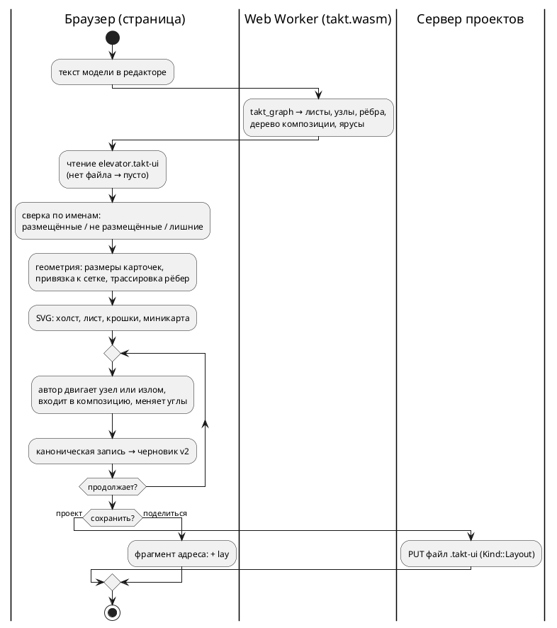

# Фича: графическое представление модели — раскладка состояний и рёбер в отдельном файле

- **Номер:** 0539
- **Статус:** РАЗРАБОТКА (с 2026-09-08; задачи 01–09 сделаны, оформление принято;
  впереди тест-план и отчёт)
- **Зависит от:** нет (связь с [онлайн-редактор Takt: подсветка, LSP, генерация, симуляция, обмен ссылками](0531-web-playground.md) — по
  контракту оболочки, нужные части в дереве; обоснование в разделе «Анализ»)
- **Tier:** — (новая функциональность, а не дефект: шкала признака вреда к ней
  неприменима)
- **Класс:** прочее
- **Связанные issue (анализ):** запрос заказчика 2026-09-07

## Стадии жизненного цикла

Все стадии — **разделы этой карточки**: «Архитектура (ADR)»,
«Анализ», «Разработка», «Тест-план», «Отчёт о тестировании», «Итог». Раздел
заводится в момент прохождения стадии, а не заранее. Отдельным артефактом
остаются только исправления — [`docs/fixes/`](../fixes/README.md) (при
необходимости `0539-YY-*`).

## Краткое описание

Модель Takt получает **графическое представление**: схему состояний и переходов,
которую автор двигает руками, а не получает заново при каждом открытии. Раскладка
хранится отдельным файлом рядом с моделью (`elevator.takt` → `elevator.takt-ui`) и
несёт координаты: центры состояний и точки рёбер. Составное состояние показывается
одним квадратом с укрупнённой моделью внутри, а вход в него открывает вложенную
модель отдельной схемой.

> Фича зарегистрирована по запросу заказчика 2026-09-07; далее проходит жизненный
> цикл по своду. **Проработка (архитектура и анализ) поручена отдельно** — здесь
> только регистрация требования.

## Требование заказчика (дословно по смыслу)

Записано без домысливания решений; всё, чего заказчик не сказал, вынесено ниже в
открытые вопросы.

- **Графическое представление модели** для интерфейса пользователя.
- Оно **хранит 2D-координаты рёбер** — форма рёбер **прямоугольная либо
  скруглённая** — и **координаты центров состояний**.
- **Скомпонованные модели** показываются **квадратом**, внутри которого видна
  укрупнённая модель.
- **Переход внутрь скомпонованной модели** открывает каждую модель.
- Раскладка живёт **отдельным файлом**, например `elevator.takt-ui`.
- Отображаемая часть должна быть **похожа на графический редактор схем**
  `archlang.dev`.

## Чем это не является

Отделено от соседних работ намеренно, чтобы проработка не начала с их переиспользования:

- **Это не кадры прогона.** У эталона уже есть графика (`gif`, `svg`,
  `unit::viewport` под фичей `graphics`): она рисует **состояние прогона по
  тактам** и раскладку вычисляет сама, детерминированно. Здесь предмет другой —
  **авторская** раскладка модели, которая переживает закрытие редактора.
- **Это не диаграмма цели `plantuml`.** Та порождается из модели целиком и
  координат не хранит: расположение выбирает чужой инструмент.

## Открытые вопросы для стадии архитектуры

Перечислены как вопросы, а не как варианты решения:

1. **Где живёт интерфейс** — внутри онлайн-редактора
   ([онлайн-редактор Takt: подсветка, LSP, генерация, симуляция, обмен ссылками](0531-web-playground.md)) или отдельным инструментом.
2. **Кто пишет файл раскладки** — только редактор, или компилятор умеет положить
   начальную раскладку для модели, у которой файла ещё нет.
3. **Что происходит при расхождении** файла и модели: состояние переименовано,
   удалено, добавлено. Раскладка описывает то, чего в модели уже нет, — это отказ,
   предупреждение или молчаливое приведение.
4. **Формат файла** и его отношение к правилам проекта: читается ли он
   компилятором, попадает ли под проверки предкоммита, детерминирован ли вывод.
5. **Единицы и система координат**, а также что означает «прямоугольное либо
   скруглённое» ребро — форму отрисовки или форму хранения (точки излома).
6. **Отношение к вложенности**: одна схема на модель или одна на файл; как
   адресуется вложенная модель при переходе внутрь.
7. **Референс `archlang.dev`** — что именно из него берётся образцом:
   взаимодействие, вид схемы или и то и другое.

## Документирование

Язык не меняется: синтаксис, семантика и поведение целей прежние, версия
языка остаётся `0.18.0`. Меняется **инструментарий**, и его документ
описывает в прикладном разделе «Инструментарий», подраздел «Онлайн-редактор»
(свод допускает описание применения инструментов): добавляется описание
вкладки «Схема» и файла раскладки рядом с моделью — что он хранит, что
компилятор его не читает, и что расхождение с моделью показывается, а не
ломает сборку. Языковые разделы правки не требуют. Ответ дан на стадии
архитектуры; работа — задача 08 плана разработки.

## Архитектура (ADR)

- **Status:** Proposed — решения, названные в «Decision» как **решения заказчика**,
  ждут его слова; остальное предложено к принятию.
- **Date:** 2026-09-08
- **Authors:** архитектор, системный аналитик, дизайнер интерфейса

### Context

Текст модели — единственное описание автомата, и проект держит это правило
жёстко: у веб-части нет своего знания о языке (подсветку красят токены модуля,
ключи сборки приходят от разбора аргументов компилятора). Схема состояний
обязана встать в тот же ряд: **что** рисовать, говорит компилятор, а **где** —
файл раскладки, который принадлежит автору. Иначе схема станет второй записью
модели, и две записи разойдутся молча.

**Что уже есть (снято чтением дерева 2026-09-08):**

| Слой | Что есть | Чего схеме не хватает |
|---|---|---|
| оболочка ([онлайн-редактор Takt: подсветка, LSP, генерация, симуляция, обмен ссылками](0531-web-playground.md)) | две области с разделителями, вкладки области вывода (`output`, `flags`, `trace`, `doc`), полка режимов для узкого экрана, проекты с файлами трёх родов (`.takt`, `.json`, `.md`), черновик `v2` с ревизией, ссылка-снимок во фрагменте адреса (`v`, `src`, `scn`, `t`, `args`), архив проекта круговым рейсом, словарь `i18n/` | вкладки «Схема» нет; рода файла для раскладки нет ни у страницы (`project.js`), ни у сервера (`limits.rs::check_file_name` знает три расширения); ссылка-снимок раскладку не несёт |
| модуль `takt-wasm` | `takt_symbols` — структура документа (модели, состояния, блоки, функции) с позициями; `takt_sim_tick` — строки трассы; `takt_goto`, `takt_rename` | графа переходов модуль не отдаёт: символы знают состояния, но не рёбра и не форму реализации; шаг прогона отдаёт **строку**, а не список активных состояний |
| эталон | раскладка графа отжигом (`unit/viewport/graph.rs`, `petgraph` + `rand` с постоянным зерном) и растеризатор — под фичей `graphics`, в модуле выключены | раскладка эталона рисует **прогон**, узлы — состояния всех уровней одним графом; авторских координат не принимает |
| дизайн-система | книга [`web/design/BOOK.md`](../../web/design/BOOK.md), витрина `controls.html`, проверка `check-design.py` (`D1`…`D8`): палитра сырья и реестр пар, пять ступеней кегля, три высоты, два скругления, пять состояний контрола, две темы | контролов холста нет: узел, ребро, сетка, миникарта, хлебные крошки, панель инструментов схемы |
| компилятор | семантическое дерево знает состояния, рёбра (`ref` с условием, `next`), реализацию состояния (`Extend::Concatenation` / `Parallel`, `implementation_children`), импорт | публичной функции «граф модели» нет; цель `plantuml` печатает текст диаграммы без координат (и предложена к изъятию — [изъятие цели диаграмм и очистка упоминаний](0540-remove-plantuml-target.md)) |

**Референс `archlang.dev` (замер 2026-09-08 прогоном страницы `/viewer` в
браузере).** Это просмотрщик архитектурных схем: бесконечный холст с точечной
сеткой, панорамирование и масштаб колесом, показатель масштаба (`1.00×`) и
миникарта в углу, слева — дерево файлов и узлов с поиском, сверху — хлебная
крошка «Корень» и кнопка «Отцентрировать на этом уровне», переключатель
«просмотр / правка». Узел — скруглённая карточка: значок вида, имя, вид мелким
кеглем, строка описания; выбранный узел получает кольцо акцента. **Контейнер —
та же карточка крупнее, а в её теле уменьшенное изображение вложенных узлов.**
Рёбра — плавные линии со стрелкой между карточками. Тема одна, тёмная.

Что из референса **применимо**: механика холста (панорамирование, масштаб,
сетка, миникарта, «отцентрировать», крошки уровня), форма карточки и
контейнер с миниатюрой, навигатор слева (у нас его даёт `takt_symbols`).
Что **не применимо**: временная шкала и сравнение версий, «аспекты», набор
значков по видам узлов (у нас видов четыре: стартовое, обычное, конечное,
композиция), одна тёмная тема (у нас две, и светлая — основная).

### Decision Drivers

1. **Одна правда о модели.** Состояния, рёбра, форма композиции приходят от
   компилятора; страница не разбирает текст модели и не хранит списка
   ключевых слов (контроль — `check-web.sh`).
2. **Раскладка — работа автора, и она переживает всё.** Файл рядом с моделью,
   в проекте, в архиве, в черновике, в ссылке-снимке; дифф файла в git несёт
   смысл — значит, запись канонична и детерминирована.
3. **Расхождение файла с моделью — не отказ.** Компилятор файла не читает;
   переименованное, удалённое и добавленное состояние обязаны показываться, а
   не ломать сборку или редактор.
4. **Без новых зависимостей.** Фронтенд без `npm` и сборщика (решение
   заказчика по [онлайн-редактор Takt: подсветка, LSP, генерация, симуляция, обмен ссылками](0531-web-playground.md)); библиотек холста в проект не
   входит. Разработчик один, CI не исполняется.
5. **Дизайн-система одна.** Новые контролы живут в книге, витрине и под
   проверкой `check-design.py`, а не рядом с ними.
6. **Детерминизм.** Начальная раскладка и запись файла воспроизводимы:
   тот же текст модели даёт тот же файл байт в байт.

### Considered Options

Варианты приведены по семи вопросам карточки; у каждого — принятое и
отвергнутое.

#### Вопрос 1 — где живёт интерфейс

- **A (принято): вкладка «Схема» в области вывода онлайн-редактора.** Там уже
  есть проект с файлами, сохранение, обмен, черновик, две темы и словарь;
  схема рядом с текстом — единственное место, где выбор состояния на схеме
  может подвинуть курсор в тексте и наоборот.
- B: отдельный настольный инструмент — отвергнут: в проекте нет
  графического стека, хранилища и обмена, а один разработчик их не потянет.
- C: панель в редакторе через LSP и `webview` плагина — отложен кандидатом:
  плагины собираются вне предкоммита, и класс «расхождение молча» там
  дороже; после первой редакции ту же страницу можно показать в `webview`.

#### Вопрос 2 — кто пишет файл раскладки

- **A (принято): пишет страница; граф и начальную раскладку считает
  библиотека.** `takt-lang` получает модуль `layout`: из семантического
  дерева строится **граф модели** (листы по моделям, узлы-состояния с видом и
  позицией в тексте, рёбра с текстом условия, дерево композиции) и
  **ярусная раскладка** (ярус и порядок узла; без случайности). Модуль
  экспортирует `takt_graph`. Геометрию — размеры карточек, шаг сетки,
  трассировку рёбер без сохранённых точек — считает страница: размеры
  принадлежат оформлению и известны только ей.
- B: подкоманда `taktc layout`, кладущая начальный файл, — отложена
  кандидатом: файл без автора, который его двигал, — шум в проекте;
  библиотечная функция та же, подкоманда добавляется по нужде.
- C: раскладка целиком в JS — отвергнута: страница узнала бы о моделях,
  состояниях и композиции, то есть о языке.
- D: раскладка отжигом эталона (`viewport/graph.rs`) — отвергнута: она
  тянет `petgraph` и `rand` в модуль, рисует все уровни одним графом и не
  предназначена для листов по моделям.

#### Вопрос 3 — расхождение файла и модели

- **A (принято): файл — подсказка, ключ — имя.** Узел ищется по пути листа и
  имени состояния, ребро — по паре имён и порядковому номеру среди рёбер той
  же пары. Состояние без записи ставится автоматически и помечается как
  «не размещено» до первого перемещения. Запись без состояния читается,
  не рисуется и **снимается при следующей записи**, о чём страница говорит
  строкой-уведомлением с именами. Отказа нет ни в каком случае; компилятор
  файла не читает, сборка от него не зависит.
- B: отказ на расхождении — отвергнут: переименование состояния в тексте
  давало бы неоткрываемую схему.
- C: молчаливое приведение — отвергнуто: автор терял бы раскладку, не узнав.
- Дополнение (редакторский слой): `rename` из редактора переименовывает и
  ключи раскладки — иначе каждое переименование ронялo бы позицию.

#### Вопрос 4 — формат файла

- **A (принято): JSON с полем версии формата, каноническая запись.** Ключи
  отсортированы, отступ два пробела, координаты целые, перевод строки в
  конце. Родов файла проекта становится четыре: `Kind::Layout` по расширению
  `.takt-ui`; файл входит в архив и в предел размера. Компилятор и
  форматтер его не знают; проверки предкоммита — тесты в `node` на канон,
  сверку с графом и круговой рейс.
- B: текстовая запись в духе Takt — отвергнута: вторая грамматика в проекте.
- C: YAML или TOML — отвергнуты: разборщика в дереве нет, а JSON уже разбирают
  сценарии и архив.

#### Вопрос 5 — единицы, координаты, форма ребра

- **A (принято).** Единица — логический пиксель при масштабе `1.0`, начало —
  левый верхний угол листа, ось `y` вниз, значения целые, привязка к сетке
  шага `--gap`. У узла хранится **центр**; размер не хранится — его задаёт
  оформление (карточка по тексту имени, композиция — квадрат постоянной
  стороны). У ребра хранятся **точки излома** ортогональной ломаной;
  сторона присоединения к карточке считается по первой и последней точке.
  «Прямоугольная либо скруглённая» — **форма отрисовки углов** (`square`
  либо `round`), одна на файл; хранятся те же точки.
- B: хранить размеры узлов — отвергнуто: размер принадлежит оформлению и
  кеглю читателя; хранить его значит зафиксировать вид.
- C: хранить точки присоединения — отвергнуто: при смене кегля карточка
  растёт, и точка уезжала бы с грани.

#### Вопрос 6 — вложенность

- **A (принято): один файл раскладки на файл модели, внутри — листы по
  моделям.** Ключ листа — путь модели (`/` у корня, `Engine`, `C/C1`).
  Состояние с реализацией показывается **квадратом с миниатюрой**: для
  одной модели — уменьшенный лист этой модели, для композиции — уменьшенная
  схема выражения. Вход в квадрат: у одной модели — сразу её лист; у
  композиции — **лист композиции** (цепочка `+` слева направо, ветви `|`
  друг под другом, скобки — вложенными рамками), где каждая модель —
  карточка, а вход в неё открывает лист модели. Лист композиции строится
  из выражения и **не хранится**. Крошки уровня — путь входа. Лист
  импортированной модели живёт в раскладке **её** файла; нет файла —
  автоматическая раскладка.
- B: одна схема на файл со всеми уровнями — отвергнута: лифт даёт шесть
  экземпляров `Engine` на одном листе, и авторская раскладка теряет смысл.
- C: хранить раскладку листа композиции — отложено кандидатом: форма
  выражения диктует порядок, двигать там нечего.

#### Вопрос 7 — что берётся из референса

Ответ дан в «Context»: механика холста, карточка, контейнер с миниатюрой,
навигатор и крошки — берутся; тёмная тема как единственная, временная
шкала, «аспекты» и значки по видам — нет. Разделение записано в брифе
дизайнеру (раздел «Анализ»).

#### Решения сверх вопросов карточки

- **A8. Отрисовка — SVG в дереве документа**, без библиотек. Узел — элемент
  с фокусом и именем для диктора, цвета — токены `app.css`, шрифт — тот же
  Fira Code, масштаб — `viewBox`. Отвергнут `canvas`: узлы без фокуса, своё
  попадание курсора, текст мимо каскада стилей; у модели десятки состояний,
  и производительности `canvas` не требуется.
- **A9. Схема не редактирует модель.** В первой редакции она — вид модели
  плюс редактор раскладки: двигать узлы и изломы, менять форму углов,
  возвращать автоматическую раскладку. Добавление состояний и рёбер со
  схемы — кандидат: текст остаётся единственным носителем модели.
- **A10. Выбор синхронен с текстом в обе стороны.** Щелчок по узлу ставит
  курсор на объявление (как переход по символу); курсор в объявлении
  состояния подсвечивает узел.
- **A11. Подсветка прогона — по решению заказчика.** Активные состояния
  шага уже известны эталону (`active_states`), но `takt_sim_tick` отдаёт
  строку; чтобы схема их показала, ответ шага получает список имён. Работа
  небольшая, но требованием заказчика не названа: заведена отдельной
  последней задачей, дизайнер рисует состояние узла «в прогоне» заранее.

### Decision

Принять вариант A по каждому вопросу и решения A8–A11. Целевой поток:

**Декомпозиция для стадии анализа** (порядок — по самостоятельной пользе;
нумерация уточняется анализом):

| Часть | Содержание | Что даёт сама по себе |
|---|---|---|
| 01 | `takt_lang::layout`: граф модели и ярусная раскладка; экспорт `takt_graph` | граф, проверяемый тестами и годный любому потребителю |
| 02 | формат `.takt-ui`: чтение, канон, сверка, запись; род файла у страницы и сервера; архив | файл, который можно править руками и хранить в git |
| 03 | дизайн холста: бриф, техническое задание, выходные требования (внешний дизайнер, параллельно 01–02) | книга, витрина и токены схемы |
| 04 | холст: вкладка «Схема», лист, навигатор, крошки, миникарта, масштаб, выбор, синхронизация с текстом | просмотр модели |
| 05 | правка раскладки: перенос узлов и изломов, форма углов, автораскладка, отмена | авторская раскладка |
| 06 | композиция: квадрат с миниатюрой, вход и выход, лист композиции | вложенность |
| 07 | сохранение: черновик, проект, ссылка-снимок, архив, уведомление о расхождении | раскладка переживает закрытие |
| 08 | документ и README: подраздел «Онлайн-редактор» | описание применения |
| 09 | подсветка активных состояний прогона (по решению заказчика) | связь схемы с симуляцией |

**Решения, ожидающие заказчика:** (1) схема не редактирует модель в первой
редакции (A9); (2) лист композиции строится из выражения и не хранится
(вопрос 6); (3) расширение `.takt-ui` и JSON внутри (вопрос 4); (4) входит ли
подсветка прогона в объём (A11); (5) привлечение внешнего дизайнера по брифу
из раздела «Анализ» — либо оформление делает разработчик по тому же
техническому заданию.

### Consequences

- **Язык не меняется**; версия языка остаётся `0.18.0`. Раздел
  «Документирование» карточки уточнён: описывается инструмент.
- `takt-lang` получает модуль `layout` — граф модели становится публичным
  API библиотеки, и цель `plantuml` при изъятии (0540) ничего не теряет:
  граф живёт отдельно от печати диаграммы.
- Модуль `takt-wasm` растёт на один экспорт; ответ `takt_sim_tick` получает
  поле со списком активных состояний (при принятии A11).
- Сервер проектов учится четвёртому роду файла; старые проекты без
  раскладки открываются как прежде — файл необязателен.
- Ссылка-снимок получает поле `lay`; ссылки без него читаются по-старому.
- В книгу оформления входит раздел о холсте, в витрину — образцы, в
  `app.css` — токены схемы; проверка `check-design.py` судит их наравне с
  прочими.
- Предкоммит получает тесты в `node` (канон файла, сверка, круговой рейс
  ссылки и архива) и тесты `cargo` для модуля `layout`; цена измеряется на
  стадии анализа.

#### Acceptance criteria

1. Для каждого `examples/*.takt` вызов `takt_graph` отвечает без отказа;
   число узлов листа равно числу состояний модели, число рёбер — числу
   `ref` и `next`; повторный вызов даёт тот же ответ байт в байт.
2. Запись файла раскладки канонична: чтение и запись без правок дают тот же
   файл байт в байт; две записи одной раскладки совпадают.
3. Переименование, удаление и добавление состояния в тексте не ломают
   схему: узел без записи размещается автоматически и помечен, лишняя
   запись названа в уведомлении и снята при записи; отказов нет.
4. Раскладка переживает закрытие страницы (черновик), сохранение проекта,
   архив круговым рейсом и ссылку-снимок.
5. Композиция показана квадратом с миниатюрой; вход открывает лист
   композиции либо модели; крошки ведут обратно.
6. Схема проходит проверку `check-design.py`, читается в обеих темах,
   контраст пар не ниже 4,5:1, узлы доступны с клавиатуры.
7. В `web/` нет списка ключевых слов Takt и разбора текста модели
   (контроль — `check-web.sh`).
8. `./scripts/precheck.sh` зелёный.

## Анализ

### Цель и контекст

ADR принял вкладку «Схема» в онлайн-редакторе, граф от компилятора,
раскладку в файле `.takt-ui` рядом с моделью и вложенность листами по
моделям. Анализ переводит решения в проверяемые требования и задачи, а
для стадии оформления даёт **бриф, техническое задание и выходные
требования** внешнему дизайнеру — так, чтобы результат оформления
передавался в разработку без устных договорённостей.

### Замер (дата 2026-09-08)

| Предмет | Факт | Следствие для задач |
|---|---|---|
| структура документа | `takt_symbols` отдаёт модели и состояния с диапазонами имени и объявления, вложенные модели — детьми | навигатор схемы строится по символам; граф добавляет рёбра и реализацию (01) |
| рёбра в дереве | `StateElement::Reference(loc, имя, условие)` и `StateElement::Next(имя)`; условие — узел, цитату даёт исходник по позиции | текст условия на ребре берётся из исходника по `loc`, а не печатается заново (01) |
| реализация состояния | `StateDefine::implements` — выражение; семантика даёт `Extend::Concatenation` / `Parallel` / ссылку на модель; список детей по вызову — `implementation_children` | лист композиции строится из `Extend`; одна модель — прямой вход (01, 06) |
| пример заказчика | `examples/elevator.takt`: модель `Engine` (пять состояний, самопереход `ref` в `Idle`), корень `Main = Engine`, `Middle = Engine + (Engine \| Engine) + Engine + Engine + Engine`, `End` | шесть экземпляров одной модели на одном листе композиции — довод за листы по моделям и за квадрат с миниатюрой |
| шаг прогона | `takt_sim_tick` отвечает строками `lines`; `trace::step_line` печатает `active_states()` | подсветка прогона требует поля со списком имён (09) |
| роды файлов | сервер: `.takt`, `.json`, `.md` (`limits.rs::check_file_name`); страница: `kind === "takt"`, `"scenario"` (`project.js`) | четвёртый род `layout` в обоих местах (02); пара «модель ↔ раскладка» по имени файла |
| ссылка-снимок | поля `v`, `src`, `scn`, `t`, `args` (`share.js`) | поле `lay` (07) |
| черновик | `draft.js`: ключ проект+файл, ревизия, предел размера | раскладка — ещё один файл черновика по тем же правилам (07) |
| оформление | `app.css`: сырьё двух тем, семь пар реестра, `--tok-*`, пять кеглей, три высоты, два скругления, `--gap` 8 px, движение 120 мс; `check-design.py` `D1`…`D8` | все размеры холста — от `--gap` и шкал; новые пары — в реестр книги (03) |
| значки | inline SVG 24×24, штрих 1,5, `currentColor`; символами не набираются (Fira Code не знает `⚙ ✎`) | значки панели схемы — тем же способом (03) |
| знание о языке в вебе | `check-web.sh` падает на списке ключевых слов в `web/static` и `web/tests` | страница не разбирает текст модели; всё от `takt_graph` (04) |
| раскладка эталона | `viewport/graph.rs`: отжиг, постоянное зерно, один граф на все уровни; под `graphics` | не переиспользуется (решение ADR); её кадр остаётся кадром прогона |
| референс | `archlang.dev/viewer`: холст, сетка, миникарта, крошка «Корень», «Отцентрировать на этом уровне», карточка с заголовком и описанием, контейнер с миниатюрой, дерево слева | перечень заимствований — в брифе (03) |

### Зависимости фичи

**Зависит от: нет.** Оболочка онлайн-редактора
([онлайн-редактор Takt: подсветка, LSP, генерация, симуляция, обмен ссылками](0531-web-playground.md)) нужна схеме по контракту, и все её
части, на которые схема опирается, **уже в дереве**: области и вкладки,
проекты с файлами, черновик, ссылка-снимок, архив, словарь, книга оформления
с проверкой. Незакрытый остаток той фичи — переход схемы базы при выкатке
— схемы не касается, поэтому блокировки нет; связь названа, а не
зависимость. [Изъятие цели диаграмм и очистка упоминаний](0540-remove-plantuml-target.md) не зависимость и не
зависит: граф модели живёт в `takt-lang::layout` отдельно от печати диаграммы.
[Язык сообщений компилятора и симулятора (i18n)](0532-i18n-diagnostics.md) не нужна: тексты схемы — строки словаря оболочки, а
тексты условий на рёбрах — цитаты исходника.

### Требования и проверяемые условия

- **R1. Граф модели.** `takt_lang::layout::graph(&дерево) -> Graph`: листы по
  моделям (ключ — путь модели, `/` у корня), у листа — узлы (имя, вид
  `start` / `state` / `end` / `composition`, позиция имени и объявления,
  дерево реализации) и рёбра (от, к, порядковый номер в паре, вид `ref` /
  `next`, текст условия, позиция). Условие: на каждом `examples/*.takt` и
  корпусе матрицы вызов не отказывает, счёт узлов и рёбер совпадает со
  счётом по АСД.
- **R2. Ярусная раскладка.** Для листа считаются `rank` (расстояние от
  стартового состояния по рёбрам, недостижимые — ниже всех) и `order`
  внутри яруса (уменьшение пересечений барицентром, разрешение ничьих по
  имени). Условие: без случайности — два вызова дают одно; на `Engine`
  лифта `Idle` в нулевом ярусе, `DoorOpening` — в последнем.
- **R3. Экспорт модуля.** `takt_graph(src) -> JSON` тем же мостом, что
  прочие экспорты; на неразбираемом тексте — ответ с диагностикой, не
  отказ. Условие: тест модуля на `elevator.takt` — три листа (`/`,
  `Engine`, лист композиции `Middle` считается страницей), у `Engine` пять
  узлов и семь рёбер, среди них самопереход.
- **R4. Формат файла.** JSON, поле `format: 1`, `corners: "square" | "round"`,
  `sheets` → лист → `nodes` (имя → `{x, y}`), `edges` (`от>к:номер` →
  `{points: [[x, y], …]}`). Каноническая запись: ключи отсортированы, отступ
  два пробела, числа целые, `\n` в конце. Условие: чтение и запись любого
  файла из тестовых данных дают тот же файл; неверный формат (незнакомая
  версия, не объект) — уведомление словами и пустая раскладка, не отказ.
- **R5. Сверка с графом.** Узел без записи — «не размещён», записи без узла
  — список имён для уведомления, рёбра — по той же схеме. Условие: тесты в
  `node` на переименование, удаление, добавление.
- **R6. Род файла.** Сервер принимает `.takt-ui` как `Kind::Layout` в тех же
  пределах имени и размера; архив несёт его и восстанавливает; страница
  находит раскладку по имени модели (`elevator.takt` ↔ `elevator.takt-ui`).
  Условие: круговой рейс архива с раскладкой; проект без файла раскладки
  открывается без уведомлений.
- **R7. Вкладка «Схема».** В области вывода — вкладка, на узком экране —
  режим полки. Лист рисуется SVG: сетка, узлы, рёбра со стрелкой, подписи
  условий, крошки уровня, миникарта, показатель масштаба, панель
  инструментов (масштаб, вписать, отцентрировать, автораскладка, форма
  углов, навигатор). Условие: прогон страницы в обеих темах; вкладка не
  ломает раскладку областей.
- **R8. Навигация.** Панорамирование мышью и пальцем, масштаб колесом и
  кнопками в пределах `0,25×`…`4×`, «вписать» по содержимому листа, крошки
  ведут по уровням. Условие: тесты координатных функций в `node`
  (экран ↔ лист при масштабе и сдвиге).
- **R9. Правка раскладки.** Перенос узла с привязкой к сетке `--gap`,
  перенос и добавление изломов ребра (двойной щелчок по сегменту — новая
  точка, по точке — снятие), переключение формы углов, автораскладка
  текущего листа, отмена и повтор в пределах сессии. Условие: тесты
  канонической записи после каждой операции.
- **R10. Синхронизация с текстом.** Щелчок по узлу ставит курсор на имя
  состояния; курсор внутри объявления состояния подсвечивает узел;
  `rename` из редактора переименовывает ключи раскладки. Условие: тест на
  переименование состояния через `takt_rename` с последующей сверкой.
- **R11. Композиция.** Узел с реализацией — квадрат постоянной стороны с
  миниатюрой; вход (двойной щелчок, Enter) открывает лист модели либо лист
  композиции; лист композиции строится из выражения; крошки и Escape ведут
  назад. Условие: на `elevator.takt` вход в `Middle` показывает цепочку из
  пяти шагов, второй шаг — две ветви; вход в любую `Engine` открывает
  один и тот же лист.
- **R12. Сохранение.** Раскладка — в черновике `v2` под своим ключом, в
  проекте — файлом при сохранении, в ссылке-снимке — полем `lay`, в архиве —
  файлом. Условие: круговые рейсы каждого пути в `node`.
- **R13. Доступность.** Узел — элемент с фокусом и именем; стрелки двигают
  выбранный узел на шаг сетки, Shift — на пять; состояние узла не только
  цветом (стартовое, конечное, композиция, не размещён — формой или
  меткой); контраст ≥ 4,5:1. Условие: замер контраста в карточке, прогон с
  клавиатуры.
- **R14. Без знания о языке.** В `web/` нет разбора текста модели и списка
  ключевых слов; всё содержание схемы — из `takt_graph`. Условие —
  `check-web.sh`.
- **R15. Подсветка прогона (по решению заказчика).** Ответ `takt_sim_tick`
  получает `states` — список активных состояний шага; при прогоне узлы
  активных состояний получают вид «в прогоне», а по завершении —
  снимаются. Условие: сверка списка со строкой трассы того же шага.

### Критерии приёмки и способ проверки

Критерии — восемь пунктов ADR. Способ: тесты `cargo` модуля `layout`
(R1–R2), тест модуля `takt-wasm` (R3, R15), тесты `node` в `web/tests`
(R4–R6, R8–R10, R12), прогон страницы в браузере обеими темами и с
клавиатуры (R7, R11, R13), `check-design.py` и `check-web.sh` (R13–R14),
`precheck.sh` целиком.

### Редакторский слой

Язык не меняется: лексика, синтаксис и семантика прежние, LSP и плагины
редакторов правки не требуют. Две оговорки: (1) `rename` в **веб-редакторе**
обязан переименовать ключи раскладки (R10) — это оболочка, не сервер языка;
(2) `takt-lsp` и плагины файла `.takt-ui` не знают и знать не обязаны —
переименование состояния из IntelliJ или Zed оставит запись раскладки
«лишней», и схема покажет это уведомлением (R5). Ответ «не нужно» для LSP
и плагинов зафиксирован с этим обоснованием.

### Особенности по обратной функциональности

- Файл раскладки необязателен: проект, архив и ссылка без него открываются
  как прежде.
- Ссылка-снимок без поля `lay` читается по-старому; поле добавляется, а не
  переопределяет форму.
- Версия формата в файле: незнакомая версия — уведомление и пустая
  раскладка; правило то же, что у архива.
- Обратная совместимость языка не затрагивается.

### Риски и зависимости

- **Геометрия на странице, знание — в библиотеке.** Граница проходит по
  размерам: как только странице понадобится «какой узел куда» сверх яруса
  и порядка, знание уедет в JS. Контроль — `check-web.sh` и обзор кода.
- **Размер `app.js`** (1058 строк) — холст заводится своими модулями
  (`scheme.js`, `layout.js`, `sheet.js`), а не наращивает главный.
- **Двойной щелчок и касание.** На сенсорном экране двойного щелчка нет:
  вход в композицию дублируется кнопкой на карточке и Enter.
- **Цена предкоммита.** Тесты `node` и `cargo` добавляются; замер —
  `scripts/measure-precheck.sh` в отчёте.
- **Дизайн без дизайнера.** Если заказчик не привлекает внешнего дизайнера,
  техническое задание ниже исполняет разработчик; выходные требования
  остаются теми же.

### План разработки: задачи и порядок выполнения

| Задача | Содержание | Проверка |
|---|---|---|
| 01 | модуль `takt_lang::layout` (граф, ярусы), экспорт `takt_graph`, тесты на корпусе | R1–R3 |
| 02 | `web/static/layout.js`: чтение, канон, сверка, запись; сервер `Kind::Layout`, архив, пределы; `project.js` — пара по имени | R4–R6 |
| 03 | оформление по брифу и техническому заданию ниже; приём по выходным требованиям | книга, витрина, `check-design.py` |
| 04 | вкладка «Схема»: `scheme.js` (холст, лист, крошки, миникарта, масштаб, навигатор), синхронизация с текстом | R7, R8, R10, R13, R14 |
| 05 | правка раскладки: перенос, изломы, углы, автораскладка, отмена | R9 |
| 06 | композиция: квадрат с миниатюрой, вход и выход, лист композиции | R11 |
| 07 | сохранение: черновик, проект, ссылка, архив, уведомление о расхождении | R12 |
| 08 | документ (подраздел «Онлайн-редактор»), README, журнал | правило свода о документировании |
| 09 | подсветка прогона (по решению заказчика) | R15 |

Задача 03 идёт **параллельно** 01 и 02 и обязана закончиться до 04: холст
строится на её токенах.

### Бриф дизайнеру (задача 03)

> Бриф, техническое задание и выходные требования выгружены для передачи
> отдельным файлом: [`docs/design/brief/0539-model-scheme.md`](../design/brief/0539-model-scheme.md)
> и той же страницей в HTML [`0539-model-scheme.html`](../design/brief/0539-model-scheme.html)
> (запрос заказчика 2026-09-08); источник — этот раздел.

**Что делаем.** Вкладка «Схема» онлайн-редактора Takt: схема состояний и
переходов модели, которую автор раскладывает руками. Схема — **вид**
модели: текст остаётся единственным её описанием, схема показывает и даёт
двигать. Ниже — что уже задано, что нужно нарисовать и чего не делать.

**Кто читает.** Автор модели: инженер по автоматике либо студент, читающий
учебный пример. Смотрит на схему рядом с текстом, на ноутбуке; на телефоне
— реже и только для просмотра.

**Референс — `archlang.dev/viewer`.** Открыть, покрутить, войти в
контейнер «Clients And Devices». Берём: ощущение бесконечного холста с
точечной сеткой; карточку-узел (скруглённый прямоугольник, имя крупно, вид
мелко); контейнер как ту же карточку крупнее с миниатюрой содержимого;
миникарту, показатель масштаба, крошку уровня, «отцентрировать»; дерево
слева. Не берём: тёмную тему как единственную; временную шкалу и сравнение;
«аспекты»; значки по видам узлов; плотность текста в карточке (у нас имя и
одна строка вида, описания нет).

**Что уже задано и обсуждению не подлежит.** Дизайн-система живёт в
[`web/design/BOOK.md`](../../web/design/BOOK.md) и показана в
[`controls.html`](../../web/design/controls.html); проверка
[`check-design.py`](../../scripts/check-design.py) падает на нарушении.
Коротко:

- шрифт один — Fira Code, наклона нет; кегль — пять ступеней, высоты — три,
  скругления — два, отступы — от `--gap` (8 px);
- цвета — только токены: сырьё двух тем и реестр пар «заливка / чернила»;
  цвет числом вне палитры — отказ проверки; новая пара — строка реестра;
- отклик наведения и нажатия — формулой, а не своим цветом; фокус — кольцо
  акцента; недоступное — чернилами, без прозрачности; теней нет;
- значки — inline SVG 24×24, штрих 1,5, `currentColor`; символами не
  набираются; у каждой кнопки-значка подпись словом;
- полос прокрутки нет, у прокручиваемого — растворяющийся край;
- две темы: светлая «чертёжная бумага» — основная, тёмная — наша; контраст
  пар не ниже 4,5:1;
- на узком экране (до 900 px) область одна и переключается полкой режимов;
  там, где нет наведения, цель нажатия не меньше 44 px.

**Что нужно нарисовать** (каждый пункт — в обеих темах):

1. **Холст.** Сетка точками с шагом, кратным `--gap`; поле листа; вид пустого
   листа (модель не разбирается — что видит автор); вид листа с одним
   состоянием.
2. **Узел-состояние** — четыре вида: стартовое, обычное, конечное (без
   рёбер и тела), композиция (квадрат с миниатюрой). Вид передаётся не
   только цветом.
3. **Состояния узла**: обычное, наведение, выбранное, в фокусе (с
   клавиатуры), перетаскиваемое, «не размещён» (записи в файле нет),
   «в прогоне» (на будущее — рисуется сейчас, включится позже).
4. **Ребро**: ортогональная ломаная с прямыми углами и со скруглёнными;
   стрелка у цели; условный переход (`ref` с условием) и безусловный
   (`next`) различимы не только подписью; самопереход (петля у карточки);
   подпись условия на ребре (моноширинная цитата, длинная — усечена);
   ребро выбрано; излом (точка) в покое, при наведении и при переносе.
5. **Композиция изнутри**: лист композиции — цепочка шагов слева направо,
   параллельные ветви друг под другом, скобки — вложенной рамкой; карточка
   модели в цепочке; вход в модель.
6. **Крошки уровня** (`Корень › Middle › Engine`), кнопка «наверх».
7. **Панель инструментов схемы**: масштаб (−, показатель, +), «вписать»,
   «отцентрировать», «автораскладка», переключатель формы углов, кнопка
   навигатора; значки в стиле витрины.
8. **Навигатор**: дерево «модель → состояния», строка с видом, выбранная
   строка; на узком экране — как открывается.
9. **Миникарта**: рамка видимой области, узлы точками.
10. **Уведомление о расхождении**: строка `.notice` с именами лишних
    записей и действием «убрать».
11. **Узкий экран**: вкладка «Схема» в полке режимов, холст во весь экран,
    панель инструментов, без перетаскивания изломов (только просмотр и
    перенос узлов).

**Чего не делать.** Не придумывать значков видам состояний; не вводить
новых цветов, теней, третьей высоты и шестого кегля; не рисовать
редактирование модели (добавление состояний, рёбер, правку условий);
не показывать значения переменных и портов на схеме; не делать тёмную тему
единственной.

### Техническое задание дизайнеру

Ниже — поведение, которое оформление обязано выразить. Числа — исходные
значения; дизайнер вправе предложить иные, назвав причину и **выразив их
через шкалы книги**.

**Т1. Лист и сетка.** Единица — логический пиксель при масштабе `1,0`.
Сетка привязки — `--gap` (8 px); сетка рисуется точками через три шага
(24 px). Пределы масштаба `0,25×`…`4×`; шаг колеса — `1,1`; при
масштабе ниже `0,5×` подписи условий скрываются, имена остаются.

**Т2. Карточка состояния.** Высота `--h-control` (3rem); ширина — по
имени, не уже `8ch` плюс поля `--gap`; скругление `--radius`. Имя —
кегль `--text-md`; вид («старт», «конец») — строка `--text-xs` чернилами
`--on-surface-soft` либо форма (двойная рамка у конечного, метка входа у
стартового) — выбор за дизайнером, но не только цвет. Заливка — пара
`--surface-raised`; выбранное — пара «выбранное» `--surface-yes` (та же,
что у вкладки); фокус — кольцо `--accent`.

**Т3. Композиция.** Квадрат со стороной `3 × --h-control` (9rem), скругление
`--radius`; заголовок — имя состояния тем же кеглем; в теле — миниатюра
листа (узлы точками либо уменьшенными карточками без текста, рёбра
линиями), уменьшенная так, чтобы лист влез целиком. Кнопка входа на
карточке (для касания); двойной щелчок и Enter — вход.

**Т4. Ребро.** Штрих `1,5` при масштабе `1,0`, чернила `--on-surface-soft`;
выбранное — `--on-surface`; стрелка у цели — рисованная, размер от штриха.
Углы: прямые либо скруглённые радиусом `--radius-sm`, одна форма на файл.
Безусловное ребро (`next`) — сплошная линия; условное — с подписью;
различие сверх подписи — выбор дизайнера (например, форма стрелки).
Самопереход — петля у правого верхнего угла карточки. Подпись условия:
кегль `--text-sm`, моноширинная, на подложке `--surface` без рамки, не
длиннее `24ch` (далее многоточие; полная — подсказкой `.tip`).

**Т5. Изломы.** Точка излома видна при выборе ребра и наведении: круг
диаметром `--gap`; при переносе — заливка акцентом. Добавление — двойной
щелчок по сегменту, снятие — двойной щелчок по точке; на касании — кнопки
в панели («добавить излом», «убрать излом») для выбранного ребра.

**Т6. Перенос узла.** Порог начала переноса — 4 px; во время переноса
карточка приподнята парой `--surface-raised` и рамкой акцента; рёбра
следуют за карточкой, сохранённые изломы не двигаются; привязка к сетке.
Отмена — Escape во время переноса, Ctrl+Z после.

**Т7. Крошки.** Строка над листом: `Корень › Middle › Engine`, кегль
`--text-sm`, разделитель нарисован (не символом); последняя крошка —
текущий лист, не ссылка. Высота строки `--h-compact`.

**Т8. Панель инструментов.** Кнопки-значки высотой `--h-dense` в обойме
(`.seg`) в правом верхнем углу холста; показатель масштаба — текст
`--text-xs`; переключатель углов — залипающая кнопка с `aria-pressed`;
навигатор — кнопка, открывающая панель слева поверх холста (ширина по
содержимому, не шире трети области).

**Т9. Навигатор.** Дерево строк высотой `--h-dense`: модель — полужирно,
состояния — с отступом `--gap-lg`; вид состояния — метка `--text-xs`;
выбранная строка — пара «выбранное»; щелчок — выбрать узел и
отцентрировать; двойной — войти.

**Т10. Миникарта.** Правый нижний угол, `8rem × 6rem`, поверхность
`--surface-sunken` с рамкой `--border`; узлы — прямоугольники чернилами
`--on-surface-off`, видимая область — рамка акцента; щелчок — переместить
вид. На узком экране миникарты нет.

**Т11. Уведомление о расхождении.** Строка `.notice` над листом: «Раскладка
знает состояния, которых в модели нет: A, B — убрать». Действие —
кнопка в строке; строка исчезает после записи.

**Т12. Пустой лист.** Модель не разбирается — строка словами («схема
появится, когда модель разберётся») по центру холста, кегль `--text-lg`,
чернила `--on-surface-soft`; ничего не рисуется.

**Т13. Состояние «не размещён».** Узел поставлен автоматически: рамка
штриховая либо метка — не только цвет; снимается первым переносом.

**Т14. Состояние «в прогоне».** Узел активного состояния шага: рамка
акцента с заливкой пары `--surface-yes`; несколько активных узлов
одновременно (параллельные ветви) — одинаково.

**Т15. Клавиатура.** Tab — по узлам в порядке ярусов; стрелки — перенос
выбранного на шаг сетки (Shift — пять шагов); Enter — вход в композицию;
Escape — назад по крошкам либо снятие выбора; `+`/`−` — масштаб; `0` —
вписать. Раскладка клавиш показывается подсказкой на кнопке навигатора.

**Т16. Узкий экран.** Вкладка «Схема» в полке режимов; панель инструментов
сворачивается в две кнопки (масштаб «вписать» и навигатор); изломы не
редактируются; перенос узла — долгим нажатием; миникарты нет.

### Выходные требования к дизайнеру (передача в разработку)

Результат оформления принимается **только** в перечисленном виде; каждая
позиция проверяется названным способом. Форма — вёрстка на живом
`app.css`, а не картинка: картинку не проверит машина и не соберёт
разработчик.

1. **Образцы в витрине.** Фрагменты в
   [`controls.html`](../../web/design/controls.html) по одному разделу
   `.case` на контрол: карточка состояния (четыре вида × семь состояний),
   ребро (обе формы углов, самопереход, подпись), излом, крошки, панель
   инструментов, строка навигатора, миникарта, уведомление, пустой лист.
   Проверка: `check-design.py` зелёный (`D6` требует образца у каждого
   контрола книги и наоборот), `D7` — у витрины нет своих цветов и кеглей.
2. **Правила в книге.** Раздел «Схема» в
   [`web/design/BOOK.md`](../../web/design/BOOK.md) по шаблону книги («что
   это → состояния → чего у него нет») на каждый контрол; новые пары —
   строками реестра пар; каждое отступление от референса названо с
   причиной. Проверка: `D3` — пара из реестра, чтение аналитиком.
3. **Токены.** Новые токены в `app.css` — только через сырьё обеих тем,
   объявлены прежде употребления, с комментарием назначения; список
   новых токенов с значениями обеих тем — в разделе книги. Проверка:
   `D1`, `D8`.
4. **Замер контраста.** Таблица «пара → контраст светлая / тёмная» для всех
   новых пар и подписей на холсте; ни одного значения ниже 4,5:1;
   штрих ребра и рамки — не ниже 3:1 к фону листа. Проверка: таблица в
   карточке фичи, выборочный пересчёт.
5. **Значки.** SVG 24×24, штрих 1,5, `currentColor`, без заливок и
   `title` внутри; по одному на действие панели (масштаб ±, вписать,
   отцентрировать, автораскладка, углы прямые / скруглённые, навигатор,
   вход в композицию, наверх, добавить излом, убрать излом). Проверка:
   прогон в витрине обеими темами.
6. **Матрица состояний.** Таблица «контрол × состояние → чем выражено»
   (пара, рамка, форма, метка) — для узла, ребра, излома, строки
   навигатора, крошки; в каждой клетке состояние выражено **не только
   цветом**. Проверка: чтение; `R13`.
7. **Размерная сетка.** Все размеры — через шкалы (`--h-*`, `--radius*`,
   `--gap*`, `--text-*`); новые числа (сторона квадрата композиции, размер
   миникарты, предел подписи) — константами в `app.css` с производной от
   шкалы. Проверка: `D4`, `D5`.
8. **Спецификация взаимодействий.** Уточнённые Т1–Т16 в виде таблицы
   «жест / клавиша → результат → отклик на экране» для мыши, касания и
   клавиатуры, включая курсоры (`grab`, `grabbing`, `crosshair`).
   Проверка: чтение аналитиком, сверка с R8–R11, R13.
9. **Строки словаря.** Все тексты схемы — ключами `scheme.*` в
   `web/static/i18n/ru.json` и `en.json`: подписи кнопок, подсказки,
   уведомления, пустой лист, крошка «Корень», виды состояний. Русского
   текста мимо словаря нет. Проверка: сканер `check-web.sh`.
10. **Узкий экран и касание.** Образцы витрины показаны в ширине 375 px;
    цели нажатия не меньше 44 px под `hover: none`. Проверка: прогон
    витрины в браузере с эмуляцией.
11. **Обе темы.** Каждый образец снят в светлой и тёмной теме; снимки
    приложены к карточке фичи (раздел «Разработка», задача 03).
12. **Приём.** Оформление принято, когда пункты 1–11 выполнены, проверка
    `check-design.py` зелёная, а аналитик подтвердил, что матрица
    состояний и спецификация взаимодействий покрывают R7–R13. До приёма
    задача 04 не начинается.

## Разработка

Заказчик 2026-09-08 велел начать без оформления: дизайн придёт позже. Взяты
задачи, которые от него не зависят, — 01 (граф и ярусы в библиотеке, экспорт
модуля) и 02 (файл раскладки, род файла у сервера и страницы, архив, пара по
имени). Задача 03 ждёт дизайнера; 04–07 строятся на её токенах и до приёма
оформления не начинаются (условие выходного требования 12 анализа).

### Задача — граф модели и ярусы: `takt_lang::layout`, экспорт `takt_graph`

**Что сделано.**

- Модуль `takt-lang/src/layout/` (три файла: типы и построение, ярусы, тесты).
  Публичный API: `layout::graph_of(&str) -> Result<Graph, Diagnostic>` и
  `layout::graph(&ast::Model, &str) -> Graph`. `Graph` — листы (`Sheet`: путь
  `/` у корня, `Engine`, `Outer/Inner`; имя; позиции объявления и имени;
  стартовое состояние; реализация уровня модели), у листа узлы (`Node`: имя,
  вид `start`/`state`/`end`/`composition`, признак стартового, позиции
  объявления и имени, дерево реализации, `rank`, `order`) и рёбра (`Edge`:
  от, к, порядковый номер в паре, вид `ref`/`next`, цитата условия, позиция).
  Дерево реализации `Implement` — модель (имя, путь листа в файле либо `None`
  у модели, объявленной не здесь, позиция имени), цепочка, параллель, скобки.
- Ярусы (`layout/rank.rs`): `rank` — расстояние от стартового состояния
  поиском в ширину, недостижимые ниже всех; `order` — барицентр
  предшественников из верхних ярусов, ничьи по имени. Случайности нет;
  контейнеры — `BTreeMap`/`BTreeSet`, а не хеш-таблицы (правило
  детерминированной генерации).
- Экспорт `takt_graph` в `takt-wasm` (`src/graph.rs`, запрос `{source}`),
  позиции — диапазонами протокола LSP, как у прочих операций редактора;
  дерево реализации — `{"model": …}`, `{"chain": […]}`, `{"parallel": […]}`,
  `{"group": …}`. Метод `graph(source)` в `web/static/bridge.js`.

**Решение по ходу разработки — граф строится по АСД, а не по семантическому
дереву.** ADR говорил «из семантического дерева», анализ — о полях АСД
(`StateElement::Reference`, `StateDefine::implements`). Выбрано АСД по
причине, которой ADR не взвешивал: схема обязана отвечать, пока модель
дописывается, а неизвестное имя в условии ребра или несходящийся тип валят
построение дерева и оставили бы автора без схемы ровно тогда, когда он её
правит. Правила при этом не удвоены: вид «конец» судит тот же носитель
`semantic::terminal::is_end`, выражение реализации читается в тех же формах,
что разворачивает семантика (имя, инстанцирование `M(…)`, `+`, `|`, скобки),
имя модели ищется вверх по вложенности, как `search_model`. Цена: модель,
пришедшая через `import`, получает `path: None` — её лист живёт в раскладке
её файла (вопрос 6 ADR), и разрешать её здесь не требуется.

**Замер на примере заказчика.** `elevator.takt`: два листа (`/`, `Engine`);
у `Engine` пять узлов и семь рёбер, `Idle` в ярусе 0, `DoorClosing` — 1,
`MovingUp`/`MovingDown` — 2, `DoorOpening` — последний; `Middle` — цепочка
из пяти шагов, второй шаг — скобки с параллелью из двух ветвей, все ветви
ведут на лист `Engine`. **Уточнение к анализу:** там сказано «самопереход
`ref` в `Idle`» — в тексте лифта самоперехода нет (`Idle` ссылается на
`DoorClosing`); самопереход проверяется своей фикстурой в тестах модуля.
Лист композиции `Middle` графом не отдаётся — его строит страница из
выражения (вопрос 6 ADR), поэтому листов два, а не три, как записано в R3.

**Проверки.** `layout/tests.rs` — восемь тестов: корпус `examples/*.takt` и
`examples/language/*.takt` (18 файлов: граф отвечает, счёт узлов и рёбер
равен счёту по АСД, два вызова равны); лифт (листы, счёт, ярусы, вид узлов,
цитата `ShouldMove`, безусловный `next`, дерево `Middle`); самопереход,
номера в паре и недостижимый ярус; порядок по предшественникам; цитата
многострочного условия; тело `always` против одноразового `enter`; поиск
модели вверх и `None` у чужого имени; реализация уровня модели; неразбираемый
текст — диагностика. `takt-wasm/src/graph.rs` — два теста (лифт формой JSON,
отказ с кодом и детерминизм ответа). Тест `node` через мост — в задаче 02.

### Задача — файл `.takt-ui`: чтение, канон, сверка, запись; род `layout`; пара по имени

**Что сделано.**

- `web/static/layout.js`: `FORMAT = 1`, `CORNERS`, `EXTENSION = ".takt-ui"`;
  `layoutName`/`modelName`/`isLayoutName` (пара по имени файла); `empty`;
  `parse(text)` — раскладка и названная причина ключом словаря
  (`scheme.fileUnreadable`, `scheme.fileFormat`), негодный файл даёт пустую
  раскладку, не отказ, пустой текст — пустую без причины; `canonical` —
  ключи отсортированы на всех уровнях, отступ два пробела, числа целые,
  перевод строки в конце, чужие поля и негодные записи отброшены;
  `edgeKey`/`parseEdgeKey` (`от>к:номер`); `sheet`, `place`, `bend`;
  `reconcile(layout, graph)` — по листу графа неразмещённые, лишние узлы и
  рёбра, плюс лишние листы и общий счёт `extras`; `prune` — снимает лишнее;
  `rename` — переносит узел и ключи рёбер (нужна R10).
- Сервер: `limits::Kind::Layout` по расширению `.takt-ui` (ветвь стоит раньше
  `.takt`), имя в базе `layout`, тот же алфавит имени и те же пределы; текст
  отказа называет четыре расширения. Схема базы: `CHECK` родов дополнен,
  `SCHEMA_VERSION` 6 → 7, миграция 6 → 7 заменяет ограничение целиком (как
  5 → 6). Архив: род едет как строка, правок не потребовал; тест кругового
  рейса дополнен файлом раскладки. Активным файлом раскладка быть не может
  (`has_kind` требует `takt`), в тело поиска не идёт.
- `web/static/project.js`: `read()` находит раскладку парой к активной
  модели (`model.takt` ↔ `model.takt-ui`, только род `layout`) и возвращает
  `layout` и `layoutFile`; без файла — пусто и без лишних обращений.
- Словари `ru.json`/`en.json`: два ключа `scheme.*`.

**Чего здесь нет — и где оно.** Щелчок по файлу `.takt-ui` в списке проекта
пока открывает его текстом как модель (род на странице не разбирается) — это
оболочка вкладки «Схема», задача 04/07. Раскладка в черновике `v2`, в
ссылке-снимке (`lay`) и при сохранении проекта — задача 07. Уведомление о
расхождении строкой `.notice` — задача 07 по данным `reconcile`.

**Проверки.** `web/tests/layout-tests.mjs` (подключён из `web-tests.mjs`,
модуль в списке `PAGE_SCRIPTS`) — семь тестов: имя пары; канон с полным
ожидаемым текстом и круговым рейсом; четыре негодных файла и пустой; сверка
(неразмещённые, лишние узел/ребро/лист, `prune`, исходник не тронут, свежая
раскладка без уведомления); переименование с пересортировкой ключей; граф
лифта через мост (листы, счёт, `next`, позиции, дерево `Middle`, детерминизм,
сверка с настоящим графом, отказ на неразбираемом); страница проекта берёт
раскладку парой, а без неё открывается как прежде. Сервер: `limits` (род,
пустое и кириллическое имя), архив (рейс с раскладкой), `tests/projects.rs`
(пять родов в ответе, отказ называет `.takt-ui`, раскладка не может быть
активным файлом) — прогнаны на временной PostgreSQL 2026-09-08, все зелёные.

**Снятые находки разработки.** (1) Канон печатал ключи верхнего уровня в
порядке вставки (`format`, `corners`) — тест полного текста поймал; `empty()`
теперь строит ключи по алфавиту, а `normalize` их не переставляет. (2)
Переименование собирало ключи рёбер в порядке обхода — пересортировка
обязательна, иначе запись после переименования не канонична. (3) `lib.rs`
крейта — замороженный долг размера: подключение модуля сделано без роста
файла, запись реестра уменьшена до 1123.

### Задача — приём оформления (результат дизайнера)

Результат пришёл 2026-09-08 в `docs/design/brief/result/`: патчи `app.css`,
витрины и книги, ключи словаря, замер контраста, матрица состояний,
спецификация взаимодействий, размерная сетка, значки, живой прототип холста
и снимки обеих тем. Принят по двенадцати выходным требованиям анализа:

- **Витрина и книга.** В `controls.html` вставлены четырнадцать разделов
  `.case` (холст, узел, легенда, ребро, пересечение, знак условия, излом,
  крошки, панель, навигатор, миникарта, пустой лист, уведомление, варианты
  знака) и восьмой образец реестра пар; в `BOOK.md` — строка реестра
  `--surface-sheet`, приписка к шкалам о константах холста и раздел
  «Схема» на каждый контрол. `check-design.py` зелёный: пар 8, контролов 27.
- **Токены.** Шесть блоков патча вставлены в `app.css` по указанным местам
  (сырьё обеих тем, роли, шкалы схемы, контролы, узкий экран). Комментарии
  дизайнера переписаны под свод кода: сняты типографские знаки, прописные,
  номера пунктов задания и упоминания заказчика — предмет комментария тот
  же, история ушла в карточку. Своих правил добавлено три: панель схемы
  как колонка, рамка параллели на листе композиции, кнопка входа.
- **Требования заказчика, пришедшие через дизайнера, приняты**: круг
  постоянного диаметра со знаком `S`+номер вместо карточки по имени
  (отступление от технического задания, причина названа в книге), знак
  `K`+номер вместо цитаты условия, две таблицы легенды с подписями автора,
  три места легенды (полка, колонка, поверх холста), мостики на
  пересечениях, авторское место знака условия. Каждое расширяет формат
  файла — он ещё не выпущен, и первая редакция вобрала их сразу.
- **Не принято в код**: ключи словаря, которых страница не употребляет
  (`scheme.title`, `scheme.running`, `scheme.saved`, `scheme.autoPlaced`,
  `scheme.badFormat`, `tabs.scheme`) — проверка словаря считает мёртвый ключ
  отказом; вариант знака B–D остаётся в витрине образцом на выбор
  заказчика, в коде — вариант A.

### Задача — холст: вкладка «Схема», лист, крошки, миникарта, навигатор, синхронизация с текстом

- **Место на странице.** Третья кнопка области вывода рядом с генерацией и
  симуляцией (`showscheme`), залипающая и взаимоисключающая с ними:
  `selectPanel` держит одну панель из трёх. На узком экране — четвёртая
  цель полки режимов. Панель — колонка: уведомление о расхождении, крошки
  уровня, полоса холста с легендой.
- **Модули.** `scheme-geometry.js` — чистая геометрия (грани и ломаная ребра,
  пересечения и мостики, путь с углами двух форм, место знака, ярусное
  размещение по `rank`/`order`, размер листа с ростом в отрицательные
  координаты, лист композиции из выражения, вид и масштаб); `scheme.js` —
  контроллер холста (граф от модуля, раскладка из файла, отрисовка SVG
  построением узлов, панорама, масштаб колесом и кнопками, крошки, миникарта,
  клавиатура, отмена и повтор); `legend.js` — легенда и навигатор. Знания о
  языке в них нет: всё содержание приходит ответом `takt_graph`.
- **Синхронизация с текстом.** Щелчок по узлу ставит курсор на имя состояния;
  курсор в объявлении состояния подсвечивает узел (`selectionchange` с
  задержкой); `rename` из редактора переименовывает ключи раскладки по
  старому имени первой правки.
- **Ленивость.** Граф считается только при открытой панели (правило вывода
  цели); при скрытой панели просьба «вписать» ждёт ненулевого размера
  области — иначе лист вписывался в нулевую область на минимальный масштаб.

### Задача — правка раскладки

Перенос узла с порогом и привязкой к сетке, снятие метки «не размещён»;
изломы — двойным щелчком по сегменту и точке, тягой, кнопками панели для
касания; форма углов на файл; знак условия — тягой и тремя кнопками
базовых мест, двойной щелчок возвращает центр; подписи автора у состояний
и условий — полями легенды, запись без перестроения листа (поле остаётся в
фокусе); место легенды — тремя кнопками, плавающую тянут за заголовок;
автораскладка снимает координаты и изломы листа, подписи оставляет; отмена
и повтор — стек канонических текстов, Ctrl+Z и Ctrl+Shift+Z с фокусом на
холсте; Escape во время тяги возвращает прежнее.

**Находка прогона.** Первый щелчок перестраивал весь SVG, и второй щелчок
двойного приходился на новый элемент — вход в композицию не наступал
никогда. Выбор узла и ребра переведён на переключение классов без
перестроения (`applySelection`); перестроение остаётся за изменением
содержимого.

### Задача — композиция

Узел с реализацией — квадрат с миниатюрой целевого листа (точки и линии,
без текста) и кнопкой входа для касания. Вход (двойной щелчок, Enter,
кнопка) открывает лист модели либо лист композиции; лист композиции
строится из выражения (`composeSheet`): цепочка слева направо, ветви
параллели друг под другом в штриховой рамке, скобки — вложенной рамкой,
шаги связаны рёбрами `next`; такой лист не редактируется и не хранится.
Крошки ведут назад, Escape — на уровень выше. Прогон на лифте:
`Корень › Middle › Engine`, у `Middle` пять шагов и две ветви, у `Engine`
пять узлов, семь рёбер и шесть знаков `K`.

### Задача — сохранение

Раскладка едет в черновике (`layout` у безымянного буфера и у файла
проекта), в ссылке-снимке полем `lay` (только непустая), в проекте — парным
файлом при сохранении (`keepLayout`: пишется лишь изменённая; пустая при
отсутствующем файле не заводится), в архиве — как файл рода `layout`.
Щелчок по `.takt-ui` в списке файлов открывает парную модель и панель
схемы. Уведомление о расхождении показывается над крошками по данным
`reconcile` с действием «убрать».

### Задача — документ

Подраздел «Схема состояний» в главе «Инструментарий», раздел
«Онлайн-редактор» документа: что показывает схема, знаки `S` и `K` с
легендой, композиция и крошки, файл раскладки рядом с моделью (что хранит,
что компилятор его не читает, как показывается расхождение), подсветка
прогона. Языковые разделы не тронуты; README правки не требует — состав
редактора описан документом.

### Задача — подсветка прогона

Решение заказчика 2026-09-08: подсветка входит в объём. Шаг эталона
(`runner::Step`) получил поле `states` — активные состояния после такта
списком, те же, что печатает строка трассы; ответ `takt_sim_tick` несёт
`states` по одному списку на строку порции; воркер передаёт их странице
вместе со строками, а холст переключает вид «в прогоне» у узлов последнего
такта порции без перестроения листа и снимает подсветку по завершении.
Имена сопоставляются с узлами активного листа: у нескольких экземпляров
одной модели подсвечивается узел, если активен любой из них, — названная
граница первой редакции. Контроль: тест моста (по списку на строку, имя
есть в строке трассы) и тест `node` на лифте (каждое имя — узел графа).

**Три вида подсветки (требование заказчика 2026-09-08, цветовой вариант Б
выбран им из трёх).** Текущее состояние — заливка «выбранное» и рамка
акцента; состояние, куда из текущего ведёт ребро, — пара «предупреждение» со
штриховой рамкой тона `--warn`; состояние, куда автомат уйдёт на следующем
такте, — пара «тревога» со сплошной рамкой тона `--alarm`. Третье требует взгляда вперёд:
`Unit::peek_transitions` вычисляет условия переходов активных узлов в том же
порядке, что такт, но не исполняет ни тел, ни переходов; шаг эталона несёт
`next` парами «из, в», ответ такта модуля — по списку на строку. Это
ожидание, а не обещание: следующий такт вправе изменить значения телами и
входами сценария, и об этом сказано в комментарии носителя. Незавершённая
реализация состояния держит узел — смотрятся переходы внутри неё, как на
такте. Правила видов — в книге у узла; форма рамки различает виды не только
цветом.

**Поле схемы бесконечно (просьба заказчика 2026-09-08).** Точечная сетка
лежит на самом холсте, а не на листе, и едет с панорамой и масштабом (шаг
удваивается при мелком масштабе, чтобы точки не сливались); лист потерял
рамку и подложку, рисунок за его краем виден. Размер листа остался мерой
для «вписать» и миникарты. Образец листа в витрине оставлен с рамкой: там
край нужен, чтобы видеть границу образца на странице.

**Находка прогона: три панели показывались разом.** Атрибут `data-panel` стоит
и на `body` (текущая панель для стилей), и запрос `[data-panel="…"]` по
документу первым находил `body`, когда его значение совпадало с искомым, —
панель при этом оставалась на экране. Дефект существовал и до схемы (две
панели), но был невидим: у `body` атрибут `hidden` ничего не меняет. Запросы
панелей ограничены рабочей областью (`panel()`/`panels()` в `app.js`).

**Поле бюджета (просьба заказчика 2026-09-08).** Числовое поле стоит в
одну высоту со ступенью кегля в шапке (`--h-dense`); правило записано в
книге у поля ввода и действует на все числовые поля страницы.

**Шаг прогона и значки (просьба заказчика 2026-09-08).** В панели симуляции
три кнопки-значка: прогон, шаг, стоп (вариант значков А выбран заказчиком);
подпись словом — в подсказке и для диктора. Шаг делает один такт и держит
сессию открытой: поток прогона один на страницу, сессия в нём ключуется
текстом, сценарием и периодом такта — изменились они, и следующий шаг либо
прогон открывают сессию заново (страница получает `opened` и очищает
трассу). Прогон продолжает сессию, начатую шагами, и бюджет считает от её
открытия; остановленный прогон сессию не закрывает — его продолжают шагами;
завершение и отказ закрывают её и снимают подсветку.

### Порядок дальнейших задач

Задачи плана исчерпаны; впереди стадии тест-плана и отчёта.
Решение (3) из ожидающих заказчика (расширение `.takt-ui`, JSON внутри)
реализовано как предложено; смена расширения стоит трёх мест
(`layout.js::EXTENSION`, `limits.rs`, миграция схемы). Значок кнопки схемы
в полосе управления выбран заказчиком из четырёх вариантов: дерево из трёх
узлов (старт сверху, две ветви вниз).
