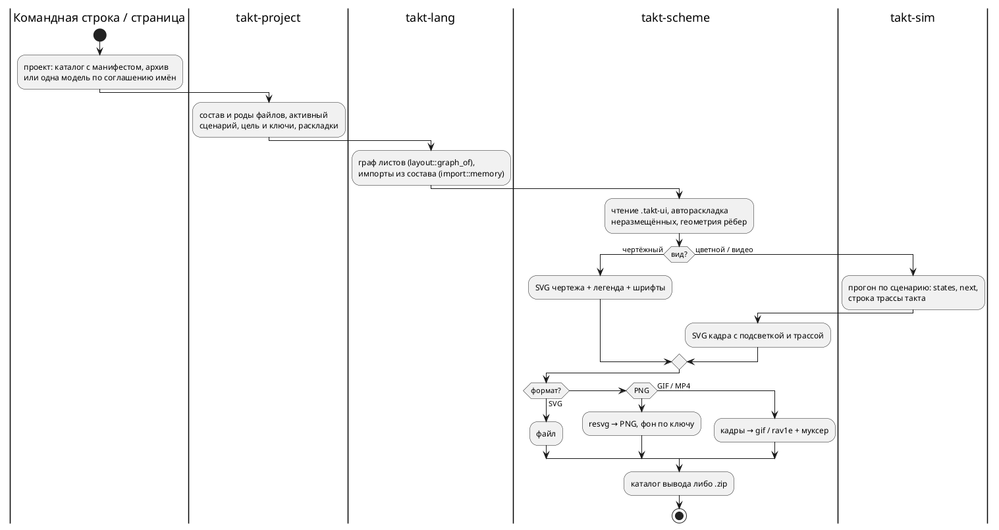

# Фича: экспорт проекта: изображения схемы и видео прогона

- **Номер:** 0590
- **Статус:** ГОТОВО
- **Зависит от:** [раскладка листа композиции хранится в файле раскладки](0542-scheme-composition-layout.md) — закрыта 2026-09-11 (решение заказчика 2026-09-11: экспорт идёт только по файлу раскладки, а лист композиции в файле пока не хранится). Связи, не зависимости: [панель схемы в webview](0543-scheme-in-editor-webview.md) — кнопка панели ставится после её закрытия; [подсветка прогона у нескольких экземпляров](0541-scheme-run-instances.md) улучшит цветной вид композиции
- **Tier:** — (новая возможность, не дефект)
- **Класс:** прочее
- **Связанные issue (анализ):** по запросу заказчика, 2026-09-11

## Стадии жизненного цикла

Все стадии — **разделы этой карточки**: «Архитектура (ADR)»,
«Анализ», «Разработка», «Тест-план», «Отчёт о тестировании», «Итог». Раздел
заводится в момент прохождения стадии, а не заранее. Отдельным артефактом
остаются только исправления — [`docs/fixes/`](../fixes/README.md) (при
необходимости `0590-YY-*`).

## Краткое описание

Схему модели можно выгрузить файлом: картинкой (SVG, PNG) в **чертёжном**
виде — для документа и отчёта — или в **цветном** виде прогона, а сам прогон —
видео (GIF, MP4). Сегодня схема живёт только на холсте страницы, и показать её
вне редактора можно лишь снимком экрана. Выгружается одна модель либо весь
проект: по картинке на модель.

> Фича зарегистрирована по запросу заказчика 2026-09-11; прорабатывать будет
> другой исполнитель. Далее проходит жизненный цикл по своду.

### Требования заказчика (2026-09-11)

1. **Форматы изображения:** SVG и PNG. У PNG два варианта фона — с заливкой
   либо прозрачный.
2. **Два вида изображения:**
   - **чертёжный** — без цветов прогона;
   - **цветной** — с подсветкой прогона (при симуляции).
3. **Легенда чертёжного вида** — по выбору: с легендой или без. Легенда несёт
   значок и пользовательское наименование — у состояний и у условий.
4. **Видео прогона:** GIF либо MP4; пауза между шагами задаётся при экспорте.
5. **Объём:** весь проект — несколько картинок, по одной на модель — либо
   только одна модель.
6. **Два пути экспорта — через интерфейс и без него** (уточнение заказчика
   того же дня): страница (и панель плагина) и командная строка дают один и
   тот же результат.
7. **Разбор и восприятие проекта без интерфейса.** Инструмент командной строки
   сам понимает проект: состав файлов и их роды (модели, сценарии, раскладки
   `.takt-ui`, карты адресов, пояснения), активный сценарий, цель и ключи
   сборки — всё то, что сегодня знает только страница и сервер проектов.
   Без этого экспорт «всего проекта» из командной строки невыразим.

### Что уже есть (для проработки; замер не снимался)

- Холст страницы — SVG (`web/static/scheme.js`), легенда — `web/static/legend.js`
  (значок и подпись автора из файла раскладки `.takt-ui`), подсветка прогона —
  классы узлов и рёбер на том же холсте.
- Эталон `takt-sim` пишет кадры прогона в GIF (`takt-sim/src/gif.rs`, растеризация
  через `resvg`) и в отдельные SVG (`takt-sim/src/svg.rs`) — под фичей
  `graphics`; раскладка там своя, не из `.takt-ui`.
- Фронтенд без зависимостей (решение заказчика, 0531): ни npm, ни бандлера.
  Скачивание файла страницей — обычная ссылка `download`.

### Вопросы к проработке (ADR и анализ)

- **Где рисуется картинка.** Раз экспорт обязан работать и без интерфейса,
  рисунок схемы нужен вне браузера. Кандидаты: общий носитель на Rust (его
  зовут CLI и модуль WebAssembly, `resvg` уже есть у эталона) либо JS-холст,
  исполняемый вне браузера. Два рисовальщика — холст страницы и отдельный
  рисунок CLI — разошлись бы молча: носитель рисунка должен остаться один, а
  если их всё же два, нужна сверка «страница = CLI». Вид холста (масштаб,
  выделение, ореолы, сетка) в чертёж попадать не должен.
- **Проект без интерфейса.** Что считается проектом на диске: каталог, архив
  проекта (круговой рейс 0531, задача 09g) или файл-манифест; где лежат
  активный сценарий, цель и ключи сборки (сегодня — метаданные сервера и
  архива); как CLI находит раскладку модели. Правило рода файла по расширению
  и правило поиска импортов обязаны остаться по одному носителю
  (`compile::project_search_paths`, 0575) — своя копия в CLI разошлась бы с
  редактором молча.
- **Команда.** Подкоманда `taktc` или `takt-sim` (прогон нужен для цветного
  вида и видео — это эталон), разбор проекта — общий для обеих.
- **MP4.** Кодировщика в браузере без зависимостей нет (`MediaRecorder` даёт
  WebM, и не везде); варианты — кодировщик в модуле, выгрузка на сервер,
  отказ от MP4 в браузере. Решение заказчика, если выбор меняет обещание.
- **Кадр видео** — такт, шаг с паузой или то и другое; что показывает кадр
  (номер такта, значения портов, легенда).
- **«Модель» в объёме проекта:** листы моделей, листы композиций (0542),
  вложенные модели и модели подключаемых файлов; модель без раскладки —
  автораскладка или отказ.
- **Легенда в картинке:** где стоит (снизу, справа — как `placeLegend`),
  что делать с моделью без условий и с длинными подписями.
- **Шрифт:** чертёж обязан выглядеть одинаково без шрифтов у читателя —
  встраивание (как делает `svg.rs`) или перевод текста в контуры.
- **Упаковка многокартинного экспорта:** архив или серия загрузок; имена
  файлов (модель, вид, формат), кириллица в именах.
- **Где кнопка:** панель схемы, меню проекта, плагин IntelliJ (панель
  [0543](0543-scheme-in-editor-webview.md)), CLI `takt-sim`/`taktc`.
- **Контроль:** что сверяется машиной (детерминированность SVG, размер PNG,
  число кадров), а что видит только человек.

## Документирование

Язык не меняется, но у фичи появляется командная строка экспорта и понятие
проекта вне страницы — это описание инструментов в [`book/`](../../book/):
глава «Инструментарий», подразделы «Экспорт — `export`» и «Проект на диске —
`project`» раздела о симуляторе и «Экспорт схемы» раздела об онлайн-редакторе
(сделано задачей о документе).

## Архитектура (ADR)

- **Status:** Accepted — решения заказчика получены 2026-09-11 (вопросы и
  ответы — в «Considered Options»); остальное принято архитектором.
- **Date:** 2026-09-11
- **Authors:** архитектор, системный аналитик

### Context

Схема модели живёт на холсте страницы, и вынести её за пределы редактора
можно лишь снимком экрана. Заказчик просит выгрузку: картинку схемы в
чертёжном либо цветном виде, видео прогона, одну модель либо весь проект, и
всё это двумя путями — со страницы и из командной строки, с одинаковым
результатом. Командная строка при этом обязана понимать проект сама: состав
файлов, их роды, активный сценарий, цель и ключи сборки, раскладки.

**Что уже есть (снято чтением дерева 2026-09-11):**

| Слой | Что есть | Чего экспорту не хватает |
|---|---|---|
| холст страницы | `scheme.js` (1766 строк) строит SVG через DOM; геометрия — `scheme-geometry.js` (820 строк, без DOM); файл раскладки — `layout.js` (без DOM); ступени вида (`edgeWidth`, `gamma` = `color`/`draft`/`contrast`, шрифты, кегли, сетка) едут на холст признаками `data-*`, а числа за ними живут в `app.css` | рисунка вне браузера нет; чертёжная гамма `draft` уже существует; вид холста (масштаб, выделение, ореолы, сетка, миникарта, крошки) вплетён в тот же SVG; `XMLSerializer` и скачивание картинки не используются |
| легенда | `legend.js` — HTML-таблицы «знак → имя из модели → подпись автора», образцы обозначений — свои маленькие SVG | легенда не часть SVG, в картинку её надо рисовать заново |
| граф | `takt_lang::layout` — листы по моделям, узлы, рёбра с цитатой условия, ярусы; форма JSON — общий носитель (0543), её отдаёт и `takt_graph`, и `takt-lsp --graph` | геометрии в Rust нет намеренно: координаты, трассировку рёбер и размеры считает страница |
| раскладка | `.takt-ui` формата 1: центры узлов, изломы, подписи автора, место легенды, ступени вида; читает только JS (страница, панель IntelliJ, скрипт примеров) | Rust файла не знает |
| эталон | `takt-sim` пишет GIF и серию SVG своей раскладкой (отжиг с постоянным зерном), кадр — псевдонимы состояний и легенда значений портов; под фичей `graphics` подключены `resvg`, `svg`, `gif`; растеризатор — `gif.rs::render_tree`; `Step` несёт `states` и `next` | вторая раскладка прогона, чужая файлу автора; номера такта в кадре нет; кодировщиков видео и `ffmpeg` в дереве нет; ширина GIF (990) расходится с `viewBox` (1180) — кадр сжат по горизонтали |
| модуль под браузер | `takt-wasm` собирает `takt-sim` без графики (модуль 3347 КиБ); плоский C-ABI, 20 функций | ни растеризатора, ни кодировщика, ни рисунка |
| проект | знает только сервер: род файла по расширению (`limits::check_file_name`: `.takt`, `.json`, `.md`, `.takt-ui`, `.takt-map`), активный сценарий, цель и ключи — колонки базы; манифест `takt-project.json` формата 5 — только внутри архива; компилятор читает состав из памяти (`semantic::import::memory`, `project_search_paths` в `takt-wasm`) | на диске манифеста нет; правило «сценарий принадлежит модели» реализовано трижды (`run_simulations.sh`, `build-example-projects.mjs`, `project.js`); сервер с `takt-lang` не линкуется намеренно (архив гоняет модуль через `wasmtime`) |
| шрифты | `web/static/font/` — Fira Code и ГОСТ 2.304-81 тип А как `woff2`; `svg.rs` встраивает шрифт в SVG через `@font-face` и base64, но ищет его в системе | `resvg` формата `woff2` не читает; TTF в дереве нет (`book/Makefile` качает ГОСТ в системный каталог) |
| панель IntelliJ | холст в режиме «данные снаружи» (`scheme-host.js`), ресурсы собираются из `web/` | самой панели ещё нет (0543 в разработке) |

### Decision Drivers

1. **Один рисовальщик на оба пути.** Страница и командная строка обязаны дать
   один результат; два независимых рисунка разошлись бы молча.
2. **Одна раскладка, и она — файл автора.** Интерфейс правит `.takt-ui`,
   экспорт читает его; картинка равна файлу. Без файла экспорта нет, вторая
   раскладка прогона (отжиг эталона) противоречит этому (корректировка
   заказчика 2026-09-11: «сперва правка `.takt-ui`, потом по нему экспорт»).
3. **Знание о проекте — один носитель.** Род файла, манифест, правило
   принадлежности сценария модели сегодня живут в трёх-четырёх копиях; экспорт
   из командной строки заводить пятую не вправе.
4. **Без внешних инструментов у экспорта.** Фронтенд без зависимостей (решение
   заказчика по [онлайн-редактору](0531-web-playground.md)); командная строка
   не требует `node` и `ffmpeg`.
5. **Детерминизм.** Тот же проект даёт тот же SVG байт в байт — иначе сверка
   «страница = командная строка» невозможна, а дифф картинок в git бессмыслен.
6. **Чертёж читаем без шрифтов читателя.** Картинка несёт шрифт с собой.

### Considered Options

Восемь вопросов; у каждого — принятое и отвергнутое. Первые четыре и вопросы
пять–восемь заданы заказчику 2026-09-11, его выбор помечен.

#### Вопрос 1 — где живёт рисовальщик чертежа (решение заказчика)

- **A (принято): чертёж считает компилятор.** Новый носитель на Rust строит
  SVG чертежа из графа, файла раскладки и ступеней вида; его зовут командная
  строка и модуль под браузер, поэтому экспорт со страницы и из командной
  строки тождествен по построению. Холст остаётся на JS — он интерактивен, а
  чертёж нет. Цена: геометрия существует в двух языках, и её тождественность
  держит сверка на корпусе (тест в `node` сравнивает координаты узлов и точки
  рёбер JS и Rust).
- **B (отвергнуто): JS вне браузера.** Модули холста исполняются в `node` с
  подменой DOM, командная строка зовёт `node`. Один рисовальщик, но экспорт без
  интерфейса требует `node` на машине, а вид холста пришлось бы вычищать из
  `draw()`.
- **C (отвергнуто): Rust рисует и холст.** Переделка холста и панели — самый
  дорогой путь при том же результате для экспорта.

#### Вопрос 2 — что такое проект на диске (решение заказчика)

- **A (принято): каталог с манифестом либо архив.** Проект — каталог, где
  рядом с файлами лежит `takt-project.json` того же формата, что в архиве, либо
  сам `.zip` архива. Формат манифеста, роды файлов и правило принадлежности
  получают один носитель на Rust, и сервер переходит на него. Каталог без
  манифеста — «проект из одной модели» по соглашению имён (модель,
  `<модель>*.json`, `<модель>.takt-ui`, `<модель>.md`, `<модель>.takt-map`);
  активный сценарий, цель и ключи тогда задаются ключами команды.
- **B (отвергнуто): только архив** — проект в git невыразим без распаковки.
- **C (отвергнуто): только соглашение имён** — метаданные страницы на диск не
  попадают, и требование 7 не выполняется.

#### Вопрос 3 — кодировщик MP4 (решение заказчика)

- **A (принято): чистый Rust-кодировщик в модуле** — один кодировщик у
  командной строки и страницы, внешних инструментов нет. Уточнение заказчика:
  **AV1 через `rav1e`** (настоящее сжатие; у крейта есть фича `wasm` и режим
  без ассемблера), контейнер — муксер на чистом Rust (`muxide` либо свой
  минимальный, выбор — по пробе). Цена, названная заказчику: тяжёлая
  зависимость (рост модуля и времени сборки — замер в первой задаче) и
  неполная поддержка AV1 в Safari и QuickTime.
- **Отвергнуто:** `less-avc` (H.264 только PCM-кадрами без сжатия — сотни
  мегабайт на сотни тактов, совместимость с плеерами не заявлена); внешний
  `ffmpeg` (ломает «страница = командная строка»); снятие MP4 из объёма.

#### Вопрос 4 — судьба нынешней графики эталона (решение заказчика)

- **Принято: заменить.** Раскладка отжигом, `gif.rs`, `svg.rs`, `viewport/`,
  `graphics_config.rs` и ключ `--graphics-config` снимаются; прогон рисуется
  чертежом по `.takt-ui`. Ключ `-o` у прогона остаётся и значит «GIF прогона
  новым рисунком», чтобы прежние вызовы не сломались молча.
- **Отвергнуто: оставить рядом** — два рисунка одного прогона.

#### Вопрос 5 — что показывает кадр видео (решение заказчика)

- **Принято: один кадр на такт — схема цветным видом и строка трассы.**
  Подсветка та же, что на странице (активные состояния, ожидаемые, следующее
  ребро), под схемой — строка трассы такта той же формы, что печатает консоль
  (`trace::step_line`: номер, время, порты, переменные). Легенда — по
  настройке, как у картинки. Пауза между кадрами одна, задаётся при экспорте.
- **Отвергнуто:** только схема и номер такта; два кадра на такт с легендой
  значений, как сегодня.

#### Вопрос 6 — что считать «моделью» в объёме проекта (решение заказчика)

- **Принято: все листы — модели и композиции.** Картинка на каждый лист,
  который можно открыть на странице: корень, вложенные модели, модели
  подключаемых файлов проекта, листы композиций состояний. Имя файла — путь
  листа. **Уточнение заказчика того же дня:** лист композиции экспортируется
  только из файла раскладки, а хранить его там научит
  [раскладка листа композиции](0542-scheme-composition-layout.md) — она
  становится зависимостью, и фича ждёт её закрытия.
- **Отвергнуто:** только листы моделей; только модели активного файла;
  композиция «как строит страница» из выражения реализации.

#### Вопрос 7 — где живёт команда (решение заказчика)

- **Принято: одна подкоманда `takt-sim export`.** Все виды и форматы в одном
  месте; `takt-sim` получает подкоманды, прежний вызов без подкоманды остаётся
  прогоном. Чертёж без прогона — тоже здесь: растеризатор и эталон живут в
  одном бинарнике.
- **Отвергнуто:** `taktc export` для картинок и `takt-sim` для видео — два
  бинарника с растеризатором.

#### Вопрос 8 — размещение носителей (архитектор)

- **Проект — отдельный крейт `takt-project`** без зависимости от компилятора:
  роды файлов, манифест, чтение каталога и архива, правило принадлежности,
  запись архива. Его берут `takt-sim`, `takt-wasm` и сервер (сервер с
  `takt-lang` не линкуется — решение 0531, оно не нарушается: крейт проекта
  компилятора не содержит).
- **Рисунок — отдельный крейт `takt-scheme`** поверх `takt-lang`: чтение
  `.takt-ui`, геометрия, ступени вида, SVG чертежа и цветного вида, легенда,
  шрифты. Фичи: `raster` (PNG через `resvg`), `video` (GIF через `gif`, MP4
  через `rav1e` и муксер). `takt-sim` берёт обе фичи (фича `graphics`
  остаётся именем), `takt-wasm` — тоже, по решению заказчика о кодировщике в
  модуле; размер модуля меряется.
- **Отвергнуто:** рисунок внутри `takt-lang` (компилятор не рисует, а предел
  размера модулей и без того давит) и растеризатор в `takt-sim` (нужен и
  модулю).

#### Решения без вопросов заказчику

- **Файл раскладки обязателен и полон** (решения заказчика 2026-09-11):
  экспорт читает `.takt-ui` рядом с моделью и ничего не раскладывает сам.
  Нет файла у модели — отказ; в файле не размещено состояние, которое есть в
  модели, — отказ с перечнем неразмещённых; при экспорте всего проекта отказ
  всего экспорта, если файла нет у любой из моделей, — частичный вывод молча
  прошёл бы за полный. Автораскладки в носителе рисунка нет вовсе: узел без
  записи — причина отказа, а не координата.
- **Легенда в картинке** — SVG-таблица теми же знаками, что на холсте, место
  по `legend.place` файла раскладки: `bottom` — под листом, `right` — справа,
  `float` — под листом (плавающее место — свойство холста). Лист без условий
  печатает только таблицу состояний; длинная подпись обрезается по ширине
  колонки с многоточием — ширина колонки задана ступенью кегля.
- **Шрифты** вшиты в носитель рисунка байтами (`include_bytes!`, TTF ГОСТ
  2.304-81 тип А и Fira Code, лицензия OFL — файлы кладутся в дерево рядом с
  `woff2`): SVG несёт `@font-face` в base64, растеризатор получает те же
  байты через `fontdb`. Системные шрифты не ищутся — иначе картинка зависела
  бы от машины.
- **Стили в SVG** — вшитый `<style>` с правилами двух гамм (чертёжной и
  цветной) в светлой теме; цвета и числа за ступенями — таблица носителя, а
  контроль сверяет её с `app.css` по форме правил (как `check-design.py`).
- **Фон PNG** — ключ: заливка (цвет `--surface-sheet` светлой темы) либо
  прозрачный; SVG фона не несёт.
- **Упаковка многокартинного экспорта** — каталог вывода у командной строки,
  архив `.zip` у страницы (пишет тот же крейт проекта). Имена файлов —
  `<путь листа>.<вид>.<формат>`, где путь листа — имя модели с `/`,
  заменённым на `.`, композиция — `<лист>#<состояние>`; корень — имя файла
  модели. Имена ASCII по правилу состава проекта.
- **Видео одного листа** — ключ выбора листа, умолчание корень; лист
  композиции подсвечивает любой экземпляр (граница [подсветки нескольких
  экземпляров](0541-scheme-run-instances.md) названа, не зависимость).
- **Кнопки:** панель схемы страницы — кнопка «Экспорт» с окном выбора (вид,
  формат, фон, легенда, объём, пауза); панель IntelliJ — после закрытия 0543,
  через запуск `takt-sim export` командной строкой плагина (модуля в панели
  нет по её ADR).

### Decision

Принять вариант A по вопросам 1–3, «заменить» по вопросу 4, решения
заказчика по вопросам 5–7 и размещение носителей по вопросу 8. Целевой поток:

### Consequences

- Два новых крейта в workspace; `takt-sim` теряет свою раскладку и конфиг
  графики; `run_simulations.sh` и примеры графики переводятся.
- Модуль под браузер получает растеризатор и кодировщик — вес растёт; замер
  и предел называются в анализе, при превышении — вопрос заказчику.
- Сервер переходит на крейт проекта: `limits::Kind` и `archive::Manifest`
  становятся его типами; формат архива не меняется.
- Геометрия живёт в двух языках; контроль — сверка на корпусе, и её отсутствие
  делает решение 1 невалидным. Автораскладка остаётся только у страницы:
  носитель рисунка читает готовые координаты.
- Фича ждёт закрытия зависимости о раскладке листа композиции: до неё её
  нельзя брать в разработку (статус `ЗАБЛОКИРОВАНА`).
- Язык не меняется; версия крейтов растёт; документ получает разделы об
  экспорте и о проекте на диске.

#### Acceptance criteria

1. `takt-sim export` на каталоге с манифестом, на архиве и на одной модели
   выгружает SVG и PNG каждого листа в чертёжном и цветном виде, с легендой и
   без, с заливкой и прозрачным фоном; без файла раскладки или с неполным —
   отказ с названной причиной, файлов на диске не появляется.
2. Тот же проект, выгруженный со страницы, даёт SVG байт в байт равный выводу
   командной строки; PNG и GIF равны байт в байт при одинаковых ключах.
3. Геометрия Rust на фикстурах `.takt-ui` (в том числе снятых с корпуса
   `examples/` страницей) совпадает с геометрией JS: точки привязки, точки
   рёбер, места знаков, размер листа.
4. Видео прогона (GIF и MP4) содержит по кадру на такт со строкой трассы;
   число кадров равно числу тактов прогона; MP4 открывается в VLC и Chrome
   (Safari — по замеру, граница называется).
5. Раскладка отжигом, `--graphics-config` и старые кадры сняты; прежний
   `takt-sim модель -o каталог` пишет GIF новым рисунком.
6. Правило рода файла и манифест — один носитель у сервера и командной строки;
   контроль — греп «второго списка расширений нет».
7. Картинка не зависит от шрифтов машины: SVG несёт шрифт, PNG растеризован
   вшитым.
8. Документ описывает подкоманду, её ключи и проект на диске; предкоммит
   зелёный.

## Анализ

### Цель и контекст

ADR принял: чертёж считает Rust-носитель, которого зовут и командная строка,
и модуль, по файлу раскладки, который правит интерфейс; проект на диске — каталог с манифестом либо архив, знание о нём —
отдельный крейт; видео — GIF и MP4 на чистом Rust; старая графика эталона
снимается. Анализ переводит решения в проверяемые требования и в задачи с
порядком, границами и способом проверки — так, чтобы исполнитель не
додумывал.

### Замер (2026-09-11)

| Предмет | Факт | Следствие для задач |
|---|---|---|
| геометрия холста | `scheme-geometry.js`: `R = 24`, `SIDE = 144`, `SNAP = 8`, `PORTS = 16`, `routeSheet`, `crossings`, `buildPath` с мостиками и разрывами, `markSpot`, `sheetSize`; `autoPlace` и `composeSheet` — автораскладка | переносится всё, кроме автораскладки (`autoPlace`, `composeSheet` остаются странице); константы становятся таблицей носителя, тест сверяет их с JS |
| раскладка | `layout.js`: формат 1, ключ ребра `<от>><к>:<номер>`, ключ листа композиции `<путь>#<состояние>` (только подписи), канон записи | Rust читает тот же JSON через `serde`; записи не делает; лист композиции ждёт своей записи (зависимость) |
| ступени вида | `app.css`: `--sheet-edge` 1/1,5/2,5, `--sheet-node` 1/1,5/2,5, кегли `--text-xs…lg`, гаммы `draft`/`contrast`, `--font-scheme`, `--grid-step` | числа переезжают в таблицу носителя; контроль сверяет с CSS |
| подсветка | классы `running`, `expected`, `reachable` у узлов, `next` у рёбер и маркеры `arrow-*-next`; `Step.states`, `Step.next` | цветной вид повторяет классы; источник — эталон |
| легенда | HTML: знак, имя из модели, подпись автора, вид; образцы обозначений своими SVG | SVG-легенда рисуется носителем заново по тем же данным |
| граф | `layout::graph_of` работает на недописанном тексте; `Sheet.path`, `Node.kind`, `Edge.condition` | состав узлов графа сверяется с записями файла: узел без записи — отказ |
| эталон | `SimulationRunner::step` → `Step { line, states, next, … }`; `trace::step_line` | кадр берёт строку и состояния у эталона, второго цикла нет |
| растеризатор | `gif.rs::render_tree`: `usvg::Tree::from_str` + `tiny_skia::Pixmap`; неравномерный масштаб по осям | масштаб один по обеим осям; размер кадра — из `viewBox` |
| GIF | `gif::Frame::from_rgb_speed`, задержка в сотых секунды, все кадры в памяти | кодирование потоковое: кадр кодируется и пишется сразу |
| MP4 | `rav1e` 0.8 (BSD-2, фича `wasm`, `RAV1E_CPU_TARGET=rust`), `muxide` (Apache/MIT, H.264 и AV1, «совместимость с FFmpeg проверена»), `less-avc` 0.1.5 (только PCM) | проба первой задачей; результат — таблица в карточке |
| проект | `limits::check_file_name` (пять родов), `archive::Manifest` формата 5, `projects::own_file_tail`, `run_simulations.sh` (самый длинный префикс), `build-example-projects.mjs::scenariosOf`, `project.js::pickScenario` | четыре носителя правила принадлежности сводятся к одному |
| импорты | `semantic::import::memory::install`, `project_search_paths` в `takt-wasm/src/compile.rs` (`["."]`) | функция переезжает в `takt-lang::compile`; командная строка зовёт её же |
| шрифты | `woff2` в `web/static/font/`; `resvg` читает TTF/OTF; ГОСТ TTF — релиз Metrolog v0.7.6 | TTF кладутся в дерево; `woff2` остаются странице |
| модуль | 3347 КиБ профиля `wasm`; `takt-sim` без графики | замер с `resvg` и `rav1e` — первая задача |
| скачивание | `account.js`, `app.js`: `Blob` + ссылка `download` | тот же приём для картинки и архива |
| панель IntelliJ | `TaktCommandLine.build(mode, params, tools)` строит вызов `takt-sim` | экспорт из панели — третий режим команды |

### Зависимости фичи

**Зависит от: [раскладка листа композиции хранится в файле раскладки](0542-scheme-composition-layout.md).**
Экспорт читает только файл раскладки (решение заказчика), а лист композиции
в файле сегодня не хранится — страница строит его из выражения реализации.
Пока зависимость не закрыта, экспортировать композиции не из чего, и объём
«все листы» невыполним; фича получает статус `ЗАБЛОКИРОВАНА` и встаёт в
витрине после зависимости; сама зависимость поднята в витрине выше
[подсветки нескольких экземпляров](0541-scheme-run-instances.md) как
разблокирующая (право аналитика по своду). Остальное, на что опирается
экспорт, в дереве:
граф и его форма ([схема состояний](0539-model-layout-ui.md),
[панель в webview](0543-scheme-in-editor-webview.md)), файл раскладки, эталон
с полями подсветки, сервер с манифестом, растеризатор. Связи, а не
зависимости: кнопка в панели IntelliJ ставится после закрытия
[панели схемы в webview](0543-scheme-in-editor-webview.md) — задача условная
и последняя; [подсветка нескольких экземпляров](0541-scheme-run-instances.md)
улучшит цветной вид композиции, когда закроется, но экспорт её не ждёт.

### Требования и проверяемые условия

Требования пронумерованы словами по группам; проверка названа при каждом.

**Проект**

- **Роды файлов и манифест — один носитель.** Крейт `takt-project`: род по
  расширению (`.takt`, `.json`, `.md`, `.takt-ui`, `.takt-map`), манифест
  формата 5 (чтение и запись), проверка имени файла. Сервер зовёт крейт; в
  `web/server/src` второго списка расширений нет. Проверка: тесты крейта на
  каждом роде и на отказе; греп по серверу; тесты сервера прежние зелёные.
- **Три формы проекта.** Каталог с `takt-project.json` (файлы плоско рядом),
  архив `.zip` (манифест и `src/`), одна модель по соглашению имён (без
  манифеста; активный сценарий — единственный подходящий либо ключ команды,
  цель и ключи — ключи команды, без них — `c` и пусто). Проверка: три
  фикстуры в `takt-project/tests/data/`, тесты на состав, роды, активные
  файлы; архив, выгруженный сервером, читается крейтом (круговой рейс).
- **Правило принадлежности одно.** «Сценарий принадлежит модели» —
  `takt-project::belongs` (самый длинный подходящий стем побеждает);
  `run_simulations.sh` зовёт `takt-sim export --list`… нет: скрипт остаётся,
  но берёт пару из `takt-sim project --scenarios`; `build-example-projects.mjs`
  и `project.js` — на странице правило остаётся в JS (модуль отдаёт список
  пар через `takt_project`). Проверка: тест «модель `elevator_mini`, сценарий
  `elevator_mini_floor2.json` — принадлежит ей, не `elevator`».
- **Импорты по составу.** Командная строка ставит `import::memory` из состава
  проекта; `project_search_paths` живёт в `takt-lang::compile`, модуль и
  командная строка зовут её. Проверка: проект с подключаемым файлом
  экспортируется; греп «второй `project_search_paths` нет».

**Рисунок**

- **Файл раскладки обязателен и полон.** Носитель сверяет узлы графа с
  записями листа: нет файла — отказ «раскладки нет», не размещено состояние —
  отказ с перечнем, лишняя запись файла (состояния уже нет) — не отказ
  (страница показывает это уведомлением, картинке она не мешает). При объёме
  «весь проект» отказ любой модели — отказ всего, файлов не пишется.
  Проверка: тесты на трёх входах (нет файла, неполный, лишняя запись) и на
  проекте из двух моделей с одной раскладкой — вывод пуст.
- **Чертёж строит носитель.** `takt-scheme::draw(sheet, layout, view, mode)`
  → SVG-текст; режим `draft` (чертёжная гамма, без подсветки) и `run`
  (цветная гамма, подсветка из `states` и `next`). Проверка: снимки SVG на
  фикстурах в `takt-scheme/tests/data/`, детерминированность (два прогона
  байт в байт).
- **Геометрия тождественна JS.** Точки привязки, трассировка, мостики и
  разрывы, места знаков, размер листа — по готовым координатам файла.
  Проверка: тест в `node` (`web/tests/scheme-parity-tests.mjs`) гоняет
  `scheme-geometry.js` и модуль (`takt_export` с форматом `geometry`) на
  фикстурах `.takt-ui` (в том числе снятых с корпуса `examples/*.takt`
  страницей — скрипт примеров уже пишет их) и сравнивает числа; расхождение
  падает списком.
- **Вид холста в чертёж не попадает.** Нет сетки, выделения, ореолов,
  мишеней, миникарты, крошек, кнопок. Проверка: греп по SVG на классы
  `edge-halo`, `edge-hit`, `pin`, `node-enter`.
- **Легенда — по ключу.** Таблицы состояний и условий, знак и подпись автора;
  место по файлу раскладки. Проверка: снимок с легендой и без; лист без
  условий — одна таблица.
- **Шрифт с собой.** SVG несёт `@font-face` в base64 обеих гарнитур, PNG
  растеризован вшитыми байтами; системные шрифты не запрашиваются. Проверка:
  греп `@font-face` в SVG; PNG на машине без ГОСТ равен PNG на машине с ним
  (сравнение снимка в тесте — растеризация без системной базы).
- **Ступени вида и цвета — из файла раскладки и таблицы.** Толщины, кегли,
  гарнитуры, стрелки, углы, пересечения. Проверка: таблица носителя сверяется
  с `app.css` тестом по форме правил (`--sheet-edge`, `--sheet-node`,
  `--text-*`, палитра гамм); снимки на разных ступенях.

**Растр и видео**

- **PNG** — `takt-scheme::raster(svg, background)`: масштаб один по осям,
  размер из `viewBox`, фон заливка либо прозрачный. Проверка: размер PNG равен
  `viewBox`; альфа угла 0 при прозрачном и 255 при заливке.
- **GIF** — по кадру на такт, задержка одна (ключ паузы, миллисекунды,
  умолчание 500), запись потоковая. Проверка: число кадров и задержка
  читаются обратно крейтом `gif`.
- **MP4** — AV1 (`rav1e`) в контейнере муксера; кадр на такт, частота из
  паузы. Проверка: файл разбирается (`muxide`/свой разбор коробок), число
  кадров; открытие в плеерах — проба первой задачи и человек в отчёте.
- **Кадр** — цветной вид листа плюс строка трассы такта под ним, форма строки
  — `trace::step_line`. Проверка: снимок SVG кадра содержит строку такта.

**Команда**

- **`takt-sim export`** с ключами: `<проект>` (каталог, архив или модель),
  `-o <каталог>` (умолчание `export/` рядом), `--view draft|run`,
  `--format svg|png|gif|mp4` (повторяемый), `--background fill|none`,
  `--legend on|off`, `--sheet <путь>` (умолчание все листы для картинок, корень
  для видео), `--pause <мс>`, `-s`, `-n`, `--tick-ms`, `-I`, `--lang`,
  `--target`/`--args` для проекта без манифеста. Прежний вызов без подкоманды
  — прогон; `-o` у прогона пишет GIF новым рисунком; `--graphics-config` —
  отказ с текстом «ключ снят». Проверка: тесты подкоманды на фикстурах, тест
  «неизвестный ключ — отказ», тест прежнего вызова.
- **`takt-sim project`** печатает состав проекта: файлы, роды, активные,
  пары «модель — сценарии» (для скриптов и плагина). Проверка: снимок вывода
  на фикстуре.
- **Старая графика снята.** `gif.rs`, `svg.rs`, `unit/viewport/`,
  `graphics_config.rs`, `runner/graphics.rs`, `examples/graphics-configs/`,
  `examples/simulations/graphics/` удалены; `run_simulations.sh` зовёт
  `export`. Проверка: греп «отжиг/`LAYOUT_SEED`/`graphics_config` нет»;
  `precheck.sh`.

**Страница и модуль**

- **`takt_export`** в модуле: запрос `{ files, sheet, view, format, background,
  legend, pause, scenario, steps, tickMs }` → байты (SVG-текст, PNG, GIF, MP4)
  либо архив всех листов. Проверка: тест модуля; `check-wasm.sh` сверяет
  вывод модуля с `takt-sim export` байт в байт (тождественность).
- **Кнопка «Экспорт»** на панели схемы, окно выбора, скачивание; текущая
  раскладка холста прежде записывается в черновик и проект (порядок «правка
  файла, потом экспорт по нему»), и модуль получает текст файла, а не
  состояние холста. Проверка: тест `node` на сборку запроса из окна и на
  порядок «запись, затем экспорт»; прогон страницы человеком.
- **Размер модуля** — замер до и после; предел названный: рост не более чем
  вдвое от 3347 КиБ, иначе — вопрос заказчику о выносе видео из модуля.

**Плагин IntelliJ (условно, после 0543)**

- Кнопка панели зовёт `takt-sim export` через `TaktCommandLine` с новым
  режимом `EXPORT`. Проверка: `TaktCommandLineTest` на порядок аргументов.

### Критерии приёмки и способ проверки

Критерии — восемь пунктов ADR. Способ: тесты крейтов `takt-project` и
`takt-scheme`, тест тождественности в `check-wasm.sh`, тест паритета
геометрии в `node`, тесты подкоманды `takt-sim`, тесты сервера, проба
плееров человеком (таблица в отчёте), `precheck.sh` целиком.

### Редакторский слой

Язык не меняется; лексика, синтаксис, семантика, LSP и подсветка прежние.
Плагин IntelliJ получает режим команды `EXPORT` (условно, после 0543); Zed —
без изменений (панели нет по решению заказчика 2026-09-09). Ответ «не нужно»
для сервера языка зафиксирован: граф он уже отдаёт, рисовать не обязан.

### Особенности по обратной функциональности

- `takt-sim модель [ключи]` без подкоманды работает как прежде; `-o` пишет
  GIF новым рисунком; `--graphics-config` — отказ словами, а не молчание.
- Формат манифеста 5 не меняется: архивы, выгруженные ранее, читаются.
- Файл раскладки формата 1 читается; модель без раскладки на странице
  показывается как прежде, а экспорт отказывает — новое поведение только у
  новой команды.
- Страница без нажатия «Экспорт» ведёт себя как прежде.

### Риски и зависимости

- **Вес модуля.** `rav1e` и `resvg` в wasm — рост неизвестен; замер первой
  задачей, предел назван; при превышении — вынос видео из модуля решает
  заказчик.
- **Совместимость MP4.** AV1 не открывают Safari на части машин и QuickTime;
  граница называется в документе; проба — первой задачей.
- **Дрейф геометрии.** Две реализации; контроль паритета обязателен и падает
  списком; без него решение ADR недействительно.
- **Дрейф ступеней.** Числа в CSS и в таблице носителя; контроль сверяет по
  форме правил, а смена шкалы правится в двух местах — названо в книге
  оформления.
- **Скорость кодирования в браузере.** AV1 в wasm однопоточен; прогон в сто
  тактов может занять десятки секунд — прогресс показывается, бюджет тактов
  тот же, что у прогона.
- **Шрифты в дереве.** TTF ГОСТ и Fira Code (лицензии OFL рядом) увеличивают
  бинарники на ~0,5 МБ.
- **Блокировка.** Фича ждёт закрытия зависимости о раскладке листа
  композиции; её проработка (ADR, анализ) актуальна, но замер зависимости
  может изменить форму записи листа композиции — задача чтения файла
  берёт форму у закрытой зависимости, а не у этого текста.

### План разработки: задачи и порядок выполнения

| № | Задача | Содержание | Проверка |
|---|---|---|---|
| 01 | проба кодировщика и веса модуля | сборка `rav1e` без ассемблера и муксера под `x86_64`/`aarch64` и `wasm32-unknown-unknown`; MP4 из 20 кадров 1180×600; открытие в VLC, Chrome, Firefox, Safari, QuickTime; размер модуля с `resvg` и `rav1e`; выбор муксера (`muxide` либо свой) | таблица замера в карточке; при провале предела — вопрос заказчику |
| 02 | крейт `takt-project` | роды, манифест формата 5, каталог, архив, одна модель, правило принадлежности, запись архива; сервер переходит на крейт; `project_search_paths` в `takt-lang::compile` | тесты крейта, тесты сервера, греп «второго списка нет» |
| 03 | крейт `takt-scheme`: раскладка и геометрия | чтение `.takt-ui` (лист модели и лист композиции по форме закрытой зависимости), сверка узлов с записями и отказы, ступени вида, константы, точки привязки, трассировка, мостики и разрывы, места знаков; экспорт геометрии JSON | тесты отказов; тест паритета в `node` на фикстурах |
| 04 | крейт `takt-scheme`: SVG | чертёжный и цветной вид, легенда, шрифты вшитые, стили двух гамм, строка трассы кадра | снимки SVG, детерминированность, греп «вида холста нет», сверка ступеней с CSS |
| 05 | растр и видео | `raster` (PNG, фон), `video` (GIF потоково, MP4 через `rav1e` и муксер); снятие старой графики эталона | тесты чтения PNG/GIF/MP4 обратно; `precheck.sh` |
| 06 | `takt-sim export` и `takt-sim project` | подкоманды, ключи, объём, каталог вывода, прежний вызов, `run_simulations.sh` | тесты подкоманд на фикстурах |
| 07 | модуль и страница | `takt_export`, тождественность в `check-wasm.sh`, кнопка и окно на панели схемы, скачивание, словарь | тест модуля, тесты `node`, прогон страницы |
| 08 | документ и журнал | глава «Инструментарий»: подкоманда и ключи, проект на диске, границы MP4; README; `CHANGES.md`; `CLAUDE.md` | правила свода о документе, `check-book-*` |
| 09 | панель IntelliJ (условно) | режим `EXPORT` у `TaktCommandLine`, кнопка панели | `TaktCommandLineTest`; только после закрытия [панели в webview](0543-scheme-in-editor-webview.md) |

Порядок: работа начинается по закрытии зависимости о раскладке листа
композиции. Первая задача — проба (её замер меняет объём пятой и седьмой);
вторая и третья параллельны; четвёртая после третьей; пятая после четвёртой
и первой; шестая после второй и пятой; седьмая после шестой; восьмая после
седьмой; девятая — по закрытии панели в webview, вне порядка.

## Разработка

### Задача — проба кодировщика и веса модуля

#### Что проверялось

Пробный крейт вне workspace: двадцать и двести кадров 1180 × 600 рисуются
`resvg` (схема из трёх узлов, горящий узел и полоса трассы меняются от кадра к
кадру), переводятся в YUV 4:2:0 и кодируются `rav1e` без ассемблера и без
потоков (скорость 10, квантователь 100, кадр в полсекунды); выборки
укладываются в MP4. Затем проба временно подключалась к `takt-wasm`, модуль
собирался профилем `wasm`, и правка откатывалась.

#### Замер (2026-09-11, Apple M4 Pro, macOS 26.6)

| Предмет | Факт |
|---|---|
| MP4, 20 кадров | 28 995 байт; нативно 0,76 с, в модуле 3,6 с |
| MP4, 200 кадров | 236 253 байт; нативно 7,2 с (в модуле 100 кадров — 16,8 с, около 0,17 с на кадр) |
| скорость 6 вместо 10 | 20 кадров — 11 312 байт за 2,6 с: втрое меньше файл, втрое дольше |
| вывод модуля и нативный | байт в байт: хеш `160b0fa4` у обоих |
| модуль | 3435 → 5548 КиБ (×1,62; предел анализа — 6694 КиБ); по сети brotli 634 → 1173 КиБ, gzip 860 → 1600 КиБ |
| импорты модуля | ни одного при `rav1e` 0.7.1 и `v_frame` 0.3.7 |
| Chrome (встроенный браузер) | `canPlayType` — «probably», 1180 × 600, длительность верна; перемотка по четырём точкам даёт верный кадр |
| VLC 3.0.23 | контейнер разобран (20 выборок, 10 с, `av1C`), декодер `dav1d`, поток доигран до конца |
| AVFoundation (движок QuickTime и Safari) | кодек `av01`, `isPlayable`, декодированы все 20 и все 200 кадров, пиксели шестого кадра верны |
| Firefox 155 | машиной не проверен — остаётся человеку |

#### Решения, принятые по пробе

- **Муксер — свой минимальный, а не `muxide`.** `muxide` 0.2.5 не разбирает
  заголовок последовательности, который пишет `rav1e`: флаг модели декодера он
  читает всегда, а по спецификации AV1 флаг читается только при наличии флага
  времени. Разбор съезжает на бит, конфигурация не извлекается, и первый же
  кадр отвергается («первый кадр AV1 без заголовка последовательности»);
  передать заголовок готовым обычный муксер не позволяет. Свой муксер —
  около ста пятидесяти строк: `ftyp`, `moov` перед `mdat` (быстрый старт),
  одна дорожка, один кусок, `av1C` из записи `rav1e` и OBU заголовка первого
  кадра; разделители времени в выборки не кладутся.
- **`rav1e` 0.7.1 с `v_frame` 0.3.7, а не 0.8.1.** `rav1e` 0.8.1 через
  `av-scenechange` требует `v_frame` не ниже 0.3.9, а тот под целью
  `wasm32-unknown-unknown` безусловно тянет `wasm-bindgen`: модуль получает три
  импорта и шесть десятков служебных экспортов. Страница и сервер (он гоняет
  модуль через `wasmtime`) рассчитаны на модуль без импортов. У `v_frame` 0.3.7
  `wasm-bindgen` — необязательная фича, и дерево его не содержит. `v_frame`
  закрепляется прямой зависимостью `=0.3.7`: обновление замка иначе вернуло бы
  импорты молча, а контроль — тесты модуля, которые создают его без импортов.
- **Без ассемблера и без потоков.** Фича `asm` выключена (`default-features =
  false`), и сборочный скрипт ассемблер не трогает — переменная
  `RAV1E_CPU_TARGET` не нужна; вывод одинаков у нативной сборки и модуля.
- **Скорость 10 — умолчание.** На схеме кадры почти неподвижны, и файл остаётся
  малым; скорость ниже уменьшает файл ценой времени, особенно заметного в
  модуле.

Вопроса заказчику нет: предел веса не превышен. Остаётся запас около 1,1 МБ под
вшитые шрифты, их вес меряет задача о рисунке.

#### Что остаётся человеку

Открыть пробный MP4 в Firefox и приложениями Safari и QuickTime (движок
проверен, окно — нет) и на машине без аппаратного AV1: там Safari и QuickTime
AV1 не играют, и эта граница будет названа в документе.

### Задача — крейт проекта

#### Что было

Знание о проекте жило у сервера: род файла по расширению и правило имени —
`limits.rs`, манифест, укладка и разбор архива — `archive.rs`. Командной
строке взять его было негде. Правило «сценарий принадлежит модели» жило в трёх
копиях, и страничная (`account.js::scenariosOf`) расходилась с двумя
другими: простое совпадение начала имени отдавало `elevator.takt` и чужой
`elevator_mini_floor2.json`.

#### Что сделано

- Крейт `takt-project` без компилятора: род файла и проверка имени
  (`check_file_name`, `Kind`, `stem_of`), манифест формата 5, укладка и разбор
  архива (`pack`, `unpack`) с пределами вызывающего (у сервиса — свои, у
  командной строки — `Limits::NONE`), правило принадлежности (`owner_of`,
  `scenarios_of`: сценарий `S.json` принадлежит модели `M`, если `S` равно `M`
  либо начинается с `M_`, и побеждает самая длинная основа), чтение проекта в
  трёх формах (`load`): каталог с манифестом (состав называет манифест, пустой
  состав — все файлы известных родов), архив, одна модель (раскладка,
  пояснение и карта адресов той же основы, сценарии по правилу; активный
  сценарий — только единственный подходящий).
- Сервер переведён на крейт: `limits::check_file_name` и `archive::{pack,
  unpack}` — переходники, которые добавляют только пределы хранилища, проверку
  имени и описания проекта и перевод рода отказа в код ответа
  (`From<takt_project::Error> for ApiError`: форма — 400, предел — 413).
- `project_search_paths` переехал в `takt-lang::compile`; модуль зовёт его
  оттуда.
- Крейт вошёл в проверки, перечисляющие крейты списком: устройство тестовых
  целей (тема `tests/project/`) и размер модулей.

Страничная копия правила принадлежности пока на месте: страница получит пары
«модель — сценарии» от модуля в задаче о странице; до неё расхождение остаётся,
и оно названо здесь.

#### Проверки

Крейт — 14 тестов: роды и правило имени; правило принадлежности (самая длинная
основа, граница — подчёркивание); круговой рейс архива, отказ на формате новее,
на архиве без манифеста и без исходников, пределы вызывающего, повтор имени;
три формы проекта на фикстурах `tests/data/` и отказы с названной причиной.
Сервер — 56 тестов без базы, среди них новый контроль «второго списка
расширений у сервера нет» (читает исходники без тестов и комментариев,
самопроверка на образце, выборка не пуста); проверки с базой пропущены по
названной политике (`TAKT_WEB_TEST_DB` не задан). Полный прогон нашёл, что контроль
проверки сервера копирует в своё дерево только `web/`: зависимость по пути в
копии не разбиралась, и `cargo fmt` отвечал справкой. Крейт проекта кладётся в
копию; полный предкоммит зелёный.

### Задача — крейт рисунка: раскладка и геометрия

#### Что было

Геометрия схемы жила только на холсте страницы (`scheme-geometry.js`), файл
раскладки читал только JS. Чертежу вне страницы брать координаты, трассы и
места знаков было негде.

#### Что сделано

- Крейт `takt-scheme` поверх `takt-lang`. Модуль `js` собирает отличия чисел
  двух языков в одном месте: `Math.round` округляет половину вверх, а не от
  нуля; минус-ноль печатается нулём; число в пути SVG записывается так же, как
  у холста.
- `layout` читает `.takt-ui` так же терпимо, как `layout.js::normalize`: запись
  не той формы отбрасывается, ступень вида вне набора — умолчание; строг он в
  одном — версия формата. Ключ ребра разбирается жадно, как регулярным
  выражением холста.
- `geometry` — перенос функция в функцию: точки привязки, раздача точек
  концам рёбер, трассировка листа, петля самоперехода, пересечения, совпадения
  и штрих, путь SVG с мостиками и разрывами для трёх форм углов, место знака,
  размер листа, рамки листа композиции и его шаги с рёбрами — без координат
  автораскладки (`composeSheet` здесь только структура).
- `sheet` строит листы, которые открывает холст: лист каждой модели и лист
  каждой композиции. Узел без записи в файле — не координата, а причина отказа;
  отказ называет все такие узлы разом, по листам.
- `drawn` считает то, что холст считает в `draw()`: трассы, мостики,
  совпадения с уже нарисованными, пути, места знаков, точку стрелки входа.
  Модуль отдаёт это операцией `takt_scheme_geometry`, мост — методом
  `schemeGeometry`.
- Крейт вошёл в проверки, перечисляющие крейты списком, и в живой контекст.

#### Проверки

Крейт — одиннадцать тестов: числа холста, чтение файла раскладки (терпимость и
строгий формат, ключи рёбер), точки привязки, трасса прямого ребра, шаги и рёбра
композиции, отказ на неполном файле со списком по листам, полный файл даёт все
листы.

Сверка паритета (`web/tests/scheme-parity-tests.mjs`) гоняет весь корпус
`examples/` в двух раскладках: полной (`placeAll`) и возмущённой (изломы,
закреплённые концы, свои места знаков, формы углов квадратная, скруглённая и
Безье, оба вида пересечения, место стрелки входа). Числа холста считаются тем
же обходом, что `draw()`, на объекте класса без DOM и сравниваются с ответом
модуля: числа — с допуском в тысячную (библиотеки математики у языков разные,
и последний разряд тригонометрии совпадать не обязан), ключи, число мостиков и
признак совпадения — точно. Выборка: 41 лист и 80 рёбер в каждой раскладке, с
мостиками, рамками, изломами и своими местами знаков; нижняя граница выборки
проверяется. Контроль сверки снят мутацией: отступ места знака в Rust сдвинут
на полшага — сверка нашла 14 расхождений; после отката — зелёная. Неполная
раскладка — отказ с названными узлами. Модуль вырос на 149 КиБ (3584 КиБ).

### Задача — крейт рисунка: SVG

#### Что сделано

- `svg` строит чертёж листа тем же рисунком, что холст, без вида холста (сетки,
  выделения, ореолов наведения, кнопок и мишеней): рамки скобок и параллели,
  рёбра со щелью под знаком условия и наконечниками своей формы, узлы со знаком
  и номером-индексом, стрелка входа, двойная окружность конца, квадрат
  композиции с миниатюрой. Свойства пишутся атрибутами, а не классами — одна
  картинка у растеризатора и у браузера. Два вида: чертёжный (одни чернила и
  поле листа в заливке — правила гаммы `draft`) и цветной (роли холста и
  подсветка прогона: горящие, ожидаемые, достижимые узлы, стрелка, которая
  сработает, счётчик экземпляров, миниатюра и плашка квадрата). По ключам —
  легенда (знак, имя из модели, подпись автора; у условий — цитата, подпись и
  переход), место по файлу раскладки, и строка трассы кадра, перенесённая по
  ширине. Имя файла листа — `file_stem`: путь модели через точку, корень —
  имя файла модели, композиция — `<лист>#<состояние>`.
- `run` — перенос правила подсветки прогона (`scheme-run.js`) на Rust; модуль
  отдаёт подсветку каждого листа с тактом в ответе рисунка.
- `style` — таблица оформления: палитра светлой темы, ступени толщины, кегли,
  доля индекса, формы наконечников.
- `fonts` — вшитые начертания и ширина текста по таблице `hmtx`: легенда
  верстается и обрезается по колонке без растеризатора. Шрифты — те же
  `woff2` страницы, развёрнутые в TTF (`takt-scheme/fonts/`), с лицензиями; SVG
  несёт в `@font-face` только гарнитуры, которыми набран лист: по умолчанию —
  один ГОСТ (157 КБ base64), моноширинный — только ради строки трассы или по
  выбору автора.

#### Что нашла работа

- **Имя семейства в атрибуте берётся в кавычки.** `font-family="ГОСТ 2.304-81"`
  браузер отбрасывал целиком: часть `2.304-81` начинается с цифры и
  идентификатором CSS не является. Показ картинки в браузере нашёл это сразу —
  чертёж набирался запасным шрифтом при вшитом начертании.
- **Плашка квадрата шире квадрата, если текст длиннее.** У холста текст
  выходит за плашку; картинке обрезать его нечем, и она показывает текст
  целиком.

#### Проверки

Крейт — семнадцать тестов, из них семь на чертёж: детерминизм (два чертежа —
один текст) и отсутствие вида холста на трёх моделях; все листы, включая
композиции, и имена файлов; одни чернила у чертёжного вида; цветной вид на
модели с параллелью — горят обе ветви, последний шаг достижим, на листе модели
число «2», плашка квадрата перечисляет шаги; легенда по ключу; только
использованные гарнитуры в `@font-face`, строка трассы; снимки девяти листов в
`tests/data/snapshots/` (без шрифтов, пересборка `TAKT_SCHEME_UPDATE=1`).
Сверка подсветки (`scheme-parity-tests.mjs`) гоняет прогоны лифта,
`pid_heater` и модели с параллелью через модуль и на каждом такте сравнивает
подсветку каждого листа у `scheme-run.js` и у Rust; мутация правила
(ожидаемый шаг без требования «завершён») дала 26 расхождений. Сверка
оформления (`scheme-style-tests.mjs`) читает `app.css`, `scheme.js` и `style.rs`:
палитра, ступени, кегли, индекс, наконечники; мутация жирной ступени поймана.
Проверка шрифтов `check-scheme-fonts.py` разворачивает `woff2` страницы и
сравнивает с TTF крейта таблицы символов, метрик и глифов; самопроверка ловит
изменённую метрику и пропавший файл. Глазом — показ картинок в браузере:
чертёжный и цветной виды, легенда справа, набор ГОСТом.

Предкоммит видит только файлы в индексе, и новые модули задачи прошли его
неотслеживаемыми: после коммита проверка комментариев нашла в двух из них
типографские кавычки. Исправлено следующим коммитом; полный прогон повторён
с файлами в индексе.

### Задача — растр и видео

#### Что сделано

- `takt-scheme`, фича `raster`: `raster::Tree` разбирает чертёж, растр — пиксель
  на единицу листа, дробная сторона округляется вверх; `png` — фон заливкой
  полем листа (`Palette::SHEET`) либо прозрачный. База шрифтов — только вшитые
  начертания, запасное семейство — ГОСТ; системные шрифты не загружаются.
- Фича `video`: `video::Film` — лента «число кадров и способ нарисовать кадр по
  номеру»: тексты кадров в памяти не копятся, кадр рисуется, растеризуется и
  кодируется. Сторона ленты — наибольшая по кадрам (строка трассы переносится
  по-разному от такта к такту), кадр ниже соседа дополняется полем листа;
  первый проход читает сторону по атрибутам корня, растеризатор разбирает кадр
  один раз. `gif` — задержка одна, пауза округляется до десяти миллисекунд, но
  не до нуля, хвост файла пишется с ответом; `mp4` — AV1 (`rav1e` 0.7.1,
  скорость 10, один поток), стороны доводятся до чётных, свой муксер `mp4`
  перенесён из пробы с разбором полей.
- Эталон: снята старая графика — раскладка отжигом, `gif.rs`, `svg.rs`,
  `unit/viewport/`, `graphics_config.rs`, `runner/graphics.rs`,
  `examples/graphics-configs/`, `examples/simulations/graphics/`; зависимости
  `svg`, `petgraph`, `rand`, `resvg`, `gif`, `base64` ушли из крейта, фича
  `graphics` теперь — крейт рисунка с видео. Бегун кадров не знает:
  `SimulationRunner::new` принимает дерево, сценарий, предел и реестр имён, а
  `run_with` — тот же цикл печати, что `run`, с обработчиком такта. Лента
  `takt_sim::film::Film` запоминает из шага подсветку и строку трассы и пишет
  GIF и MP4.
- `takt-sim -o` пишет GIF корневого листа новым рисунком (с легендой, пауза
  500 мс) по файлу `<модель>.takt-ui` рядом с моделью. Нет файла либо он
  неполон — отказ до прогона, каталог вывода не создаётся; GIF пишется во
  временный файл и переименовывается по готовности. `--graphics-config` —
  отказ словами «ключ снят».
- `run_simulations.sh` кадров больше не пишет: у примеров нет файлов раскладки
  в дереве; вывод прогонов вернёт подкоманда экспорта (следующая задача).
  Кандидат «замеры времени кадра печатаются из библиотеки эталона» снят вместе
  с модулем, который печатал.

#### Что нашла работа

- **Обобщённый код кодировщика собирается уровнем нашего крейта.** Функции
  `rav1e` над пикселем `u8` порождаются в `takt-scheme`, и в отладочной сборке
  три кадра кодировались 2,2 с при оптимизированном `rav1e`. Профиль `dev`
  оптимизирует и `rav1e`, и крейт рисунка: 0,1 с на то же кодирование, сборка
  крейта дороже на 5 с (замер в корневом `Cargo.toml`).

#### Проверки

Крейт рисунка — пять новых тестов чтения обратно (`video_tests`) и четыре
модульных: размер PNG равен `viewBox`, угол залит полем листа либо прозрачен,
детерминизм; обе гарнитуры найдены без системной базы (разный растр у ГОСТ и
моноширинного); GIF — кадр на такт, задержка, сторона ленты — наибольшая,
детерминизм, отказ на пустой ленте; MP4 — порядок `ftyp`, `moov`, `mdat`, выборка
на такт, длительность — пауза, первый кадр ключевой, `av1C` с заголовком
последовательности, смещение куска и сумма выборок, детерминизм. Эталон — три
сквозных теста `film_tests`: GIF прогона с кадром на такт и без временного
файла; отказ без раскладки и на неполной (названо неразмещённое состояние) —
трассы нет, каталога нет; отказ снятого ключа. Глазом — кадр прогона модели с
параллелью: ГОСТ, легенда, строка трассы.

### Задача — подкоманды `export` и `project`

#### Что сделано

- `takt_sim::export` — экспорт в памяти: проект составом
  (`takt_project::Project`), вывод — пары «имя файла, байты»; куда их положить,
  решает вызывающий (командная строка — каталог, страница — архив в следующей
  задаче). Картинки и видео — две части с разным объёмом по умолчанию: картинки
  — все листы всех моделей (библиотека без состояний пропускается — рисовать в
  ней нечего, и раскладки у неё нет), видео — корень активной модели (манифест
  либо единственная). `--model` и `--sheet` сужают объём. Отказ любой модели
  объёма (нет раскладки, неполна, не разбирается) отменяет весь вывод, причины
  перечисляются разом; два листа с одним именем файла — отказ, а не перезапись.
- Цветной вид картинки — лист в последнем такте прогона; видео — кадр на такт.
  Прогон: сценарий названный, активный проекта (если он этой модели) либо
  единственный её; без сценария и без `-n` — не больше 200 тактов (умолчание
  бюджета страницы): модель без терминального состояния шла бы вечно.
  Импорты каталога и архива разрешаются по составу проекта (`import::memory`),
  одна модель читает соседей с диска, как прогон без подкоманды. Замечания
  прогона (нарушенная проверка сценария) печатаются, код возврата — 1.
- `takt-sim export <проект>`: `-o` (умолчание `export/` в каталоге проекта),
  `--view draft|run`, `--format svg|png|gif|mp4` (повторяемый, умолчание `svg`),
  `--background fill|none`, `--legend on|off`, `--model`, `--sheet`, `--pause`,
  `-s` (файл проекта; файл вне проекта берётся с диска и входит в него
  сценарием), `-n`, `--tick-ms`, `-I`, `--lang`. Чертёжный вид рядом с видео —
  отказ словами. Файл пишется во временный и переименовывается.
- `takt-sim project <проект>` печатает состав строками для скриптов: форма,
  активные файлы, цель и ключи, файлы с родами, сценарии каждой модели;
  `--owner <сценарий> <модели>…` — модель-хозяин по правилу принадлежности.
- Подкоманда узнаётся по первому аргументу; прежний вызов `takt-sim модель` —
  прогон, как был. `run_simulations.sh` берёт модель сценария у
  `takt-sim project --owner` — копия правила на bash снята.
- Ключей `--target`/`--args`, названных анализом, у экспорта нет: картинка и
  прогон от цели сборки не зависят, и ключ, который ничего не меняет, был бы
  рапортом об успехе на невыполненной просьбе. Цель и ключи проекта печатает
  `project`.

#### Что нашла работа

- **Знак вне гарнитуры растеризатор набирает чужой гарнитурой целиком.** В ГОСТе
  нет стрелки перехода легенды («S1 → S2»); `resvg`, не найдя знака, набирал всю
  строку моноширинным, даже при списке семейств, а браузер заменил бы только
  стрелку — PNG разошёлся бы с SVG. `svg::runs` выносит знаки, которых нет в
  гарнитуре, в `tspan` второй вшитой; ширина таких знаков меряется ею же, а
  `@font-face` берёт гарнитуры, которыми лист набран на деле. Снимки легенд
  пересобраны: изменились только отрезки и ширина легенды.

#### Проверки

Сквозные тесты `export_tests` (семь): каталог с манифестом — вывод по умолчанию
в `export/`, библиотека пропущена, цветной вид подсвечивает последний такт,
легенда выключается; архив, собранный крейтом проекта из того же каталога, даёт
те же SVG и PNG байт в байт; одна модель — все три листа, PNG; видео — GIF и
MP4, кадров столько же, сколько тактов у прогона без подкоманды; отказ всего
экспорта, когда у второй модели нет раскладки (каталог вывода не создан);
противоречивые и неизвестные ключи, несуществующий лист; снимок вывода
`project` и `--owner` (самая длинная основа, ничей сценарий — код 1). Тест
запасной гарнитуры в `svg_tests`. `run_simulations.sh` — 6 из 6. Глазом — PNG
цветного вида проекта с импортом.

### Задача — модуль и страница

#### Что сделано

- Модуль: операция `takt_export` — проект из состава запроса (род файла по
  расширению — крейт проекта, форма каталога, импорты по составу), вывод —
  `takt_sim::export`, тот же, что у `takt-sim export`; байты файлов едут в JSON
  строкой base64 (второй, двоичный, протокол ради одной операции завёл бы второй
  разбор ответа). Вывод из нескольких файлов уходит одним архивом — его пишет
  `takt_project::pack_files` (без манифеста: это не проект, а выгрузка для
  человека; время файлов постоянное). Операция `takt_scenarios` — пары «модель —
  сценарии» по правилу крейта проекта. Модуль собирает эталон с фичей `graphics`.
- Проверка тождественности модуля (`check-wasm-identity.mjs`) получила четвёртую
  часть: проект-фикстура экспорта в трёх наборах ключей (чертёжный SVG и PNG;
  цветной без легенды на прозрачном фоне; GIF и MP4) — файлы модуля байт в байт
  равны файлам `takt-sim export`. Модель сценария проверка теперь спрашивает у
  `takt-sim project --owner` — своя копия правила снята.
- Страница: кнопка «Экспорт» на панели «Лист» схемы, окно `export.js` — формат
  (SVG, PNG, GIF, MP4), объём (лист, модель, проект), вид, фон PNG, легенда,
  пауза видео; неприменимое гаснет, а не пропадает (у видео вид цветной и
  показан цветным). Порядок «правка файла, потом экспорт по нему»: раскладка
  пишется в черновик и в проект (если его можно править; отказ записи сказан
  словами и экспорт не отменяет), затем собирается состав — все файлы проекта
  текстом, поверх них набранная модель, раскладка холста и сценарий — и уходит
  запрос. Экспорт идёт в потоке прогона: кодирование видео занимает секунды, и
  главный поток оставался бы мёртвым. Один файл скачивается как есть, несколько
  — архивом `<проект>.export.zip`.
- Правило «сценарий принадлежит модели» на странице отвечает модуль: копия
  `account.js::scenariosOf` снята. Она расходилась с правилом крейта: брала
  любой сценарий, имя которого начинается с имени модели, — `elevator.takt`
  получал чужой `elevator_mini_floor2.json`, а `heater-cold.json` считался
  сценарием `heater.takt`. Теперь — основа целиком либо с `_`, и самая длинная
  основа побеждает; сценарий с дефисом больше не приписывается модели, и это
  названо здесь как перемена поведения.
- Панель редактора IntelliJ собирается из разметки страницы, и кнопка экспорта
  там молчала бы: модуля в панели нет. Сборка холста панели кнопку вырезает и
  падает, если вырезать не удалось; экспорт из панели — командной строкой
  (задача 09).
- Страничная копия правила в `scripts/build-example-projects.mjs` осталась: скрипт
  собирает проекты примеров вне страницы и модуля не грузит; правило в нём то
  же (самая длинная основа).

#### Замер (2026-09-11, Apple M4 Pro)

| Предмет | Факт |
|---|---|
| модуль | 3612 → 6518 КиБ (предел анализа 6694 КиБ, запас 176 КиБ); brotli 1451 КиБ, gzip 1974 КиБ; импортов нет |
| экспорт в браузере, модель с параллелью | SVG листа 0,2 с; GIF 5 с; MP4 12 с (в потоке прогона, страница отзывчива) |
| вывод модуля и `takt-sim export` | байт в байт: 6 файлов (SVG, PNG двух видов, GIF, MP4) |

Запас веса модуля мал: следующая тяжёлая зависимость упрётся в предел, и вынос
видео из модуля станет вопросом заказчику (риск анализа).

#### Проверки

Тесты модуля: экспорт отдаёт картинки, архив — только для нескольких файлов,
отказ без раскладки словами; пары «модель — сценарии» по самой длинной основе.
Крейт проекта: архив выгрузки — те же имена и байты, детерминизм, отказ на
повторе имени. Проверка тождественности — шесть файлов экспорта; контроль снят
мутацией: модуль, игнорирующий ключ легенды, дал два расхождения; проба проверки
получила случай W6 — подменённые байты экспорта ловятся и названы. Тест страницы:
запрос из выбора окна (лист, видео, проект) и порядок «запись раскладки, состав,
запрос»; отказ модуля словами без загрузки. Прогон страницы: отказ на
неразмещённой раскладке с перечнем узлов по листам; PNG модели цветным видом —
архив из трёх файлов; SVG, GIF и MP4 листа — по файлу; окно на ширине 375.

### Задача — документ и журнал

#### Что сделано

- Глава «Инструментарий» документа: подразделы «Экспорт — `export`» (виды,
  таблица ключей, имена файлов, «всё или ничего», граница MP4: AV1 играют
  Chrome, Firefox и VLC, Safari и QuickTime — только с аппаратным декодером) и
  «Проект на диске — `project`» (три формы, правило принадлежности сценария,
  `--owner`); абзац о `-o` у прогона переписан в задаче о растре. В разделе
  онлайн-редактора — «Экспорт схемы» (кнопка, окно, порядок «файл, потом
  экспорт», отказ на неразмещённых узлах).
- Попутно исправлены два места главы, отставшие от сделанных фич: «без входа
  страница работает как прежде» (после фичи о показе без входа — только шапка
  и справка) и «подключение файлов в браузере не работает» (импорт по составу
  проекта сделан раньше; теперь — «подключаются только файлы проекта»). Те же
  два места поправлены в README.
- README: раздел «Экспорт схемы и видео прогона (`takt-sim export`)» и абзац об
  экспорте в разделе онлайн-редактора. `CHANGES.md` — записи о фиче (в
  разработке). Живой контекст — команды экспорта.

#### Проверки

Сборка документа, проверки символов шрифта, языков блоков кода, разбора
примеров глав, трасс, лексики, команд и чисел README, ссылок — зелёные;
предкоммит зелёный.

### Исправление — сценарий через дефис

#### Что было

После задачи о странице на стенде проект не находил свой сценарий прогона:
у модели `model.takt` активный сценарий `model-scenario-1.json` оказался
ничьим. Правило принадлежности крейта проекта (задача о крейте проекта)
признавало разделителем только `_`, а страница и сервер называли сценарии и
через дефис: так их заводят на странице, и тот же дефис сервер считает частью
имени, названного по проекту, при переименовании. Пока правило жило копией на
странице (`startsWith`), дефис проходил; когда страница стала спрашивать модуль,
такие сценарии пропали. Замер базы стенда (только имена файлов): один проект
из пяти со сценарием через дефис.

#### Что сделано

- Правило: сценарий принадлежит модели `M`, если имя равно `M` либо начинается
  с `M_` или `M-`; самая длинная основа по-прежнему побеждает (`test1-big-run`
  — модели `test1-big`, а не `test1`).
- Скрипт проектов примеров спрашивает правило у модуля, который он и так
  загружает: последняя копия правила в дереве снята. Состав проектов примеров
  прежний.
- Документ, журнал и комментарий страницы называют оба разделителя.

#### Проверки

Тест крейта на дефис и на самую длинную основу через дефис; тест модуля — имя
со стенда (`model-scenario-1.json` у `model.takt`). Скрипт примеров собрал те
же 11 проектов с теми же сценариями. Предкоммит зелёный.

## Тест-план

По критериям приёмки ADR; способ проверки назван у каждого пункта.

1. **Три формы проекта, виды, фоны, легенда, отказы.** `takt-sim export` на
   каталоге с манифестом, на архиве и на одной модели выгружает SVG и PNG
   каждого листа в чертёжном и цветном виде, с легендой и без, с заливкой и
   прозрачным фоном; без файла раскладки или с неполным — отказ с причиной, файлов
   нет. Способ: сквозные тесты подкоманды (`export_tests`), тесты растра.
2. **Страница равна командной строке.** SVG, PNG, GIF и MP4 модуля экспорта байт
   в байт равны выводу `takt-sim export` при тех же ключах. Способ: четвёртая
   часть `check-wasm-identity.mjs`, мутация модуля.
3. **Геометрия Rust равна геометрии холста** на корпусе `examples/` в полной и
   возмущённой раскладках: точки привязки, точки рёбер, места знаков, размер
   листа. Способ: `scheme-parity-tests.mjs`, мутация отступа знака.
4. **Видео: кадр на такт со строкой трассы**; число кадров равно числу тактов;
   MP4 открывается в VLC и Chrome, Safari — по замеру. Способ: чтение GIF и MP4
   обратно в тестах, декодирование MP4 AVFoundation (движок Safari и QuickTime)
   и Chrome на выводе `takt-sim export`, проба первой задачи для VLC.
5. **Старая графика снята**: отжиг, `--graphics-config`, SVG-кадры; прежний
   `takt-sim модель -o каталог` пишет GIF новым рисунком. Способ: `film_tests`,
   сборка без удалённых модулей.
6. **Род файла, манифест и правило принадлежности — один носитель** у сервера,
   командной строки, страницы и скрипта примеров. Способ: контроль «второго
   списка расширений у сервера нет», тесты крейта проекта, тест модуля с именем
   со стенда.
7. **Картинка не зависит от шрифтов машины**: SVG несёт шрифт, PNG растеризован
   вшитым; знак вне гарнитуры набирается одинаково у растеризатора и браузера.
   Способ: тест обеих гарнитур без системной базы, тест запасной гарнитуры,
   проверка `check-scheme-fonts.py`.
8. **Документ и предкоммит**: подкоманда, ключи, проект на диске, экспорт на
   странице; предкоммит зелёный. Способ: проверки документа, `precheck.sh`.

## Отчёт о тестировании

Прогон 2026-09-11, Apple M4 Pro, macOS 26.6; дерево `f629ae62` и новее.

| № | Итог | Факт |
|---|---|---|
| 1 | пройдено | `export_tests` — семь сквозных тестов: каталог (вывод по умолчанию в `export/`, библиотека пропущена, цветной вид подсвечивает последний такт, легенда выключается), архив равен каталогу байт в байт, одна модель — три листа, отказ всего экспорта без раскладки второй модели (каталог вывода не создан), противоречивые и неизвестные ключи; тесты растра — размер PNG равен `viewBox`, альфа угла 255 и 0 |
| 2 | пройдено | тождество модуля экспорта и `takt-sim export`: шесть файлов (SVG и PNG двух видов, GIF, MP4) байт в байт; модуль, игнорирующий ключ легенды, дал два расхождения; проба W6 |
| 3 | пройдено | сверка паритета: 41 лист и 80 рёбер в каждой из двух раскладок, числа с допуском в тысячную, ключи и мостики точно; отступ знака, сдвинутый на полшага, дал 14 расхождений; подсветка прогона — на каждом такте трёх моделей, мутация правила дала 26 расхождений |
| 4 | пройдено с границей | GIF и MP4 читаются обратно (кадр на такт, задержка, `ftyp`/`moov`/`mdat`, `av1C`); на выводе `takt-sim export` AVFoundation декодировал все кадры — 6 из 6 и 25 из 25 при 25 тактах прогона, кодек `av01`, «воспроизводим»; Chrome — `canPlayType` «probably», длительность 12,5 с (25 кадров по 0,5 с), кадр после перемотки декодирован; VLC — проба первой задачи на том же муксере. Граница: Firefox и Safari с QuickTime на машине без аппаратного декодера AV1 машиной не проверены — названо в документе (Safari и QuickTime играют AV1 только с аппаратным декодером) |
| 5 | пройдено | `film_tests`: GIF прогона с кадром на такт, без временного файла; отказ без раскладки и на неполной до прогона; `--graphics-config` — отказ словами; модули отжига и кадров удалены, эталон собирается и без фичи графики |
| 6 | пройдено | контроль сервера «второго списка расширений нет»; правило принадлежности — крейт проекта у командной строки, модуля страницы и скрипта примеров (копии сняты); имя со стенда `model-scenario-1.json` принадлежит `model.takt` |
| 7 | пройдено | обе гарнитуры найдены без системной базы (растры ГОСТ и моноширинного различаются); стрелка легенды — отрезком запасной гарнитуры, обе гарнитуры в `@font-face`; `check-scheme-fonts.py` сверяет TTF крейта с `woff2` страницы |
| 8 | пройдено | глава «Инструментарий» (экспорт, проект на диске), раздел «Экспорт схемы» онлайн-редактора, README, журнал; проверки документа и предкоммит зелёные |

Исправление по ходу разработки — сценарий через дефис (раздел «Разработка»);
найдено на стенде, закрыто до тестирования.

## Итог

ГОТОВО. Схема модели выгружается файлом: картинка каждого листа в SVG или PNG —
чертёжный вид либо цветной, с легендой или без, с заливкой или прозрачным
фоном — и видео прогона в GIF или MP4 (AV1) с кадром на такт и строкой трассы.
Два пути дают один результат байт в байт: `takt-sim export` в командной строке
(проект — каталог с манифестом, архив либо одна модель; `takt-sim project`
печатает состав) и кнопка «Экспорт» на панели листа страницы (модуль экспорта,
грузится по требованию — фича о разгрузке модуля). Рисует новый крейт
`takt-scheme` по файлу раскладки `.takt-ui` со шрифтами внутри картинки; знание о
проекте — крейт `takt-project`, одно у сервера, командной строки и страницы.
Старая графика эталона снята, `takt-sim -o` пишет GIF новым рисунком.

Задача 09 (кнопка экспорта в панели IntelliJ) из фичи вынесена: она ждёт
закрытия [панели схемы в webview](0543-scheme-in-editor-webview.md) и записана
кандидатом в `FEATURES.md`.
