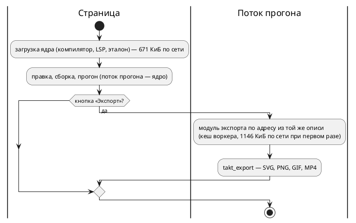

# Фича: разгрузка модуля под браузер — части по требованию

- **Номер:** 0594
- **Статус:** ГОТОВО
- **Зависит от:** нет (опирается на экспорт, уже лежащий в дереве:
  [экспорт проекта](0590-project-export.md), задачи 05–07)
- **Tier:** proc
- **Класс:** прочее
- **Связанные issue (анализ):** по требованию заказчика, 2026-09-11

## Стадии жизненного цикла

Все стадии — **разделы этой карточки**: «Архитектура (ADR)»,
«Анализ», «Разработка», «Тест-план», «Отчёт о тестировании», «Итог». Раздел
заводится в момент прохождения стадии, а не заранее. Отдельным артефактом
остаются только исправления — [`docs/fixes/`](../fixes/README.md) (при
необходимости `0594-YY-*`).

## Краткое описание

Модуль WebAssembly страницы вырос с 3,5 до 6,4 МиБ, когда в него вошли
экспорт картинок и видео, а грузится он при каждом открытии страницы и ещё
раз — в поток прогона. Нужны же растеризатор, шрифты и кодировщики только
кнопке «Экспорт». Фича делит модуль на части, загружаемые по требованию и
кешируемые так же, как основной модуль, и проходит по остальным логическим
частям сервиса: что грузится всегда, что — редко, что не нужно странице вовсе.

> Фича зарегистрирована по требованию заказчика 2026-09-11 и поставлена вне
> очереди — первой в последовательности разработки («повысь приоритет»).
> Проработана до стадии «Анализ»; решения, меняющие обещание, — вопросы
> заказчику ниже.

## Документирование

Язык не меняется, документ [`book/`](../../book/) — не требуется. README
(раздел об онлайн-редакторе) называет состав модулей и что грузится по
требованию.

## Архитектура (ADR)

- **Status:** Accepted — заказчик принял рекомендации по всем трём вопросам
  2026-09-11 (ядро и модуль экспорта целиком, видео в модуле экспорта, кеш при
  первом использовании)
- **Date:** 2026-09-11
- **Authors:** архитектор, системный аналитик

### Context

Замер 2026-09-11 (профиль `wasm`, `gzip -9`, `brotli -q 11` — как у
`build-web.sh`; вклад частей — вариантами сборки, код по крейтам — `twiggy`):

| Часть | Сырой, КиБ | brotli, КиБ | Кто зовёт | Как часто |
|---|---|---|---|---|
| ядро: компилятор, LSP, эталон, проект | 3641 | 671 | страница, поток прогона, сервер | каждое открытие |
| + рисунок SVG, лента кадров, архив выгрузки | +343 | +96 | экспорт | редко |
| + шрифты ГОСТ и Fira Code (TTF) | +395 | +155 | SVG и растр экспорта | редко |
| + растр PNG (resvg, usvg, tiny-skia, rustybuzz) | +1396 | +342 | PNG и кадры видео | редко |
| + GIF | +49 | +11 | видео GIF | редко |
| + AV1 и MP4 (rav1e, свой муксер) | +694 | +176 | видео MP4 | очень редко |
| **весь модуль** | **6518** | **1451** | | |

Код `takt_lang` — 1838 КиБ (семантика 700, генераторы 627: rust 173, c 158,
sv 142, st 125; разбор LALRPOP 315; LSP и форматтер 80; граф схемы 27).

Кто что зовёт сегодня:

- **главный поток** (загрузка при старте): версия, компиляция, диагностики,
  токены, подсветка вывода, наведение, переход, использования,
  переименование, форматирование, символы, дополнение, граф схемы, пары
  «модель — сценарии»;
- **поток прогона** загружает **второй экземпляр того же модуля** при первом
  прогоне: открытие, такт и закрытие прогона, экспорт;
- **сервер проектов** зовёт только компиляцию и проверку ключей (архив с
  выводом, запись цели), но `wasmtime` компилирует все 6,5 МБ;
- **операцию `takt_scheme_geometry` страница не зовёт вовсе** — её зовёт только
  сверка паритета геометрии в `node`.

Итог: всё, что добавил экспорт (2877 КиБ сырых, 780 КиБ по сети), нужно одной
кнопке, а платит за это каждое открытие страницы — дважды (главный поток и
поток прогона), и сервер.

`wasm-opt -Oz` не помогает: сырой вес 6518 → 5194 КиБ, но brotli растёт 1451 →
1534 КиБ — по сети модуль тяжелеет.

### Decision Drivers

1. **Открытие страницы платит только за то, что страница делает всегда** —
   редактор, сборку, прогон.
2. **Картинка со страницы равна картинке командной строки байт в байт** —
   свойство экспорта, и деление модулей не вправе его ослабить: сверка
   тождественности обязана идти по тому модулю (или цепочке модулей), который
   рисует на деле.
3. **Модуль части кешируется так же, как основной**: адрес с версией в пути и
   отпечатком содержимого, контрольная сумма в описи, отказ выкладки на
   подмене (правило выкладки 0531).
4. **Модули одной выкладки не расходятся**: версия ядра и части в кеше
   читателя обязаны совпадать — иначе экспорт рисовал бы не той версией
   компилятора, что показывает редактор, и молча.
5. **Сложность протокола — по нужде**: цепочка модулей через JS — новый
   разбор байтов и новая точка расхождения.

### Considered Options

#### Вопрос 1 — где проходит граница (рекомендация архитектора, вопрос заказчику)

- **A (рекомендуется): ядро и модуль экспорта целиком.** Ядро — компилятор,
  LSP, эталон, проект: 3641 КиБ, **671 КиБ по сети** (−54 % к нынешнему).
  Модуль экспорта — `takt_export` со своим компилятором и эталоном: 4748 КиБ,
  1146 КиБ по сети, грузится потоком прогона при первом экспорте. Rust почти
  не меняется: новый крейт-`cdylib` с одной операцией, протокол `takt_export`
  прежний, сверка тождественности смотрит в модуль экспорта. Цена —
  компилятор и эталон лежат в обоих модулях (около 1,9 МБ сырых, ~370 КиБ по
  сети) — платит только тот, кто экспортирует.
- **B: ядро с рисунком SVG, модуль растра, модуль видео.** Ядро 4379 / 922,
  растр 591, видео 194–753 КиБ по сети. Компилятор не дублируется, но экспорт
  становится цепочкой через JS: ядро отдаёт SVG и кадры, растр — RGBA, видео —
  файл; тождество держится только при сверке всей цепочки, шрифты лежат в двух
  модулях (+155 КиБ). Открытие страницы дороже, чем в A, на 250 КиБ.
- **C: как B, шрифты — отдельным файлом рядом с модулями.** Дубль шрифтов
  исчезает, но добавляется третий вид загрузки и сверка байтов шрифта.
- **Отвергнуто: `wasm-opt`** — по сети тяжелее (замер выше).

#### Вопрос 2 — видео отдельно от картинок (вопрос заказчику)

В варианте A видео живёт в модуле экспорта (+725 КиБ сырых, ~187 КиБ по
сети к картинкам). Выделить кодировщик (RGBA → GIF/MP4, 700 КиБ сырых, ~200
по сети) в третий модуль можно: модуль экспорта отдаёт кадры RGBA потоку, тот
кормит ими модуль видео. Выигрыш — 187 КиБ по сети у того, кто выгружает только
картинки; цена — цепочка через JS и сверка тождества по ней. Рекомендация:
**не делить на первом шаге**, вернуться, если модуль экспорта окажется тяжёл на
деле.

#### Вопрос 3 — кеш частей для работы без сети (вопрос заказчику)

- **Лениво (рекомендуется):** часть попадает в кеш служебного воркера при
  первом использовании (стратегия «сначала кеш» для `wasm/` уже есть). Без
  сети экспорт работает после первого экспорта в сети.
- **Заранее (`PRECACHE`):** экспорт без сети доступен сразу, но выгода
  откладывается только до установки воркера — трафик тот же.

#### Решения без вопросов заказчику

- **Поток прогона не грузит второй экземпляр целиком ради прогона**, если
  прогона не просили: загрузка ядра в потоке — по первой команде, как сейчас;
  модуль экспорта — по первой команде экспорта.
- **Сервер берёт только ядро**: компиляция и ключи в модуле экспорта не
  нужны; `wasmtime` компилирует 3,6 МБ вместо 6,5.
- **Операция `takt_scheme_geometry` уходит из ядра** в модуль экспорта: её
  зовёт только сверка паритета, а рисунку она принадлежит.
- **Опись выкладки** (`version.json`, `manifest.json`) называет каждый модуль
  адресом с версией, отпечатком и `sha256`; страница берёт адреса только из
  описи одной выкладки — ядро и часть не расходятся (драйвер 4).
- **Остальные части сервиса не делятся на этом шаге.** Генераторы целей (627
  КиБ кода, по 125–173 на цель) зовутся на каждую правку текста выбранной целью;
  деление по целям дало бы по 30–40 КиБ по сети на цель ценой загрузки при
  смене вкладки — отмечено кандидатом. LSP и форматтер (80 КиБ) и граф схемы
  (27 КиБ) малы. `zip` с `deflate` тянет `zopfli` (42 КиБ) — только в модуле
  экспорта после деления.

### Decision

Вариант A по вопросу 1, видео в модуле экспорта (вопрос 2), ленивый кеш
(вопрос 3) — после ответа заказчика. Целевой поток:

### Consequences

- Новый крейт `cdylib` модуля экспорта в workspace; `takt-wasm` теряет фичу
  графики эталона и операции экспорта и геометрии.
- `build-web.sh`, `deploy-web.sh`, опись и служебный воркер знают два модуля;
  сверка тождественности и её проба — тоже.
- Первый экспорт после открытия страницы ждёт загрузки модуля экспорта
  (секунда-две по сети); последующие — из кеша.

## Анализ

### Требования и проверяемые условия

- **Ядро без экспорта.** Модуль страницы не содержит растеризатора, шрифтов,
  кодировщиков и рисунка; вес — не больше 3700 КиБ сырых. Проверка: замер в
  `check-wasm.sh` с пределом; тесты модуля ядра без операций экспорта.
- **Модуль экспорта отдельно.** Одна операция `takt_export` прежнего протокола
  (и `takt_scheme_geometry` для сверки паритета); без импортов. Проверка: тест
  модуля; `check-wasm.sh` собирает оба и проверяет импорты.
- **Тождество.** Вывод модуля экспорта равен `takt-sim export` байт в байт на
  трёх наборах ключей. Проверка: `check-wasm-identity.mjs` по модулю экспорта;
  проба — мутация модуля экспорта ловится.
- **Загрузка по требованию.** Поток прогона грузит модуль экспорта при первом
  экспорте и держит его; главный поток модуль экспорта не грузит. Проверка:
  тест `node` на порядок загрузки (подменный загрузчик); прогон страницы —
  сетевой журнал: при открытии нет запроса модуля экспорта, при экспорте —
  один.
- **Опись и кеш.** `version.json` называет оба модуля адресами с версией и
  отпечатком; `manifest.json` — `sha256` обоих; выкладка отказывает на подмене
  любого. Служебный воркер кеширует модуль экспорта по стратегии «сначала
  кеш». Проверка: `test-deploy-web.sh` (подмена второго модуля — отказ),
  проверка воркера.
- **Сервер — ядро.** `module.rs` берёт модуль ядра. Проверка: тесты сервера.
- **Паритет геометрии** зовёт модуль экспорта. Проверка: `scheme-parity-tests`.

### План разработки

| № | Задача | Содержание | Проверка |
|---|---|---|---|
| 01 | модуль экспорта | крейт `cdylib` с `takt_export` и `takt_scheme_geometry`; ядро без графики эталона | тесты модулей, замер веса обоих |
| 02 | сборка, опись, выкладка | `build-web.sh`, `version.json`, `manifest.json`, `deploy-web.sh` с отказом на подмене | `test-deploy-web.sh`, проверка сборки |
| 03 | страница и воркер | загрузка модуля экспорта по требованию в потоке прогона, кеш воркера | тест `node`, прогон страницы с сетевым журналом |
| 04 | сверки | тождество по модулю экспорта, паритет геометрии, проба `test-check-wasm.sh` | `check-wasm.sh`, мутация |
| 05 | документ и журнал | README, `CHANGES.md`, живой контекст | проверки документа |

### Риски

- **Расхождение версий ядра и модуля экспорта в кеше читателя** — закрыто
  описью одной выкладки (адреса только из неё).
- **Первый экспорт медленнее** — загрузка модуля по сети; показывается
  сообщением «загружается модуль экспорта».
- **Кандидат на потом:** деление генераторов по целям — выигрыш 30–40 КиБ по
  сети на цель.

## Разработка

### Задача — модуль экспорта

Новый крейт `takt-wasm-export` (`cdylib` и `rlib`): операции `takt_export` и
`takt_scheme_geometry`, версия языка. Протокол обмена — буфер, вызов операции,
форма ответа — переехал из `takt-wasm` в крейт `takt-wasm-io`: у обоих модулей
одна копия, а символы `takt_io_*` каждый модуль объявляет своими обёртками
(символы зависимости-`rlib` утекли бы в чужой модуль). Ядро `takt-wasm` потеряло
графику эталона, крейт рисунка и `base64`; операция пар «модель — сценарии»
осталась в ядре (её зовёт главный поток). Модули собираются отдельными вызовами
cargo — общий вызов объединил бы фичи, и ядро получило бы графику эталона.

| Модуль | Сырой, КиБ | brotli, КиБ | Импортов |
|---|---|---|---|
| ядро `takt.wasm` (было 6518 / 1451) | 3454 | 636 | 0 |
| модуль экспорта `takt-export.wasm` | 5225 | 1167 | 0 |

Ядро легче, чем до экспорта (3612): ушёл и рисунок в числах, которого страница
не зовёт.

### Задача — сборка, опись, выкладка

`build-web.sh` кладёт `wasm/<версия>/takt-export.wasm`, опись версии несёт его
сумму и размер, опись сборки — адрес `export_wasm` с отпечатком содержимого.
`deploy-web.sh` отказывает на подмене любого из модулей под адресом с версией.
Образ стенда собирает оба модуля. Предзагрузка служебного воркера модуль
экспорта не берёт: он кешируется при первом использовании (стратегия «сначала
кеш» для `wasm/`).

### Задача — страница и воркер

Поток прогона грузит модуль экспорта по первой команде экспорта и держит его;
о первой загрузке страница говорит «загружается модуль экспорта…». Адрес — из
описи той же выкладки, что ядро (`build.describe` делает абсолютными оба адреса:
относительный посчитался бы в воркере от каталога бандла). Главный поток модуль
экспорта не грузит.

### Задача — сверки

`check-wasm.sh` собирает оба модуля, держит предел веса ядра (3700 КиБ: ядро
сверх него значит, что в него вернулось нужное одному экспорту) и сверяет
экспорт с `takt-sim export` по модулю экспорта. Сверка паритета геометрии холста
спрашивает рисунок у модуля экспорта, граф и прогон — у ядра. Пробы проверок
модуля, веб-части и выкладки кладут и знают оба модуля; выкладка получила случай
E14.

### Задача — документ и журнал

README (раздел об онлайн-редакторе — два модуля), документ (раздел «Экспорт
схемы» — первая загрузка модуля экспорта), `CHANGES.md`, живой контекст
(семь крейтов, пункт о делении модулей).

## Тест-план

1. Ядро без операций экспорта и геометрии, модуль экспорта с ними; оба без
   импортов; вес ядра в пределе.
2. Вывод модуля экспорта равен `takt-sim export` байт в байт (три набора ключей);
   мутация ловится.
3. Поток прогона грузит модуль экспорта один раз, по первой команде; главный
   поток — никогда; предзагрузка его не берёт.
4. Опись: адрес модуля экспорта с отпечатком, сумма в описи версии; подмена
   отвергается выкладкой.
5. Паритет геометрии холста и чертежа — по модулю экспорта.
6. Прогон страницы: при открытии — только ядро; экспорт дважды — одна загрузка
   модуля экспорта.

## Отчёт о тестировании

1. Сборка: экспорты модулей перечислены — у ядра нет `takt_export` и
   `takt_scheme_geometry`, у модуля экспорта нет операций редактора; импортов нет
   у обоих; ядро 3454 КиБ при пределе 3700. Тесты модулей зелёные.
2. `check-wasm.sh`: шесть файлов экспорта равны байт в байт; проба W1…W6.
3. Тест `node` на воркере с подменами сети и компиляции: одна загрузка по своему
   адресу, одно «загружается модуль экспорта», ответ на каждую команду; главный
   поток адрес только передаёт; предзагрузка без модуля экспорта.
4. `test-deploy-web.sh` E1…E14.
5. `check-web.sh`: 147 тестов, сверка паритета зелёная; проба B1…B8.
6. Прогон страницы (собранная статика, журнал сервера): при открытии — ядро
   (главный поток, затем поток прогона из кеша, `304`), при первом экспорте —
   один запрос `takt-export.wasm`, второй экспорт без запроса.

Предкоммит зелёный. Стенд — проверка после выкатки в разделе «Итог».

## Итог

ГОТОВО. Ядро модуля страницы — 3454 КиБ и 636 КиБ по сети вместо 6518 и 1451
(−56 %); экспорт — отдельным модулем, который поток прогона грузит при первом
нажатии «Экспорт» и кеширует так же, как ядро. Картинки со страницы равны выводу
`takt-sim export` байт в байт. Выкачено на стенд.
